# [!DNL Snapchat] コンバージョン API拡張機能の概要

[!DNL Snap] Conversion API拡張機能は、[Edge Network API](https://developer.adobe.com/data-collection-apis/docs/)の安全なインターフェイスであり、Web サイトでのユーザーアクションに関する情報を[!DNL Snapchat]と直接共有できます。 イベント転送ルールを活用して、**[!DNL Adobe Experience Platform Edge Network]**&#x200B;変換API拡張機能を使用して、**[!DNL Snapchat]**&#x200B;から&#x200B;**[!DNL Snap]**&#x200B;までのデータを送信できます。

## [!DNL Snapchat] 前提条件 {#prerequisites}

[!DNL Snapchat] コンバージョン APIを使用するには：

* Adobe Experience Platformで[&#x200B; イベント転送プロパティ &#x200B;](/help/tags/ui/event-forwarding/getting-started.md)を設定する必要があります。
* プロパティを編集するには、[必要な権限](/help/collection/permissions.md)も必要です。

[&#x200B; データストリーム &#x200B;](/help/tags/ui/event-forwarding/getting-started.md)を作成し、[&#x200B; イベント転送サービス &#x200B;](/help/tags/ui/event-forwarding/getting-started.md#enable-event-forwarding)を追加します。

コンバージョン APIを使用するには、**[!DNL Snapchat]** [Business Manager](https://business.snapchat.com/) アカウントが必要です。 Business Managerは、広告主が&#x200B;**[!DNL Snapchat]**&#x200B;のマーケティング活動をビジネス全体および外部パートナーと統合するのに役立ちます。 Business Manager アカウントをお持ちでない場合は、**[!DNL Snapchat]** [&#x200B; ヘルプセンターの記事](https://businesshelp.snapchat.com/s/article/get-started?language=en_US)を参照してください。

[[!DNL [Snap Pixel]]](https://businesshelp.snapchat.com/s/article/pixel-website-install?language=en_US)をSnapchat Ads Managerで設定し、`Pixel ID`を表示するためのアクセス権が必要です。 `Pixel ID`は、[[!UICONTROL [Events Manager]]](https://businesshelp.snapchat.com/s/article/events-manager?language=en_US) セクションにあります。

静的で長期間有効なAPI トークンが必要です。 このトークンを取得するには、[[!DNL Snapchat] Conversions API ドキュメント &#x200B;](https://developers.snap.com/api/marketing-api/Conversions-API/GetStarted#access-token)を参照してください。

## [!DNL Snapchat] web イベント API拡張機能をインストールして設定します {#install}

拡張機能をインストールするには、**[!UICONTROL Data Collection]**>**[!UICONTROL Event Forwarding]**&#x200B;に移動します。 拡張機能をインストールするプロパティを選択します。

目的のプロパティを選択したら、次の手順に従います。

1. 左側のナビゲーションパネルで、**[!UICONTROL Extensions]**&#x200B;を選択します。
2. **[!UICONTROL Snap Conversion API Extension]**&#x200B;を検索し、**[!UICONTROL Install]**&#x200B;を選択します。

   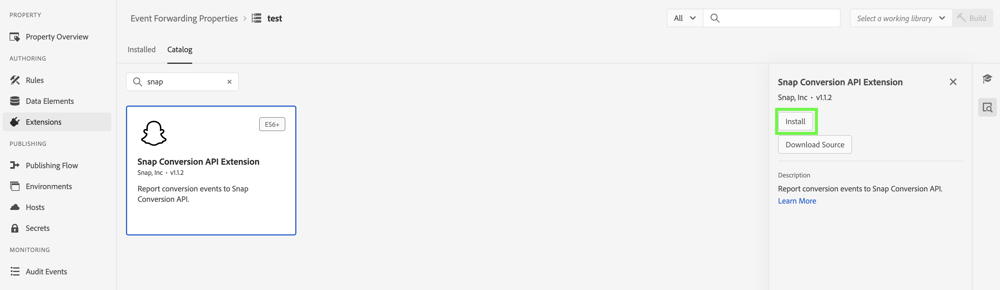

3. 設定画面で、次の値を入力します。

* **[!UICONTROL Pixel Id]**
* **[!UICONTROL API Token]**

終了したら「**[!UICONTROL Save]**」を選択します。

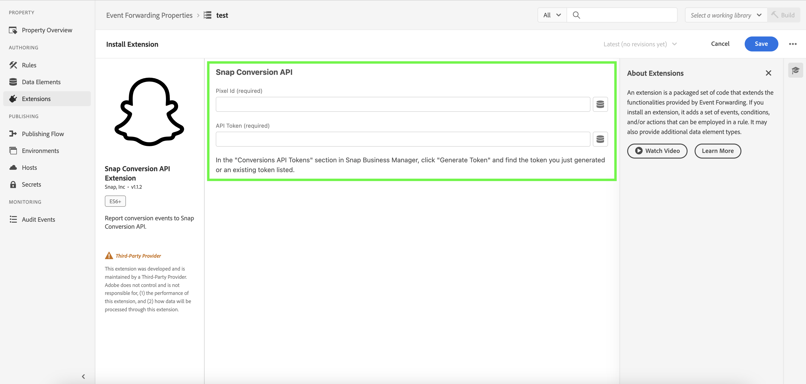

<!-- 
![[!DNL Snap] configuration screen for the [!DNL Snap] conversion API extension.](../../../images/extensions/server/snap/configure.png) 
-->

## データ要素の作成 {#create-data-elements}

データを[!DNL Snapchat] Conversions API拡張機能に送信するには、各データパラメーターに[&#x200B; データ要素](https://experienceleague.adobe.com/ja/docs/platform-learn/implement-web-sdk/event-forwarding/setup-event-forwarding#create-an-event-forwarding-data-element)を作成します。 次の手順に従います。

1. プロパティの&#x200B;**[!UICONTROL Authoring]**&#x200B;画面で&#x200B;**[!UICONTROL Data Elements]**>**[!UICONTROL Property Info]**&#x200B;に移動し、**[!UICONTROL Add Data Element]**&#x200B;を選択します。

   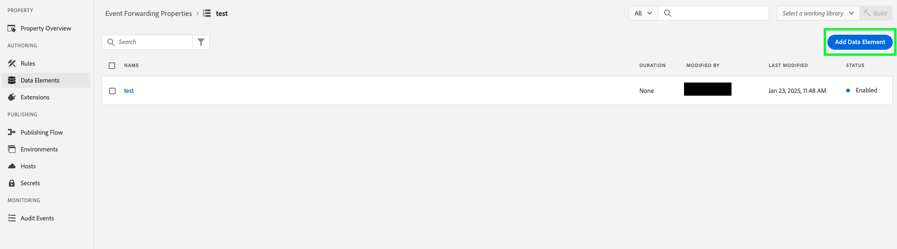

2. データ要素の名前を入力します。

3. 拡張機能として&#x200B;**[!UICONTROL Core]**、データ要素タイプとして&#x200B;**[!UICONTROL Path]**&#x200B;を選択します。

4. ドロップダウンメニューから適切な項目を選択し、右側のパネルの[!UICONTROL Path] フィールドに入力して、スキーマ内の目的のデータを参照します。

   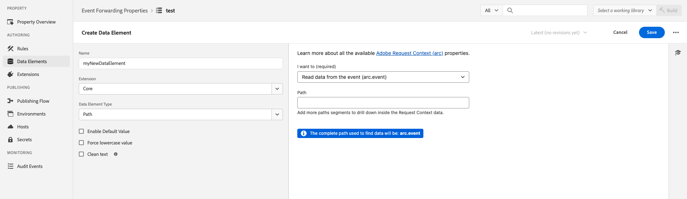

例えば、以下に示すスキーマで`snapClickId`を参照するデータ要素を作成する場合は、

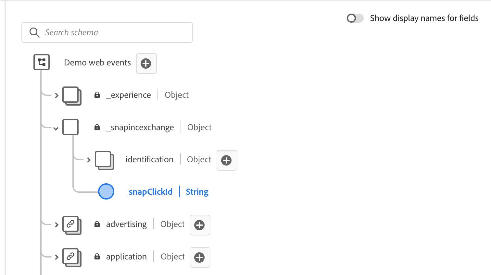

`snapClickId`がXDM スキーマの`_snap.inc.exchange`の下にあるので、データ要素を設定する必要があります。

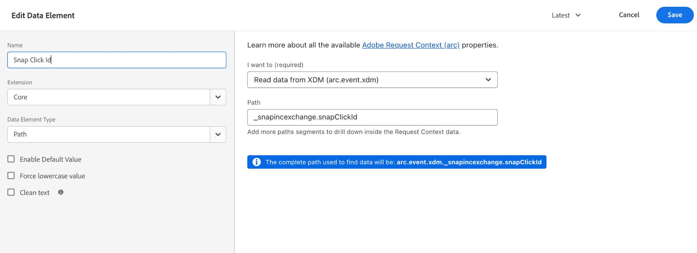

データ要素の作成について詳しくは、[&#x200B; イベント転送プロパティのドキュメント &#x200B;](/help/tags/ui/event-forwarding/overview.md#data-elements)を参照してください。

## コンバージョンイベントをSnapに送信するルールの作成 {#create-snap-rules}

[&#x200B; ルール &#x200B;](https://experienceleague.adobe.com/ja/docs/platform-learn/implement-web-sdk/event-forwarding/setup-event-forwarding#create-an-event-forwarding-rule)は、Experience Platformで拡張機能をトリガーするために使用されます。 この節では、イベント転送プロパティ内でルールを作成し、Conversions API拡張機能を使用してコンバージョンイベントをSnapに送信する方法について説明します。

### 新しいルールの作成

1. イベント転送プロパティに移動し、オーサリングメニューから「**[!UICONTROL Rules]**」を選択します。 次に、**[!UICONTROL Create New Rule]**&#x200B;をクリックします。

   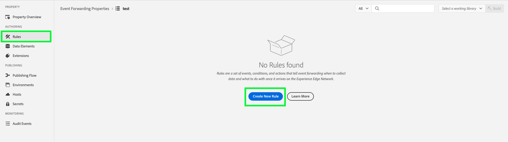

2. ルールに名前を付け、スナップイベントをトリガーするための条件を設定します。 例えば、イベントに注文番号が含まれている場合に`PURCHASE` イベントを送信するには、ユーザーのインタラクションに有効な注文番号が含まれているかどうかを確認する条件を設定します。

   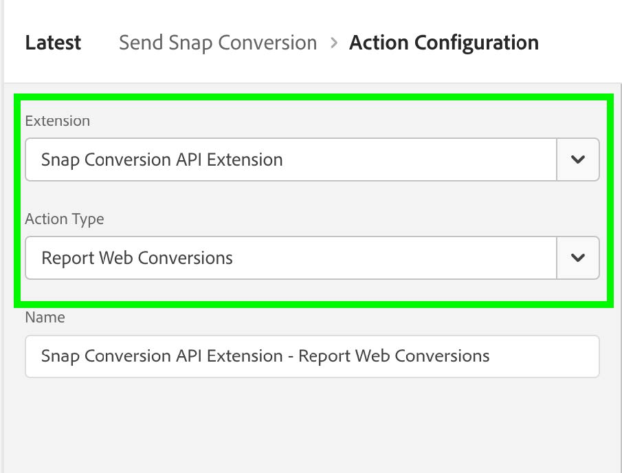

3. 条件を保存した後、Snap Conversion APIをトリガーするアクションを追加します。 左側のパネルで、次の操作を行います。

   * [!UICONTROL Extension] ドロップダウンメニューを[!UICONTROL Snap Conversions API Extension]に設定します。

   * [!UICONTROL Action Type] ドロップダウンメニューを[!UICONTROL Report Web Conversions]に設定します。

   * ルールに適切な名前を付けます。

   

4. 右側のパネルの[&#x200B; セクションで、イベント用に送信する](https://developers.snap.com/api/marketing-api/Conversions-API/Parameters)CAPI パラメーター値&#x200B;**[!UICONTROL Data Bindings]**&#x200B;を設定します。 拡張機能のフィールドは、次に示すようにCAPI パラメーターにマッピングされます。 各パラメーターについて詳しくは、[Snapchat コンバージョン API ドキュメント &#x200B;](https://developers.snap.com/api/marketing-api/Conversions-API/Parameters)を参照してください。

| データバインディングフィールド | CAPI パラメーターをスナップ |
| --- | --- |
| イベントタイプ（必須） | `event_name` |
| メール | `em` |
| 電話番号 | `ph` |
| ユーザーエージェント | `client_user_agent` |
| IP アドレス | `client_ip_address` |
| クリック ID | `sc_click_id` |
| Cookie1 | `so_cookie1` |
| 名 | `fn` |
| 姓 | `ln` |
| 性別 | `ge` |
| 市区町村 | `ph` |
| 都道府県 | `st` |
| 郵便番号 | `zp` |
| 国 | `country` |
| 外部 ID | `external_id` |
| パートナーId | `partner_id` |
| 購読 ID | `subscription_id` |
| リード ID | `lead_id` |
| 項目またはカテゴリ | `content_category` |
| コンテンツ名 | `content_ids` |
| コンテンツタイプ | `content_name` |
| 目次 | `contents` |
| 説明 | `description` |
| イベントタグ | `event_tag` |
| 項目数 | `num_items` |
| 価格 | `value` |
| 通貨 | `currency` |
| トランザクション ID | `order_id` （`event_id`の代わりに`client dedup idD`にも送信されます） |
| 予測LTV | `predicted_ltv` |
| 検索文字列 | `search_string` |
| サインアップ方法 | `sign_up_method` |
| クライアント重複排除ID | `event_id` |
| データ利用の制限 | `data_processing_options` |
| ページ Url | `event_source_url` |

{style="table-layout:auto"}

### 必須フィールドと任意フィールド

各イベントには`event_source`が必要です。これは常に`WEB.`に設定されます。一致させるには、次のフィールドまたは組み合わせのうち少なくとも1つが必要です。

* 電子メール
* 電話番号
* IP アドレスとユーザーエージェント

**その他のメモ：**

* `Purchase` イベントの場合、`Currency`および`Price` フィールドが必要です。

* **[!UICONTROL Test Mode]** チェックボックスを有効にすると、イベントがテストイベントとして送信され、標準レポートではなくテストイベントツールに表示されます。 詳しくは、[&#x200B; ビジネスヘルプセンターの記事](https://businesshelp.snapchat.com/s/article/capi-event-testing?language=en_US#:~:text=Snap's%20Conversions%20API%20(CAPI)%20Test,being%20processed%20as%20production%20results)を参照してください。

* `contents` パラメーターは、次のいずれかのフィールドを含むJSON文字列である必要があります。

   * `id`
   * `item_category`
   * `brand`
   * `delivery_category`
   * `item_price`
   * `quantity`

例：

```json
{
  "id": "id1",
  "brand": "brand1",
  "delivery_category": "c1",
  "item_price": 2.00,
  "quantity": 2
}
```

[&#x200B; カスタムコンバージョン値とROAS レポート &#x200B;](https://businesshelp.snapchat.com/s/article/custom-conversions-value-roas?language=en_US)を使用するには、`contents` フィールドに関連するパラメーターを含めます。 購入イベントの設定の例：`brand`、`item_price`、`id`など

`Purchase` イベントの設定例：

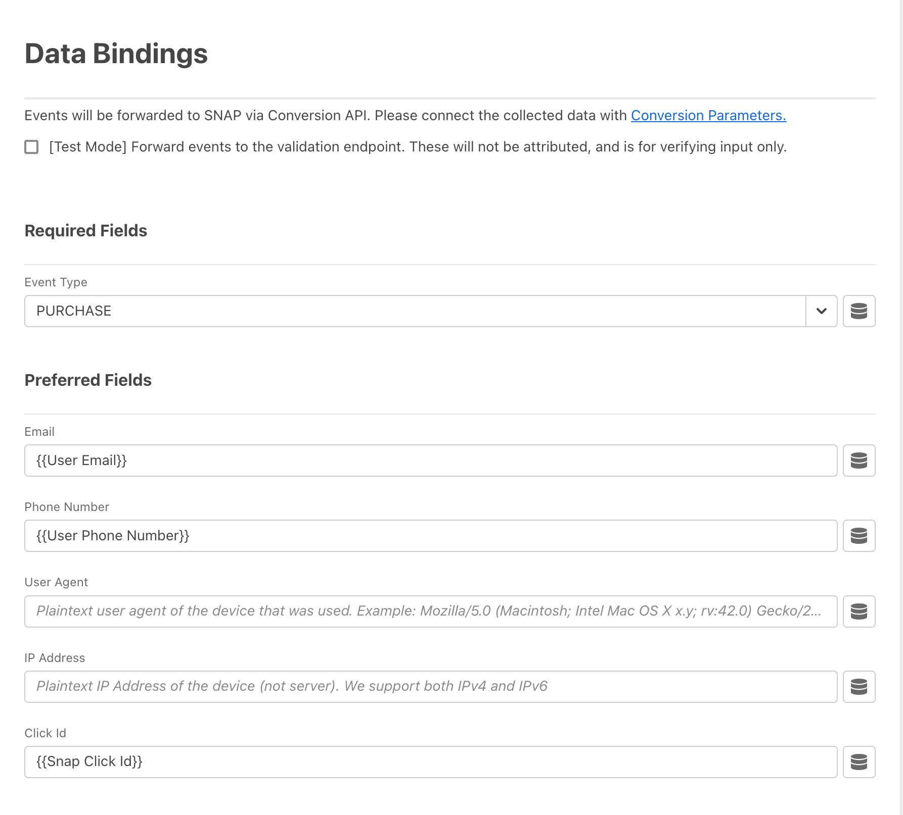

オプションのフィールドは、次のように設定できます。

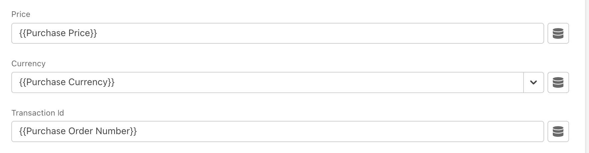

前述のようにルールの名前、条件、アクションを設定したら、ルールを保存し、ルールが有効になっていることを確認します。

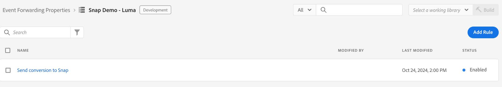

これらの変更をプロパティに公開できるようになりました。 詳しくは、[公開フロー](/help/tags/ui/publishing/overview.md)のドキュメントを参照してください。

## トラブルシューティング {#troubleshoot}

トラブルシューティングと設定の最適化については、[&#x200B; イベント品質スコアの推奨事項](https://businesshelp.snapchat.com/s/article/event-quality-score)を確認して、イベントが可能な限り高い一致率とパフォーマンス成果を達成することを確認してください。

**イベント品質スコア**&#x200B;で問題が発生した場合は、改善するための推奨事項について詳しく説明します[こちら](https://businesshelp.snapchat.com/s/article/esq-issues-recommendations?language=en_US)。

## 次の手順 {#next-steps}

このガイドでは、**[!DNL Snap]**&#x200B;拡張機能を使用してサーバーサイドのイベントデータを&#x200B;**[!DNL Snap Conversions API]**&#x200B;に送信する方法について説明しました。 Experience Platformのイベント転送機能について詳しくは、[&#x200B; イベント転送の概要](../../../ui/event-forwarding/overview.md)を参照してください。
