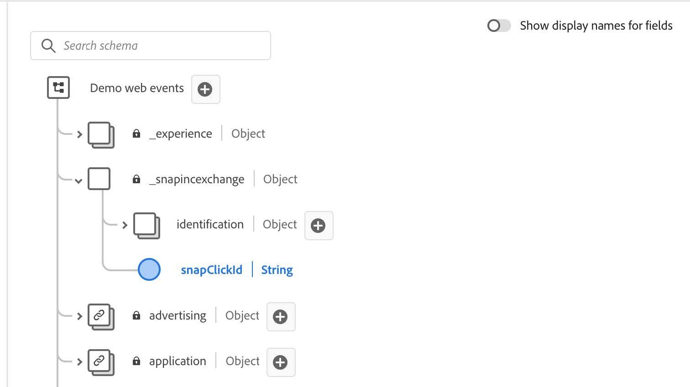
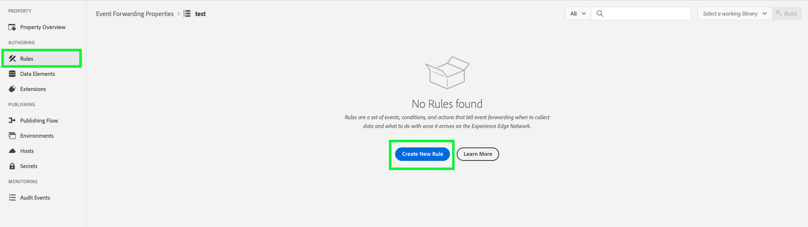

# [!DNL Snapchat] Conversions API 拡張機能の概要

[!DNL Snap] Conversion API Extension は、安全な [Edge Network API](https://developer.adobe.com/data-collection-apis/docs/) インターフェイスで、Web サイト上のユーザーアクションに関する情報を [!DNL Snapchat] と直接共有できます。 イベント転送ルールを活用し、**[!DNL Snap]** Conversion API 拡張機能を使用して、**[!DNL Adobe Experience Platform Edge Network]** から **[!DNL Snapchat]** にデータを送信できます。

## [!DNL Snapchat] 前提条件 {#prerequisites}

[!DNL Snapchat] Conversions API を使用するには：

* Adobe Experience Platformで [&#x200B; イベント転送プロパティ &#x200B;](/help/tags/ui/event-forwarding/getting-started.md) を設定する必要があります。
* また、プロパティを編集するには [&#x200B; 必要な権限 &#x200B;](/help/collection/permissions.md) が必要です。

[&#x200B; データストリーム &#x200B;](/help/tags/ui/event-forwarding/getting-started.md) を作成し、[&#x200B; イベント転送サービス &#x200B;](/help/tags/ui/event-forwarding/getting-started.md#enable-event-forwarding) を追加します。

Conversions API を使用するには、**[!DNL Snapchat]** [Business Manager](https://business.snapchat.com/) アカウントが必要です。 Business Manager は、広告主が **[!DNL Snapchat]** のマーケティング活動をビジネス全体および外部パートナーと統合するのに役立ちます。 Business Manager アカウントがない場合は、作成に関する **[!DNL Snapchat]** [&#x200B; ヘルプセンターの記事 &#x200B;](https://businesshelp.snapchat.com/s/article/get-started?language=en_US) を参照してください。

Snapchat Ads Manager で [[!DNL [Snap Pixel]]](https://businesshelp.snapchat.com/s/article/pixel-website-install?language=en_US) を設定し、`Pixel ID` を表示するためのアクセス権を持っている必要があります。 `Pixel ID` の詳細については、[[!UICONTROL [Events Manager]]](https://businesshelp.snapchat.com/s/article/events-manager?language=en_US) の節を参照してください。

静的で長期間有効な API トークンが必要です。 このトークンを取得するには、[[!DNL Snapchat] Conversions API ドキュメント &#x200B;](https://developers.snap.com/api/marketing-api/Conversions-API/GetStarted#access-token) を参照してください。

## [!DNL Snapchat] Web イベント API 拡張機能のインストールと設定 {#install}

拡張機能をインストールするには、**[!UICONTROL データ収集]**/**[!UICONTROL イベント転送]** に移動します。 拡張機能をインストールするプロパティを選択します。

目的のプロパティを選択したら、次の手順に従います。

1. 左側のナビゲーションパネルで、「**[!UICONTROL 拡張機能]**」を選択します。
2. **[!UICONTROL Snap Conversion API Extension]** を検索し、「**[!UICONTROL インストール]**」を選択します。

   

3. 設定画面で、次の値を入力します。

* **[!UICONTROL ピクセル Id]**
* **[!UICONTROL API トークン]**

完了したら「**[!UICONTROL 保存]**」を選択します。


<!-- 
![[!DNL Snap] configuration screen for the [!DNL Snap] conversion API extension.](../../../images/extensions/server/snap/configure.png) -->

## データ要素の作成 {#create-data-elements}

[!DNL Snapchat] Conversions API 拡張機能にデータを送信するには、データパラメーターごとに [&#x200B; データ要素 &#x200B;](https://experienceleague.adobe.com/ja/docs/platform-learn/implement-web-sdk/event-forwarding/setup-event-forwarding#create-an-event-forwarding-data-element) を作成します。 次の手順に従います。

1. プロパティの **[!UICONTROL プロパティ情報]** 画面で **[!UICONTROL オーサリング]**>**[!UICONTROL データ要素]** に移動し、「**[!UICONTROL データ要素を追加]**」を選択します。

   

2. データ要素の名前を入力します。

3. 拡張機能として **[!UICONTROL Core]** を選択し、データ要素タイプとして **[!UICONTROL Path]** を選択します。

4. ドロップダウンメニューから適切な項目を選択し、右側のパネルの [!UICONTROL &#x200B; パス &#x200B;] フィールドに入力して、スキーマ内の目的のデータを参照します。

   

例えば、以下に示すスキーマの `snapClickId` を参照するデータ要素を作成するとします。

 を示す画像

データ要素は XDM スキーマの `_snap.inc.exchange` の下に `snapClickId` るため、設定する必要があります。


データ要素の作成について詳しくは、[&#x200B; イベント転送プロパティのドキュメント &#x200B;](/help/tags/ui/event-forwarding/overview.md#data-elements) を参照してください。

## 変換イベントを Snap に送信するルールを作成する {#create-snap-rules}

[&#x200B; ルール &#x200B;](https://experienceleague.adobe.com/ja/docs/platform-learn/implement-web-sdk/event-forwarding/setup-event-forwarding#create-an-event-forwarding-rule) は、Experience Platformで拡張機能をトリガーするために使用されます。 この節では、イベント転送プロパティ内でルールを作成し、Conversions API 拡張機能を使用してコンバージョンイベントを Snap に送信する方法について概説します。

### 新しいルールの作成

1. イベント転送プロパティに移動し、オーサリングメニューから **[!UICONTROL ルール]** を選択します。 次に、「**[!UICONTROL 新規ルールを作成]**」をクリックします。

   

2. ルールに名前を付け、スナップ・イベントをトリガーする条件を構成します。 例えば、イベントに注文番号が含まれる場合に `PURCHASE` イベントを送信するには、ユーザーインタラクションに有効な発注番号が含まれているかどうかを確認する条件を設定します。

   

3. 条件を保存した後、Snap Conversion API をトリガーするアクションを追加します。 左側のパネルで以下を行います。

   * [!UICONTROL &#x200B; 拡張機能 &#x200B;] ドロップダウンメニューを [!UICONTROL Snap Conversions API 拡張機能 &#x200B;] に設定します。

   * [!UICONTROL &#x200B; アクションタイプ &#x200B;] ドロップダウンメニューを [!UICONTROL Web コンバージョンをレポート &#x200B;] に設定します。

   * ルールに適切な名前を付けます。

   

4. 右側のパネルの [&#x200B; データバインディング &#x200B;](https://developers.snap.com/api/marketing-api/Conversions-API/Parameters) セクションで、イベントに送信する **[!UICONTROL CAPI パラメーター値]** を設定します。 以下に示すように、拡張機能のフィールドは CAPI パラメーターにマッピングされます。 各パラメーターについて詳しくは、[Snapchat Conversions API ドキュメント &#x200B;](https://developers.snap.com/api/marketing-api/Conversions-API/Parameters) を参照してください。

| データ連結フィールド | スナップ CAPI パラメータ |
| --- | --- |
| イベントタイプ （必須） | `event_name` |
| メール | `em` |
| 電話番号 | `ph` |
| ユーザーエージェント | `client_user_agent` |
| IP アドレス | `client_ip_address` |
| クリック ID | `sc_click_id` |
| Cookie1 | `so_cookie1` |
| 名 | `fn` |
| 姓 | `ln` |
| 性別 | `ge` |
| 市区町村 | `ph` |
| 都道府県 | `st` |
| 郵便番号 | `zp` |
| 国 | `country` |
| 外部 ID | `external_id` |
| パートナー Id | `partner_id` |
| 購読 ID | `subscription_id` |
| リード ID | `lead_id` |
| 品目またはカテゴリ | `content_category` |
| コンテンツ名 | `content_ids` |
| コンテンツタイプ | `content_name` |
| 目次 | `contents` |
| 説明 | `description` |
| イベントタグ | `event_tag` |
| 項目の数 | `num_items` |
| 価格 | `value` |
| 通貨 | `currency` |
| トランザクション ID | `order_id` （`client dedup idD` の代わりに `event_id` でも送信） |
| 予測される LTV | `predicted_ltv` |
| 検索文字列 | `search_string` |
| 新規登録メソッド | `sign_up_method` |
| クライアント重複排除 Id | `event_id` |
| データ使用の制限 | `data_processing_options` |
| ページ Url | `event_source_url` |

{style="table-layout:auto"}

### 必須フィールドとオプションフィールド

各イベントには `event_source` が必要で、常に `WEB.` に設定されます。一致させるには、次のフィールドまたは組み合わせのうち少なくとも 1 つが必要です。

* メール
* 電話番号
* IP アドレスとユーザーエージェント

**その他のメモ：**

* イベント `Purchase` 場合、「`Currency`」フィールドと「`Price`」フィールドは必須です。

* 「**[!UICONTROL テストモード]**」チェックボックスを有効にすると、イベントがテストイベントとして送信され、標準のレポートではなくテストイベントツールに表示されます。 詳しくは、こちらの [&#x200B; ビジネスヘルプセンターの記事 &#x200B;](https://businesshelp.snapchat.com/s/article/capi-event-testing?language=en_US#:~:text=Snap&#39;s%20Conversions%20API%20(CAPI)%20Test,being%20processed%20as%20production%20results。) を参照してください。

* `contents` パラメーターは、次のフィールドのうち少なくとも 1 つを含む JSON 文字列である必要があります。

   * `id`
   * `item_category`
   * `brand`
   * `delivery_category`
   * `item_price`
   * `quantity`

例：

```json
{
  "id": "id1",
  "brand": "brand1",
  "delivery_category": "c1",
  "item_price": 2.00,
  "quantity": 2
}
```

[&#x200B; カスタムコンバージョン値と ROAS レポート &#x200B;](https://businesshelp.snapchat.com/s/article/custom-conversions-value-roas?language=en_US) を使用するには、`contents` フィールドに関連するパラメーターを含めます。 購入イベントの設定例は、`brand`、`item_price`、`id` のようになります。

`Purchase` イベントの設定例：


オプションのフィールドは、次のように設定できます。


上記のようにルールの名前、条件、アクションを設定したら、ルールを保存して有効になっていることを確認します。


これで、これらの変更をプロパティに公開できます。 詳しくは、[&#x200B; 公開フロー &#x200B;](/help/tags/ui/publishing/overview.md) に関するドキュメントを参照してください。

## トラブルシューティング {#troubleshoot}

設定のトラブルシューティングと最適化については、[&#x200B; イベント品質スコアの推奨事項 &#x200B;](https://businesshelp.snapchat.com/s/article/event-quality-score) を確認し、イベントの一致率とパフォーマンス結果を可能な限り高くします。

**イベント品質スコア** に問題が発生した場合は、それを改善するための推奨事項の詳細を確認してください [&#x200B; こちら &#x200B;](https://businesshelp.snapchat.com/s/article/esq-issues-recommendations?language=en_US)。

## 次の手順 {#next-steps}

このガイドでは、**[!DNL Snap Conversions API]** 拡張機能を使用してサーバーサイドのイベントデータを **[!DNL Snap]** に送信する方法について説明しました。 Experience Platformのイベント転送機能について詳しくは、[&#x200B; イベント転送の概要 &#x200B;](../../../ui/event-forwarding/overview.md) を参照してください。
