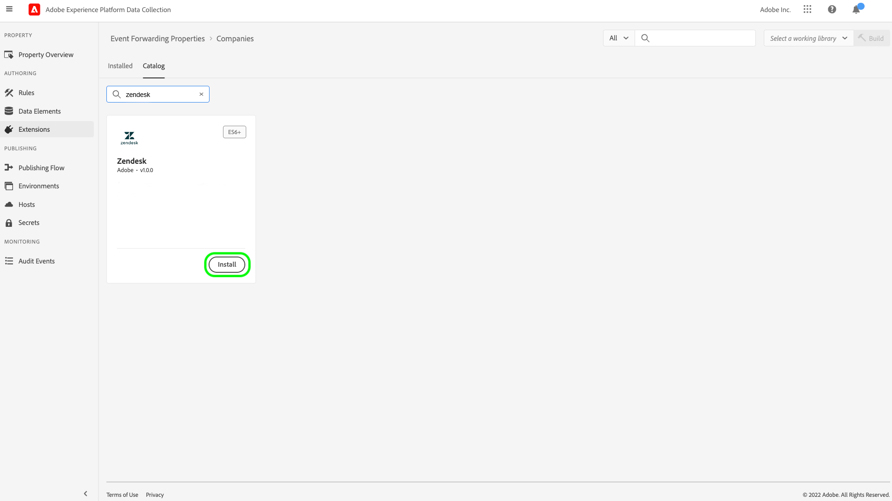

# [!DNL Zendesk] Events API 拡張機能の概要

[Zendesk](https://www.zendesk.co.jp) は、カスタマーサービスソリューションおよびセールスツールです。 Zendesk [イベント転送](../../../ui/event-forwarding/overview.md)拡張機能は、[[!DNL Zendesk Events API]](https://developer.zendesk.com/api-reference/custom-data/events-api/events-api/) を活用して、イベントを Adobe Experience Platform Edge Network から Zendesk に送信して、さらに処理できるようにします。 拡張機能を使用して、ダウンストリームの分析やアクションで使用する顧客プロファイルインタラクションを収集できます。

このドキュメントでは、UI で 拡張機能をインストールおよび設定する方法について説明します。

## 前提条件

この拡張機能を使用するには、Zendesk アカウントが必要です。 Zendesk アカウントは、[Zendesk web サイト](https://www.zendesk.co.jp/register/)で登録できます。

また、Zendesk の設定に関して、次の詳細を収集する必要があります。

| キータイプ | 説明 | 例 |
| --- | --- | --- |
| サブドメイン | 登録プロセス中に、アカウントに固有の一意の&#x200B;**サブドメイン**&#x200B;が作成されます。詳しくは、[Zendesk のドキュメント](https://developer.zendesk.com/documentation/ticketing/working-with-oauth/creating-and-using-oauth-tokens-with-the-api/)を参照してください。 | `xxxxx.zendesk.com`（`xxxxx` は、アカウントの作成時に指定された値です） |
| API トークン | Zendesk は、Zendesk API と通信するための認証メカニズムとして Bearer トークンを使用します。 Zendesk ポータルにログインした後、API トークンを生成します。 詳しくは、[Zendesk のドキュメント](https://support.zendesk.com/hc/en-us/articles/4408889192858-Generating-a-new-API-token)を参照してください。 | `cwWyOtHAv12w4dhpiulfe9BdZFTz3OKaTSzn2QvV` |

{style="table-layout:auto"}

最後に、API トークンのイベント転送の秘密鍵を作成する必要があります。 秘密鍵タイプを「**[!UICONTROL トークン]**」に設定し、その値を Zendesk 設定から収集した API トークンに設定します。 秘密鍵の設定に関する詳細については、[イベント転送での秘密鍵](../../../ui/event-forwarding/secrets.md)に関するドキュメントを参照してください。 

## 拡張機能のインストール {#install}

UI で Zendesk 拡張機能をインストールするには、**イベント転送**&#x200B;に移動し、拡張機能を追加するプロパティを選択するか、代わりに新しいプロパティを作成します。

目的のプロパティを選択または作成したら、**拡張機能**／**カタログ**&#x200B;に移動します。「[!DNL Zendesk]」を検索し、Zendesk 拡張機能で **[!DNL Install]** を選択します。

## 拡張機能の設定 {#configure}

>[!IMPORTANT]
>
>実装のニーズに応じて、拡張機能を設定する前に、スキーマ、データ要素、データセットの作成が必要になる場合があります。 ユースケースに合わせて設定する必要のあるエンティティを判断するには、開始する前にすべての設定手順を確認してください。

左側のナビゲーションの「**拡張機能**」を選択します。 **インストール済み**&#x200B;で、Zendesk 拡張機能の「**設定**」を選択します。 

**[!UICONTROL Zendesk ドメイン]**&#x200B;で、Zendesk サブドメインの値を入力します。**[!UICONTROL Zendesk トークン]**&#x200B;で、API トークンを含む、以前に作成した秘密鍵を選択します。

## イベント転送ルールの設定

新しいイベント転送ルールの[ルール](../../../ui/managing-resources/rules.md)の作成を開始し、 必要に応じて条件を設定します。 ルールのアクションを選択する場合は、[!UICONTROL Zendesk] 拡張機能を選択してから、「[!UICONTROL イベントを作成]」アクションタイプを選択します。

アクション設定を設定する際に、Zendesk に送信される様々なプロパティにデータ要素を割り当てるように求められます。

これらのデータ要素は、以下に示すようにマッピングする必要があります。

### `event` キー

`event` は、ユーザーによってトリガーされたイベントを表す JSON オブジェクトです。`event` オブジェクトが取得するプロパティについて詳しくは、[イベントの詳細](https://developer.zendesk.com/documentation/custom-data/events/anatomy-of-an-event/)に関する Zendesk のドキュメントを参照してください。

次のキーは、`event` オブジェクト内でデータ要素にマッピングするときに参照されます。

| `event` キー | タイプ | プラットフォームパス | 説明 | 必須 | 制限 |
| --- | --- | --- | --- | --- | --- |
| `source` | 文字列 | `arc.event.xdm._extconndev.event_source` | イベントを送信したアプリケーション。 | ○ | `Zendesk` は、Zendesk 標準イベントのソース名として保護されているため、値として使用しないでください。使用を試みると、エラーが発生します。 値の長さは 40 文字を超えないようにします。 |
| `type` | 文字列 | `arc.event.xdm._extconndev.event_type` | イベントタイプの名前。このフィールドを使用して、特定のソースに対して様々な種類のイベントを示すことができます。例えば、ユーザーログイン用のイベントと買い物かご用のイベントを 1 組ずつ作成できます。 | ○ | 値の長さは 40 文字を超えないようにする必要があります。 |
| `description` | 文字列 | `arc.event.xdm._extconndev.description` | イベントに関する説明。 | × | （N/A） |
| `created_at` | 文字列 | `arc.event.xdm.timestamp` | イベントが作成された時刻を反映した ISO-8601 タイムスタンプ。 | × | （N/A） |
| `properties` | オブジェクト | `arc.event.xdm._extconndev.EventProperties` | イベントについての詳細を含むカスタム JSON オブジェクト。 | ○ | （N/A） |

{style="table-layout:auto"}

>[!NOTE]
>
>イベントプロパティについて詳しくは、[[!DNL Zendesk Events API] ドキュメント](https://developer.zendesk.com/api-reference/custom-data/events-api/events-api/)を参照してください。

### `profile` キー

`profile` は、イベントをトリガーしたユーザーを表す JSON オブジェクトです。 `profile` オブジェクトによって取り込まれるプロパティについて詳しくは、Zendesk のドキュメントにある[プロファイルの詳細](https://developer.zendesk.com/documentation/custom-data/profiles/anatomy-of-a-profile/)を参照してください。

データ要素へのマッピングの際、次のキーは `profile` オブジェクト内で参照できます。

| `profile` キー | タイプ | プラットフォームパス | 説明 | 必須 | 制限 |
| --- | --- | --- | --- | --- | --- |
| `source` | 文字列 | `arc.event.xdm._extconndev.profile_source` | プロファイルに関連付けられた製品またはサービス（例：`Support`、`CompanyName`、または `Chat`）。 | ○ | （N/A） |
| `type` | 文字列 | `arc.event.xdm._extconndev.profile_type` | プロファイルタイプの名前。このフィールドを使用して、特定のソースに対応する様々な種類のプロファイルを作成できます。例えば、顧客用と従業員用に 1 組の会社プロファイルを作成できます。 | ○ | プロファイルタイプの長さは 40 文字以下にする必要があります。 |
| `name` | 文字列 | `arc.event.xdm._extconndev.name` | プロファイルの人物名 | × | （N/A） |
| `user_id` | 文字列 | `arc.event.xdm._extconndev.user_id` | Zendesk におけるその人物のユーザー ID。 | × | （N/A） |
| `identifiers` | 配列 | `arc.event.xdm._extconndev.identifiers` | 1 つ以上の識別子を含む配列。 各識別子は、タイプと値で構成されます。 | ○ | `identifiers` 配列について詳しくは、[Zendesk ドキュメント](https://developer.zendesk.com/api-reference/custom-data/profiles_api/profiles_api/#identifiers-array)を参照してください。すべてのフィールドと値は一意である必要があります。 |
| `attributes` | オブジェクト | `arc.event.xdm._extconndev.attrbutes` | 人物に関するユーザー定義のプロパティを含むオブジェクト。 | × | プロファイル属性について詳しくは、[Zendesk ドキュメント](https://developer.zendesk.com/documentation/custom-data/profiles/anatomy-of-a-profile/#attributes)を参照してください。 |

{style="table-layout:auto"}

## Zendesk 内のデータの検証 {#validate}

イベントの収集と Adobe Experience Platform の統合が成功した場合は、Zendesk コンソール内のイベントが以下のように表示されます。これは、統合が成功したことを示します。

プロファイル：

イベント：

## リクエストの制限 {#limits}

アカウントのタイプに基づいて、Zendesk [!DNL Events API] は、1 分あたりに次のリクエスト数を処理できます。

| [!DNL Account Type] | 1 分あたりのリクエスト数 |
| --- | --- |
| [!DNL Team] | 250 |
| [!DNL Growth] | 250 |
| [!DNL Professional] | 500 |
| [!DNL Enterprise] | 750 |
| [!DNL Enterprise Plus] | 1000 |

{style="table-layout:auto"}

これらの制限の詳細については、[Zendesk のドキュメント](https://developer.zendesk.com/api-reference/ticketing/account-configuration/usage_limits/#:~:text=API%20requests%20made%20by%20Zendesk%20apps%20are%20subject,sources%20for%20the%20account%2C%20including%20internal%20product%20requests.)を参照してください。

## エラーとトラブルシューティング {#errors-and-troubleshooting}

拡張機能の使用中または設定中に、以下のエラーが Zendesk Events API から返される場合があります。

| エラーコード | 説明 | 解像度 | 例 |
|---|---|---|---|
| 400 | **無効なプロファイル長：**&#x200B;このエラーは、プロファイル属性の長さが 40 文字を超える場合に発生します。 | プロファイル属性データの長さを最大 40 文字に制限します。 | `{"error": [{"code":"InvalidProfileTypeLength","title": "Profile type length > 40 chars"}]}` |
| 401 | **ルートが見つかりません：**&#x200B;このエラーは、無効なドメインが指定された場合に発生します。 | 有効なドメインが次の形式 `{subdomain}.zendesk.com` で指定されていることを確認します。  | `{"error": [{"description": "No route found for host {subdomain}.zendesk.com","title": "RouteNotFound"}]}` |
| 401 | **認証が無効または見つかりません：**&#x200B;このエラーは、トークンへのアクセスが無効、見つからない、または期限切れの場合に発生します。 | アクセストークンが有効で、期限切れでないことを確認します。 | `{"error": [{"code":"MissingOrInvalidAuthentication","title": "Invalid or Missing Authentication"}]}` |
| 403 | **必要な権限がありません：**&#x200B;このエラーは、リソースにアクセスするのに十分な権限が提供されていない場合に発生します。 | 必要な権限が提供されていることを確認します。 | `{"error": [{"code":"PermissionDenied","title": "Insufficient permisssions to perform operation"}]}` |
| 429 | **リクエストが多すぎます：**&#x200B;このエラーは、エンドポイントオブジェクトのレコード制限を超えた場合に発生します。 | 制限ごとのしきい値の詳細については、[リクエスト制限](#limits)に関する上記の節を参照してください。 | `{"error": [{"code":"TooManyRequests","title": "Too Many Requests"}]}` |

{style="table-layout:auto"}

## 次の手順

このドキュメントでは、UI で Zendesk イベント転送拡張機能をインストールおよび設定する方法について説明しました。 Zendesk でのイベントデータの収集について詳しくは、次の公式ドキュメントを参照してください。

* [イベント使用の手引き](https://developer.zendesk.com/documentation/custom-data/events/getting-started-with-events/)
* [Zendesk Events API](https://developer.zendesk.com/api-reference/custom-data/events-api/events-api/)
* [Events API について](https://developer.zendesk.com/documentation/custom-data/events/about-the-events-api/)
* [イベントの詳細](https://developer.zendesk.com/documentation/custom-data/events/anatomy-of-an-event/)
* [Zendesk Profiles API](https://developer.zendesk.com/api-reference/custom-data/events-api/events-api/#profile-object)
* [Profiles API について](https://developer.zendesk.com/documentation/custom-data/profiles/about-the-profiles-api/)
* [プロファイルの詳細](https://developer.zendesk.com/documentation/custom-data/profiles/anatomy-of-a-profile/)
