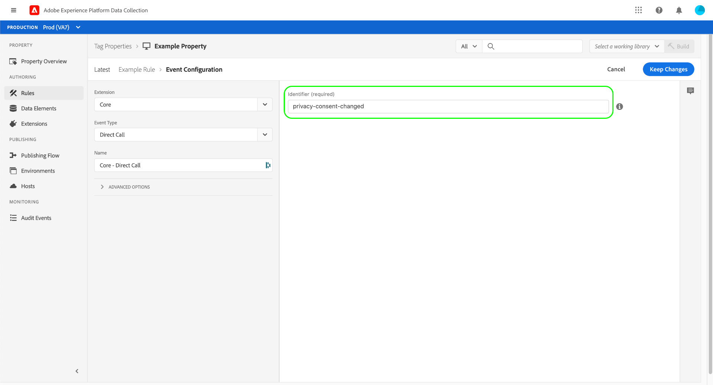

# コア拡張機能の概要

>[!NOTE]
>
>Adobe Experience Platform Launch は、Adobe Experience Platform のデータ収集テクノロジースイートとしてリブランドされています。 その結果、製品ドキュメント全体でいくつかの用語の変更がロールアウトされました。 用語の変更点の一覧については、次の[ドキュメント](../../../term-updates.md)を参照してください。

Core タグ拡張機能は、Adobe Experience Platform でリリースされたデフォルトの拡張機能です。

このドキュメントでは、コア拡張機能を使用してルールを作成する際に使用できるオプションに関する情報を提供します。

## Core 拡張機能のイベントタイプ {#core-extension-event-types}

このトピックでは、Core 拡張機能で使用できるイベントのタイプについて説明します。複数のイベントタイプに設定できるオプションについては、 [オプション](#options) の節を参照してください。

### ブラウザーベースのイベント

#### Tab Blur

tab-blur イベントは、タブがフォーカスを失ったときのアクションをトリガーします。 このイベントタイプに関する設定はありません。

#### Tab Focus

tab-focus イベントは、タブがフォーカスされたときのアクションをトリガーします。 このイベントタイプに関する設定はありません。

### フォーム

#### Blur

blur イベントは、フォームがフォーカスを失ったときのアクションをトリガーします。 カスタマイズ可能なイベント設定について詳しくは、 [オプション](#options) の節を参照してください。

#### Focus

focus イベントは、フォームがフォーカスを取得したときのアクションをトリガーします。 カスタマイズ可能なイベント設定について詳しくは、 [オプション](#options) の節を参照してください。

#### Submit

送信イベントは、フォームが送信されたときのアクションをトリガーします。 カスタマイズ可能なイベント設定について詳しくは、 [オプション](#options) の節を参照してください。

### キーボード制御イベント

#### Key Press

キーが押されたとき、イベントをトリガーします。 カスタマイズ可能なイベント設定について詳しくは、 [オプション](#options) の節を参照してください。

### メディアベースのイベント

#### Media Ended

メディアが終了したとき、イベントをトリガーします。カスタマイズ可能なイベント設定について詳しくは、 [オプション](#options) の節を参照してください。

#### Media-Loaded Data

メディアがデータを読み込むと、イベントをトリガーします。カスタマイズ可能なイベント設定について詳しくは、 [オプション](#options) の節を参照してください。

#### Media Pause

メディアが一時停止されると、イベントをトリガーします。カスタマイズ可能なイベント設定について詳しくは、 [オプション](#options) の節を参照してください。

#### Media Play

メディアが再生されると、イベントをトリガーします。カスタマイズ可能なイベント設定について詳しくは、 [オプション](#options) の節を参照してください。

#### Media Stalled

メディアが停止した場合に、イベントがトリガーされます。 カスタマイズ可能なイベント設定について詳しくは、[オプション](#options) の節を参照してください。

#### Media-Time Played

メディアが一定の時間再生されると、イベントをトリガーします。イベントがトリガーされるように、メディアの再生時間を指定する必要があります。カスタマイズ可能なイベント設定について詳しくは、 [オプション](#options) の節を参照してください。


#### Media-Volume Changed

ボリュームが増加または減少すると、イベントをトリガーします。カスタマイズ可能なイベント設定について詳しくは、 [オプション](#options) の節を参照してください。

### モバイルデバイス指向のイベント

#### Orientation Change

デバイスの向きが変更されたら、イベントをトリガーします。イベントがトリガーされるように、向きを変更する期間を指定する必要があります。このイベントタイプに関する設定はありません。

#### Zoom Change

ユーザーがズームインまたはズームアウトすると、イベントをトリガーします。このイベントタイプに関する設定はありません。

### マウス制御イベント

#### Click

指定した要素が選択（クリック）されると、イベントをトリガーします。オプションとして、イベントがトリガーされる前に、要素で true となる必要があるプロパティ値を指定できます。

要素がリンクされたコンテンツ向けのアンカータグ（`<a>`）の場合は、ナビゲーションを一定の期間遅らせるかどうかを指定することもできます。これは、ルールの実行に余分な時間が必要で、通常ページナビゲーションがおこなわれる前に実行が完了しない場合に便利です。

>[!WARNING]
>
>このオプションは、誤って使用した場合、ユーザーエクスペリエンスに悪影響を与える可能性があるので、慎重に使用してください。

リンク遅延を使用すると、Platform は実際にブラウザーがページから移動するのを防ぎます。 次に、指定されたタイムアウトの後に、元の宛先への JavaScript リダイレクトを実行します。これは、ページのマークアップに `<a>` タグがあり、意図したとおりに機能しても実際にはユーザーがページから移動しない場合は特に危険です。  問題を他の方法で解決できない場合は、セレクターの定義を正確に指定して、このイベントが必要な場所でのみトリガーするようにしてください。

デフォルトのリンク遅延値は 100 ミリ秒です。 タグは常に指定の時間待機し、ルールのアクションの実行には一切関与しないことに注意してください。 遅延のせいでユーザーの待機時間が必要以上に長くなる可能性があります。また、逆に、遅延が十分に長くないためルールの必ずしもすべてのアクションが正常に完了することができない可能性もあります。この時間を長くすると、ルールの実行に時間がかかるだけでなく、ユーザーエクスペリエンスも低下します。

遅延を有効にするには、イベントをトリガーする選択要素と、イベントがトリガーされるまでの特定の時間の両方を指定する必要があります。

詳細設定のオプションについて詳しくは、 [オプション](#options) の節を参照してください。

#### Hover

指定した要素にユーザーがマウスポインターを置くと、イベントをトリガーします。また、ルールがすぐにトリガーされるか、指定した時間（ミリ秒）が経過した後でルールがトリガーされるかを設定します。カスタマイズ可能なイベント設定について詳しくは、 [オプション](#options) の節を参照してください。

### その他のイベント

#### Custom Event

カスタムイベントタイプが発生すると、イベントをトリガーします。コードベース内の他の場所で定義されている名前付き JavaScript 関数は、カスタムイベントタイプとして使用できます。カスタムイベントタイプの名前を指定し、次の[オプション](#options)の節で説明するように、その他の設定をおこないます。

#### Data Element Changed

指定したデータ要素が変更されると、イベントをトリガーします。データ要素の名前を指定する必要があります。 データ要素を選択するには、テキストフィールドにその名前を入力するか、テキストフィールドの右側にあるデータ要素アイコンを選択し、表示されるダイアログ内のリストから選択します。

#### 直接呼出し {#direct-call-event}

直接呼出しイベントは、イベント検出とルックアップシステムをバイパスします。直接呼出しルールは、システムに対して、どのような処理が行われるかを正確に伝える場合に最適です。また、システムが DOM でイベントを検出できない場合にも最適です。

直接呼出しイベントを定義する際には、このイベントの識別子として機能する文字列を指定する必要があります。同じ識別子を含む[直接呼び出しアクションをトリガー](#direct-call-action)が実行されると、その識別子をリスンするすべての直接呼出しイベントルールが実行されます。



#### Element Exists

指定した要素が存在する場合は、イベントをトリガーします。カスタマイズ可能なイベント設定について詳しくは、 [オプション](#options) の節を参照してください。

#### Enters Viewport

指定したビューポートにユーザーが入ると、イベントをトリガーします。一致する要素をターゲットにする条件として、CSS セレクターを指定する必要があります。 ルールを直ちにトリガーするか、指定した時間（ミリ秒）が経過した後にトリガーするか、およびイベントが発生するたびにイベントをトリガーするか、初回のみトリガーするかを設定する必要があります。

カスタマイズ可能なイベント設定について詳しくは、 [オプション](#options) の節を参照してください。

#### History Change

pushState または hashchange イベントが発生した場合にイベントがトリガーされます。 このイベントタイプに関する設定はありません。

#### Time-Spent on Page

指定した秒数の間ユーザーがページに留まると、イベントをトリガーします。イベントをトリガーするまでの時間（経過する必要がある秒数）を指定します。

### ページ読み込みイベント

#### DOM Ready

DOM の準備が完了し、ユーザーがページを操作できるようになるとイベントをトリガーします。このイベントタイプに関する設定はありません。

#### Library Loaded（Page Top） {#library-loaded-page-top}

タグライブラリが読み込まれるとすぐにイベントをトリガーします。 このイベントタイプに関する設定はありません。

#### Page Bottom {#page-bottom}

`_satellite.pageBottom();` が呼び出されたら、イベントをトリガーします。タグライブラリを非同期で読み込む場合、このイベントタイプは使用しないでください。このイベントタイプに関する設定はありません。

#### Window Loaded

onLoad がブラウザーによって呼び出され、ページの読み込みが完了すると、イベントをトリガーします。このイベントタイプに関する設定はありません。

### オプション {#options}

各フォームイベントタイプでは、次の設定を使用します。

#### Specific Elements \| Any Element

* 「**[!UICONTROL 特定の要素]**」を選択すると、要素とプロパティの値を選択するオプションが表示されます。
* 「**[!UICONTROL 任意の要素]**」を選択した場合、要素を絞り込むための追加オプションは不要です。

#### Elements matching the CSS selector

イベントをトリガーする要素を識別する CSS セレクターを入力します。

#### And having certain property values

このオプションを選択すると、次のパラメーターを使用できるようになります。

* `property=value`

   プロパティの値を指定します。

* Regex

   `property=value` が正規表現の場合は有効にします。

* Add

   別の `property=value` ペアを追加します。

#### Advanced options (Bubbling)

* イベントが子孫要素から開始した場合でも、このルールを実行します
* 既に子孫要素をターゲットとしているルールがトリガーされている場合でも、このルールを実行できます
* ルールが実行された後に、親要素のターゲティングルールをトリガーしないようにしてください

## Core 拡張機能の条件のタイプ

ここでは、Core 拡張機能で使用できる条件のタイプについて説明します。これらの条件タイプは、標準ロジックと例外ロジックのどちらででも使用できます。

### データ

#### Cookie

アクションをトリガーするためにイベントで使用する必要がある cookie の名前と値を指定します。

1. Cookie 名を指定します。
1. イベントでアクションをトリガーする場合に、cookie に存在している必要がある値を入力します。
1. （オプション）正規表現の場合は、正規表現を有効にします。

#### カスタムコード

イベントの条件として存在する必要があるカスタムコードを指定します。

>[!NOTE]
>
>ES6+ JavaScript がカスタムコードでサポートされるようになりました。一部の古いブラウザーは ES6 以降をサポートしていません。 ES6+ 関数を使用した場合の影響を理解するには、サポート対象の web ブラウザーに対してテストしてください。

組み込みコードエディターを使用してカスタムコードを入力します。

1. 「**[!UICONTROL エディターを開く]**」を選択します。
1. カスタムコードを入力します。
1. 「**[!UICONTROL 保存]**」を選択します。

カスタムコード内から参照できる `event` という名前の変数が自動的に使用可能になります。この `event` オブジェクトには、ルールをトリガーしたイベントに関する便利な情報が含まれます。どのイベントを使用できるかを判断する最も簡単な方法として、カスタムコード内からコンソールに `event` を記録します。

```javascript
console.log(event);
return true;
```

ブラウザーでルールを実行し、ブラウザーのコンソールでログに記録されたイベントオブジェクトを調べます。利用可能な情報を把握したら、その情報をカスタムコード内でプログラム判定に使用できます。

*条件の順序付け*

プロパティ設定の「Run rule components in sequence」オプションを有効にすると、条件によって非同期タスクが実行される間、後続のルールコンポーネントを待機させることができます。

条件によって [Promise](https://developer.mozilla.org/ja-JP/docs/Web/JavaScript/Reference/Global_Objects/Promise) が返される場合、ルール内の次の条件は、返されたプロミスが解決されるまで実行されません。プロミスが拒否された場合、タグはその条件を失敗と見なし、そのルールからのそれ以上の条件やアクションは実行されません。

プロミスを返す条件の例を次に示します。

```javascript
return new Promise(function(resolve, reject) {
  setTimeout(function() {
    if (new Date().getDay() === 5) {
      resolve();
    } else {
      reject();
    }
  }, 1000);
});
```

#### 値の比較 {#value-comparison}

2 つの値を比較して、この条件が true を返すかどうかを判断します。

複数の条件を持つルールがある場合、この条件で true が返されても、他の条件が false と評価されるか、いずれかの例外が true と評価されて、ルールが実行されない可能性があります。

1. 値を指定します。
1. 演算子を選択します。詳細については、次の値比較演算子のリストを参照してください。
1. （必要な場合）比較で大文字と小文字を区別するかどうかを選択します。
1. 比較用に別の値を指定します。

次の値比較演算子を使用できます。

**Equal：**&#x200B;厳密でない比較を使用して 2 つの値が等しい場合（JavaScript では == 演算子）、true を返します。値には任意のタイプを指定できます。値フィールドに _true_、_false_、_null_&#x200B;または _undefined_ などの単語を入力すると、その単語は文字列として比較され、同等の JavaScript には変換されません。

**Does Not Equal：**&#x200B;厳密でない比較で 2 つの値が等しくない場合（JavaScript では= 演算子）、条件は true を返します。値には任意のタイプを指定できます。値フィールドに _true_、_false_、_null_&#x200B;または _undefined_ などの単語を入力すると、その単語は文字列として比較され、同等の JavaScript には変換されません。

**Contains：**&#x200B;最初の値に 2 番目の値が含まれている場合、条件は true を返します。数値は文字列に変換されます。数値または文字列以外の値を指定すると、条件は false を返します。

**Does Not Contain：**&#x200B;最初の値に 2 番目の値が含まれていない場合、条件は true を返します。数値は文字列に変換されます。数字または文字列以外の値を指定すると、条件は true を返します。

**Starts With：**&#x200B;最初の値が 2 番目の値で開始する場合、条件は true を返します。数値は文字列に変換されます。数値または文字列以外の値を指定すると、条件は false を返します。

**Does Not Start With：**&#x200B;最初の値が 2 番目の値で始まらない場合、条件は true を返します。数値は文字列に変換されます。数値または文字列以外の値を指定すると、条件は true を返します。

**Ends With：**&#x200B;最初の値が 2 番目の値で終わる場合、条件は true を返します。数値は文字列に変換されます。数値または文字列以外の値を指定すると、条件は false を返します。

**Does Not End With：**&#x200B;最初の値が 2 番目の値で終わらない場合、条件は true を返します。数値は文字列に変換されます。数値または文字列以外の値を指定すると、条件は true を返します。

**Matches Regex：**&#x200B;最初の値が正規表現と一致する場合、条件は true を返します。数値は文字列に変換されます。数値または文字列以外の値を指定すると、条件は false を返します。

**Does Not Match Regex：**&#x200B;最初の値が正規表現と一致しない場合、条件は true を返します。数値は文字列に変換されます。数値または文字列以外の値を指定すると、条件は true を返します。

**Is Less Than：**&#x200B;最初の値が 2 番目の値より小さい場合、条件は true を返します。数字を表す文字列は数値に変換されます。数値または変換可能な文字列以外の値を指定すると、条件は false を返します。

**Is Less Than Or Equal To：**&#x200B;最初の値が 2 番目の値以下の場合、条件は true を返します。数字を表す文字列は数値に変換されます。数値または変換可能な文字列以外の値を指定すると、条件は false を返します。

**Is Greater Than：**&#x200B;最初の値が 2 番目の値以上の場合、条件は true を返します。数字を表す文字列は数値に変換されます。数値または変換可能な文字列以外の値を指定すると、条件は false を返します。

**Is Greater Than Or Equal To：**&#x200B;最初の値が 2 番目の値以上の場合、条件は true を返します。数字を表す文字列は数値に変換されます。数値または変換可能な文字列以外の値を指定すると、条件は false を返します。

**Is True：**&#x200B;値が true のブール値の場合、条件は true を返します。他のタイプの場合、指定した値はブール値に変換されません。値が true のブール値以外の値を指定すると、条件は false を返します。

**Is Truthy：**&#x200B;ブール値に変換した後、値が true の場合、条件は true を返します。Truthy な値の例については、[MDN の Truthy に関するドキュメント](https://developer.mozilla.org/ja-JP/docs/Glossary/Truthy)を参照してください。

**Is False：**&#x200B;値が false のブール値の場合、条件は true を返します。他のタイプの場合、指定した値はブール値に変換されません。値が false のブール値以外の値を指定すると、条件は false を返します。

**Is Falsy：**&#x200B;ブール値に変換した後、値が false の場合は、条件は true を返します。Falsy な値の例については、[MDN の Falsy に関するドキュメント](https://developer.mozilla.org/ja-JP/docs/Glossary/Falsy)を参照してください。

#### Variable

アクションをトリガーするためにイベントで使用する必要がある JavaScript変数名と値を指定します。

1. JavaScript 変数名を指定します。
1. イベントの条件に必要な変数値を指定します。
1. （オプション）正規表現の場合は、正規表現を有効にします。

### Engagement

#### Landing Page

イベントをトリガーするためにユーザーがランディングする必要があるページを指定します。

1. ランディングページを指定します。
1. （オプション）正規表現の場合は、正規表現を有効にします。

#### New/Returning Visitor

アクションをトリガーするには、訪問者がイベントの新規訪問者または再訪問者である必要があるかどうかを指定します。

次のいずれかを選択します。

* New Visitor
* Returning Visitor

#### Page Views

アクションがトリガーされる前に訪問者がページを何回表示する必要があるかを設定します。

1. ページビュー数を、指定した値より大きい、指定した値と等しい、または指定した値未満のどれにする必要があるかを選択します。
1. 条件が満たされているかどうかを判断するページビュー数を指定します。
1. 次のいずれかを選択して、ページビューをカウントするタイミングを設定します。
   * Lifetime
   * Current Session

#### Sessions

ユーザーのセッション数が指定した条件を満たす場合、アクションをトリガーします。

1. セッション数を、指定した値より大きい、指定した値と等しい、または指定した値未満のどれにするかを選択します。
1. 条件が満たされているかどうかを判断するセッション数を指定します。

#### Time On Site

ユーザーのセッション数が指定した条件を満たす場合、アクションをトリガーします。

訪問者がどの程度の時間サイトに滞在したらアクションをトリガーするかを設定します。

1. 訪問者がサイトに滞在している時間（分）を、指定した値より大きい、指定した値と等しい、または指定した値未満のどれにする必要があるかを選択します。
1. 条件が満たされているかどうかを判断する時間（分）を指定します。

#### Traffic Source

ユーザーのセッション数が指定した条件を満たす場合、アクションをトリガーします。

アクションをトリガーするために、true となっている必要がある訪問者のトラフィックのソースを指定します。

1. トラフィックソースを指定します。
1. （オプション）正規表現の場合は、正規表現を有効にします。

### 技術

#### Browser

アクションをトリガーするために、訪問者が使用する必要があるブラウザーを選択します。

次のブラウザーを 1 つ以上選択します。

* Chrome
* Firefox
* Internet Explorer/Edge
* Internet Explorer Mobile
* Mobile Safari
* OmniWeb
* Opera
* Opera Mini
* Opera Mobile
* Safari

#### Device Type

アクションをトリガーするために、訪問者が使用する必要があるデバイスのタイプを選択します。

次のデバイスタイプを 1 つ以上選択します。

* Android
* BlackBerry
* Desktop
* iPad
* iPhone
* iPod
* Nokia
* Windows Phone

#### Operating System

アクションをトリガーするために、訪問者が使用する必要があるオペレーティングシステムを選択します。

次のオペレーティングシステムを 1 つ以上選択します。

* Android
* BlackBerry
* iOS
* Linux
* MacOS
* Maemo
* Symbian OS
* Unix
* Windows

#### Screen Resolution

アクションをトリガーするために、訪問者がデバイスで使用する必要がある画面解像度を選択します。

1. 画面解像度の幅を、指定した値より大きい、指定した値と等しい、または指定した値未満のどれにするかを選択します。
1. 画面解像度の幅に必要なピクセル数を指定します。
1. 画面解像度の高さを、指定した値より大きい、指定した値と等しい、または指定した値未満のどれにするかを選択します。
1. 画面解像度の高さに必要なピクセル数を指定します。

#### Window Size

アクションをトリガーするために、訪問者がデバイスで使用する必要があるウィンドウサイズを選択します。

1. ウィンドウサイズの幅を、指定した値より大きい、指定した値と等しい、または指定した値未満のどれにするかを選択します。
1. ウィンドウサイズの幅に必要なピクセル数を指定します。
1. ウィンドウサイズの高さを、指定した値より大きい、指定した値と等しい、または指定した値未満のどれにするかを選択します。
1. ウィンドウサイズの高さに必要なピクセル数を指定します。

### URL

#### Domain

訪問者のドメインを指定します。

#### Hash

URL に必要な 1 つ以上のハッシュパターンを指定します。

>[!NOTE]
>
>複数のハッシュパターンは OR で結合されます。

1. ハッシュパターンを指定します。
1. （オプション）正規表現の場合は、正規表現を有効にします。
1. その他のハッシュパターンを追加します。

#### Path And Query String

URL に存在する必要がある 1 つ以上のパスを指定します。パスとクエリー文字列が含まれます。

>[!NOTE]
>
>複数のパスは OR で結合されます。

1. パスを指定します。
1. （オプション）正規表現の場合は、正規表現を有効にします。
1. 他のパスを追加します。

#### Path Without Query String

URL に存在する必要がある 1 つ以上のパスを指定します。これにはパスが含まれますが、クエリー文字列は含まれません。

>[!NOTE]
>
>複数のパスは OR で結合されます。

1. パスを指定します。
1. （オプション）正規表現の場合は、正規表現を有効にします。
1. 他のパスを追加します。

#### Protocol

URL で使用するプロトコルを指定します。

次のいずれかを選択します。

* HTTP
* HTTPS

#### Query String Parameter

URL で使用する URLパラメーターを指定します。

1. URL パラメーター名を指定します。
1. URL パラメーターに使用する値を指定します。
1. （オプション）正規表現の場合は、正規表現を有効にします。

#### Subdomain

URL に存在する 1 つまたは複数のサブドメインを指定します。

>[!NOTE]
>
>複数のサブドメインは、OR で結合されます。

1. サブドメインを指定します。
1. （オプション）正規表現の場合は、正規表現を有効にします。
1. 他のサブドメインを追加します。

### その他

#### Date Range

日付範囲を指定します。イベントが発生する前または後の日時、タイムゾーンを選択します。

#### Max Frequency

条件が true を返す最大回数を指定します。選択できる項目は次のとおりです。

* Page view
* セッション
* Visitor
* Seconds
* Minutes
* Days
* Weeks
* Months

条件の最大頻度 1 セッションあたり、これら 2 つの `localStorage` 項目が比較されます。 `visitorTracking.sessionCount` が `maxFrequency.session` カウントより大きい場合、サンプリング条件は true です。 これらが等しい場合、条件は false です。

`sessionCount` が `visitorTracking` 項目である場合は、訪問者 API を有効にして、サンプリング条件が機能するようにする必要があります。

#### Sampling

条件が true を返す時間のパーセンテージを指定します。

## Core 拡張機能のアクションタイプ

ここでは、Core 拡張機能で使用できるアクションタイプについて説明します。

### カスタムコード

>[!NOTE]
>
>ES6+ JavaScript がカスタムコードでサポートされるようになりました。一部の古いブラウザーは ES6 以降をサポートしていません。 ES6+ 関数を使用した場合の影響を理解するには、サポート対象の web ブラウザーに対してテストしてください。

イベントのトリガー後に実行して条件を評価するコードを提供します。

1. アクションコードに名前を付けます。
1. アクションの定義に使用する言語を選択します。
   * JavaScript
   * HTML
1. アクションコードをグローバルに実行するかどうかを選択します。
1. 「**[!UICONTROL エディターを開く]**」を選択します。
1. コードを編集して、「**[!UICONTROL 保存]**」を選択します。

言語として「JavaScript」を選択すると、カスタムコード内から参照できる `event` という名前の変数が自動的に使用可能になります。この `event` オブジェクトには、ルールをトリガーしたイベントに関する便利な情報が含まれます。どのイベントを使用できるかを判断する最も簡単な方法として、カスタムコード内からコンソールに `event` を記録します。

```javascript
console.log(event);
```

ブラウザーでルールを実行し、ブラウザーのコンソールでログに記録されたイベントオブジェクトを調べます。利用可能な情報を把握したら、カスタムコード内でその情報をプログラム判定に使用したり、`event` オブジェクトの一部をサーバーに送信したりできます。

### 「Custom Code」アクションの処理

Core 拡張機能は、すべての Adobe Experience Platform ユーザーが使用でき、ユーザー指定の JavaScript または HTML を実行するためのカスタムコードアクションが含まれています。「Custom Code」アクションを使用するルールの処理方法を理解すると便利です。

#### 「Page Top」または「Page Bottom」イベントを使用するルール

カスタムアクションからのコードは、メインタグライブラリに埋め込まれます。コードは、document.write を使用してドキュメントに書き込まれます。ルールに複数のカスタムコードアクションがある場合、コードはルール内で設定されている順序で記述されます。

#### Page Top または Page Bottom 以外のイベントを使用するルール

カスタムアクションのコードはサーバーから読み込まれ、[Postscribe](https://github.com/krux/postscribe) を使用してドキュメントに書き込まれます。ルールに複数のカスタムコードアクションがある場合、コードはサーバーから平行して読み込まれますが、ルール内で設定されている順序で記述されます。

ページの読み込み後に document.write を使用すると、通常は問題が発生しますが、これはカスタムコードアクションによって提供されるコードの場合は問題になりません。コードを実行するタイミングに関係なく、カスタムコードアクション内で document.write を使用できます。

#### カスタムコードの検証

タグコードエディターで使用されるバリデーターは、開発者が作成したコードの問題を識別するように作られています。縮小処理をおこなったコード（コードマネージャーからダウンロードした AppMeasurement.js コードなど）は、バリデーターによって、誤って「問題あり」とフラグ付けされることがありますが、通常は無視できます。

#### アクションの順序付け

プロパティ設定の「Run rule components in sequence」オプションを有効にすると、アクションによって非同期タスクが実行される間、後続のルールコンポーネントを待機させることができます。JavaScript と HTML カスタムコードでは、動作は異なります。

*JavaScript*

JavaScript のカスタムコードアクションを作成する場合、アクションから [Promise](https://developer.mozilla.org/en-US/docs/Web/JavaScript/Reference/Global_Objects/Promise) を返すことがあります。ルール内の次のアクションは、返されたプロミスが解決された場合にのみ実行されます。プロミスが拒否された場合、ルールの次のアクションは実行されません。

>[!NOTE]
>
>これは、JavaScript がグローバルに実行されないよう設定されている場合にのみ機能します。グローバルスコープでカスタムコードアクションを実行している場合、タグはプロミスが直ちに解決されたものと見なし、処理キュー内の次の項目に移動します。

プロミスを返す JavaScript カスタムコードアクションの例を次に示します。

```javascript
return new Promise(function(resolve, reject) {
  setTimeout(function() {
    if (new Date().getDay() === 5) {
      resolve();
    } else {
      reject();
    }
  }, 1000);
});
```

*HTML*

HTML のカスタムコードアクションを作成する場合、`onCustomCodeSuccess()` という関数をカスタムコード内で使用することができます。この関数を呼び出して、カスタムコードが完了し、タグが後続のアクションの実行に進むことができると示すことができます。一方、カスタムコードが何らかの方法で失敗した場合は、`onCustomCodeFailure()` を呼び出すことができます。これにより、そのルールから後続のアクションを実行しないようにタグに通知します。

新しいコールバックを使用する HTML カスタムコードアクションの例を次に示します。

```html
<script>
setTimeout(function() {
  if (new Date().getDay() === 5) {
    onCustomCodeSuccess();
  } else {
    onCustomCodeFailure();
  }
}, 1000);
</script>
```

### 直接呼出しのトリガー {#direct-call-action}

このアクションは、特定の[直接呼出しイベント](#direct-call-event)を使用するすべてのルールをトリガーします。アクションを設定する際に、トリガーする直接呼出しイベントの識別子文字列を指定する必要があります。オプションとして、`detail` オブジェクト（キーと値のペアのカスタムセットを含めることができる）を介して直接呼出しイベントにデータを渡すこともできます。


アクションは、クライアントサイドのコードからアクセスできる `satellite` オブジェクトの [`track` メソッド](../../../ui/client-side/satellite-object.md?lang=en#track)に直接マッピングされます。

## Core 拡張機能データ要素のタイプ

データ要素のタイプは、拡張機能によって決まります。タイプはいくつでも作成することができます。

以降の節では、Core 拡張機能で使用できるデータ要素のタイプについて説明します。その他の拡張機能は、他のタイプのデータ要素を使用します。

### Cookie

使用可能なドメイン cookie は、「cookie name」フィールドで参照できます。

#### 例：

`cookieName`

### 定数

アクションまたは条件で参照できる任意の定数文字列値。

#### 例：

`string`

### カスタムコード

>[!NOTE]
>
>ES6+ JavaScript がカスタムコードでサポートされるようになりました。一部の古いブラウザーは ES6 以降をサポートしていません。 ES6+ 関数を使用した場合の影響を理解するには、サポート対象の web ブラウザーに対してテストしてください。

カスタム JavaScript を UI に入力するには、「エディターを開く」を選択してエディターウィンドウにコードを挿入します。

データ要素の値として使用する値を示すために、エディターウィンドウで return ステートメントを記述する必要があります。return ステートメントが含まれていない場合や、値 `null` または `undefined` が返された場合は、データ要素のデフォルト値がデータ要素の値として使用されます。

**例：**

```javascript
var pageType = $('div.page-wrapper').attr('class').split('')[1];
if (window.location.pathname == '/') {
  return 'homepage';
} else {
  return pageType;
}
```

カスタムコードデータ要素がルールの実行中に取得される場合、カスタムコード内から参照できる `event` という名前の変数が自動的に使用可能になります。この `event` オブジェクトには、ルールをトリガーしたイベントに関する便利な情報が含まれます。どのイベントを使用できるかを判断する最も簡単な方法として、カスタムコード内からコンソールに `event` を記録します。

```javascript
console.log(event);
return true;
```

ブラウザーでルールを実行し、ブラウザーのコンソールでログに記録されたイベントオブジェクトを調べます。データ要素を使用できる様々なルールにおいて使用可能な情報を把握したら、カスタムコード内でその情報をプログラム判定に使用したり、`event` オブジェクトの一部をデータ要素の値として返すことができます。

### DOM 属性

div または H1 タグなど、任意の要素の値を取得できます。

#### 例：

CSS セレクターチェーン：

`id#dc logo img`

値を取得する要素：

`src`

### JavaScript 変数

使用可能な JavaScript オブジェクトまたは変数は、パスフィールドを使用して参照できます。

タグデータ要素を使用して、マークアップの JavaScript 変数やオブジェクトプロパティを取り込むことができます。 これらの値は、タグデータ要素を参照することで、拡張機能やカスタムルール内で使用できます。 データのソースが変更された場合は、データ収集 UI 内でソースへの参照を更新するだけで済みます。

次の例では、マークアップに `Page_Name` という JavaScript 変数が含まれています。

```markup
<script>
  //data layer
  var Page_Name = "Homepage"
</script>
```

データ収集 UI でデータ要素を作成する場合は、この変数へのパスを指定するだけです。

データレイヤーでデータコレクターオブジェクトを使用している場合は、データ要素に取得するオブジェクトおよびプロパティを参照するドット表記をパスに使用します（例：`_myData.pageName` や `digitalData.pageName` など）。

#### 例：

`window.document.title`

### ローカルストレージ

「Local Storage Item Name」フィールドにローカルストレージ項目の名前を入力します。

ローカルストレージを使用すると、ブラウザーはページからページへと情報を保存できます（[https://www.w3schools.com/html/html5_webstorage.asp](https://www.w3schools.com/html/html5_webstorage.asp)）。ローカルストレージは cookie のように機能しますが、cookie よりも大きく、柔軟です。

指定したフィールドを使用して、ローカルストレージ項目用に作成した値（例：`lastProductViewed.`）を指定します。

### 結合オブジェクト

各要素がオブジェクトを提供する複数のデータ要素を選択します。これらのオブジェクトは、深く（再帰的に）結合され、新しいオブジェクトが生成されます。ソースオブジェクトは変更されません。複数のソースオブジェクト上の同じ場所にプロパティが見つかった場合は、後者のオブジェクトの値が使用されます。ソースプロパティの値が `undefined` の場合、以前のソースオブジェクトの値は上書きされません。複数のソースオブジェクト上で同じ場所に配列が見つかった場合、配列は連結されます。

例えば、次のオブジェクトを提供するデータ要素を選択するとします。

```
{
  "sport": {
    "name": "tennis"
  },
  "dessert": "ice cream",
  "fruits": [
    "apple",
    "banana"
  ]
}
```

次のオブジェクトを提供する別のデータ要素も選択するとします。

```
{
  "sport": {
    "name": "volleyball"
  },
  "dessert": undefined,
  "pet": "dog",
  "instrument": undefined,
  "fruits": [
    "cherry",
    "duku"
  ]
}
```

結合オブジェクトのデータ要素の結果は、次のオブジェクトになります。

```
{
  "sport": {
    "name": "volleyball"
  },
  "dessert": "ice cream",
  "pet": "dog",
  "instrument": undefined,
  "fruits": [
    "apple",
    "banana",
    "cherry",
    "duku"
  ]
}
```

### ページ情報

これらのデータポイントを使用して、ルールロジックで使用するページ情報をキャプチャしたり、Analytics や外部トラッキング システムに情報を送信したりできます。

次のいずれかのページ属性を選択してデータ要素で使用できます。

* URL
* Hostname
* Pathname
* プロトコル
* リファラー
* Title

### Query String Parameter

単一の URL パラメーターを「URL Parameter」フィールドで指定します。

名前セクションのみが必要で、特殊な指定子（「?」や「=」など）は、省略する必要があります。

#### 例：

`contentType`

### 乱数

乱数を生成するには、このデータ要素を使用します。多くの場合、データのサンプリングや、ID の作成（ヒット ID など）に使用されます。乱数は、難読化または salt 機密データに使用できます。例として次のようなものが挙げられます。

* ヒット ID の生成
* 数字をユーザートークンまあはタイムスタンプと連結して一意性を確保する
* PII データでの単方向ハッシュの実行
* サイトでサーベイリクエストをいつ表示するかをランダムに決定する

乱数の最小値と最大値を指定します。

**デフォルト：**

最小：0

最大：1000000000

### セッションストレージ

「Session Storage Item Name」フィールドにセッションストレージ項目の名前を入力します。

セッションストレージは、ローカルストレージと似ていますが、セッションの終了後はデータが破棄されるという点が異なります。ローカルストレージや cookie はデータを保持することがあります。

### 訪問者行動

ページ情報と同様、このデータ要素は、ルールまたはその他の Platform ソリューションにおいて、共通の動作タイプを使用してロジックを強化します。

次のいずれかの訪問者行動属性を選択します。

* Landing page
* Traffic source
* Minutes on site
* Session count
* Session page view count
* Lifetime page view count
* Is new visitor

一般的なユースケースには次のものが含まれます。

* 訪問者がサイトに 5 分間滞在した後にサーベイを表示する
* 訪問のランディングページの場合は、Analytics 指標を生成する
* 「Session Counts」の数が X に到達したら訪問者に新しいオファーを表示する
* 初回訪問者にニュースレターへの新規登録を表示する

### 条件付き値

[値の比較](#value-comparison-value-comparison)条件のラッパー。比較の結果に基づいて、フォームで使用可能な 2 つの値のいずれかを返します。これにより、追加のルールを必要とせずに、「If ... Then ... Else ...」シナリオを処理できます。

### ランタイム環境

次のいずれかの変数を選択できます。

* 環境ステージ - 開発環境／ステージング環境／実稼動環境を区別するために `_satellite.environment.stage` を返します。
* ライブラリのビルド日 - `_satellite.buildInfo.buildDate` と同じ値を含む `turbine.buildInfo.buildDate` を返します。
* プロパティ名 - Launch プロパティの名前を取得するために `_satellite.property.name` を返します。
* プロパティ ID - Launch プロパティの ID を取得するために `_satellite.property.id` を返します。
* ルール名 - 実行されたルールの名前を含む `event.$rule.name` を返します。
* ルール ID - 実行されたルールの ID を含む `event.$rule.id` を返します。
* イベントタイプ - ルールをトリガーしたイベントのタイプを含む `event.$type` を返します。
* イベントの詳細ペイロード - カスタムイベントまたはダイレクトコールルールのペイロードを含む `event.detail` を返します。
* ダイレクトコール識別子 - ダイレクトコールルールの識別子を含む `event.identifier` を返します。

### デバイス属性

次のいずれかの訪問者デバイス属性を返します。

* ブラウザーウィンドウのサイズ
* 画面サイズ

### JavaScript ツール

これは、一般的な JavaScript 操作のラッパーです。データ要素を入力として受け取ります。データ要素値の次のいずれかの変換結果を返します。

* 基本的な文字列操作（置換、部分文字列、正規表現の一致、最初と最後のインデックス、分割、スライス）
* 基本的な配列操作（スライス、結合、ポップ、シフト）
* 基本的なユニバーサル操作（スライス、長さ）