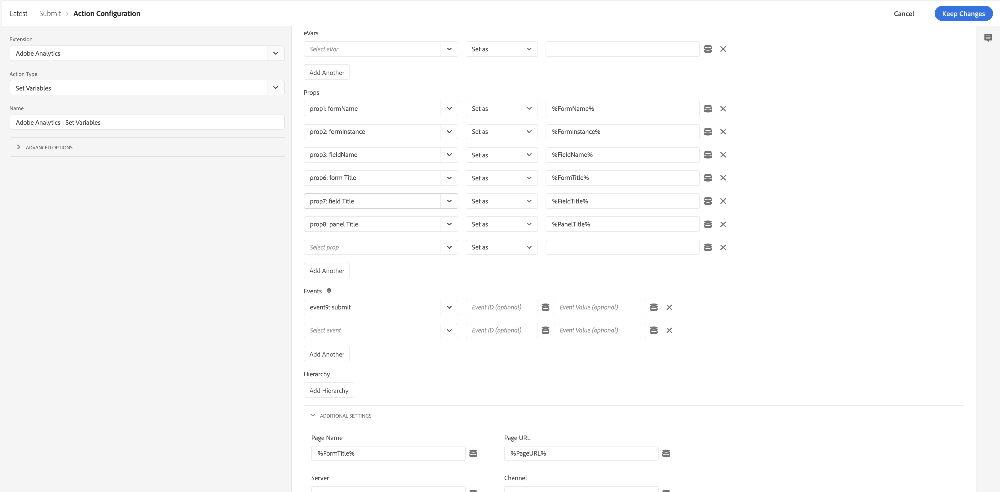

# Adobe Experience Manager Forms拡張機能の概要

このドキュメントでは、Adobe Experience PlatformのAdobe Experience Manager Formsタグ拡張の概要を説明します。

## イベント

拡張機能では、次のイベントタイプが提供されます。

1. **レンダリング**:トリガー：ユーザーがフォームをレンダリング（開く）したとき。
1. **エラー**:トリガー：ユーザーがフォームに検証ミスを犯した場合。
1. **ヘルプ**:トリガー：ユーザーがフィールドのヘルプアイコンをクリックしたとき。
1. **送信**:フォーム送信時のトリガー。
1. **フィールド訪問**:トリガー（フィールドが訪問されたとき）。
1. **放棄**:トリガー。
1. **保存**:トリガー（フォームがポータルに保存されたとき）

>[!IMPORTANT]
>
>Saveイベントは、現在、forms as a Cloud Serviceでは使用できません。 アダプティブFormsのルールエディターによってディスパッチされるカスタムイベントは、コアイベント「Capture custom event」を使用してキャプチャできます。

## データ要素

拡張機能は、Analytics呼び出しでプロパティを送信するために使用できるデータ要素をいくつか提供します。

## はじめに

拡張機能を使用するには、以下の手順に従います。

1. 拡張機能カタログからAdobe Experience Manager Forms拡張機能をインストールします。 インストール後は、それ以上の設定は必要ありません。
2. [Adobe Analytics拡張機能](../analytics/overview.md#Configure-the-Adobe-Analytics-extension)をインストールして設定します。

## ルールの作成

FormsExperience Manager機能を利用するルールは、次のようになります。

以下に示す手順に従って、実装に類似したルールを作成します。

### イベントの追加

1. 「拡張機能」ドロップダウンで「**Adobe Experience Manager Forms**」を選択します。
2. キャプチャするイベントを選択します。

### アクションの追加

1. 拡張機能ドロップダウンで「Adobe Analytics」を選択します。
2. 「アクションタイプ」ドロップダウンで「変数を設定」を選択します。
3. 設定表示で、送信するプロパティとイベントを選択します。
4. 手順3で設定したイベントとプロパティを使用してAnalytics呼び出しを送信する「ビーコンを送信」アクションを追加します
   
5. 「変数をクリア」アクションを追加します。

