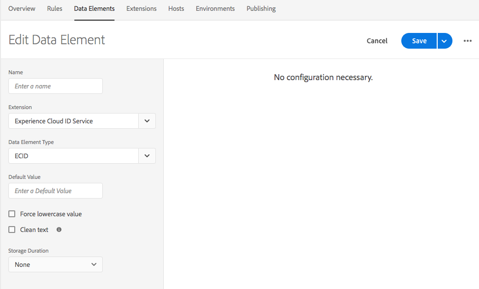

# Adobe Experience Cloud ID サービス拡張機能のリリースノート

>[!NOTE]
>
>Adobe Experience Platform Launch は、Adobe Experience Platform のデータ収集テクノロジースイートとしてリブランドされています。 その結果、製品ドキュメント全体でいくつかの用語の変更がロールアウトされました。 用語の変更点の一覧については、次の[ドキュメント](../../../term-updates.md)を参照してください。

Adobe Experience Platform タグ拡張機能だけでなく、Experience Cloud ID サービス自体のリリースノートについては、[https://experienceleague.adobe.com/docs/id-service/using/release-notes/release-notes.html?lang=ja](https://experienceleague.adobe.com/docs/id-service/using/release-notes/release-notes.html?lang=ja) を参照してください。

## 2021年11月3日（PT）

### Experience Cloud ID Extension 5.2.1

#### **機能**

* このパッチには、Google Chrome ブラウザーで属性 `SameSite=None` を持つ iFrame から Cookie を書き込むための修正が含まれています。

## 2021 年 1 月 12 日（PT）

### Experience Cloud ID Extension 5.2.0

#### **機能**

* 同意を受け取ったときに、ECID DataElement の修正を含む VisitorJS 5.2.0 パッチへのアップデートを更新できませんでした。

## 2020 年 10 月 27 日（PT）

### Experience Cloud ID Extension 5.1.0

#### **機能**

* `AMCV` cookieの `SameSite` 属性を指定する `sameSiteCookie` 設定を追加しました。この設定では、`SameSite` 属性の次の値がサポートされます。

   * `Strict`
   * `Lax`
   * `None`

これらの属性値の詳細は、[web.dev](https://web.dev/samesite-cookies-explained/) と [chromium](https://www.chromium.org/updates/same-site) にあります

## 2020 年 8 月 13 日（PT）

### Experience Cloud ID Extension 5.0.1

#### **機能**

* VisitorJS 5.0.1 パッチに更新し、IAB 同意文字列が変更された場合の d_cf フラグの追加に関する修正を加えました。

## 2020 年 6 月 15 日（PT）

### Experience Cloud ID Extension 5.0.0

#### **機能**

* `IAB TCF` 透明性と同意に関するフレームワーク `Version 2.0` のサポートを追加しました。

## 2020 年 4 月 13 日（PT）

### Experience Cloud ID Extension 4.6.0

#### **機能**

* デフォルトで `loadSSL` フラグをオンにしました。ID サービスへのすべての呼び出しは、デフォルトにより、`https` でオンになります。非 SSL ページから http で ID サービスを呼び出す場合は、false に設定できます。
* ESLint によって報告される問題を修正するため、Internet-Explorer（IE）のバージョン検出に使用する関数を更新しました。
* ECID が optIn で事前に承認され、後で承認された場合、Internet Explorer（IE）11 でパフォーマンスの問題が発生するバグを修正しました。

## 2020 年 1 月 22 日（PT）

### Experience Cloud ID Extension 4.5.2

#### **機能**

* visitor.js を 4.5.2 に更新しました
* 訪問者 4.5.1 には、Optin 用 IAB プラグインのバグ修正が含まれています
* 送信された空の ID を拒否するよう `setCustomerIDs` メソッドを更新しました。

## 2020 年 1 月 7 日（PT）

### Experience Cloud ID Extension 4.4.2

#### **機能**

* visitor.js を 4.4.2 に更新しました
* 値を素早く取得できるよう `getVisitorValues` メソッドを更新しました。

## 2019 年 9 月 19 日（PT）

### Experience Cloud ID Extension 4.4.1

#### **機能**

* visitor.js を 4.4.1 に更新しました
* オプトイン preApprovals 入力の取得に関するバグを修正しました
* preOptInApprovals の VIDEO_ANALYTICS to MEDIA_ANALYTICS の名前を変更しました。

   

## 2019 年 7 月 17 日（PT）

### Experience Cloud ID Extension 4.4.0

#### **機能**

* visitor.js を 4.4.0 に更新しました
* setCustomerIDs の SHA256 ハッシュサポートを追加しました

   

## 2019 年 5 月 13 日（PT）

### Experience Cloud ID Extension 4.3.1

#### **機能**

* visitor.js を 4.3 に更新しました
* タグ拡張機能の一部として、ECID にデータ要素タイプを追加しました

   

## 2019 年 4 月 9 日（PT）

### Experience Cloud ID Extension 4.2.0

#### **機能**

* Audience Manager IAB TCF プラグインのサポートを含む visitor.js を 4.2 に更新しました。

## 2019 年 2 月 25 日（PT）

### Experience Cloud ID Extension 4.1.0

#### **機能**

* visitor.js を 4.1 に更新し、新しい API の変更に従って publishDestinations を更新しました。この更新により、必要に応じて、ID - 同期中にページのリファラー情報を表示できます。

## 2019 年 2 月 15 日（PT）

### Experience Cloud ID Extension 4.0.0

#### **機能**

* visitor.js を 4.0 に更新しました
* 新しい組み込みオプトインオブジェクトの設定オプションを追加しました。オプトイン設定を使用して、GDPR などのサポート規則を改善するために、アドビソリューションの cookie やビーコン呼び出しを抑制することができます

   

## 2018 年 3 月 20 日（PT）

### Experience Cloud ID Extension 3.1.0

#### **機能**

* visitor.js を 3.1 に更新しました
* `resetBeforeVersion` と `serverState` の 2 つの設定プロパティを追加しました。
