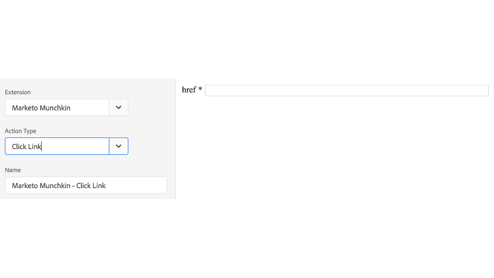

# Marketo Munchkin 拡張機能の概要

>[!NOTE]
>
>Adobe Experience Platform Launchは、Adobe Experience Platformのデータ収集テクノロジーのスイートとしてリブランドされました。 その結果、製品ドキュメント全体でいくつかの用語の変更がロールアウトされました。用語の変更点の一覧については、次の[ドキュメント](../../../term-updates.md)を参照してください。

この拡張機能を使用して、[!DNL Marketo Munchkin] JavaScript トラッキングコードをプロパティと統合します。[!DNL Marketo Munchkin] JavaScript を使用すると、Marketo ランディングページと外部 web ページに対するエンドユーザーのページ訪問回数およびナビゲーション回数を追跡できます。

## Marketo Munchkin 拡張機能のインストール

[!DNL Marketo Munchkin] 拡張機能がまだインストールされていない場合は、プロパティを開いて&#x200B;**[!UICONTROL エクステンション／カタログ]**&#x200B;を選択し、 [!DNL Marketo Munchkin] 拡張機能にカーソルを置いて「**[!UICONTROL インストール]**」を選択します。

この拡張には必要な設定はありません。

## Marketo Munchkin 拡張機能のアクションタイプ

ここでは、 [!DNL Marketo Munchkin] 拡張機能で使用できるアクションタイプについて説明します。

### 初期設定

**Munchkin ID:（必須）**&#x200B;管理者／統合／Munchkin メニューにある Munchkin アカウント ID。

**Configurations：**&#x200B;設定可能なパラメーターはすべて[ここ](https://developers.marketo.com/javascript-api/lead-tracking/configuration/)に記載されています。

### Web ページにアクセス

**url：（必須）**&#x200B;ページ訪問の記録に使用する URL ファイルパス。

**params：**&#x200B;記録する必要のあるパラメーターのクエリー文字列。

**name：** Web ページアセットのカスタム名。

### リンクをクリック

**href：（必須）**&#x200B;リンク選択の記録に使用する URL ファイルパス。
