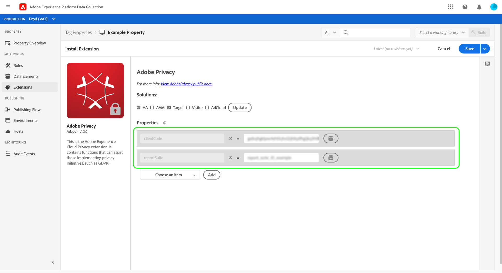
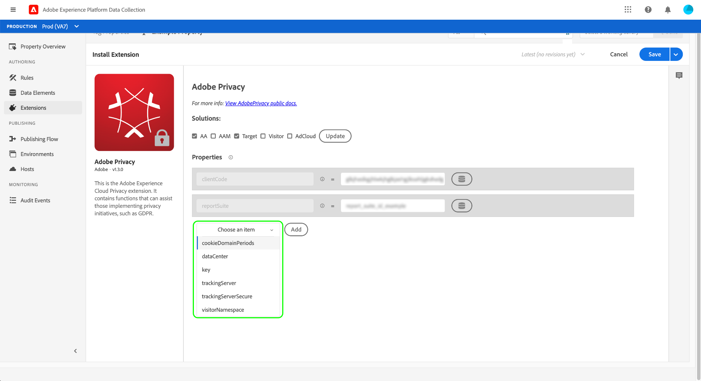

# Adobe Privacy 拡張機能の概要

>[!NOTE]
>
>Adobe Experience Platform Launch は、Adobe Experience Platform のデータ収集テクノロジースイートとしてリブランドされています。 その結果、製品ドキュメント全体でいくつかの用語の変更がロールアウトされました。 用語の変更点の一覧については、次の[ドキュメント](../../../term-updates.md)を参照してください。

Adobeプライバシータグ拡張を使用すると、クライアントサイドデバイス上のAdobeソリューションによってエンドユーザーに割り当てられているユーザー ID を収集および削除できます。 収集された ID は、次の場所に送信できます。 [Adobe Experience Platform Privacy Service](../../../../privacy-service/home.md) をクリックして、サポートされているAdobe Experience Cloudアプリケーションで関連する個人の個人データにアクセスしたり、個人データを削除したりします。

このガイドでは、データ収集 UI でAdobeプライバシー拡張機能をインストールおよび設定する方法について説明します。

>[!NOTE]
>
>If you prefer to install these functionalities without using tags, see the the [Privacy JavaScript Library overview](../../../../privacy-service/js-library.md) for steps on how to implement using raw code.

##  拡張機能のインストールと設定

データ収集 UI で、「 」を選択します。 **[!UICONTROL 拡張機能]** 左のナビゲーションで、 **[!UICONTROL カタログ]** タブをクリックします。 検索バーを使用して、Adobeプライバシーが見つかるまで、使用可能な拡張機能のリストを絞り込みます。 選択 **[!UICONTROL インストール]** をクリックして続行します。

次の画面では、拡張機能で ID を収集するソースとソリューションを設定できます。 拡張機能では、次のソリューションがサポートされています。

* Adobe Analytics (AA)
* Adobe Audience Manager (AAM)
* Adobe Target
* Adobe Experience Cloud Identity Service (Visitor, or ECID)
* Adobe Advertising Cloud (AdCloud)

1 つ以上のソリューションを選択し、「 **[!UICONTROL 更新]**.

画面が更新され、選択したソリューションに基づいて、必要な設定パラメーターの入力が表示されます。

以下のドロップダウンメニューを使用して、ソリューション固有のパラメーターを設定に追加することもできます。

>[!NOTE]
>
>See the section on [configuration parameters](../../../../privacy-service/js-library.md#config-params) in the Privacy JavaScript Library overview for details on the accepted configuration values for each supported solution.

選択したソリューションのパラメータの追加が完了したら、「 **[!UICONTROL 保存]** 設定を保存します。

## 拡張機能の使用 {#using}

Adobeプライバシー拡張機能には、 [ルール](../../../ui/managing-resources/rules.md) 特定のイベントが発生し、条件が満たされた場合：

* **[!UICONTROL ID の取得]**:ユーザーが保存した ID 情報が取得されます。
* **[!UICONTROL ID を削除]**:ユーザーが保存した ID 情報は削除されます。
* **[!UICONTROL Retrieve Then Remove Identities]**: The user&#39;s stored identity information is retrieved, then removed.

上記の各アクションに対して、取得した ID データを受け取り、オブジェクトパラメーターとして処理するコールバック JavaScript 関数を指定する必要があります。 ここから、これらの ID を保存したり、表示したり、 [Privacy ServiceAPI](../../../../privacy-service/api/overview.md) 必要に応じて

Adobeプライバシータグ拡張を使用する場合、必要なコールバック関数をデータ要素の形式で指定する必要があります。 Refer to the next section for steps on how to configure this data element.

### ID を処理するデータ要素を定義する

データ収集 UI で、新しいデータ要素の作成プロセスを開始します。それには、次を選択します。 **[!UICONTROL データ要素]** 左のナビゲーションで、その後に **[!UICONTROL データ要素を追加]**. 設定画面で、「 」を選択します。 **[!UICONTROL コア]** 拡張機能と **[!UICONTROL カスタムコード]** （データ要素タイプ用） ここからを選択します。 **[!UICONTROL 編集画面を開く]** をクリックします。

表示されるダイアログで、取得した ID を処理する JavaScript 関数を定義します。 このコールバックは、1 つのオブジェクトタイプ引数 (`ids` （以下の例）。 The function can then handle the IDs however you wish, and can also invoke any variables and functions that are globally available on your site for further processing.

>[!NOTE]
>
>For more information on the structure of the `ids` object that the callback function is expected to handle, refer to the [code samples](../../../../privacy-service/js-library.md#samples) provided in the overview for the Privacy JavaScript Library.

終了したら「**[!UICONTROL 保存]**」をクリックします。

異なるイベントに対して異なるコールバックが必要な場合は、引き続き他のカスタムコードデータ要素を作成できます。

### プライバシーアクションを含むルールの作成

取得した ID を処理するAdobeデータ要素を設定した後、サイトで特定のイベントが発生したときに、必要な他の条件を満たすときにコールバックプライバシー拡張機能を呼び出すルールを作成できます。

When configuring the action for the rule, select **[!UICONTROL Adobe Privacy]** for the extension. アクションタイプに対して、 [3 つの機能](#using) 拡張機能によって提供されます。

The right panel prompts you to select a data element that will serve as the action&#39;s callback. Select the database icon () and choose the data element you created earlier from the list. 選択 **[!UICONTROL 変更を保持]** をクリックして続行します。

From here, you can continue configuring the rule so that the Adobe Privacy action  fires under the events and conditions you require. 満足したら、「 」を選択します。 **[!UICONTROL 保存]**.

You can now add the rule to a library to deploy as a build on your website for testing. 概要については、 [タグ公開フロー](../../../ui/publishing/overview.md) を参照してください。

## 拡張機能を無効にするかアンインストールします

拡張機能をインストールした後、その拡張機能を無効化または削除することができます。インストールした拡張機能の Adobe Privacy カードで「**[!UICONTROL 設定]**」を選択し、「**[!UICONTROL 無効化]**」または「**[!UICONTROL アンインストール]**」を選択します。

## 次の手順

このガイドでは、データ収集 UI でのAdobeプライバシータグ拡張の使用について説明しました。 生のコードを使用した使用方法の例など、拡張機能で提供される機能について詳しくは、 [プライバシー JavaScript ライブラリの概要](../../../../privacy-service/js-library.md) (Privacy Serviceドキュメント )
