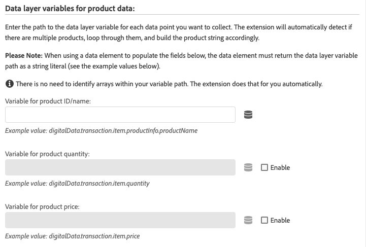

# Adobe Analytics Product String 拡張機能の概要

>[!NOTE]
>
>Adobe Experience Platform Launchは、Adobe Experience Platformのデータ収集テクノロジーのスイートとしてリブランドされました。 その結果、製品ドキュメント全体でいくつかの用語の変更がロールアウトされました。用語の変更点の一覧については、次の[ドキュメント](../../../term-updates.md)を参照してください。

`products` 変数は、サイトでユーザーが製品に対してどのような操作をするかを追跡します。例えば、`products` 変数を使用して、製品の表示、買い物かごへの追加、チェックアウトおよび購入の各回数を追跡できます。サイトでのマーチャンダイジングカテゴリの相対的効果を追跡することもできます。

`products` 変数は、必ず成功イベントと組み合わせて設定する必要があります。

[!DNL Adobe Analytics Product String Builder] 拡張機能は、データ `products` レイヤーをループさせ、必要な製品関連のデータをすべて取得し、次に示す適切な構文で形式設定することで、変数が自動的に設定されます。これらの複雑なアクションを実行するために、カスタム JavaScript を作成して維持する必要はなくなりました。

## 製品変数の構文

```bash
Category;Product;Quantity;Price;eventN=X|eventN2=X2;eVarN=merch_category|eVarN2=merch_category2
```

詳細なドキュメントについては、[製品](https://experienceleague.adobe.com/docs/analytics/implementation/vars/page-vars/products.html?lang=ja)を参照してください。

## 拡張の手順

### アクションの設定

「Adobe Analytics Product String - Set s.products」アクションを追加します。


### 標準製品データの設定

次に、データレイヤー変数を定義します。前の手順で説明したようにアクションを設定すると、次の画面が表示されます。



製品文字列に含める各データポイントに対して、適切なデータレイヤー変数へのパスを入力します。

例えば、データレイヤーが次のような構造になっている場合、

```json
digitalData = {
  "transaction": {
    "item": [{
      "productInfo": {
        "productName": "My Product"
      }
    }]
  }
};
```

「product ID/name」フィールドに次のパスを入力して、`productName` 変数を取得します。

```json
digitalData.transaction.item.productInfo.productName
```

>[!NOTE]
>
>データ要素を使用してフィールドに値を入力する場合は、「Constant」または「Custom Code」データ要素タイプを使用して設定し、上記のパスを文字列リテラルとして返す必要があります。

### 価格のタイプ

[!DNL Adobe Analytics]　製品文字列の「`price`」パラメーターは、その製品の単価ではなく、購入数の合計金額を反映する必要があります。拡張アクションで「Price」フィールドを有効にする場合は、データレイヤーで合計機能と単価のどちらを表示するかを指定する必要があります。単価を使用する場合、[!DNL Adobe Analytics Product String]拡張機能は自動的に単価を数量で乗算して合計価格を求め、製品文字列を正しく設定します。


### カスタムイベントおよびマーチャンダイジング eVar


実装でカスタムイベントまたはマーチャンダイジング eVar を使用する場合は、次の手順に従います。

1. 関連付けられている「**[!UICONTROL 追加]**」ボタンを選択します。
1. 設定する必要があるイベントまたは eVar をドロップダウンから選択します。
1. 上記と同じ構文を使用して、適切なデータレイヤー変数へのパスを入力します。

### アクションシーケンス

このアクションは、対応する成功イベントを設定する「Adobe Analytics - Set Variables」アクション、および「Adobe Analytics - Send Beacon」アクションと共に実行する必要があります。アクションの適切な順序を次に示します。


### 要件

* すべての製品関連データ（製品 ID、数量、価格など）の変数を含む、オブジェクトベースの[データレイヤー](https://theblog.adobe.com/data-layers-buzzword-best-practice/)。この拡張機能は、アレイベースのデータレイヤーでは機能しません。
* [Adobe Analytics](../analytics/overview.md) 拡張機能がインストールされている必要があります。
