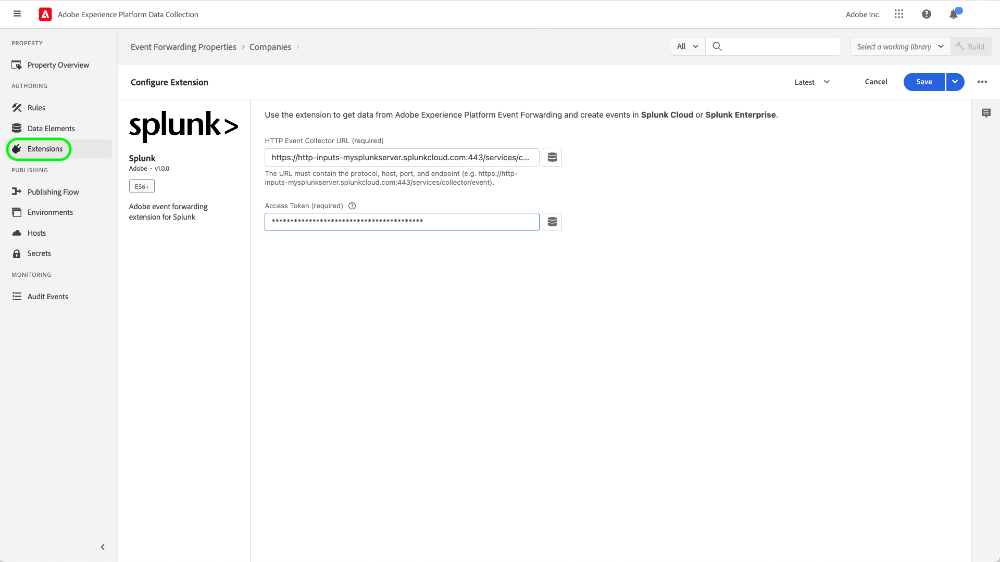

# Splunk 拡張機能の概要

[Splunk](https://www.splunk.com) は、データに関する実用的なインサイトの検索、分析、ビジュアライゼーションを提供する観察性プラットフォームです。 スプランク [イベント転送](../../../ui/event-forwarding/overview.md) 拡張機能は、 [Splunk HTTP イベントコレクター REST API](https://docs.splunk.com/Documentation/Splunk/8.2.5/Data/HECRESTendpoints) を追加して、Adobe Experience Platform Edge Network からにイベントを送信します。 [Splunk HTTP イベントコレクター](https://docs.splunk.com/Documentation/Splunk/8.2.5/Data/UsetheHTTPEventCollector).

Splunk は、Splunk イベントコレクター API と通信するための認証メカニズムとして bearer トークンを使用します。

## ユースケース {#use-cases}

マーケティングチームは、次の使用例で拡張機能を使用できます。

| 使用例 | 説明 |
| --- | --- |
| 顧客行動分析 | 組織は、Web サイトから顧客インタラクションイベントデータを取り込み、関連するイベントを Splunk に転送できます。 その後、マーケティングチームと分析チームは、Splunk プラットフォーム内で後続の分析を実行して、主なユーザーのインタラクションと動作を把握できます。 Splunk プラットフォームを使用して、グラフ、ダッシュボード、その他のビジュアライゼーションを生成し、ビジネス関係者に通知することができます。 |
| 大規模なデータセットでの拡張性の高い検索 | 組織は、Web サイトからイベントデータとしてトランザクション入力や会話入力を取り込み、イベントを Splunk に転送できます。 その後、Analytics チームは、Splunk の拡張性の高いインデックス付け機能を活用して、大規模なデータセットをフィルタリングおよび処理し、ビジネスインサイトを導き出し、十分な情報に基づいた意思決定をおこなうことができます。 |

{style=&quot;table-layout:auto&quot;}

## 前提条件 {#prerequisites}

この拡張機能を使用するには、Splunk アカウントが必要です。 Splunk アカウントに登録するには、 [Splunk ホームページ](https://www.splunk.com/page/sign_up).

>[!NOTE]
>
> Splunk 拡張機能は、Splunk Cloud と Splunk の両方のエンタープライズインスタンスをサポートします。 このガイドでは、 [Splunk クラウド](https://www.splunk.com/en_us/products/splunk-cloud-platform.html) を参照として使用します。 の設定プロセス [Splunk Enterprise](https://www.splunk.com/en_us/products/splunk-enterprise.html) は似ていますが、Splunk Enterprise 管理者からの具体的なガイダンスが必要です。

また、拡張機能を設定するには、次の技術的な値が必要です。

* An [イベントコレクタートークン](https://docs.splunk.com/Documentation/Splunk/8.2.5/Data/UsetheHTTPEventCollector#Create_an_Event_Collector_token_on_Splunk_Cloud_Platform). トークンは通常、次のような UUIDv4 形式です。 `12345678-1234-1234-1234-1234567890AB`.
* 組織の Splunk プラットフォームインスタンスのアドレスとポート。 通常、プラットフォームインスタンスのアドレスとポートの形式は次のとおりです。 `mysplunkserver.example.com:443`.
   >[!IMPORTANT]
   >
   > イベント転送内で参照される Splunk エンドポイントは、ポートのみを使用する必要があります `443`. 非標準ポートは、現在、イベント転送の実装ではサポートされていません。

## Splunk 拡張機能のインストール {#install}

UI に Splunk イベントコレクター拡張機能をインストールするには、に移動します。 **イベント転送** をクリックし、拡張機能を追加するプロパティを選択するか、代わりに新しいプロパティを作成します。

目的のプロパティを選択または作成したら、に移動します。 **拡張機能** > **カタログ**. 「[!DNL Splunk]「」を選択し、「 **[!DNL Install]** を Splunk 拡張機能に追加します。

## Splunk 拡張機能の設定 {#configure_extension}

>[!IMPORTANT]
>
>実装のニーズに応じて、拡張機能を設定する前に、スキーマ、データ要素、データセットの作成が必要になる場合があります。 使用事例に合わせて設定する必要のあるエンティティを判断するには、開始する前にすべての設定手順を確認してください。

選択 **拡張機能** をクリックします。 の下 **インストール済み**&#x200B;を選択します。 **設定** Splunk 拡張機能で使用できます。

の場合 **[!UICONTROL HTTP イベントコレクター URL]**&#x200B;に、Splunk プラットフォームインスタンスのアドレスとポートを入力します。 の下 **[!UICONTROL アクセストークン]**、 [!DNL Event Collector Token] の値です。 終了したら「**[!UICONTROL 保存]**」を選択します。

## イベント転送ルールの設定 {#config_rule}

新しいイベント転送ルールの作成を開始 [ルール](../../../ui/managing-resources/rules.md) 必要に応じて、条件を設定します。 ルールのアクションを選択する場合、 [!UICONTROL Splunk] 拡張機能を選択して、 [!UICONTROL イベントを作成] アクションタイプ。 Splunk イベントをさらに設定するための追加のコントロールが表示されます。

次の手順では、Splunk イベントプロパティを、以前に作成したデータ要素にマッピングします。 設定可能な入力イベントデータに基づいて、サポートされるオプションのマッピングを以下に示します。 詳しくは、 [Splunk ドキュメント](https://docs.splunk.com/Documentation/Splunk/8.2.5/Data/FormateventsforHTTPEventCollector#Event_metadata) 詳しくは、を参照してください。

| フィールド名 | 説明 |
| --- | --- |
| [!UICONTROL イベント&#x200B;]  **（必須）** | イベントデータの提供方法を指定します。 イベントデータは `event` キーは、HTTP リクエストの JSON オブジェクト内にあるか、生のテキストにすることができます。 この `event` キーは、JSON イベントパケット内のメタデータキーと同じレベルにあります。 内 `event` キー値の中括弧で囲むことで、データは必要なあらゆる形式（文字列、数値、他の JSON オブジェクトなど）にすることができます。 |
| [!UICONTROL ホスト] | データを送信するクライアントのホスト名。 |
| [!UICONTROL ソースタイプ] | イベントデータに割り当てるソースタイプ。 |
| [!UICONTROL ソース] | イベントデータに割り当てるソース値。 例えば、開発中のアプリからデータを送信する場合は、このキーをアプリの名前に設定します。 |
| [!UICONTROL 索引] | イベントデータのインデックスの名前。 トークンに indexes パラメーターが設定されている場合、ここで指定するインデックスは、許可されたインデックスのリスト内にある必要があります。 |
| [!UICONTROL 時間] | イベント時刻。 デフォルトの時刻形式は UNIX 時刻（形式）です。 `<sec>.<ms>`) およびは、ローカルタイムゾーンに依存します。 例： `1433188255.500` は、エポックの1433188255秒後 500 ミリ秒、または 2015 年 6 月 1 日（月）の 7:50:午後 55 時 (GMT)。 |
| [!UICONTROL フィールド] | インデックス時に定義する明示的なカスタムフィールドを含む、生の JSON オブジェクトまたはキーと値のペアのセットを指定します。  この `fields` キーは、生データには適用されません。  を含むリクエスト `fields` プロパティを `/collector/event` エンドポイント、またはインデックスが作成されない場合は、インデックスが作成されません。 詳しくは、 [インデックス付きフィールド抽出](http://docs.splunk.com/Documentation/Splunk/8.2.5/Data/IFXandHEC). |

### Splunk 内のデータの検証 {#validate}

イベント転送ルールを作成して実行した後、Splunk API に送信されたイベントが Splunk UI に期待どおりに表示されるかどうかを検証します。 イベント収集とExperience Platform統合が成功した場合は、次のようなイベントが Splunk コンソールに表示されます。

## 次の手順

このドキュメントでは、UI での Splunk イベント転送拡張機能のインストールおよび設定方法について説明しました。 Splunk でのイベントデータの収集について詳しくは、次の公式ドキュメントを参照してください。

* [Splunk Web での HTTP イベントコレクターの設定と使用 ](https://docs.splunk.com/Documentation/Splunk/8.2.5/Data/UsetheHTTPEventCollector)
* [トークンによる認証の設定](https://docs.splunk.com/Documentation/Splunk/8.2.5/Security/Setupauthenticationwithtokens#Prerequisites_for_activating_tokens)
* [HTTP イベントコレクターのトラブルシューティング](https://docs.splunk.com/Documentation/Splunk/8.2.5/Data/TroubleshootHTTPEventCollector) ( また、 [考えられるエラーコード](https://docs.splunk.com/Documentation/Splunk/8.2.5/Data/TroubleshootHTTPEventCollector#Possible_error_codes))
