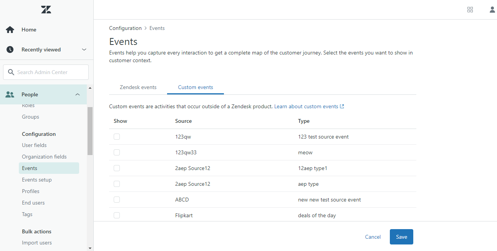

# [!DNL Zendesk] イベント API 拡張機能の概要

[Zendesk](https://www.zendesk.com) は、カスタマーサービスソリューションおよびセールスツールです。 ザゼンデスク [イベント転送](../../../ui/event-forwarding/overview.md) 拡張機能は、 [[!DNL Zendesk Events API]](https://developer.zendesk.com/api-reference/custom-data/events-api/events-api/) イベントをAdobe Experience Platform Edge Network から Zendesk に送信して、さらに処理できるようにします。 拡張機能を使用して、ダウンストリームの分析やアクションで使用する顧客プロファイルインタラクションを収集できます。

このドキュメントでは、UI での拡張機能のインストールと設定の方法について説明します。

## 前提条件

この拡張機能を使用するには、Zendesk アカウントが必要です。 Zendesk アカウントには、 [Zendesk Web サイト](https://www.zendesk.com/register/).

また、Zendesk の設定に関して、次の詳細を収集する必要があります。

| キータイプ | 説明 | 例 |
| --- | --- | --- |
| サブドメイン | 登録プロセス中に、 **サブドメイン** は、アカウントに固有に作成されます。 詳しくは、 [Zendesk ドキュメント](https://developer.zendesk.com/documentation/ticketing/working-with-oauth/creating-and-using-oauth-tokens-with-the-api/) を参照してください。 | `xxxxx.zendesk.com` ( `xxxxx` は、アカウントの作成時に指定された値です ) |
| API トークン | Zendesk は、Zendesk API と通信するための認証メカニズムとして bearer トークンを使用します。 Zendesk ポータルにログインした後、API トークンを生成します。 詳しくは、 [Zendesk ドキュメント](https://support.zendesk.com/hc/en-us/articles/4408889192858-Generating-a-new-API-token) を参照してください。 | `cwWyOtHAv12w4dhpiulfe9BdZFTz3OKaTSzn2QvV` |

{style=&quot;table-layout:auto&quot;}

最後に、API トークンのイベント転送秘密鍵を作成する必要があります。 シークレットタイプをに設定します。 **[!UICONTROL トークン]**&#x200B;の値を Zendesk 設定から収集した API トークンに設定します。 に関するドキュメントを参照してください。 [イベント転送の秘密](../../../ui/event-forwarding/secrets.md) 秘密鍵の設定に関する詳細は、を参照してください。

## 拡張機能のインストール {#install}

UI に Zendesk 拡張機能をインストールするには、に移動します。 **イベント転送** をクリックし、拡張機能を追加するプロパティを選択するか、代わりに新しいプロパティを作成します。

目的のプロパティを選択または作成したら、に移動します。 **拡張機能** > **カタログ**. 「[!DNL Zendesk]「」を選択し、「 **[!DNL Install]** Zendesk Extension で

## 拡張機能の設定 {#configure}

>[!IMPORTANT]
>
>実装のニーズに応じて、拡張機能を設定する前に、スキーマ、データ要素、データセットの作成が必要になる場合があります。 使用事例に合わせて設定する必要のあるエンティティを判断するには、開始する前にすべての設定手順を確認してください。

選択 **拡張機能** をクリックします。 の下 **インストール済み**&#x200B;を選択します。 **設定** Zendesk 拡張機能で

の下 **[!UICONTROL Zendesk Domain]**」で、Zendesk サブドメインの値を入力します。 の下 **[!UICONTROL Zendesk トークン]**」で、作成した API トークンを含む秘密鍵を選択します。

## イベント転送ルールの設定

新しいイベント転送ルールの作成を開始 [ルール](../../../ui/managing-resources/rules.md) 必要に応じて、条件を設定します。 ルールのアクションを選択する場合、 [!UICONTROL Splunk] 拡張機能を選択して、 [!UICONTROL イベントを作成] アクションタイプ。

アクション設定を設定する際に、Zendesk に送信される様々なプロパティにデータ要素を割り当てるよう求めるプロンプトが表示されます。

これらのデータ要素は、以下に示すようにマッピングする必要があります。

### `event` keys

`event` は、ユーザーによってトリガーされたイベントを表す JSON オブジェクトです。 Zendesk のドキュメントを参照してください。 [イベントの解剖学](https://developer.zendesk.com/documentation/custom-data/events/anatomy-of-an-event/) を参照してください。 `event` オブジェクト。

次のキーは、 `event` オブジェクトを次のように変更します。

| `event` key | タイプ | プラットフォームパス | 説明 | 必須 | 制限 |
| --- | --- | --- | --- | --- | --- |
| `source` | 文字列 | `arc.event.xdm._extconndev.event_source` | イベントを送信したアプリケーション。 | ○ | 使用しない `Zendesk` 値として。Zendesk 標準イベントの保護されたソース名です。 使用を試みると、エラーが発生します。 値の長さは 40 文字を超えないようにする必要があります。 |
| `type` | 文字列 | `arc.event.xdm._extconndev.event_type` | イベントタイプの名前。 このフィールドを使用して、特定のソースに対する異なる種類のイベントを示すことができます。 例えば、ユーザーログイン用と買い物かご用にイベントのセットを 1 つ作成できます。 | ○ | 値の長さは 40 文字を超えないようにする必要があります。 |
| `description` | 文字列 | `arc.event.xdm._extconndev.description` | イベントの説明。 | × | (N/A) |
| `created_at` | 文字列 | `arc.event.xdm.timestamp` | イベントが作成された時刻を反映した ISO-8601 タイムスタンプ。 | × | （なし） |
| `properties` | オブジェクト | `arc.event.xdm._extconndev.EventProperties` | イベントの詳細を含むカスタム JSON オブジェクト。 | ○ | （なし） |

{style=&quot;table-layout:auto&quot;}

>[!NOTE]
>
>詳しくは、 [[!DNL Zendesk Events API] ドキュメント](https://developer.zendesk.com/api-reference/custom-data/events-api/events-api/) を参照してください。

### `profile` キー

`profile` は、イベントをトリガーしたユーザーを表す JSON オブジェクトです。 Zendesk のドキュメントを参照してください。 [輪郭の解剖学](https://developer.zendesk.com/documentation/custom-data/profiles/anatomy-of-a-profile/) を参照してください。 `profile` オブジェクト。

次のキーは、 `profile` オブジェクトを次のように変更します。

| `profile` key | タイプ | プラットフォームパス | 説明 | 必須 | 制限 |
| --- | --- | --- | --- | --- | --- |
| `source` | 文字列 | `arc.event.xdm._extconndev.profile_source` | プロファイルに関連付けられた製品またはサービス（例： ） `Support`, `CompanyName`または `Chat`. | ○ | （なし） |
| `type` | 文字列 | `arc.event.xdm._extconndev.profile_type` | プロファイルタイプの名前。 このフィールドを使用して、特定のソースに対して様々な種類のプロファイルを作成できます。 例えば、顧客用と従業員用に 1 組の会社プロファイルを作成できます。 | ○ | プロファイルタイプの長さは 40 文字以下にする必要があります。 |
| `name` | 文字列 | `arc.event.xdm._extconndev.name` | プロファイルからの人物の名前 | × | （なし） |
| `user_id` | 文字列 | `arc.event.xdm._extconndev.user_id` | Zendesk でのユーザー ID。 | × | （なし） |
| `identifiers` | 配列 | `arc.event.xdm._extconndev.identifiers` | 1 つ以上の識別子を含む配列。 各識別子は、タイプと値で構成されます。 | ○ | 詳しくは、 [Zendesk ドキュメント](https://developer.zendesk.com/api-reference/custom-data/profiles_api/profiles_api/#identifiers-array) 詳しくは、 `identifiers` 配列。 すべてのフィールドと値は一意である必要があります。 |
| `attributes` | オブジェクト | `arc.event.xdm._extconndev.attrbutes` | 人物に関するユーザー定義のプロパティを含むオブジェクト。 | × | 詳しくは、 [Zendesk ドキュメント](https://developer.zendesk.com/documentation/custom-data/profiles/anatomy-of-a-profile/#attributes) を参照してください。 |

{style=&quot;table-layout:auto&quot;}

## Zendesk 内のデータの検証 {#validate}

イベントの収集とAdobe Experience Platformの統合が成功した場合は、Zendesk コンソール内のイベントが以下のように表示されます。 これは、統合が成功したことを示します。

プロファイル:

イベント：

## リクエストの制限 {#limits}

アカウントのタイプに基づいて、Zendesk [!DNL Events API] は、1 分あたりに次の数のリクエストを処理できます。

| [!DNL Account Type] | 1 分あたりのリクエスト数 |
| --- | --- |
| [!DNL Team] | 250 |
| [!DNL Growth] | 250 |
| [!DNL Professional] | 500 |
| [!DNL Enterprise] | 750 |
| [!DNL Enterprise Plus] | 1000 |

{style=&quot;table-layout:auto&quot;}

詳しくは、 [Zendesk ドキュメント](https://developer.zendesk.com/api-reference/ticketing/account-configuration/usage_limits/#:~:text=API%20requests%20made%20by%20Zendesk%20apps%20are%20subject,sources%20for%20the%20account%2C%20including%20internal%20product%20requests.) を参照してください。

## エラーとトラブルシューティング {#errors-and-troubleshooting}

拡張機能の使用中または設定中に、以下のエラーが Zendesk Events API から返される場合があります。

| エラーコード | 説明 | 解像度 | 例 |
|---|---|---|---|
| 400 | **無効なプロファイル長：** このエラーは、プロファイル属性の長さが 40 文字を超える場合に発生します。 | プロファイル属性データの長さを最大 40 文字に制限します。 | `{"error": [{"code":"InvalidProfileTypeLength","title": "Profile type length > 40 chars"}]}` |
| 401 | **ルートが見つかりません：** このエラーは、無効なドメインが指定された場合に発生します。 | 有効なドメインが次の形式で指定されていることを確認します。 `{subdomain}.zendesk.com` | `{"error": [{"description": "No route found for host {subdomain}.zendesk.com","title": "RouteNotFound"}]}` |
| 401 | **認証が無効または見つかりません：** このエラーは、トークンへのアクセスが無効、見つからない、または期限切れの場合に発生します。 | アクセストークンが有効で、期限切れでないことを確認します。 | `{"error": [{"code":"MissingOrInvalidAuthentication","title": "Invalid or Missing Authentication"}]}` |
| 403 | **権限が不十分です：** このエラーは、リソースにアクセスするのに十分な権限が提供されていない場合に発生します。 | 必要な権限が提供されていることを検証します。 | `{"error": [{"code":"PermissionDenied","title": "Insufficient permisssions to perform operation"}]}` |
| 429 | **リクエストが多すぎます：** このエラーは、エンドポイントオブジェクトのレコードの制限を超えた場合に発生します。 | 上記の [リクエスト制限](#limits) を参照してください。 | `{"error": [{"code":"TooManyRequests","title": "Too Many Requests"}]}` |

{style=&quot;table-layout:auto&quot;}

## 次の手順

このドキュメントでは、UI で Zendesk イベント転送拡張機能をインストールして設定する方法について説明しました。 Zendesk でのイベントデータの収集について詳しくは、次の公式ドキュメントを参照してください。

* [イベントの概要](https://developer.zendesk.com/documentation/custom-data/events/getting-started-with-events/)
* [Zendesk Events API](https://developer.zendesk.com/api-reference/custom-data/events-api/events-api/)
* [イベント API について](https://developer.zendesk.com/documentation/custom-data/events/about-the-events-api/)
* [イベントの詳細](https://developer.zendesk.com/documentation/custom-data/events/anatomy-of-an-event/)
* [Zendesk Profiles API](https://developer.zendesk.com/api-reference/custom-data/events-api/events-api/#profile-object)
* [プロファイル API について](https://developer.zendesk.com/documentation/custom-data/profiles/about-the-profiles-api/)
* [プロファイルの分析](https://developer.zendesk.com/documentation/custom-data/profiles/anatomy-of-a-profile/)
