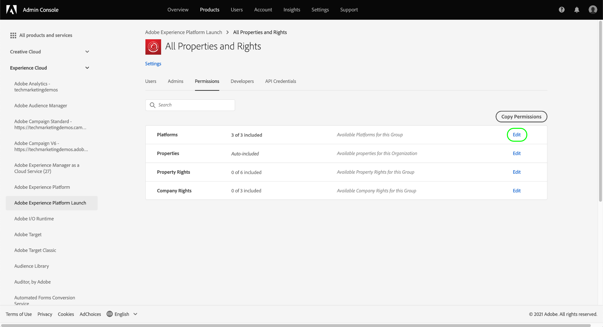

# タグの権限管理

>[!NOTE]
>
>Adobe Experience Platform Launch は、Adobe Experience Platform のデータ収集テクノロジースイートとしてリブランドされています。 その結果、製品ドキュメント全体でいくつかの用語の変更がロールアウトされました。 用語の変更点の一覧については、次の[ドキュメント](../../term-updates.md)を参照してください。

Adobe Experience Platform でタグを使用するには、Adobe Admin Console で 1 つ以上の Adobe Experience Cloud 製品へのアクセス権が付与されている必要があります。さらに、データ収集 UI にログインしたときに特定のアクションを実行するには、製品プロファイルのレベルでタグへのアクセス権も付与されているる必要があります。

このガイドでは、Admin Console を使用してユーザーに権限を付与する方法について説明します。

>[!NOTE]
>
>このガイドで取り上げる様々なタグ権限について詳しくは、 [ユーザー権限の概要](./user-permissions.md) を参照してください。

## タグ製品プロファイルの管理者権限の取得

タグのユーザー権限を管理するには、Adobe Admin Console のタグの製品プロファイル管理者である必要があります。システム管理者と製品管理者は、タグ製品プロファイルの権限を管理することもできます。

様々な管理者レベルの詳細と組織内でそれらの役割を管理する方法については、 [管理ロール](https://helpx.adobe.com/jp/enterprise/admin-guide.html/enterprise/using/admin-roles.ug.html) に関する Admin Consoleドキュメントを参照してください。

## 権限を管理する製品プロファイルの選択

管理者権限があれば、Admin Console にサインインし、上部のナビゲーションから「**[!UICONTROL 製品]**」を選択します。表示された製品のリストから、「**[!UICONTROL Adobe Experience Platform Launch]**」を選択します。

製品プロファイルのリストが表示されます。製品プロファイルは、ユーザーのグループに権限のグループをリンクする構造です。ここから、新しいプロファイルを作成して設定したり、既存の製品プロファイルをリストから選択して編集したりできます（プロファイルへの管理者権限がある場合）。

### 製品プロファイルの作成

>[!NOTE]
>
>既存のプロファイルを選択して編集する場合は、スキップして [次のセクション](#permissions) に進んでください。

新しい製品プロファイルを作成するには、「**[!UICONTROL 新しいプロファイル]**」をクリックします。

プロファイルの名前とオプションで説明を入力できるダイアログが表示されます。ユーザーがこのプロファイルに追加されたり、このプロファイルから削除されたときに、ユーザーが電子メールを受信するかどうかを切り替えることもできます。終了したら「**[!UICONTROL 保存]**」をクリックします。

## 製品プロファイルの権限の設定 {#permissions}

製品プロファイルの詳細ページが表示されます。提供されたタブを使用すると、プロファイルに割り当てられているユーザーを管理し、プロファイルがそれらのユーザーに付与する特定のプロパティと権限を設定できます。

ユーザーを追加する手順は、](#users)このガイドの後半[に記載されています。ここでは、「**[!UICONTROL 権限]**」を選択します。

次の画面では、現在プロファイルに割り当てられているプラットフォーム数、プロパティ数および権限数の概要が表示されます。行の横にある「**[!UICONTROL 編集]**」を選択すると、プロファイルの権限の設定を開始できます。

[!UICONTROL 権限の編集] 画面が表示され、製品プロファイルに対する権限の追加と削除をおこなうことができます。「**[!UICONTROL プラットフォーム]**」セクションから、すべてのプラットフォームがデフォルトでプロファイルに追加されていることを確認できます。

### プロパティの割り当て

このプロファイルにプロパティを割り当てるには、左のナビゲーションで「**[!UICONTROL プロパティ]**」を選択します。

デフォルトでは、新しい製品プロファイルには、組織で使用可能なすべてのプロパティへのアクセス権が自動的に付与されます。これには、現在使用できるプロパティと今後作成されるプロパティが含まれます。

使用できるプロパティを制限する場合は、「**[!UICONTROL 自動インクルード]**」の切り替えを選択します。これにより、必要に応じて、プロパティを手動で追加および削除できるようになります。

自動インクルードが無効になっている場合、現在使用可能なすべてのプロパティが左側に一覧表示されます。プロファイルにプロパティを追加するには、左側の列で、該当するプロパティの横にあるプラス（**+**）アイコンを選択します。プロパティを削除するには、右側の列で、該当するプロパティの横にある **X** アイコンを選択します。

>[!IMPORTANT]
>
>自動インクルード機能を無効にした場合、今後作成されるプロパティに製品プロファイルがアクセスできるようにするには、製品プロファイルに手動でプロパティを追加する必要があります。

### 権限の割り当て

デフォルトでは、製品プロファイルのすべての権限は無効になっており、有効にするには手動で追加する必要があります。プロパティを自動インクルードするものの、権限のない製品プロファイルに属している場合は、すべてのプロパティに対して読み取り専用アクセス権だけがあります。

>[!NOTE]
>
>ユーザーは Admin Console の複数の製品プロファイルに属することができますが、これらのプロファイルの権限はマスター権限セットに結合されません。そのユーザーが持つ権限は、各グループによって明示的に付与された権限のみです。
>
>たとえば、グループ 1 でプロパティ A への「開発」権限、グループ 2 でプロパティ B への「公開」権限が付与される場合、プロパティ A と B に対する開発権限と公開権限は組み合わせられません。プロパティ A では開発、プロパティ B では公開のみをおこなうことができます。

左側のナビゲーションで「**[!UICONTROL プロパティ権限]**」を選択します。プロパティと同様に、プロパティ権限の横にあるプラス（**+**）アイコンを選択すると、プロパティ権限をプロファイルに追加できます。すべてのプロパティ権限をプロファイルに追加する場合は、「**[!UICONTROL すべてを追加]**」を選択することもできます。

次に、左側のナビゲーションで「**[!UICONTROL 会社権限]**」を選択します。必要な権限を追加または削除し、完了したら「**[!UICONTROL 保存]**」を選択します。

## プロファイルへのユーザーの割り当て {#users}

製品プロファイルにユーザーを割り当てるには、「[!UICONTROL ユーザー]」タブを選択し、「[!UICONTROL ユーザーを追加]」を選択します。

表示されるダイアログで、プロファイルに追加するユーザーの名前、ユーザーグループまたはメールアドレスを入力します。ユーザーが組織に属している場合、ユーザーの情報はオートコンプリートのドロップダウンに表示されるので、選択して詳細を入力できます。組織に属していない場合は、ユーザーの情報を手動で入力します。

入力したら、「**[!UICONTROL 保存]**」を選択して、指定したユーザーを製品プロファイルに追加します。

ユーザーがプロファイルに追加されると、データ収集 UI の権限を取得したことを知らせる電子メールがユーザーに届きます。

## 次の手順

このドキュメントでは、Adobe Admin Console を使用してデータ収集 UI のプロパティと権限を管理する方法について説明しました。使用できる権限と、それらの権限に付与された機能について詳しくは、 [ユーザー権限](./user-permissions.md) の概要を参照してください。
