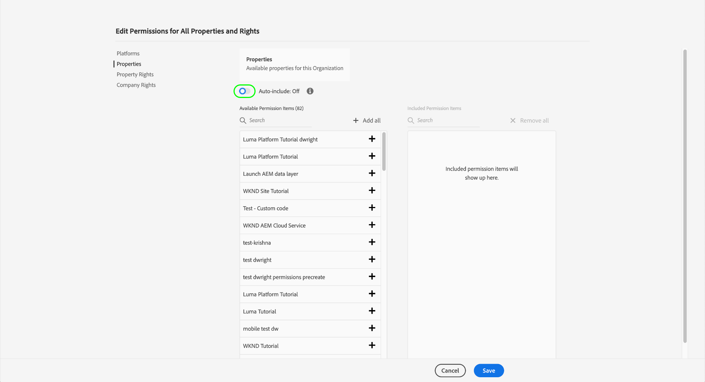
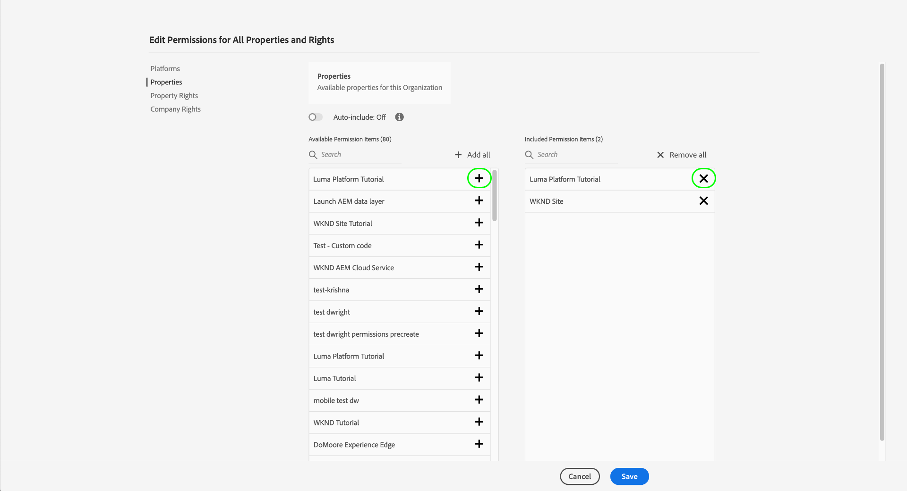

# タグの権限の管理

>[!NOTE]
>
>Adobe Experience Platform Launchは、Adobe Experience Platformのデータ収集テクノロジーのスイートとしてリブランドされました。 その結果、製品ドキュメント全体でいくつかの用語の変更がロールアウトされました。 用語の変更点の一覧については、次の[ドキュメント](../../term-updates.md)を参照してください。

Adobe Experience Platformでタグを使用するには、Adobe Admin Consoleを通じて1つ以上のAdobe Experience Cloud製品へのアクセス権を付与される必要があります。 また、データ収集UIにログインしたときに特定のアクションを実行するには、製品プロファイルレベルでタグの権限も付与される必要があります。

このガイドでは、ユーザーに権限を付与する方法について説明します。Admin Console

>[!NOTE]
>
>このガイドで取り上げる様々なタグ権限の詳細については、[ユーザー権限の概要](./user-permissions.md)を参照してください。

## タグ付け製品プロファイルの管理者権限の取得

タグのユーザー権限を管理するには、少なくともAdobe Admin Consoleのタグの製品プロファイル管理者である必要があります。 また、システム管理者と製品管理者は、製品プロファイルにタグを付ける権限を管理することもできます。

様々な管理者レベルの詳細と組織内でこれらの役割を管理する方法については、[管理ロール](https://helpx.adobe.com/jp/enterprise/admin-guide.html/enterprise/using/admin-roles.ug.html)のAdmin Consoleドキュメントを参照してください。

## 権限を管理する製品プロファイルの選択

管理者権限を取得したら、Admin Consoleにサインインし、上部のナビゲーションから「**[!UICONTROL 製品]**」を選択します。 表示された製品のリストから、「**[!UICONTROL Adobe Experience Platform Launch]**」を選択します。

製品プロファイルのリストが表示されます。 製品プロファイルは、権限のグループをユーザーのグループにリンクする構成体です。 ここから、設定する新しいプロファイルを作成したり、リストから既存の製品プロファイルを選択して編集したりできます（そのプロファイルの管理者権限がある場合）。

### 製品プロファイルの作成

>[!NOTE]
>
>編集する既存のプロファイルを選択した場合は、次の[セクション](#permissions)に進んでください。

新しい製品プロファイルを作成するには、「**[!UICONTROL 新しいプロファイル]**」をクリックします。

プロファイルの名前と説明（オプション）を入力できるダイアログが表示されます。 また、ユーザーがこのプロファイルに追加または削除されたときに電子メールを受信するかどうかを切り替えることもできます。 終了したら「**[!UICONTROL 保存]**」をクリックします。

## 製品プロファイルの権限の設定 {#permissions}

製品プロファイルの詳細ページが表示されます。 提供されたタブを使用して、プロファイルに割り当てられるユーザーを管理し、プロファイルがそれらのユーザーに付与する特定のプロパティと権限を設定できます。

ユーザーを追加する手順は、このガイド](#users)の後半で提供されます。 [現時点では、「**[!UICONTROL 権限]**」を選択します。

次の画面には、現在プロファイルに割り当てられているプラットフォーム、プロパティおよび権限の数の概要が表示されます。 行の1つの横にある「**[!UICONTROL 編集]**」を選択して、プロファイルの権限の設定を開始します。

[!UICONTROL 権限の編集]画面が表示され、製品プロファイルに対する権限の追加と削除をおこなうことができます。 「**[!UICONTROL Platforms]**」セクションから、すべてのプラットフォームがデフォルトでプロファイルに追加されていることを確認できます。

### プロパティの割り当て

このプロファイルにプロパティを割り当てるには、左のナビゲーションで「**[!UICONTROL プロパティ]**」を選択します。

デフォルトでは、新しい製品プロファイルには、組織で使用可能なすべてのプロパティへのアクセス権が自動的に付与されます。 これには、現在使用可能なプロパティと今後おこなわれるプロパティが含まれます。

使用可能なプロパティを制限する場合は、「**[!UICONTROL 自動インクルード]**」切り替えを選択します。 これにより、必要に応じて、プロパティのプロパティを手動で追加および削除できます。

自動インクルードが無効になっている場合、現在使用可能なすべてのプロパティが左側に表示されます。 左の列で、該当するプロパティの横にあるプラス(**+**)アイコンを選択して、プロファイルにプロパティを追加できます。 プロパティを削除するには、右側の列で、該当するプロパティの横にある&#x200B;**X**&#x200B;アイコンを選択します。

>[!IMPORTANT]
>
>自動インクルード機能を無効にすると、今後作成されるプロパティを製品プロファイルに手動で追加して、製品プロファイルにアクセスできるようになります。

### 権限の割り当て

デフォルトでは、製品プロファイルのすべての権限が無効になっており、有効にするには手動で追加する必要があります。 プロパティを自動的に含むが権限を持たない製品プロファイルに属している場合、すべてのプロパティに対する読み取り専用アクセス権があります。

>[!NOTE]
>
>ユーザーは、Admin Console内の複数の製品プロファイルに属することができますが、これらのプロファイルの権限は、マスター権限セットに組み合わされません。 そのユーザーが持つ権限は、各グループによって明示的に付与された権限のみです。
>
>例えば、グループ1が開発権限を持つプロパティAに、グループ2が公開権限を持つプロパティBに、開発権限と公開権限はプロパティAとプロパティBに組み合わされません。プロパティAでの開発およびプロパティBでの公開のみ可能です。

左側のナビゲーションで「**[!UICONTROL プロパティ権限]**」を選択します。 プロパティと同様に、プロパティ権限の横にあるプラス(**+**)アイコンを選択して、プロファイルに追加できます。 すべてのプロパティ権限をプロファイルに追加する場合は、「**[!UICONTROL すべて]**&#x200B;を追加」を選択することもできます。

次に、左側のナビゲーションで「**[!UICONTROL 会社権限]**」を選択します。 必要な権限を追加または削除し、完了したら「**[!UICONTROL 保存]**」を選択します。

## ユーザーをプロファイルに割り当てる {#users}

製品プロファイルにユーザーを割り当てるには、「[!UICONTROL ユーザー]」タブを選択し、「[!UICONTROL ユーザーを追加]」を選択します。

表示されるダイアログで、プロファイルに追加するユーザーの名前、ユーザーグループまたは電子メールアドレスを入力します。 ユーザーが組織に所属している場合、そのユーザーの情報はオートコンプリートドロップダウンに表示され、選択して詳細を入力できます。 組織に属していない場合は、代わりに手動で情報を入力できます。

終了したら、「**[!UICONTROL 保存]**」を選択して、指定したユーザーを製品プロファイルに追加します。

ユーザーがプロファイルに追加されると、データ収集UIの権限を取得したことを知らせる電子メールが届きます。

## 次の手順

このドキュメントでは、Adobe Admin Consoleを使用してデータ収集UIのプロパティと権限を管理する方法について説明します。 使用可能な権限と、それらの権限がアクセス権を付与する機能について詳しくは、[ユーザー権限](./user-permissions.md)の概要を参照してください。
