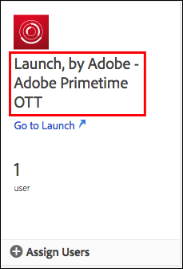

# ユーザー権限

>[!NOTE]
>
>Adobe Experience Platform Launchは、Adobe Experience Platformのデータ収集テクノロジーのスイートとしてリブランドされました。 その結果、製品ドキュメント全体でいくつかの用語の変更がロールアウトされました。 用語の変更点の一覧については、次の[ドキュメント](../../term-updates.md)を参照してください。

## 権限タイプ

Adobe Experience Platformでタグを使用する際の理解が必要なユーザー権限は次の2つです。

* **Experience Cloud の権限：**[!DNL Experience Cloud] 権限は会社レベルの Admin Console にあり、すべての [!DNL Experience Cloud] 製品で、どのユーザーがグループ権限とグループメンバーシップを制御できるかを管理します。
* **タグの権限：** タグの権限は、製品プロファイルレベルのAdmin Consoleにあります。これらの権限は、データ収集UIにログインしたときに、特定のアクションを実際に実行できるユーザーを管理します。

この記事では、これらの様々な権限タイプについて詳しく調べます。

### Experience Cloud の権限

この節では、Platformを使用する際に理解しておくべき要因について説明します。 [!DNL Experience Cloud] 権限の包括的なビューについては、「[エンタープライズユーザーガイドの管理的役割](https://helpx.adobe.com/jp/enterprise/using/admin-roles.html)」を参照してください。

#### 組織管理者

組織管理者は、多くの場合「Org Admin」と呼ばれます。組織管理者の主な機能は、他のユーザーに権限を割り当てることです。これをおこなうには、特定の製品内で、特定の権限セットを含む製品プロファイル（またはグループ）を作成してから、既存のユーザーまたは新規ユーザーを、その製品プロファイルに割り当てます。

エンタープライズ組織管理者は、Platformのタグの権限を継承しません。 データ収集UIで何らかの操作を行う場合は、適切な権限を持つ製品プロファイルに自分自身を追加する必要があります。

#### 製品管理者

製品管理者は、組織管理者と似ていますが、より狭い範囲が対象となります。製品管理者は、会社がアクセスできるすべての [!DNL Adobe] 製品ではなく、特定の [!DNL Adobe] 製品の製品プロファイルを変更する権限のみを持っています。

### タグの権限

[!DNL Experience Cloud] 内では、個々のユーザーに権限は割り当てられません。これらは製品プロファイルに割り当てられます（上記の「Experience Cloud の権限」を参照）。その後、個々のユーザーが 1 つ以上の製品プロファイルに割り当てられます。

製品プロファイル内では、タグの権限は4つのディメンションに分けられます。

1. プラットフォーム
1. プロパティ
1. プロパティ権限
1. 会社権限

#### プラットフォーム

各プロパティにはプラットフォームがあります。  現在、タグに使用できるプラットフォームは2つあります。*Web*&#x200B;と&#x200B;*モバイル*。 この権限の種類を使用して、特定の種類のプロパティへのアクセスを制限または付与できます。  これは、モバイルアプリを管理するチームが Web サイトを管理するチームとは異なる場合に役立ちます。

#### プロパティ

これは、会社内に存在するすべてのプロパティのリストです。  この権限の種類を使用して、特定の既存のプロパティへのアクセスを（名前順に）制限または付与できます。

#### プロパティ権限

データ収集UIで作成したプロパティは、権限を割り当てるためにAdmin Consoleで使用できます。 特定の製品プロファイルがプロパティ A1 にアクセスできない場合、そのプロファイルに属するユーザーはプロパティ A1 内の設定を表示または変更できません。

ユーザーがプロパティ A1 へのアクセス権を持つプロファイルに属している場合、プロパティ A1 内で実行できる操作は、この権限グループから付与されている権限によって決まります。プロパティ A1 に対するアクセス許可を持っているけれど、権限が割り当てられていないユーザーは、読み取り専用アクセス権を持ちます。

このグループ内で使用できる権限は次のとおりです。

* **開発：** ルールとデータ要素を作成できます。また、ライブラリを作成して、既存の開発環境に構築することもできます。準備ができたら、承認用にライブラリを送信できます。データ収集UIの日常的なタスクのほとんどでは、この権限が必要です。
* **承認：** 送信されたライブラリを取得し、ステージング環境にビルドできます。テストが完了したら、公開用にライブラリを承認することもできます。
* **公開：** 承認済みのライブラリを実稼動環境に公開できます。
* **拡張機能の管理：** プロパティに新しい拡張機能をインストールし、既にインストールされている拡張機能の拡張機能設定を変更したり、拡張機能を削除したりできます。拡張機能の詳細については、拡張機能の概要のドキュメント[を参照してください。](../managing-resources/extensions/overview.md) このロールは一般的に、IT またはマーケティングに属しています（組織によって異なります）。
* **環境の管理：** 環境を作成および変更できます。詳しくは、[環境のドキュメント](../publishing/environments.md)を参照してください。 この役割は通常、IT グループに属しています。

#### 会社権限

会社権限は、複数のプロパティにまたがるアクセス許可に適用されます。現在、次の 3 つがあります。

* **プロパティの管理：** データ収集UIで新しいプロパティを作成し、プロパティレベルでメタデータと設定を変更できます。プロパティを削除することもできます。詳しくは、[プロパティのドキュメント](companies-and-properties.md)を参照してください。 管理者は通常、この役割を実行します。
* 
* 新しいプロパティを作成し、プロパティレベルでメタデータと設定を変更する機能を付与します。 プロパティを削除することもできます。プロパティについて詳しくは、[こちら](companies-and-properties.md)を参照してください。管理者は通常、この役割を実行します。
* **拡張機能の開発：**&#x200B;非公開リリースや公開リリースのリクエストなど、会社が所有する拡張機能パッケージを作成および変更する能力を付与します。
* **アプリ設定の管理：** Adobe Journey Optimizer のライセンスを持つ顧客、またはその他のソリューションでモバイルアプリ内メッセージやプッシュメッセージにアクセスできる顧客のみが利用できます。これにより、Experience Cloudが把握しているアプリを、Firebase Cloud MessagingサービスおよびApple Push Notification Serviceとの通信に必要なプッシュ資格情報と共に管理できます。

### ユーザー権限の合計

個々のユーザーの合計権限は、異なる製品プロファイルのメンバーシップの合計によって決定されます。ユーザーが複数の製品プロファイルに属する場合、各プロファイルの権限は乗算されずに加算されます。

例：製品プロファイル A は、Henry に対して、プロパティ 1 の「開発」権限を付与します。製品プロファイル B は、プロパティ 2 の「公開」権限を付与します。Henry はプロパティ 1 で開発、プロパティ 2 で公開をおこなうことができますが、明示的に権限を与えられていないため、プロパティ 1 で公開、プロパティ 2 で開発をおこなうことはできません。

## 権限シナリオ

会社が異なれば、新しい製品プロファイルを作成するときのニーズも異なります。これらのニーズは、会社の規模、組織構造、サイト数、タグ管理に携わるユーザーの数などによって異なります。

製品プロファイルの作成とユーザーの追加を考慮する際に使用できる、一般的なシナリオと推奨される出発点を次に示します。

### One-person show

1 人の人物があらゆることを担当する中小企業では、すべてのプロパティに対してこのユーザー権限を付与し、上記のすべての権限を割り当てます。

### Separation of duties

タグ付けには、多くの人が関わります。ルールとデータ要素を作成するユーザーのセット（外部コンサルタントなど）に、実稼動環境へのアクセス権は与えたくない場合や、IT チーム以外のユーザーが実稼動環境にデプロイできないようにしたい場合があります。

1. コンサルタントのアカウントを作成し、それらのアカウントに開発権限を付与します。
1. コンサルタントは、設定した範囲内でビルドとテストをおこないます。
1. コンサルタントが新しい拡張機能を希望する場合や、有効にする準備が整ったら、（適切な権限を持つ）組織の担当者が、それらのアクションを実行します。

### Enterprise

企業では、離れた地域に複数のサイトがあり、異なるチームが各地域を担当している場合があります。これらのチームでは、開発と公開を別の人物がおこないます。

これは、上の「Separation of duties」と似ていますが、地域別に整理されています。

* 北米
   * 開発グループ
   * 公開グループ
* ヨーロッパ
   * 開発グループ
   * 公開グループ
* ...
   * 開発グループ
   * 公開グループ

## 例

組織内で使用できる役割のタイプと、それらに割り当てる必要がある権限をいくつか示すことで、この概念がわかりやすくなります。

組織やマトリクスに適用することのできる様々な役割についての説明と、ジョブの実行に必要な権限を示します。

* マネージャー：何が起きているかを把握する必要があるが、変更を加えることはできない。
* マーケター：拡張機能をンインストールして既存のプロパティに新しいタグを設定できるが、ステージング環境や実稼動環境にパブリッシュすることはできない。
* モバイルアプリ開発者：ネイティブモバイルアプリケーション内にアドビおよびサードパーティソリューションを実装します。
* IT チーム：実際にタグの変更はおこない、ステージング環境および実稼動環境、およびタグに含まれる内容を完全に制御できます。
* その他：すべてを実行します。

| 役割 | プロパティ | 会社権限 | プロパティ権限 |
|--- |--- |--- |--- |
| マネージャー | 自動インクルード |  |  |
| マーケティング担当者 | 自動インクルード | プロパティの管理 | 開発 拡張機能の管理 |
| モバイルアプリ開発者 | 自動インクルード | プロパティの管理 アプリ設定の管理 | 開発 拡張機能の管理 |
| IT チーム | 自動インクルード | 承認 公開 環境の管理 |
| その他 | 自動インクルード | プロパティの管理 | 開発 承認 公開 拡張機能の管理 環境の管理 |
| 拡張機能の開発者 | 自動インクルード | プロパティの管理 拡張機能の開発 | 開発 |

## ユーザー権限の割り当て

次の手順で、権限を割り当てるプロセスを説明します。また、このプロセスに関する[ビデオ](https://www.youtube.com/watch?v=ba28BHX8cwU)を視聴できます。

次の手順 1 ～ 3 は、[Adobe Admin Console](https://adminconsole.adobe.com/enterprise/products) に直接移動することで回避できます。複数の組織に属している場合は、右上のナビゲーションから正しい組織を選択します。

### 1. Experience Cloud にサインインする

Adobe IDで[https://experiencecloud.adobe.com/](https://experiencecloud.adobe.com/)にログインし、[!UICONTROL ナビゲーション]メニューからデータ収集UI内で使用する組織を選択します。

[!UICONTROL ナビゲーション]メニューから9 つのドットのアイコンを選択してソリューションピッカーを開き、「**[!UICONTROL 管理]**」をクリックします。

このリンクが表示されない場合、次の両方の条件が true となっています。

* 組織管理者ではない。
* [!DNL Experience Cloud] 製品の製品管理者ではない。

どちらの場合も、組織管理者にこれらの手順を実行するように依頼するか、タグの製品管理者にして自分で実行できるようにしてもらってください。

>[!NOTE]
>
>組織管理者が不明な場合は、ClientCare にお問い合わせください。

### 2. Admin Console を開く

**Admin Console**&#x200B;を選択します。

**[!DNL Experience Platform Launch]-`Company Name`** カードを選択します。

<!-- Scott, update above image. Rebranding. -->

上部のナビゲーションで「**[!UICONTROL 製品]**」を選択し、左のナビゲーションから「**[!DNL Experience Platform Launch]-`Company Name`**」を選択することもできます。

「[!DNL Experience Platform Launch]」カードが表示されない場合や、このリストに [!DNL Experience Platform Launch] が表示されない場合、組織管理者ではなく、他の Experience Cloud 製品の管理者となっています。あなたは Experience Platform Launch の管理者ではないので、これらの手順を実行できる組織管理者や、[!DNL Platform Launch] の製品管理者にしてもらえる組織管理者を見つける必要があります。

Platform Launch を選択すると、製品プロファイルのリストが表示されます。これらのプロファイルは、権限グループと考えることができます。1 つのプロファイルが作成され、「[!DNL Platform Launch] - `Company Name`」という名前が付けられます。

### 3. 製品プロファイルを作成する

既存の製品プロファイルを編集している場合は、この手順をスキップしてください。

この製品プロファイルを編集するか、新しく作成します。

新しい製品プロファイルを作成するには、「**[!UICONTROL 新しいプロファイル]**」をクリックします。

新しいプロファイルに名前と説明を付け、このプロファイルから追加または削除されたときにメールを受信するかどうかを設定してから、「**[!UICONTROL 完了]**」をクリックします。

### 4. 製品プロファイルを編集する

リストから製品プロファイルを選択し、「**[!UICONTROL 権限]**」タブを開きます。プロパティと権限という 2 つのディメンションをまたいでアクセス許可を割り当てることができます。

このグループ定義にプロパティを割り当てるには、「**[!UICONTROL プロパティ]**」セクションを開きます。

タグのプロパティがリストに表示されます。

デフォルトでは、新しい製品設定によってプロパティが自動的に追加されます。つまり、すべてのプロパティ（現在および将来）がグループ定義に含まれます。

自動インクルードが無効になっている場合、現在使用可能なすべてのプロパティが左側に一覧表示されます。このグループ定義にプロパティを移動するには、「**[!UICONTROL 追加]**」を選択します。

完了したら、「**[!UICONTROL 保存]**」をクリックします。

### 5. 権限の割り当て

グループ定義に含める権限を割り当てます。「**[!UICONTROL 権限]**」セクションを開きます。

権限は自動的には含まれません。プロファイルにそれぞれの権限を割り当てる必要があります。「 [!UICONTROL +すべてを追加] 」ボタンを使用して、このプロファイルにすべての権限をすばやく追加するか、個々の「 + 」（追加）ボタンを使用して、個々の権限を割り当てることができます。 各権限に関連付けられているアクセス許可について詳しくは、「[権限シナリオ](#rights-scenarios)」を参照してください。完了したら、「**[!UICONTROL 保存]**」をクリックします。[!UICONTROL 「保存]」が使用できない場合は、変更はおこなわれず、新しい権限は割り当てられません。

最初に、プロパティ権限を割り当てます。

次に、会社権限を割り当てます。

権限の割り当てに関する重要な注意事項を次に示します。

* 権限を持っていない場合、アクセス権は読み取り専用になります。自動インクルードプロパティを持つ製品設定に属し、権限を持っていない場合、すべてのタグプロパティに対する読み取り専用アクセス権があります。
* 「プロパティの管理」を正しく割り当てていないと、ログイン時にプロパティを追加できません。
* ユーザーは複数のグループに属することができますが、これらのグループの権限はマスター権限セットには組み合わせられません。そのユーザーが持つ権限は、各グループによって明示的に付与された権限のみです。

   例えば、グループ 1 が開発権限でプロパティ A へのアクセスを付与し、グループ 2 が公開権限でプロパティ B へのアクセスを付与する場合、プロパティ A とプロパティ B に対する開発権限と公開権限は組み合わせられません。プロパティ A では開発、プロパティ B では公開のみをおこなうことができます。

### 6. ユーザーをグループに割り当てる

ユーザーをグループの一部に割り当てるには、「[!UICONTROL ユーザー]」タブを開いてから、「[!UICONTROL ユーザーを追加]」をクリックします。

一括ユーザー操作など、その他のオプションについては省略記号(...)を選択します。

>[!NOTE]
>
>組織管理者または製品管理者は、ユーザーにタグ製品内のいかなる権利も付与しません。 ユーザーは、1 つ以上の製品プロファイルに属している必要があります。

グループに追加するユーザーを検索します。名前または電子メールアドレスで検索できます。組織内の既存のユーザーから自動入力されます。目的のユーザーを見つけたら、そのユーザーの名前を選択します。

ユーザーを追加すると、そのユーザーが権限を持っていることを知らせる電子メールが届きます。 ログインするには、[データ収集UI](https://launch.adobe.com)へのリンクに従います。

>[!NOTE]
>
> ユーザが存在しない場合は、電子メールアドレス全体を入力してから、氏名を入力できます。新しいユーザーが電子メールを受け取り、その電子メールの招待状から [!DNL Adobe] ID を作成すると、そのユーザー用に作成したユーザーアカウントと一緒にリンクされます。自分自身に権限を割り当てる場合、この問題は発生しません。

## 一般的な問題

### アカウントの読み込みエラー

データ収集UIにログインすると、「Error Loading Account」というメッセージが表示されます。

解像度：ユーザーがどのタグ製品プロファイルにも属していない。 上記の手順を参照して、プロファイルを作成して権限を割り当て、ユーザーをプロファイルに割り当てます。

### プロパティボタンがグレー表示される

ログイン後に、プロパティを追加することはできません。

解決策：ユーザーアカウントが、プロパティの管理権限を持つ製品設定に属していません。上記の手順 5 に戻ります。
