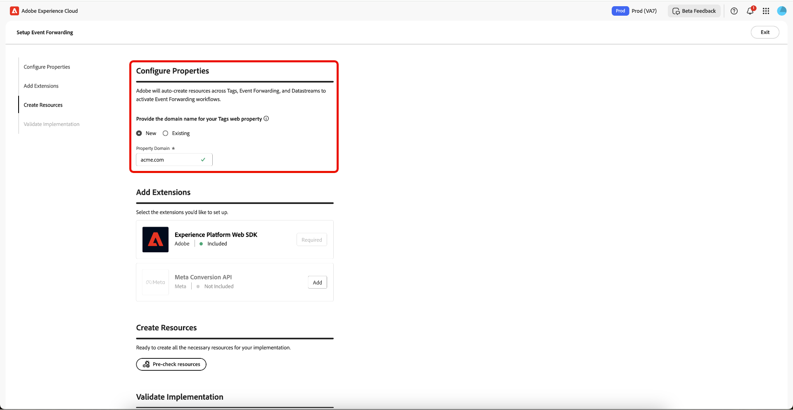
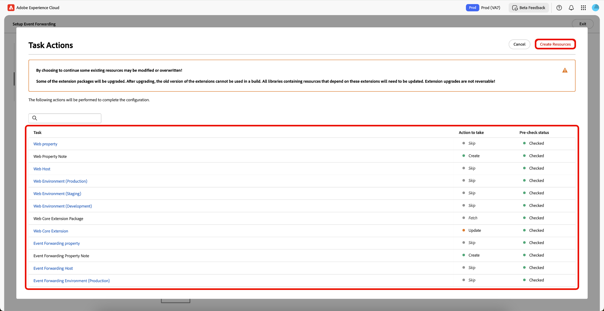

# イベント転送ガイド付き設定の概要

>[!IMPORTANT]
>
>ガイド付き設定機能は、Real-Time CDP PrimeとUltimate パッケージを購入したお客様が利用できます。 詳しくは、アドビ担当者にお問い合わせください。

>[!NOTE]
>
>既存のクライアントは、ガイド付き設定ワークフローを使用して、次の場合に使用できる参照実装を作成できます。
>
>* 全く新しい実装の始まりとして使用してください。
>* 参照実装として利用して、どのように設定されているかを確認し、現在の実稼動実装で複製することができます。

ガイド付き設定機能を使用すると、簡単かつ効率的に設定できます。 このツールは、Adobe タグとイベント転送で実行される複数のステップを自動化し、設定時間を大幅に短縮します。

この設定では、拡張機能を自動インストールできます。 このハイブリッド実装は、[!DNL Meta]がイベントコンバージョンをサーバーサイドで収集および転送するために推奨しています。 ガイド付き設定機能は、イベント転送の実装を開始するために設計されており、すべてのユースケースに対応するエンドツーエンドの完全に機能する実装を提供することを目的としていません。

## ガイド付き設定の基本を学ぶ {#guided-setup}

この機能を使い始めるには、**[!UICONTROL Get Started]** データ収集UIで&#x200B;**[!UICONTROL Event Forwarding]**&#x200B;を選択します。

データ収集UI イベント転送のホームページ

>[!INFO]
>
>ガイド付き設定には、データコレクションのホームページから直接アクセスすることもできます。

### 新しいタグプロパティの作成 {#new-property}

「プロパティの設定」セクションで「**[!UICONTROL New]**」を選択し、新しい&#x200B;**[!UICONTROL Property Domain]**&#x200B;詳細を入力します。

拡張機能の追加セクションの&#x200B;**[!UICONTROL Add]**&#x200B;で「[!DNL Meta Conversion API]」を選択します。 [!DNL Meta]情報の設定ページで、**[!UICONTROL Meta Pixel ID]**、**[!UICONTROL Meta System User Access Token]**、**[!UICONTROL Data Layer Path]**&#x200B;を手動で入力するか、**[!UICONTROL Connect to Meta]** オプションを使用できます。

#### 資格情報を使用して[!DNL Meta]に接続する {#meta-credentials}

「**[!UICONTROL Connect to Meta]**」を選択し、[!DNL Meta]資格情報を入力して「**[!UICONTROL Log in]**」を選択し、「**[!UICONTROL Next]**」を選択します。

今後、**ビジネスポートフォリオの作成**&#x200B;を依頼されます。 **[!UICONTROL Business portfolio name]**&#x200B;を入力し、**[!UICONTROL Next]**&#x200B;を選択します。

リストからビジネス ポートフォリオを選択し、**[!UICONTROL Next]**&#x200B;を選択します。 Business Portfolio、Ad Account、および[!DNL Meta Pixel]の設定を確認できます。 **[!UICONTROL Continue]**&#x200B;を選択して設定を確認し、**[!UICONTROL Next]**&#x200B;を選択します。

設定プロセスが完了するまで数分待ってから、**[!UICONTROL Done]**&#x200B;を選択します。

**[!UICONTROL Meta Pixel ID]**、**[!UICONTROL Meta System User Access Token]**、**[!UICONTROL Data Layer Path]**&#x200B;が自動的に入力されます。 **[!UICONTROL Save]** を選択します。

#### 新しいタグプロパティのリソースを作成する {#create-resources}

「リソースを作成」セクションで「**[!UICONTROL Pre-check resources]**」を選択し、組織とプロパティが競合しているか、または実装に必要な既存のリソースがあるかどうかを確認します。

タスクアクションページには、タスクとアクションのリストが表示されます。 これらのタスクを作成するには、**[!UICONTROL Create Resources]**&#x200B;を選択します。

タスクと実行するアクションのリストを表示する

必要なルール、データ要素、拡張機能、ライブラリ、SDKなどに数分かかって、インストールを完了します。 「リソースの作成」セクションには、作成されたプロパティとリソースへのリンクが表示されます。

#### 実装の検証 {#validate-implementation}

「実装の検証」セクションには、web サイトで使用できる埋め込みリンクが表示されます。 **[!UICONTROL Start Validation]**&#x200B;は、このガイド付き設定ページで、現在のブラウザーセッションでテストを実行します。 ここで検証が成功した場合は、サイトに埋め込みリンクをデプロイするときに、同じ実装が機能する必要があります。

**[!UICONTROL Send PageView Event]**&#x200B;を選択して、Adobe Experience Platform Edge Networkを通じてテストイベントを送信します。 その後、サーバーサイドで[!DNL Meta]に転送されます。 **[!UICONTROL Finished Validation]**&#x200B;を選択して設定を完了します。

>[!NOTE]
>
>検証プロセス中にエラーが発生した場合は、**[!UICONTROL Assurance]** リンクを選択して、失敗した可能性のあるイベントを確認します。

検証結果を表示する

### 既存のタグプロパティの使用 {#existing-property}

「プロパティの設定」セクションで「**[!UICONTROL Existing]**」を選択し、ドロップダウンメニューからタグプロパティを選択します。 システムは、既にこのプロパティに添付されているイベント転送プロパティをデータストリームを通じて検索しようとします。 [!DNL Meta Conversion API]を引き続き再構成してから、事前にチェックしてリソースを作成できるようになりました。

選択したタグプロパティがイベント転送プロパティに接続されていない場合、またはデータストリームが見つからない場合は、自動的に作成されます。

[!DNL Meta Conversion API]を設定するには、上記の[資格情報を使用して [!DNL Meta] に接続](#meta-credentials)する方法に従ってください。

**[!UICONTROL Meta Pixel ID]**、**[!UICONTROL Meta System User Access Token]**&#x200B;および&#x200B;**[!UICONTROL Data Layer Path]**&#x200B;を生成したので、**[!UICONTROL Pre-Check resources]**&#x200B;を選択してイベント転送ワークフローを作成します。

既存のタグプロパティを使用しているため、設定プロセスは新しいプロパティワークフローとは若干異なります。 Web プロパティ、ホスト、環境の作成は既に存在するため、システムがスキップします。 最後に、**[!UICONTROL Create Resources]**&#x200B;を選択して、まだ使用できないタスクを作成します。

>[!INFO]
>
>ガイド付き設定では、プロセス中に更新されるプロパティにメモが自動的に追加されます。 編集モードでは、タグプロパティの右側のパネルの「メモ」セクションでこれらを表示できます。 ガイド付き設定ツールによってプロパティが更新または作成されたタイミングを確認できます。 この監査証跡は、ガイド付き設定機能による変更を追跡するのに役立ちます。

必要なルール、データ要素、拡張機能、ライブラリ、SDKなどに数分かかって、インストールを完了します。 「リソースの作成」セクションには、作成されたプロパティとリソースへのリンクが表示されます。

「実装の検証」セクションには、web サイトで使用できる埋め込みリンクが表示されます。 **[!UICONTROL Start Validation]**&#x200B;は、このガイド付き設定ページで、現在のブラウザーセッションでテストを実行します。 ここで検証が成功した場合は、サイトに埋め込みリンクをデプロイするときに、同じ実装が機能する必要があります。

**[!UICONTROL Send PageView Event]**&#x200B;を選択して、Adobe Experience Platform Edge Networkを通じてテストイベントを送信します。 その後、サーバーサイドで[!DNL Meta]に転送されます。 **[!UICONTROL Finished Validation]**&#x200B;を選択して設定を完了します。

>[!NOTE]
>
>検証プロセス中にエラーが発生した場合は、**[!UICONTROL Assurance]** リンクを選択して、失敗した可能性のあるイベントを確認します。

検証結果を表示する

## 次の手順 {#next-steps}

このガイドでは、ガイド付き設定ツールを使用して[!DNL Meta Conversions API]のプロパティを作成および設定する方法について説明しました。

統合を効果的に実装する方法について詳しくは、[!DNL Meta][の [!DNL Conversions API] ベストプラクティスに関する](https://www.facebook.com/business/help/308855623839366?id=818859032317965)のドキュメントを参照してください。 Adobe Experience Cloudでのタグおよびイベント転送に関する一般的な情報については、[&#x200B; タグの概要](../../home.md)を参照してください。
