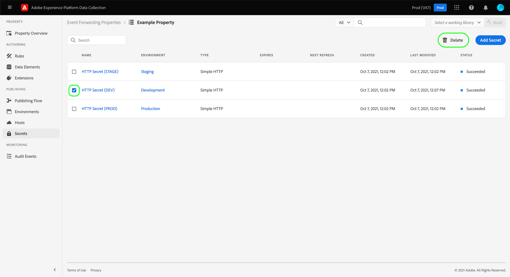
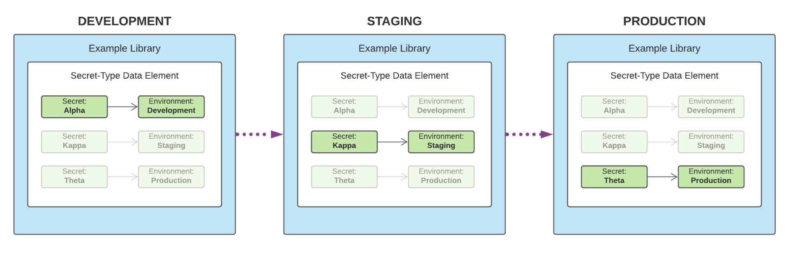

# イベント転送の機密情報

イベント転送では、秘匿とは別のシステムの認証資格情報を表すリソースです。これによって、データを安全に交換することができます。 シークレットを作成できるのは、「イベント転送」プロパティ内に限られます。

現在は、次の3つのシークレットタイプがサポートされています。

| シークレットタイプ | 説明 |
| --- | --- |
| [!UICONTROL トークン] | 両方のシステムによって認識され、認識される認証トークン値を表す1つのストリング。 |
| [!UICONTROL HTTP] | には、それぞれ、ユーザー名とパスワードの2つの string 属性が含まれています。 |
| [!UICONTROL OAuth 2] | OAuth2 認証仕様をサポートするためのいくつかの属性が含まれてい  ます。 必要な情報の入力を求めるメッセージが表示されたら、指定した間隔でこれらのトークンを更新する処理が行われます。 現在のところ、 [ クライアント資格情報 ](https://datatracker.ietf.org/doc/html/rfc6749#section-1.3.4) バージョンの OAuth2 のみがサポートされています。 |

{style=&quot;table-layout:auto&quot;}

このガイドでは、データ収集 UI の「event フォワーディング ( [!UICONTROL  Edge)」プロパティに機密情報を設定する方法について概要を説明し ] ます。

>[!NOTE]
>
>Reactor API での機密情報の管理方法について詳しくは、「機密情報管理ガイド」を参照してください  。

## 前提条件

このガイドでは、データエレメントやイベント転送ルールの作成方法について、データ収集 UI でのタグやイベント転送のリソースの管理方法について理解していることを前提としています。  概要情報が必要な場合は、リソース管理に関するガイドを参照してください。

また、リソースをライブラリに追加する方法や、テスト用にビルドを web サイトにインストールする方法など、タグやイベント転送に関する公開フローについて理解しておく必要があります。 詳しくは、パブリッシュの概要を参照してください  。

## シークレットの作成 {#create}

シークレットを作成するには、データ収集 UI にログインして、機密情報を追加するイベント転送プロパティを開きます。 次に、左側のナビゲーションで「シークレット」を選択し **** 、その後に「 **[!UICONTROL 新規シークレット」を作成し]** ます。

次の画面では、シークレットの詳細を設定することができます。 イベント転送によってシークレットを使用できるようにするには、既存の環境にシークレットを割り当てる必要があります。 イベント転送プロパティに対して作成された環境がない場合は、これらの [ 環境設定を参照してから ](../publishing/environments.md) 続行します。

>[!NOTE]
>
>シークレットを作成して保存した後に、環境に追加する場合は、 **[!UICONTROL 他の情報に入力する前に、環境へのシークレットのアタッチをオフにして]** ください。 シークレットを使用する場合は、後で環境に割り当てておく必要があることに注意してください。
>
>

「 **[!UICONTROL ターゲット環境」]** で、ドロップダウンメニューを使用して、秘匿に割り当てる環境を選択します。 「 **[!UICONTROL シークレット名」に、]** 環境のコンテキストにおけるシークレットの名前を指定します。 この名前は、「イベント転送」プロパティにあるすべてのシークレットについて一意である必要があります。

シークレットは一度に1つの環境にのみ割り当てることができますが、必要に応じて、異なる環境間で同じ資格情報を複数の機密情報に割り当てることもできます。 「環境を追加」を選択し **** て、リストに1つの行を追加します。

追加した環境には、関連する機密情報として別の一意の名前を指定する必要があります。 使用可能な環境をすべて消費した場合は、「 **[!UICONTROL 環境を追加]** 」ボタンが使用できなくなります。

ここから、シークレットを作成する手順は、作成するシークレットの種類によって異なります。 詳しくは、次の項を参照してください。

* [[!UICONTROL トークン]](#token)
* [[!UICONTROL HTTP]](#http)
* [[!UICONTROL OAuth 2]](#oauth2)

### [!UICONTROL トークン] {#token}

トークンシークレットを作成するには **[!UICONTROL 、]** タイプドロップダウンから「トークン」を選択し **** ます。 **** 表示される「トークン」フィールドに、認証先のシステムによって認識される認証文字列を指定します。「 **[!UICONTROL シークレットを作成」を選択し]** てシークレットを保存します。

### [!UICONTROL HTTP] {#http}

HTTP シークレットを作成するには、 **** **[!UICONTROL タイプドロップダウンリストから「簡易 http」を選択し]** ます。 以下に示すフィールドで、「 **[!UICONTROL secret を作成」を選択してシークレットを保存するには、事前に認証情報のユーザー名とパスワードを入力]** します。

>[!NOTE]
>
>保存時に、クレデンシャル情報は [ 「基本」 HTTP 認証スキームを使用してエンコードされ ](https://www.rfc-editor.org/rfc/rfc7617.html) ます。

### [!UICONTROL OAuth 2] {#oauth2}

OAuth2 secret を作成するには **[!UICONTROL 、]** 「タイプ」ドロップダウンから「OAuth2」を選択し **** ます。 以下に示すフィールドに、 [[!UICONTROL  クライアント ID ] と [!UICONTROL  クライアントシークレット ] ](https://www.oauth.com/oauth2-servers/client-registration/client-id-secret/) 、および  OAuth 統合の認証 URL を指定します。[!UICONTROL データコレクション UI の「承認 URL ] 」フィールドは、承認サーバーのホストとトークンのパスの間に連結されています。

「 **[!UICONTROL 認証情報」オプションで]** は、 `scope` キーと値のペアなど、その他の資格情報オプションを指定することができ `audience` ます。 キーと値のペアを追加するには、「追加」を選択し **** ます。

最後に、その機密情報については「更新オフセット」の値を設定でき **** ます。 これは、システムが自動更新を実行するトークンの有効期限が経過するまでの秒数を表します。 入力したときに、相当する時刻がフィールドの右側に表示され、自動的に更新されます。

例えば、更新オフセットがデフォルト値 `14400` (4 時間) に設定されていて、アクセストークンの値が `expires_in` `86400` (24 時間) である場合、システムでは自動的に機密情報が20時間後に自動的に更新されます。

>[!IMPORTANT]
>
>OAuth シークレットは、更新の間に少なくとも4時間が必要であり、最低8時間は有効になっている必要があります。 この制限によって、生成されたトークンに問題が発生した場合に、少なくとも4時間で介入することができます。
>
>例えば、オフセットが (8 時間) に設定されて `28800` いて、アクセストークン `expires_in` の数が `36000` (10 時間) である場合、交換が失敗するのは、その差が4時間未満である場合です。

完了したら、「シークレットを作成」を選択し **** てシークレットを保存します。

## シークレットの編集

1つのプロパティについてシークレットを作成した後は、シークレットワークスペースに一覧表示され **** ます。 既存の機密情報を編集するには、リストから名前を選択します。

次の画面では、シークレットの名前と資格情報を変更することができます。

>[!NOTE]
>
>既存の環境にシークレットが関連付けられている場合は、そのシークレットを別の環境に再割り当てすることはできません。 同じ資格情報を別の環境で使用する場合は、代わりに新しいシークレットを作成する必要があり  ます。 この画面から環境を再割り当てする唯一の方法は、シークレットを事前に設定していない場合、またはそのシークレットが適用されていた環境を削除した場合のみです。

### Secret exchange の再実行

シークレットの交換は、編集画面から再実行することも、更新することもできます。 この処理は、編集されているシークレットの種類によって異なります。

| シークレットタイプ | リトライプロトコル |
| --- | --- |
| [!UICONTROL トークン] | **** 秘密交換を試みるには、「exchange シークレット」を選択します。このコントロールは、シークレットに接続されている環境がある場合にのみ使用できます。 |
| [!UICONTROL HTTP] | シークレットに環境が関連付けられていない場合は、「exchange シークレット」を選択し **** て、認証情報を base64 に交換します。 環境が関連付けられている場合は、「exchange を選択して、exchange に機密情報を base64 に展開」を選択し **** て、Cloudfare にシークレットを展開します。 |
| [!UICONTROL OAuth 2] | 「 **[!UICONTROL トークンの生成」を選択]** すると、認証情報が交換され、認証プロバイダーからアクセストークンが返されます。 |

## シークレットの削除

シークレットワークスペース内の既存のシークレットを削除するには  **** 、「削除」を選択する前に、名前の横にあるチェックボックスをオンにし **** ます。

## イベント転送でのシークレットの使用

イベント転送の際にシークレットを使用するには、まず機密情報を参照するためのデータエレメントを作成する必要があり  ます。 データエレメントを保存した後は、それをイベント転送 [ ルールに ](../managing-resources/rules.md) 追加し、ライブラリに追加し [ ます。これは、これらのルールをライブラリに追加することもでき ](../publishing/libraries.md)  ます。

データエレメントを作成する際には、拡張機能を選択して、 **** **[!UICONTROL データエレメントタイプに「シークレット」を選択し]** ます。 右側のパネルには、最大3つのシークレットがデータエレメントに割り当てられます。これは、1つは [!UICONTROL  開発用 ] 、ステージング用、  および [!UICONTROL  実稼働用 ] です。

>[!NOTE]
>
>開発、ステージング、および実稼働環境に関連付けられた秘密のみが、それぞれのドロップダウンで表示されます。

1つのデータ要素に複数の機密情報を割り当ててルールを作成することにより、格納しているライブラリがパブリッシュフローのどこにあるかに応じて、データエレメントの値を変化させることができ  ます。

>[!NOTE]
>
>データエレメントを作成するには、開発環境が割り当てられている必要があります。 ステージング環境および運用環境の機密情報は必須ではありませんが、これらの環境に移行しようとすると、そのようなシークレットタイプのデータ要素にシークレットが指定されていない場合は失敗します。

## 次の手順

このガイドでは、データ収集 UI でシークレットを管理する方法について説明しています。 Reactor API を使用した秘密情報の操作方法について詳しくは、『 [ シークレット endpoint guide 』を参照してください ](../../api/endpoints/secrets.md) 。
