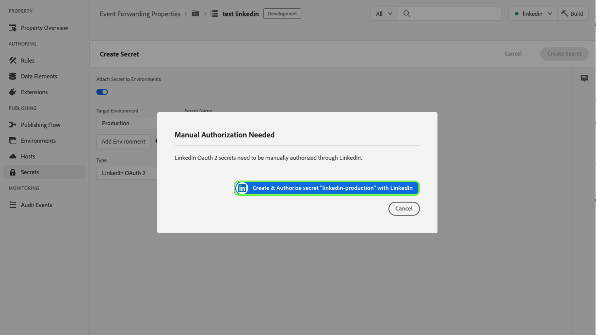
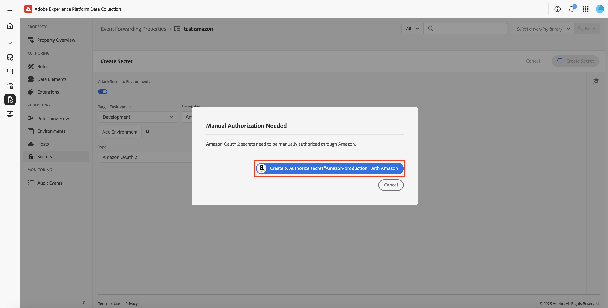

# イベント転送でのシークレットの設定

イベント転送では、秘密鍵は別のシステムの資格情報を表すリソースであり、データの安全な交換を可能にします。秘密鍵は、イベント転送プロパティ内でのみ作成できます。

現在、次の秘密鍵タイプがサポートされています。

| 秘密鍵タイプ | 説明 |
| --- | --- |
| [!UICONTROL Amazon OAuth 2] | [!DNL Amazon] サービスによる安全な認証を有効にします。 システムはトークンを安全に保管し、指定された間隔で更新を処理します。 |
| [!UICONTROL Google OAuth 2] | [Google Ads API](https://developers.google.com/google-ads/api/docs/oauth/overview) および [Pub/Sub API](https://cloud.google.com/pubsub/docs/reference/service_apis_overview) で使用する [OAuth 2.0](https://datatracker.ietf.org/doc/html/rfc6749) 認証仕様をサポートするためのいくつかの属性が含まれています。システムの指示に従って必要な情報を入力すると、指定した間隔でトークンの更新が行われます。 |
| [!UICONTROL HTTP] | ユーザー名とパスワードの 2 つの文字列属性がそれぞれ含まれます。 |
| [!UICONTROL [!DNL LinkedIn] OAuth 2] | システムの指示に従って必要な情報を入力すると、指定した間隔でトークンの更新が行われます。 |
| [!UICONTROL OAuth 2] | [OAuth 2.0](https://datatracker.ietf.org/doc/html/rfc6749) 認証仕様の[クライアント資格情報付与タイプ](https://datatracker.ietf.org/doc/html/rfc6749#section-1.3.4)をサポートするためのいくつかの属性が含まれています。システムの指示に従って必要な情報を入力すると、指定した間隔でトークンの更新が行われます。 |
| [!UICONTROL OAuth 2 JWT] | [OAuth 2.0 認証](https://datatracker.ietf.org/doc/html/rfc7523#section-2.1)許可の JSON Web トークン(JWT)プロフィールをサポートする複数の属性が含まれています。システムの指示に従って必要な情報を入力すると、指定した間隔でトークンの更新が行われます。 |
| [!UICONTROL Token] | 両方のシステムで認識および理解されている認証トークン値を表す単一の文字列。 |

{style="table-layout:auto"}

このガイドでは、Experience Platform UIまたは データ コレクション UIでイベント転送 ([!UICONTROL Edge]) プロパティのシークレットを構成する方法の概要について説明します。

>[!NOTE]
>
>秘密鍵の構造の JSON の例など、Reactor API で秘密鍵を管理する方法に関するガイダンスについて詳しくは、[秘密鍵 API ガイド](../../api/guides/secrets.md)を参照してください。

## 前提条件

このガイドは、UI でタグやイベント転送のリソースを管理する方法（データ要素やイベント転送ルールの作成方法など）を既に熟知していることを前提としています。概要については、[リソースの管理](../managing-resources/overview.md)に関するガイドを参照してください。

また、タグとイベント転送の公開フロー（ライブラリにリソースを追加する方法や、テスト用に web サイトにビルドをインストールする方法など）についての実用的な理解が必要です。詳しくは、[公開の概要](../publishing/overview.md)を参照してください。

## 秘密鍵の作成 {#create}

>[!CONTEXTUALHELP]
>id="platform_eventforwarding_secrets_environments"
>title="シークレットの環境"
>abstract="シークレットをイベント転送で使用できるようにするには、シークレットを既存の環境に割り当てる必要があります。イベント転送プロパティ用の環境が作成されていない場合は、先に進む前に環境を設定する必要があります。"
>additional-url="https://experienceleague.adobe.com/docs/experience-platform/tags/publish/environments/environments.html?lang=ja" text="環境の概要"

シークレットを作成するには、左側のナビゲーションで「**[!UICONTROL Event Forwarding]**」を選択し、シークレットを追加するイベント転送プロパティを開きます。 次に、左側のナビゲーションで「**[!UICONTROL Secrets]**」を選択し、次に「**[!UICONTROL Create New Secret]**」を選択します。

次の画面では、シークレットの詳細を設定できます。シークレットをイベント転送で使用できるようにするには、シークレットを既存の環境に割り当てる必要があります。イベント転送プロパティ用に環境が作成されていない場合は、続行する前に[環境](../publishing/environments.md)に関するガイドを参照して、環境の設定方法を確認してください。

>[!NOTE]
>
>シークレットを環境に追加する前にシークレットを作成して保存する場合は、残りの情報を入力する前に **[!UICONTROL Attach Secret to Environments]** トグルを無効にします。 シークレットを使用する場合は、後で環境に割り当てる必要があります。
>
>

[ **[!UICONTROL Target Environment]**] で、ドロップダウンメニューを使用して、シークレットを割り当てる環境を選択します。 [ **[!UICONTROL Secret Name]**] で、環境のコンテキストでのシークレットの名前を入力します。 この名前は、イベント転送プロパティの下にあるすべての秘密鍵に対して一意である必要があります。

シークレットは、一度に 1 つの環境にのみ割り当てることができますが、必要に応じて、異なる環境の複数のシークレットに同じ資格情報を割り当てることができます。**[!UICONTROL Add Environment]** を選択して、別の行をリストに追加します。

追加する環境ごとに、関連付けられたシークレットに別の一意の名前を指定する必要があります。使用可能なすべての環境を使い果たすと、 **[!UICONTROL Add Environment]** ボタンが使用できなくなります。

ここからシークレットを作成する手順は、作成するシークレットのタイプによって異なります。詳しくは、以下のサブセクションを参照してください。

* [[!UICONTROL Token]](#token)
* [[!UICONTROL HTTP]](#http)
* [[!UICONTROL OAuth 2]](#oauth2)
* [[!UICONTROL OAuth 2 JWT]](#oauth2jwt)
* [[!UICONTROL Google OAuth 2]](#google-oauth2)
* [[!UICONTROL [!DNL LinkedIn] OAuth 2]](#linkedin-oauth2)
* [[!UICONTROL [!DNL Amazon] OAuth 2]](#amazon-oauth2)

### [!UICONTROL Token] {#token}

トークンシークレットを作成するには、**[!UICONTROL Token]**&#x200B;ドロップダウンから&#x200B;**[!UICONTROL Type]**&#x200B;を選択します。表示される [ **[!UICONTROL Token]** ] フィールドに、認証先のシステムで認識される資格情報文字列を入力します。 [ **[!UICONTROL Create Secret]** ] を選択してシークレットを保存します。

### [!UICONTROL HTTP] {#http}

HTTP シークレットを作成するには、[**[!UICONTROL Simple HTTP]**] ドロップダウンから [**[!UICONTROL Type]**] を選択します。下に表示されるフィールドで、シークレットを保存する **[!UICONTROL Create Secret]** を選択する前に、資格情報のユーザー名とパスワードを入力します。

>[!NOTE]
>
>資格情報は、保存時に、[基本「HTTP 認証スキーム」](https://www.rfc-editor.org/rfc/rfc7617.html)を使用してエンコードされます。

### [!UICONTROL OAuth 2] {#oauth2}

OAuth 2 シークレットを作成するには、**[!UICONTROL OAuth 2]**&#x200B;ドロップダウンから [**[!UICONTROL Type]**] を選択します。下に表示されるフィールドに、OAuth 統合の [[!UICONTROL Client ID] と [!UICONTROL Client Secret]](https://www.oauth.com/oauth2-servers/client-registration/client-id-secret/)、および [[!UICONTROL Token URL]](https://www.oauth.com/oauth2-servers/access-tokens/client-credentials/) を入力します。 UIの「 [!UICONTROL Token URL] 」フィールドは、認証 サーバー・ホストとトークン・パスを連結したものです。

**[!UICONTROL Credential Options]** では、`scope`や`audience`などの他の認証情報オプションをキーと値のペアの形式で提供できます。キーと値のペアをさらに追加するには、「 **[!UICONTROL Add another]**」を選択します。

最後に、秘密鍵の **[!UICONTROL Refresh Offset]** 値を設定できます。 これは、トークンの有効期限が切れる前に、システムが自動更新を実行する秒数を表します。同等の時間（時間と分）がフィールドの右側に表示され、入力中に自動で更新されます。

例えば、更新オフセットがデフォルト値の `14400`（4 時間）に設定されていて、アクセストークンの `expires_in` 値が `86400`（24 時間）の場合、システムは 20 時間で自動的に秘密鍵を更新します。

>[!IMPORTANT]
>
>OAuth 秘密鍵は、4 時間以上の更新間隔、8 時間以上の有効期限が必要です。この制限により、生成されたトークンで問題が発生した場合に介入するための時間が 4 時間以上確保されます。
>
>例えば、オフセットが `28800`（8 時間）に設定されていて、アクセストークンの `expires_in` が `36000`（10 時間）の場合、差分が 4 時間未満となるため、交換は失敗します。

終了したら、「**[!UICONTROL Create Secret]**」を選択して秘密鍵を保存します。

### [!UICONTROL OAuth 2 JWT] {#oauth2jwt}

OAuth 2 JWT 秘密鍵を作成するには、**[!UICONTROL OAuth 2 JWT]** ドロップダウンから「**[!UICONTROL Type]**」を選択します。

![[!UICONTROL Create Secret] ドロップダウンで OAuth 2 JWT 秘密鍵がハイライト表示された「[!UICONTROL Type]」タブ &#x200B;](../../images/ui/event-forwarding/secrets/oauth-jwt-secret.png)

>[!NOTE]
>
>JWT への署名が現在サポートされている [!UICONTROL Algorithm] は RS256 のみです。

下に表示されるフィールドに、 [!UICONTROL Issuer]、 [!UICONTROL Subject]、 [!UICONTROL Audience]、 [!UICONTROL Custom Claims]、 [!UICONTROL TTL]を入力し、ドロップダウンから [!UICONTROL Algorithm] を選択します。 次へ、OAuth 統合の [!UICONTROL Private Key Id]と [[!UICONTROL Token URL]](https://www.oauth.com/oauth2-servers/access-tokens/client-credentials/) を入力します。 「 [!UICONTROL Token URL] 」フィールドは必須フィールドではありません。 値が指定されている場合、JWT はアクセストークンと交換されます。 シークレットは、応答の `expires_in` 属性と [!UICONTROL Refresh Offset] 値に従って更新されます。 値が指定されていない場合、エッジにプッシュされるシークレットは JWT です。 [!UICONTROL TTL]と[!UICONTROL Refresh Offset]の値に従って、JWT が更新されます。

![[!UICONTROL Create Secret]タブ、選択した入力フィールドがハイライト表示されます。](../../images/ui/event-forwarding/secrets/oauth-jwt-information.png)

**[!UICONTROL Credential Options]** では、キーと値のペアの形式で`jwt_param`など、他の資格情報オプションを指定できます。キーと値のペアをさらに追加するには、「 **[!UICONTROL Add another]**」を選択します。

![[!UICONTROL Create Secret]タブ[!UICONTROL Credential Options]フィールドが強調表示されます。](../../images/ui/event-forwarding/secrets/oauth-jwt-credential-options.png)

最後に、シークレットの **[!UICONTROL Refresh Offset]** 値を設定できます。 これは、トークンの有効期限が切れる前に、システムが自動更新を実行する秒数を表します。同等の時間（時間と分）がフィールドの右側に表示され、入力中に自動で更新されます。

![&#x200B; 「[!UICONTROL Create Secret]」フィールドをハイライト表示した「[!UICONTROL Refresh Offset]」タブ &#x200B;](../../images/ui/event-forwarding/secrets/oauth-jwt-refresh-offset.png)

例えば、更新オフセットがデフォルト値の `1800` （30 分）に設定されていて、アクセストークンの `expires_in` 値が `3600` （1 時間）の場合、システムは 1 時間で自動的に秘密鍵を更新します。

>[!IMPORTANT]
>
>OAuth 2 JWT 秘密鍵は、更新間隔が 30 分以上で、1 時間以上も有効である必要があります。 この制限により、生成されたトークンで問題が発生した場合に介入するための時間が 30 分以上になります。
>
>例えば、オフセットが `1800` （30 分）に設定されていて、アクセストークンの `expires_in` が `2700` （45 分）の場合、差分が 30 分未満となるため、交換は失敗します。

終了したら、「**[!UICONTROL Create Secret]**」を選択して秘密鍵を保存します。

![&#x200B; 「[!UICONTROL Create Secret]」タブのハイライト表示 [!UICONTROL Create Secret]](../../images/ui/event-forwarding/secrets/oauth-jwt-create-secret.png)

### [!UICONTROL Google OAuth 2] {#google-oauth2}

Google OAuth 2 シークレットを作成するには、**[!UICONTROL Google OAuth 2]**&#x200B;プルダウンから [**[!UICONTROL Type]**] を選択します。[ **[!UICONTROL Scopes]**] で、このシークレットを使用してアクセスを許可する Google API を選択します。 現在、次の製品がサポートされています。

* [Google 広告 API](https://developers.google.com/google-ads/api/docs/oauth/overview)
* [Pub/Sub API](https://cloud.google.com/pubsub/docs/reference/service_apis_overview)

終了したら「**[!UICONTROL Create Secret]**」を選択します。

秘密鍵を Google で手動で認証する必要があることを示すポップオーバーが表示されます。**[!UICONTROL Create & Authorize]**&#x200B;を選択して続行します。

Google アカウントの資格情報を入力するためのダイアログが表示されます。画面の指示に従い、選択したスコープでイベント転送にデータへのアクセスを許可します。認証プロセスが完了すると、シークレットが作成されます。

>[!IMPORTANT]
>
>組織が Google Cloud アプリケーション用に再認証ポリシーセットを使用している場合、認証の有効期限が切れた後（ポリシーセットに応じて 1～24 時間）、作成されたシークレットは正常に更新されません。
>
>この問題を解決するには、Google 管理コンソールにログインし、イベント転送アプリ（Adobe Real-Time CDP イベント転送）を [!DNL Trusted] としてマークできるように **[!DNL App access control]** ページに移動します。詳しくは、Google ドキュメントで [Google Cloud サービスのセッション継続時間を設定する](https://support.google.com/a/answer/9368756)を参照してください。

### [!UICONTROL [!DNL LinkedIn] OAuth 2] {#linkedin-oauth2}

[!DNL LinkedIn] OAuth2 シークレットを作成するには、**[!UICONTROL [!DNL LinkedIn] OAuth 2]** ドロップダウンから「**[!UICONTROL Type]**」を選択します。 次に、「**[!UICONTROL Create Secret]**」を選択します。

![[!UICONTROL Create Secret] のフィールドがハイライト表示された「[!UICONTROL Type]」タブ &#x200B;](../../images/ui/event-forwarding/secrets/linkedin-oauth.png)

秘密鍵を [!DNL LinkedIn] で手動で認証する必要があることを示すポップオーバーが表示されます。 **[!UICONTROL Create & Authorize secret with [!DNL LinkedIn]]**&#x200B;を選択して続行します。

[!DNL LinkedIn] 資格情報を入力するように求めるダイアログが表示されます。 画面の指示に従い、イベント転送にデータへのアクセスを許可します。

認証プロセスが完了すると、「**[!UICONTROL Secrets]**」タブに戻り、新しく作成した秘密鍵を確認できます。 ここでは、秘密鍵のステータスと有効期限の日付を確認できます。

![[!UICONTROL Secret]タブ新しく作成されたシークレットが強調表示されます。](../../images/ui/event-forwarding/secrets/linkedin-new-secret.png)

#### [!UICONTROL [!DNL LinkedIn] OAuth 2] シークレットの再認証

>大事な
>
>365 日ごとに、 [!DNL LinkedIn] 資格情報を使用して再認証する必要があります。 期限内に再認証しないと、シークレットは更新されず、 [!DNL LinkedIn] コンバージョンリクエストは失敗します。

再認証を必要とするシークレットの 3 か月前に、プロパティページをナビゲートしているときにポップアップが表示され始めます。 **[!UICONTROL Click here to go to your secrets]** を選択します。

![[!UICONTROL Property Overview]タブ、シークレットの再認証ポップアップが強調表示されます。](../../images/ui/event-forwarding/secrets/linkedin-reauthorization-popup.png)

[!UICONTROL Secrets]タブにリダイレクトされます。このページに一覧表示されているシークレットは、再承認が必要なシークレットのみを表示するようにフィルター処理されます。 再認証する必要があるシークレットの **[!UICONTROL Auth Needed]** を選択します。

![[!UICONTROL Secret]タブ[!UICONTROL Auth Needed]&#x200B;[!DNL LinkedIn]シークレットについて。](../../images/ui/event-forwarding/secrets/linkedin-reauthorization.png)

[!DNL LinkedIn] 資格情報の入力を求めるダイアログが表示されます。プロンプトに従って、シークレットを再認証します。

### [!UICONTROL [!DNL Amazon] OAuth 2] {#amazon-oauth2}

[!DNL Amazon] OAuth2 シークレットを作成するには、**[!UICONTROL [!DNL Amazon] OAuth 2]** ドロップダウンから「**[!UICONTROL Type]**」を選択します。 次に、「**[!UICONTROL Create Secret]**」を選択します。

![[!UICONTROL Create Secret] のフィールドがハイライト表示された「[!UICONTROL Type]」タブ &#x200B;](../../images/ui/event-forwarding/secrets/amazon-oauth.png)

秘密鍵を [!DNL Amazon] で手動で認証する必要があることを示すポップオーバーが表示されます。 「**[!UICONTROL Create & Authorize secret with [!DNL Amazon]]**」を選択して続行します。

[!DNL Amazon] 資格情報を入力するように求めるダイアログが表示されます。 画面の指示に従ってイベント転送データへのアクセスを許可します。

認証プロセスが完了すると、「**[!UICONTROL Secrets]**」タブに戻り、新しく作成した秘密鍵を確認できます。 ここでは、秘密鍵のステータスと有効期限の日付を確認できます。

![&#x200B; 新しく作成した秘密鍵がハイライト表示された「[!UICONTROL Secret]」タブ &#x200B;](../../images/ui/event-forwarding/secrets/amazon-new-secret.png)

## 秘密鍵の編集

プロパティの秘密鍵を作成したら、**[!UICONTROL Secrets]** ワークスペースに一覧表示されます。 既存の秘密鍵の詳細を編集するには、リストから名前を選択します。

次の画面では、秘密鍵の名前と資格情報を変更できます。

>[!NOTE]
>
>秘密鍵が既存の環境に関連付けられている場合、その秘密鍵を別の環境に再割り当てすることはできません。異なる環境で同じ資格情報を使用する場合は、代わりに[新しい秘密鍵を作成する](#create)必要があります。この画面から環境を再割り当てできるのは、以前に秘密鍵を環境に割り当てたことがない場合、または秘密鍵が添付されていた環境を削除した場合のみです。

### 秘密鍵の交換の再試行

編集画面から秘密鍵の交換を再試行または更新できます。このプロセスは、編集する秘密鍵のタイプによって異なります。

| 秘密鍵タイプ | 再試行プロトコル |
| --- | --- |
| [!UICONTROL Token] | 「**[!UICONTROL Exchange Secret]**」を選択して、秘密鍵の交換を再試行します。 このコントロールは、秘密鍵に接続された環境がある場合にのみ使用できます。 |
| [!UICONTROL HTTP] | 秘密鍵に接続された環境がない場合は、「**[!UICONTROL Exchange Secret]**」を選択し、認証情報を base64 に交換します。 環境が接続されている場合は、「**[!UICONTROL Exchange and Deploy Secret]** を選択して、base64 と交換し、シークレットをデプロイします。 |
| [!UICONTROL OAuth 2] | 「**[!UICONTROL Generate Token]**」を選択して認証情報を交換し、認証プロバイダーからアクセストークンを返します。 |

## 秘密鍵の削除

**[!UICONTROL Secrets]** ワークスペースで既存の秘密鍵を削除するには、名前の横にあるチェックボックスを選択してから、**[!UICONTROL Delete]** を選択します。

## イベント転送での秘密鍵の使用

イベント転送で秘密鍵を使用するには、まず秘密鍵自体を参照する[データ要素](../managing-resources/data-elements.md)を作成する必要があります。データ要素を保存した後、それをイベント転送[ルール](../managing-resources/rules.md)に含め、それらのルールを[ライブラリ](../publishing/libraries.md)に追加できます。ライブラリは、[ビルド](../publishing/builds.md)としてアドビのサーバーにデプロイできます。

データ要素の作成時に、 **[!UICONTROL Core]** 拡張機能を選択し、データ要素タイプで **[!UICONTROL Secret]** を選択します。 右側のパネルが更新され、データ要素に最大 3 つのシークレット (それぞれ [!UICONTROL Development]、 [!UICONTROL Staging]、 [!UICONTROL Production] ) を割り当てるためのドロップダウン コントロールが表示されます。

>[!NOTE]
>
>開発環境、ステージング環境、本番環境に関連付けられた秘密鍵のみが、それぞれのドロップダウンに表示されます。

複数の秘密鍵を 1 つのデータ要素に割り当ててルールに含めることで、含まれるライブラリが[公開フロー](../publishing/publishing-flow.md)のどこにあるかに応じて、データ要素の値を変更できます。

>[!NOTE]
>
>データ要素を作成する場合は、開発環境を割り当てる必要があります。ステージング環境と本番環境の秘密鍵は必須ではありませんが、これらの環境に移行しようとするビルドは、その秘密鍵タイプのデータ要素秘密鍵する環境用に選択された秘密鍵がない場合、失敗します。

## 次の手順

このガイドでは、UI でのシークレットの管理方法について説明しました。Reactor API を使用してシークレットを操作する方法については、[シークレットエンドポイントガイド](../../api/endpoints/secrets.md)を参照してください。
