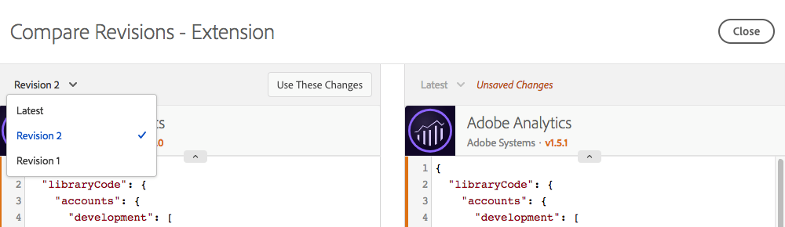

# リソースリビジョンの比較

>[!NOTE]
>
>Adobe Experience Platform Launch は、Adobe Experience Platform のデータ収集テクノロジースイートとしてリブランドされています。 その結果、製品ドキュメント全体でいくつかの用語が変更されました。用語の変更点の一覧については、次の[ドキュメント](../../term-updates.md)を参照してください。

リソースリビジョンを比較して、個々のリソースの履歴を確認します。リソースの現在の状態を古いバージョンと比較したり、現在公開されているリソースを、保存済みの最新の変更セットと比較したりできます。

## 比較の開始

比較の開始は、どのリソースタイプでも同じです。個々のリソースの編集ビューを開き、「**[!UICONTROL 保存]**」ボタンの横にある 3 つのドットのアイコンを見つけ、そのリソースで使用可能なアクションを表示します。リストから「**[!UICONTROL リビジョンを比較]**」を選択します。

拡張機能の場合、インストールされている拡張機能のリストを表示する際に「**[!UICONTROL 設定]**」ボタンを選択して詳細ビューにアクセスします。データ要素とルールの場合は、リストから選択します。

## 比較ビューの使用

比較を開始すると、デフォルトのビューでは、右側に最新バージョンが表示されます。このバージョンには、編集ビュー内のリソースに対して行われた未保存の変更が含まれています。（下の画像の右側に、「Unsaved Changes」ラベルがあります。）

左側では、「Latest」と比較する既存のリビジョンを選択できます。

「**[!UICONTROL これらの変更を使用]**」を選択し、選択したリビジョン（左）の設定を最新のバージョン（右）にコピーします。これにより、古いリビジョンから最新の変更内容に設定がコピーされます。これらの変更を保持するには、既存の比較ビューを終了してから「**[!UICONTROL 保存]** 」してください。

>[!TIP]
>個々のリソースには、属性と設定の両方を含めることができます。これらの設定は、JSON ブロックとして保存されます。JSON ブロックはデータを構造化された方法で格納しますが、非常に柔軟性が高く、拡張機能開発者は拡張機能で目的の処理をおこなうために必要なあらゆる要素を含めることができます。
>比較ビューの最初のリリースには、RAW 形式の設定を JSON で表示します。将来の強化では、詳細なコード比較や、拡張機能開発者が提供する拡張機能ビューの使用など、様々な方法でバージョンを表示できるようになります。

## 拡張機能の比較

拡張機能では、1 つの画面でバージョン間の違いを示します。

比較ビューでは、設定バージョン間の違いがハイライト表示されます。個々の設定に対する追加と削除は、いずれかの方向の線の拡張によって示されます。

上記では、次の変更を確認できます。

* [!DNL Adobe Analytics] 拡張機能は新しいバージョンに更新され、上部にオレンジ色のバージョン番号が表示されます。
* `orgID` と `currencyCode` の設定が変更され、オレンジ色のセクションの拡張によって表示されようになります。

## データ要素の比較

データ要素には違いを示す単一の画面がありますが、データ要素の設定以外に属性が追加されているため、追加情報が表示されます。変更された属性はオレンジ色でハイライト表示されます。

上記では、次の変更を確認できます。

* 名前が「Page Name 2」から「My Special Page Name」に変更され、オレンジ色のバーが表示されます。
* タイプが JavaScript 変数からページ情報に変更されました。
* デフォルト値「b」が追加されました。
* 「Force lowercase value」が選択されました。
* 「Clean text」が選択されました。
* 設定が変更されました。（JavaScript 変数タイプの設定は、ページ情報タイプとは異なります。）

設定ブロックが大きい場合は、設定セクションを展開して、より適切に表示することができます。

## ルールの比較

ルールは、多くのルールコンポーネントで構成されます。ルールの変更を理解するには、コンポーネントの追加と削除、および個々のコンポーネントへの変更について知っておく必要があります。したがって、ルールのバージョンを比較すると、実際には 2 つの画面があります。

最初の画面には大まかなビューが表示され、ルール内でのルールコンポーネントのは位置に対する変更がハイライトされます。変更がハイライトされます。様々なタイプの変更が表示されます。

上記では、次の変更を確認できます。

* ルール名が、「Analytics」から「Baseline Analytics」に変更されました。名前の横にオレンジ色のバーが表示されます。
* 「Core- Domain」条件が追加されました。右側にオレンジ色の「+」アイコンと追加のコンポーネントが表示されます。
* 「[!DNL Adobe Analytics] - Clear Variables」アクションが削除されました。右側にオレンジ色の「-」アイコンが表示され、コンポーネントがなくなります。
* 「[!DNL Adobe Analytics] - Set Variables」アクションが変更されました。左右のコンポーネントのバージョンの間にオレンジ色の線が表示されます。コンポーネントの順序が変更されていない場合、この線は直線です。
* 「[!DNL Adobe Analytics] - Set Variables」アクションと「[!DNL Adobe Analytics] - Send Beacon」アクションの順序が変更されました。左右のコンポーネントの異なるバージョンをつなげる曲線が表示されます。

ルールコンポーネントの 1 つに対する特定の変更を表示するには、表示する特定のコンポーネントを選択します。カーソルを重ねると、線が青に変わります。

個々のルールコンポーネントの比較は、データ要素の比較と同じになります。

上記では、次の変更を確認できます。

* ルールコンポーネントが変更され、eVar2 に値「1」が追加されました。

設定ブロックが大きい場合は、設定セクションを展開して、より適切に表示することができます。
