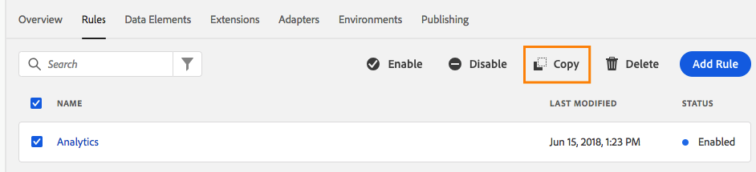

# リソースのコピー

>[!NOTE]
>
>Adobe Experience Platform Launch は、Adobe Experience Platform のデータ収集テクノロジースイートとしてリブランドされています。 その結果、製品ドキュメント全体でいくつかの用語の変更がロールアウトされました。 用語の変更点の一覧については、次の[ドキュメント](../../term-updates.md)を参照してください。

既存のリソースの設定を使用して新しいリソースを作成すると便利な場合があります。この場合、コピーを作成できます。

プロパティ、拡張機能、ルールおよびデータ要素はすべてコピーできます。

リソースをコピーすると、指定した宛先にそのリソースの複製が作成されます。これは、1 回のみのアクションであり、元のリソースと作成されたコピーの間に継続的な関係はありません。

## コピーの開始

インストールした拡張機能を表示して、「 **[!UICONTROL 設定]**」ボタンのドロップダウン矢印を選択し、「**[!UICONTROL コピー]**」を選択すると、拡張機能のコピーを開始できます。

プロパティ、ルール、およびデータ要素の場合は、コピーするリソースを選択し、アクションメニューの「**[!UICONTROL コピー]**」ボタンを選択します。

ルールまたはデータ要素をコピーする場合、コピーダイアログでドロップダウンメニューを使用して、コピー先となる宛先プロパティを選択できます（デフォルト設定は現在のプロパティです）。拡張機能は同じプロパティにコピーできないので、そのオプションには提供されません。

>[!NOTE]
>
>データ収集 UI では、あるプロパティが拡張機能の開発用に設定され、他のプロパティがそうでない場合は、リソースを別のプロパティにコピーすることはできません。

目的の動作を設定したら、「**[!UICONTROL コピー]**」を選択します。

## プロパティのコピー

完全なプロパティのコピーを作成する場合、プロセスについていくつかの点を理解しておく必要があります。

* プロパティ設定は、そのままコピーされます（ドメイン、詳細設定など）
* 元のプロパティ内のルール、データ要素および拡張機能は、新しいターゲットプロパティにコピーされます。アダプター、環境、ライブラリはコピーされません。
* 必須の拡張機能（既存のデータ要素またはルールコンポーネントに必要な拡張）は、元のプロパティからアンインストールされている場合でも、ターゲットプロパティにコピーされます。
* プロパティのコピーには時間がかかる場合があります。これはバックグラウンドで実行されます。コピーの進行状況を監視したり、実行中に他のタスクを続行したりできます。
* 個々のリソースを、ターゲットプロパティにコピーした後（ただし、コピーが完了する前）に変更した場合、新しい変更はコピーされません。

## 拡張機能のコピー

拡張機能を別のプロパティにコピーする場合、次の点を理解する必要があります。

* 宛先プロパティに拡張機能がインストールされていない場合は、元のプロパティと同じ設定を使用してインストールされます。
* 宛先プロパティに既に拡張機能がインストールされている場合、設定のみがコピーされます。
* 宛先プロパティにインストールされている拡張機能のバージョンが古い場合は、コピーを実行する前に、宛先プロパティで拡張機能をアップグレードする必要があると通知されます。拡張機能の開発者が、時間の経過と共に拡張機能に設定を追加している可能性があります。そのため、新しい拡張機能の設定を、古いバージョンに確実に適用することはできません。
* 宛先プロパティに新しいバージョンの拡張機能がインストールされている場合、設定はコピーされますが、ダウングレードは実行されません。宛先プロパティには、現在のバージョン番号が引き続き保持されます。

## ルールとデータ要素のコピー

すべてのルールとデータ要素は拡張機能によって提供されるので、プロパティをまたいでコピーする場合、Platform はこれらの基礎となる拡張機能を考慮する必要があります。

「コピー」ダイアログボックスには、コピーを開始する前に、どのような処理がおこなわれるかの正確な説明を提供します。上記のダイアログはルール用ですが、データ要素にも適用されます。

1. **これらのルールで必要な拡張機能はコピーされます。**&#x200B;これにより、ユーザーは、必要な拡張機能がルールと共に実行されることを把握できます。これらのコピーは、上記の通常の拡張機能のコピーと同じルールに従います。
1. **拡張機能が既にインストールされている場合、拡張機能の設定はコピーされません。**&#x200B;つまり、目的の拡張機能が既に宛先プロパティ上に存在する場合、拡張機能はそのままになります。拡張機能の設定もコピーする場合は、「**Replace extension settings on destination property**」切り替えを使用すると、それに従って説明も更新されます。
1. **これらのルールに必要なデータ要素はコピーされません。**&#x200B;この説明はルールにのみ適用されます。ルールは、正常に機能するため、データ要素に依存しています。ルールを新しいプロパティにコピーする場合、別途、必要なデータ要素もコピーする必要があります。
