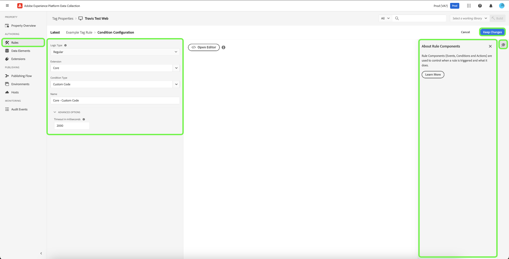

# ルール

>[!NOTE]
>
>Adobe Experience Platform Launch は、Adobe Experience Platform のデータ収集テクノロジースイートとしてリブランドされています。 その結果、製品ドキュメント全体でいくつかの用語の変更がロールアウトされました。 用語の変更点の一覧については、次の[ドキュメント](../../term-updates.md)を参照してください。

Adobe Experience Platform のタグは、ルールベースのシステムに従います。 ユーザーの操作と関する各種データを参照します。ルールで設定された条件が満たされると、ルールは、特定した拡張機能、スクリプトまたはクライアント側コードをトリガーします。

異なる製品を 1 つのソリューションに統合するマーケティングおよび広告テクノロジーのデータと機能を統合するためのルールを構築します。

## ルール構造

**Events (If)：**&#x200B;イベントは、ルールで検出する対象です。これは、イベント、適用条件、および例外を選択することで定義されます。

**アクション（Then）：**&#x200B;トリガーは、ルールのイベントが発生し、すべての条件が満たされた後に発生します。タグのルールでは、個別のアクションを必要なだけトリガーし、それらのアクションの発生順序を制御することができます。例えば、e-コマースのありがとうございますページ用の 1 つのルールから、解析ツールおよびサードパーティタグを同時にトリガーできます。各拡張機能やタグに個別のルールを作成する必要はありません。

イベントタイプは追加できます。複数のイベントは OR で結合され、いずれかのイベントの条件を満たすと、ルールの条件が評価されます。

>[!IMPORTANT]
>
> 変更は [公開](../publishing/overview.md) されるまでは反映されません。

### イベントと条件（if）

条件付きのイベントは、ルールの *If* 部分です。

指定したイベントが発生した場合、条件が評価され、必要に応じて指定したアクションが実行されます。

* **イベント**：ルールをトリガーするために実行する必要がある 1 つ以上のイベントを指定します。複数のイベントは OR で結合されます。指定したイベントのいずれかによって、ルールがトリガーされます。

* **条件**：イベントでルールをトリガーするために、true でなくてはならない条件を設定して、イベントを絞り込みます。例外は、NOT 条件として定義されます。複数の条件は AND で結合されます。

使用できるイベントは、インストールされている拡張機能によって異なります。Core 拡張機能のイベントについて詳しくは、「[Core 拡張機能のイベントタイプ](../../extensions/web/core/overview.md#core-extension-event-types)」を参照してください。

### アクション（then）

アクションは、ルールの「*Then*」部分です。ルールが実行される際に発生することを定義します。イベントがトリガーされた場合、条件が true と評価され、例外が false と評価されると、アクションが実行されます。アクションをドラッグ＆ドロップし、必要に応じて並べ替えることができます。

## ルールの作成

条件が満たされた場合に発生するアクションを指定するルールを作成します。

1. 「[!UICONTROL ルール]」タブを開き、「**[!UICONTROL 新しいルールを作成]**」を選択します。

   

1. ルール名を設定します。
1. イベント **[!UICONTROL 追加]**&#x200B;アイコンを選択します。
1. 拡張機能と、その拡張機能で使用可能ないずれかのイベントタイプを選択してから、イベントの設定を指定します。

   

   使用できるイベントタイプは、選択した拡張機能によって異なります。イベント設定は、イベントタイプに基づいて異なります。設定を指定する必要がないイベントもあります。

   >[!IMPORTANT]
   >
   >クライアントサイドのルールでは、データ要素名の先頭と末尾に `%` を付けてデータ要素をトークン化します。たとえば、`%viewportHeight%` のように設定します。イベントに転送するルールでは、データ要素名の先頭に `{{`、末尾に `}}` を付けてデータ要素をトークン化します。例：`{{viewportHeight}}`。

   Edge ネットワークからデータを参照するには、データ要素のパスを `arc.event._<element>_` にする必要があります。

   `arc` は、Adobe Response Context の略語です。

   例：`arc.event.xdm.web.webPageDetails.URL`

   >[!IMPORTANT]
   >
   >このパスが正しく指定されていない場合、データは収集されません。

1. 順序パラメーターを設定し、「 **[!UICONTROL 変更を保持]**」をクリックします。

   すべてのルールコンポーネントのデフォルトの順序は 50 です。すぐに実行する場合は、50 よりも小さい数値を指定します。

   * 実行順序は数字順です。1 は 3 より前、3 は 10 より前、10 は 100 より前になります。
   * 順番が同じでないルールは、特定の順序で実行されません。
   * ルールは順番に実行されますが、同じ順序で終了するとは限りません。ルール A とルール B がイベントを共有し、ルール A が最初になるように順序を割り当てた場合、ルール A が非同期で何かを実行すると、ルール B が開始する前にルール A が完了する保証はありません。

      後で実行させる場合は、50 よりも大きい数値を指定します。順序について詳しくは、「[ルールの順序](rules.md#rule-ordering)」を参照してください。

1. 条件の&#x200B;**[!UICONTROL 追加]**&#x200B;アイコンを選択して、論理タイプ、拡張機能、および条件タイプを選択し、条件の設定を指定します。次に、「**[!UICONTROL 変更を保持]**」を選択します。

   

   使用できる条件タイプは、選択した拡張機能によって異なります。条件設定は、条件タイプに基づいて異なります。

   論理タイプ：

   * 正規論理型を使用すると、条件が満たされた場合にアクションを実行できます
   * 例外論理タイプでは、条件が満たされた場合にアクションが実行されないようにします

   （詳細）Timeout：このオプションは、プロパティでルールコンポーネントの優先順位が有効になっている場合に使用できます。この属性は、条件が実行されるまでに許容される最大時間を定義します。タイムアウトに達した場合、条件は失敗し、ルールの残りの条件とアクションは処理キューから削除されます。デフォルトは、2000 ms です。

   条件は好きなだけ追加できます。同じルール内の複数の条件は AND で結合されます。

1. アクションの&#x200B;**[!UICONTROL 追加]**&#x200B;アイコンを選択して、拡張機能と、その拡張機能で使用可能ないずれかのアクションタイプを選択し、アクションの設定を指定してから「**[!UICONTROL 変更を保持]**」を選択します。

   

   使用できるアクションタイプは、選択した拡張機能によって異なります。アクション設定は、アクションタイプに基づいて異なります。

   （詳細）Wait to run next action：このオプションは、プロパティでルールコンポーネントの優先順位が有効になっている場合に使用できます。オンにすると、完了するまでタグは次のアクションを呼び出しません。オフにすると、直ちに次のアクションの実行が開始されます。デフォルトでは、**[!UICONTROL オン]**&#x200B;になっています。

   （詳細）Timeout：このオプションは、プロパティでルールコンポーネントの優先順位が有効になっている場合に使用できます。アクションが完了するまでに許容される最大時間を定義します。タイムアウトに達した場合、アクションは失敗し、このルールの後続のアクションは処理キューから削除されます。デフォルトは、2000 ms です。

1. ルールを確認し、「**[!UICONTROL ルールを保存]**」を選択します。

   後に[公開](../publishing/overview.md)する際に、このルールをライブラリに追加してデプロイします。

ルールを作成または編集する際は、[アクティブなライブラリ](../publishing/libraries.md#active-library)に保存および成できます。これにより、変更は直ちにライブラリに保存され、ビルドが実行されます。ビルドのステータスが表示されます。

## ルール順序 {#rule-ordering}

ルール順序を使用すると、イベントを共有するルールの実行順序を制御できます。各ルールには、順序の優先度を決定する整数が含まれます（デフォルト値は 50）。順序の値が小さいルールは、値が大きいルールの前に実行されます。

すべてがイベントを共有し、デフォルトの優先度を持つ 5 つのルールのセットについて考えてみましょう。

* 最後に実行するルールがある場合は、そのルールコンポーネントを編集して 50 より大きい数（例：60）を指定します。
* 最初に実行するルールがある場合は、そのルールコンポーネントを編集して 50 より小さい数値（例：40）を指定します。

>[!NOTE]
>
>最終的には、アクションを順に実行する責任は、使用しているイベントタイプの拡張機能開発者が負います。アドビの拡張機能開発者は、拡張機能が意図したとおりに動作することを確認します。アドビは、サードパーティの拡張機能開発者に対して、これを適切に行うためのガイダンスを提供しますが、これらのガイドラインに従う方法を保証することはできません。

ルールの順序付けには 1 ～ 100 の正の数（デフォルトは 50）を使用することを強くお勧めします。ルールの順序は手動で管理する必要があるので、ベストプラクティスは、できるだけ簡単に順序を設定することです。この制約が適していないエッジケースの場合、タグは +/- 2,147,483,648 の間のルール順序番号をサポートします。

### クライアント側のルール処理

ルールの読み込み順序は、ルールアクションが JavaScript、HTML またはその他のクライアント側コードのどれで設定されているか、ルールがページ下部／上部イベントまたは異なるタイプのどのイベントを使用しているかによって異なります。

ルールに設定されているイベントに関係なく、カスタムスクリプト内で `document.write` を使用できます。

異なるカスタムコードタイプを相互に並べることができます。例えば、JavaScript カスタムコードアクション、HTML カスタムコードアクション、JavaScript カスタムコードアクションの順で使用できるようになりました。タグは、それらのアクションがその順序で実行されるようにします。

## ルールのバンドル

ルールのイベントと条件は、常にメインのタグライブラリにバンドルされます。アクションは、メインライブラリにバンドルされるか、サブリソースが必要とするだけ遅く読み込まれます。アクションがバンドルされているかどうかは、ルールのイベントタイプによって決まります。

### 「Core - Library Loaded」または「Core - Page Top」イベントを含むルール

これらのイベントは、（条件が false に評価されない限り）ほとんど常に実行される必要があるので、効率性を考慮して、埋め込みコードによって参照されるファイルであるメインライブラリにバンドルされます。

* **JavaScript：** JavaScript は、メインのタグライブラリに埋め込まれます。カスタムスクリプトはスクリプトタグでラップされ、`document.write` を使用してドキュメントに書き込まれます。ルールに複数のカスタムスクリプトがある場合、それらは順番に記述されます。

* **HTML：** HTML はメインのタグライブラリに埋め込まれています。`document.write` を使用して、ドキュメントに HTML を書き込みます。ルールに複数のカスタムスクリプトがある場合、それらは順番に記述されます。

### 他のイベントを含むルール

アドビでは、他のルールが実際にトリガーされ、そのアクションコードが必要になるということは保証できません。このため、前述のリストに記載されていないすべてのイベントタイプのアクションは、メインライブラリにパッケージ化されません。代わりに、サブリソースとして保存され、必要に応じてメインライブラリによって参照されます。

* **JavaScript：** JavaScript は、サーバーから通常のテキストとして読み込まれ、script タグで囲まれ、Postscribe を使用してドキュメントに追加されます。ルールに複数の JavaScript カスタムスクリプトがある場合、それらはサーバーから並行して読み込まれますが、ルール内の設定と同じ順序で実行されます。
* **HTML：** HTML はサーバーから読み込まれ、Postscribe を使用してドキュメントに追加されます。ルールに複数のカスタムHTML スクリプトがある場合、それらはサーバーから並行して読み込まれますが、ルール内の設定と同じ順序で実行されます。

## ルールコンポーネントの優先順位 {#sequencing}

ランタイム環境の動作は、プロパティで「**[!UICONTROL ルールコンポーネントを順番に実行]**」がオンとオフのどちらに設定されているかによって異なります。この設定はにより、ルールのコンポーネントを並行して（非同期で）評価できるか、順番に評価する必要があるかが決定します。

>[!IMPORTANT]
>
>この設定は、各ルール内での条件とアクションの評価方法のみを決定し、プロパティでルール自体が実行される順序には影響しません。 複数のルールの実行順序を決定する方法について詳しくは、 [ルール順序](#rule-ordering) に関する前の節を参照してください。
>
>[イベント転送](../event-forwarding/overview.md) プロパティでは、ルールのアクションは常に順番に実行され、この設定は使用できません。ルールを作成する際は、順序が正しいことを確認してください。

### 有効

実行時にイベントがトリガーされたときに設定が有効になっている場合、ルールの条件とアクションは（定義した順序に基づいて）処理キューに追加され、「先入れ先出し」（FIFO）ベースで一度に 1 つずつ処理されます。ルールは、コンポーネントが完了するのを待ってから、次のコンポーネントに移動します。

条件が false と評価されるか定義されたタイムアウトに達すると、そのルールの後続の条件とアクションはキューから削除されます。

アクションに失敗するか定義されたタイムアウトに達すると、そのルールの後続のアクションはキューから削除されます。 

### 無効

無効にすると、実行時にイベントがトリガーされた場合、ルールの条件が直ちに評価されます。複数の条件が並行して評価されます。

すべての条件が true を返す場合（および例外が false を返す場合）は、ルールのアクションが直ちに実行されます。アクションは順番に呼び出されますが、タグは完了するのを待たずに次のアクションを呼び出します。アクションが同期している場合、アクションは順番に実行されます。1 つ以上のアクションが非同期の場合、一部のアクションは並行して実行されます。
