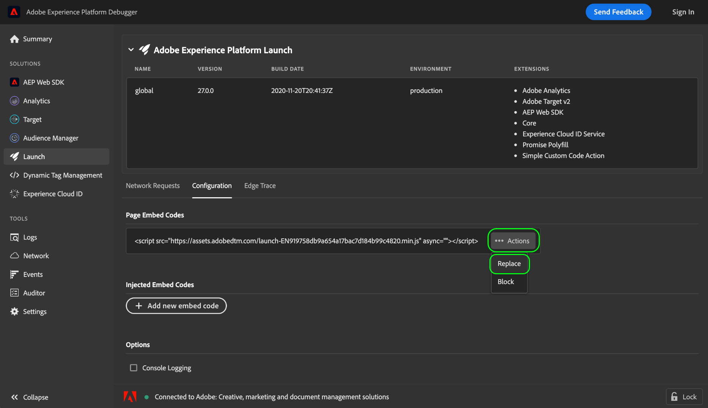

# Adobe Experience Platform Debugger を使用した埋め込みコードのテスト

>[!NOTE]
>
>Adobe Experience Platform Launch は、Adobe Experience Platform のデータ収集テクノロジースイートとしてリブランドされています。 その結果、製品ドキュメント全体でいくつかの用語の変更がロールアウトされました。 用語の変更点の一覧については、次の[ドキュメント](../../term-updates.md)を参照してください。

Adobe Experience Platform のタグライブラリビルドに変更を加える場合は、ビルドを実稼動環境にデプロイする前に、これらの変更をテストする必要があります。Web サイトに専用のステージングまたは開発環境がない場合は、Adobe Experience Platform Debugger を使用して、サイト内の様々な埋め込みコードをローカルでテストできます。

## 前提条件

このチュートリアルでは、タグの環境と埋め込みコードの使用に関する十分な知識が必要です。 「[環境の概要](./environments.md) 」で詳細情報を参照してください。

また、このチュートリアルでは、Platform Debugger ブラウザー拡張機能がインストールされている必要があります。 Platform Debugger は、クロムおよび Firefox ブラウザーでのみ使用できます。 チュートリアルを開始する前に、次のリンクのいずれかを使用して、拡張機能をインストールしてください。

* [クロム用 Platform Debugger](https://chrome.google.com/webstore/detail/adobe-experience-platform/bfnnokhpnncpkdmbokanobigaccjkpob)
* [Firefox 用 Platform Debugger](https://addons.mozilla.org/ja/firefox/addon/adobe-experience-platform-dbg/)

## Web サイトで Platform Debugger を開きます

選択したブラウザーを使用して、Web サイトに移動し、Platform Debugger 拡張機能を開きます。Platform Debugger が現在接続しているサイトが、ウィンドウの下部に表示されます。 タグが現在サイト上で実行中の場合は、「[!UICONTROL 概要]」タブに表示されます。

>[!NOTE]
>
>Platform Debugger が最初に接続しない場合は、Web サイトを表示しているブラウザータブをリロードしてから、再試行する必要がある場合があります。

## 埋め込みコードの置換

Platform Debugger がサイトに接続したら、左側のナビゲーションで「 **[!UICONTROL Launch]** 」を選択します。ここには、環境や関連する拡張機能など、現在サイトで実行されているライブラリビルドに関する情報が表示されます。 ここから「**[!UICONTROL 設定]**」を選択すると、埋め込みコードを管理するコントロールが表示されます。

「[!UICONTROL ページ埋め込みコード]」の下には、現在サイトで使用中の埋め込みコードが表示されます。埋め込みコードの右側で「**[!UICONTROL アクション]**」を選択してから、「**[!UICONTROL 置換]**」を選択します。

現在の埋め込みコードを置き換える埋め込みコードを指定するよう求めるポップオーバーが表示されます。 Platform Debugger を使用して埋め込みコードを置き換えても、サイトに導入されている埋め込みコードは変更されません。 代わりに、ローカルで実行されている埋め込みコードのみが置き換えられるので、実装のテストとデバッグを実行できます。

表示されたテキストボックスにテストする埋め込みコードをペーストし、「**[!UICONTROL 適用]**」を選択します。

「**[!UICONTROL 設定]**」タブが再表示され、ライブ埋め込みコードが指定したコードに置き換えられたことを示します。Web ブラウザーを使用して、テスト中の埋め込みコードが期待どおりに動作しているかどうかを確認できるようになりました。

## 次の手順

このチュートリアルでは、Platform Debugger を使用して、テスト用に埋め込みコードをローカルで切り替える方法を説明します。 各機能の詳細情報については、[Platform Debugger のドキュメント](../../../debugger/home.md) を参照してください。
