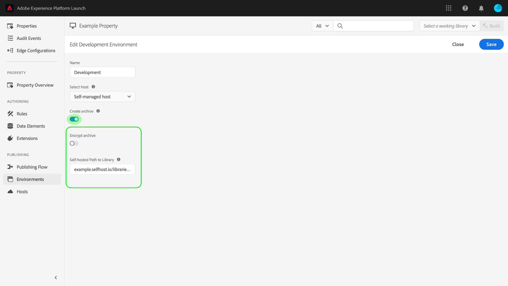

# 環境

>[!NOTE]
>
>Adobe Experience Platform Launchは、Adobe Experience Platformのデータ収集テクノロジーのスイートとしてリブランドされました。 その結果、製品ドキュメント全体でいくつかの用語の変更がロールアウトされました。用語の変更点の一覧については、次の[ドキュメント](../../term-updates.md)を参照してください。

タグ環境は、Web サイトまたはアプリケーションにデプロイするライブラリビルドの主要な側面をいくつか定義します。

* ビルドのファイル名です。
* 環境が割り当てたホストに応じた、ビルドのドメインとパス。
* 選択したアーカイブオプションに応じた、ビルドのファイル形式。

ライブラリビルドを作成する場合は、そのライブラリビルドを環境に割り当てる必要があります。ビルドの拡張機能、ルール、およびデータ要素がコンパイルされ、割り当てられた環境に配置されます。各環境は、割り当てられたビルドをサイトに統合できる、一意の埋め込みコードを提供します。

各環境には異なる アーティファクトが存在することがあります。これにより、ワークフローを通じてプッシュしながら、様々な環境で異なるライブラリをテストできます。

このドキュメントでは、データ収集ユーザーインターフェイスで異なる環境をインストール、設定、作成する手順を説明します。

## 環境タイプ

タグはそれぞれ、[パブリッシュワークフロー](./publishing-flow.md)の異なる状態に対応した、次の 3 種類の環境タイプをサポートします。

| 環境タイプ | 説明 |
| --- | --- |
| 開発 | この環境は、パブリッシュワークフローの「**開発** 」列に対応します。 |
| ステージング | この環境は、パブリッシュワークフローの「**送信済み** 」列と「**承認済み** 」列に対応します。 |
| 実稼動 | この環境は、パブリッシュワークフローの「**公開中のアイテム** 」列に対応します。 |

各環境には異なる アーティファクトが存在することがあります。これにより、パブリッシュワークフローを通じてプッシュしながら、様々な環境で異なるライブラリをテストできます。

>[!NOTE]
>
>各環境に割り当てることのできるライブラリビルドは、一度に 1 つのみです。ただし、パブリッシュワークフロー内を移動し、必要に応じて複数の環境間でビルドを再割り当てていくうちに、1 つの環境に様々なビルドが含まれることが予想されます。

## インストール

各環境には、アプリケーションに接続するための命令のセットがあります。Web プロパティの場合、これらの手順によって埋め込みコードが提供されます。モバイルプロパティの場合、これらの手順では、使用しているライブラリをインスタンス化し、実行時に設定を取得するために必要なコードを提供します。

>[!IMPORTANT]
>
>各環境タイプには、対応する独自のインストール手順があります。使用している環境に応じて、対応する埋め込みコードや依存関係が正しく使用されていることを確認する必要があります。
>
>例えば、Web プロパティの実稼動用埋め込みコードはブラウザーのキャッシュをサポートしますが、開発用埋め込みコードとステージング用埋め込みコードはこのキャッシュをサポートしません。したがって、高トラフィックまたは実稼動コンテキストでは、開発またはステージングの埋め込みコードを使用しないでください。

環境のインストール手順にアクセスするには、プロパティの「**[!UICONTROL 環境]**」タブに移動し、その環境の「**[!UICONTROL インストール]**」アイコンを選択します。

Web プロパティを使用する場合は、ドキュメントの `<head>` タグで使用する埋め込みコードが提供されます。実行時にライブラリファイルを同期的または非同期的にデプロイするオプションも用意されています。選択した設定によって、表示されるインストール手順が異なります。埋め込みコードの詳細については、このドキュメントで後述します。

モバイルプロパティを使用している場合は、Android 用（[Gradle](https://gradle.org/) 経由）と iOS 用（[CocoaPods](https://cocoapods.org/) 経由）の依存関係のインストールに関する説明が別々に表示されます。

## モバイル設定

モバイルプロパティの場合は、リストから選択して環境の設定オプションを表示できます。 ここから、環境の名前を変更できます。 モバイル環境は、現在、アドビ管理ホストのみを使用できます。

詳細情報については、[ホストの概要](./hosts/hosts-overview.md) を参照してください。

## Web 設定

割り当てられた環境の設定によって、Web プロパティに関する以下の設定が決まります。

* **ホスト**：ビルドをデプロイするサーバーの場所。
* **アーカイブ設定**：システムでデプロイ可能なファイルのセットを出力するか、アーカイブ形式で圧縮するかを指定します。
* **埋め込みコード**：Web サイトページの HTML 内に埋め込む `<script>` コード。実行時にライブラリビルドをデプロイするために使用します。

「[!UICONTROL 環境]」タブで、リストに表示された環境を選択して、設定コントロールを表示します。

### ホスト {#host}

「**[!UICONTROL ホスト]**」を選択して、ドロップダウンメニューから環境用の事前設定済みホストを選択します。

ビルドを作成すると、割り当てられたホストが指定した場所にそのビルドが配信されます。データ収集 UI でのホストの作成および設定方法について詳しくは、[ホストの概要](./hosts/hosts-overview.md)を参照してください。

### アーカイブ設定 {#archive}

ほとんどのビルドは複数のファイルで構成されています。マルチファイルビルドには、他のファイルへの内部参照を含むメインライブラリファイル（埋め込みコード内でリンクされている）が含まれ、必要に応じてプルされます。

「**[!UICONTROL アーカイブを作成]**」ボタンをクリックすると、環境のアーカイブ設定を切り替えることができます。デフォルトでは、アーカイブオプションはオフになり、ビルドはそのまま実行される形式（Web プロパティは JavaScript、モバイルプロパティは JSON）で配信されます。

アーカイブ設定を有効にすると、追加の設定が UI に表示され、アーカイブファイルをオプションで暗号化できます。自己ホスティングの場合はライブラリへのパスを定義できます。

パスには、完全 URL または複数ドメインで使用できる相対パスを指定できます。ほとんどのビルドには内部参照を含む複数のファイルがあるので、これは重要です。

アーカイブオプションを使用する場合、すべてのビルドファイルは、代わりに ZIP ファイルとして配信されます。これは、次の場合に便利です。

1. ライブラリを自己ホストしているが、SFTP ホストを配信用に設定したくない場合。
1. デプロイメントの前にビルドでコード分析を実行する必要がある場合。
1. ビルドの内容を見て何が含まれているかを確認したい場合。

### 埋め込みコード {#embed-code}

埋め込みコードは、作成したコードを読み込んで実行するために、Web サイトのページの `<head>` セクションに配置する必要がある `<script>` タグです。各環境の設定によって自動的に独自の埋め込みコードが生成されるので、このタグをコピーして、タグを実行するサイトのページに貼り付けるだけで済みます。

インストール手順を表示している際に、スクリプトでライブラリファイルを同期または非同期で読み込むように選択できます。この設定は永続的ではなく、実際にサイトでタグを実装した方法は反映していません。代わりに、環境をインストールする適切な方法を示すのみです。

>[!WARNING]
>
>タグライブラリの内容に応じ、同期デプロイメントと非同期デプロイメントとで、ルールや他の要素の動作が変わることがあります。したがって、変更を十分にテストすることが重要です。

#### 非同期デプロイメント

非同期デプロイメントを使用すると、ブラウザーでライブラリを取得しながら、ページの残り部分の読み込みを続行できます。この設定を使用する場合、埋め込みコードは 1 つだけです。埋め込みコードは `<head>` ドキュメントに配置する必要があります。

この設定について詳しくは、[非同期デプロイメント](../client-side/asynchronous-deployment.md)のガイドを参照してください。

#### 同期デプロイメント

ブラウザーは、同期デプロイメントを使用して埋め込みコードを読み取る際に、タグライブラリを取得および実行してから、ページの読み込みを続行します。

同期埋め込みコードは、Web サイトの HTML 内に配置する必要がある 2 つの `<script>` タグで構成されます。一方の `<script>` タグはドキュメント `<head>` 内、もう一方のタグは `</body>` 終了タグの直前に配置する必要があります。

#### 埋め込みコードの更新

埋め込みコードは環境の設定に基づいて生成されるので、設定の変更によっては、対象の環境の埋め込みコードが自動的に更新されます。次のような変更があります。

* アドビ管理ホストから SFTP ホストへの切り替え（またはその逆）。
* アーカイブ設定の変更。
* アーカイブ設定が有効な場合は、パスフィールドを更新します。

>[!WARNING]
>
>タグ環境の埋め込みコードが変更された場合 は、HTML の埋め込みコードを手動で更新する必要があります。コストのかかるメンテナンスを避けるため、埋め込みコードは必要な場合にのみ更新する必要があります。

## 環境の作成

プロパティが最初に作成されるときに、プロパティに対して 3 つの環境（開発、ステージング、実稼動）が自動的に割り当てられます。これは、パブリッシュワークフローを実行するのに十分です。ただし、必要に応じて開発環境を追加することもできます。複数の開発者が異なるプロジェクトで同時に作業を行う大きなチームに便利です。

プロパティの「[!UICONTROL 環境]」タブで、「**[!UICONTROL 環境を追加]**」を選択します。

次の画面で、「**[!UICONTROL 開発]**」オプションを選択します。

次の画面では、新しい環境に名前を付け、ホストを選択し、アーカイブ設定を選択できます。終了したら、「**[!UICONTROL 保存]**」を選択して環境を作成します。

「 [!UICONTROL 環境]」タブが再表示され、新しい環境のインストール手順が表示されます。

## 次の手順

このドキュメントでは、UI で環境を設定し、Web サイトやアプリにインストールする際の操作について説明します。これで、ライブラリビルドの公開を開始する準備が整いました。

ライブラリの繰り返しを徐々に公開すると、トラブルシューティングおよびロールバック目的で、以前のビルドの追跡やアーカイブが必要になる場合があります。詳しくは、[古いライブラリの再公開](./republish.md)に関するガイドを参照してください。
