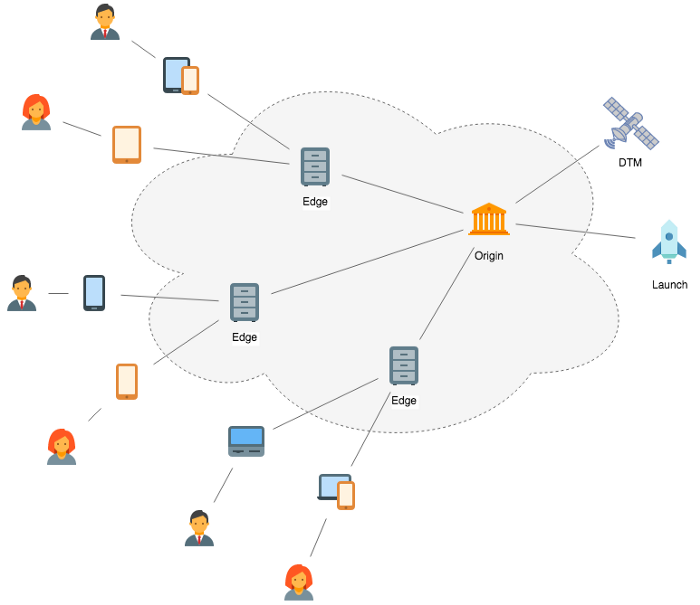

# アドビが管理するホストの概要

>[!NOTE]
>
>Adobe Experience Platform Launchは、Adobe Experience Platformのデータ収集テクノロジーのスイートとしてリブランドされました。 その結果、製品ドキュメント全体でいくつかの用語の変更がロールアウトされました。 用語の変更点の一覧については、次の[ドキュメント](../../../term-updates.md)を参照してください。

Adobeが管理するホストは、Adobe Experience Platformにタグライブラリビルドを導入するためのデフォルトのホスト設定です。 データ収集ユーザーインターフェイスを使用して新しいプロパティを作成すると、デフォルトのAdobe管理ホストが作成されます。

アドビが管理するホストを使用している場合、ライブラリビルドは、アドビが契約しているサードパーティのコンテンツ配信ネットワーク（CDN）へと配信されます。これらの CDN はアドビとは独立して動作するので、Platform がメンテナンス中や他の理由で停止している場合でも、デプロイ済みのコードは、サイトやアプリケーションで引き続き通常どおりに機能します。アドビが管理するホスト用の埋め込みコードは CDN 上のメインライブラリファイルを参照するので、クライアントデバイスは実行時にファイルを取得できます。

このドキュメントでは、PlatformでAdobeが管理するホストの概要と、UIで新しくAdobeが管理するホストを作成する手順を説明します。

## Akamai

現在、アドビの主な CDN プロバイダーは [Akamai](https://www.akamai.com/jp) です。Akamai の堅牢な CDN は、世界中にいる、Web 訪問者の大量のオーディエンスへと、コンテンツを提供するように設計されています。CDN は、負荷を分散し、地域を最適化したノードの冗長構成ネットワークを実行し、世界中の訪問者に対して可能な限り迅速にコンテンツを提供します。

特に、87 か国で 13 万 7,000 台を超えるサーバーを 1,150 以上のネットワークで運用しています。冗長性に関しては、CDNは、あるサーバーから別のサーバーへとルーティングするだけでなく、必要に応じて、あるサーバーのノードから別のサーバーのノードへルーティングすることもできます。 つまり、各ノードは複数のサーバーで構成されているので、1 台のサーバーがダウンしても、同じノード上の他のサーバーが引き継ぐことができ、問題になることはありません。

ノード全体がダウンした場合、Akamaiは、同じキャッシュコンテンツを持つ、最も近い次のノードからサービスを提供します。 ノードは、訪問者の場所、トラフィックの負荷、その他の要因に基づいて動的に選択されるので、コンテンツは、常に訪問者に応じて最も近い最適なノードから提供されます。

Akamai でホストされているファイルには、ドメイン（`assets.adobedtm.com`）があります。これは、埋め込み `<script>` コード内での呼び出し方法に基づいて、安全な方法またはそうでない方法（`http://` または `https://`）で参照できます。

>[!WARNING]
>
>Akamai ネットワークからライブラリを使用できない場合、Platform は、Akamai ネットワークが原因で発生する可能性のあるエラーを防ぐことができません。

## ライブラリビルドのキャッシュ

アドビが管理するホストを使用する場合、ライブラリビルドは次の 2 つの場所にキャッシュされます。

* [エッジキャッシュ](#edge)
* [ブラウザーのキャッシュ](#browser)

### エッジキャッシュ {#edge}

CDNの主な目的は、エンドユーザーに近いサーバーにコンテンツをインテリジェントに配信し、クライアントデバイスでコンテンツをより迅速に取得できるようにすることです。 CDN は、世界中に分散したサーバー（「エッジノード」）でコンテンツのコピーを利用できるようにすることで、これを実現します。

アドビが管理するホストにビルドがデプロイされると、CDN は複数の中央サーバー（「接触チャネル」）にビルドを配布し、次に世界中の様々なエッジノードにビルドのコピーを送信してキャッシュをおこないます。これらのエッジノードに格納されている、キャッシュされたバージョンのビルドは、最終的にはクライアントデバイスに提供されます。

>[!NOTE]
>
>アドビが管理するホストの場合、新しい環境に対して最初に公開されたライブラリがグローバル CDN に反映されるまでに最大 5 分かかる場合があります。

エッジノードが特定のファイル（ライブラリビルドなど）に対するリクエストを受け取ると、ノードはまずファイルの有効期間(TTL)値を確認します。 TTL の期限が切れていない場合、エッジノードはキャッシュされているバージョンとしての役割を果たします。TTL の期限が切れると、エッジノードは最も近い接触チャネルからの新しいコピーをリクエストし、その更新されたコピーに対応してから、新しい TTL を使用して更新されたコピーをキャッシュします。

>[!NOTE]
>
>エッジノードのキャッシュに加えて、会社ネットワークやモバイルネットワークなどの中間ネットワークが独自のキャッシュを実行する場合もあります。ビルドが期待どおりにキャッシュされない場合、これらのネットワークが根本原因の可能性があります。

#### エッジキャッシュの無効化 {#invalidation}

新しいライブラリビルドをアップロードすると、適用可能なすべてのエッジノード上のキャッシュが無効化されます。 つまり、新しいコピーをいつ取得したかに関係なく、各ノードはキャッシュされたバージョンを無効と見なします。 次にエッジノードがそのファイルに対するリクエストを受け取ると、そのノードは接触チャネルから新しいコピーを取得します。

Akamaiには、互いにファイルをレプリケートする複数のオリジンサーバーがあり、どのオリジンが最初にファイルを受信したかを知る方法がないので、これらのノードリクエストは最新バージョンを持たないオリジンにヒットする可能性があります。 その後、古いバージョンを再びキャッシュします。 この問題が発生しないように、新しいビルドごとに、次の間隔で複数のキャッシュの無効化が実行されます。

* アップロード直後
* アップロードの 5 分後
* アップロードの 60 分後

このようにキャッシュの無効化をずらすことで、接触チャネルサーバーグループは、ファイルの最新バージョンを互いに複製する時間を確保し、全員がファイルの取得時点の最新バージョンを持つようにすることができます。

### ブラウザーのキャッシュ {#browser}

ライブラリビルドも、`cache-control` HTTP ヘッダーを使用してブラウザー上にキャッシュされます。アドビが管理するホストを使用する場合、API 応答で返されるヘッダーを制御できないので、キャッシュに対するアドビのデフォルトが使用されます。つまり、アドビが管理するホストにカスタムヘッダーを使用することはできません。カスタムの `cache-control` ヘッダーが必要な場合は、[自己ホスト](self-hosting-libraries.md)を検討する必要がある場合があります。

ブラウザーキャッシュライブラリビルドの有効期間(TTL)（`cache-control`ヘッダーによって決まります）は、使用しているタグ環境によって異なります。

| 環境 | `cache-control` の値 |
| --- | --- |
| 開発 | `max-age=0, no-cache, no-store` |
| ステージング | `max-age=0, no-cache, no-store` |
| 実稼動 | `max-age=3600` |

上のテーブルが示すように、ブラウザーのキャッシュは開発環境およびステージング環境ではサポートされていません。したがって、高トラフィックまたは実稼動コンテキストでは、開発またはステージングの埋め込みコードを使用しないでください。

キャッシュ制御ヘッダーは、メインライブラリビルドにのみ適用されます。 メインライブラリの下のサブリソースは常に新しいサブリソースと見なされるので、ブラウザー上でキャッシュする必要はありません。

## データ収集UIでのAdobe管理ホスティングの使用

[データ収集UI](https://experience.adobe.com/#/data-collection/)でプロパティを初めて作成すると、Adobe管理ホストが自動的に作成されます。 すぐに使用可能なプロパティを持つ使用可能な環境も、デフォルトでAdobe管理ホストに割り当てられます。

>[!NOTE]
>
>すべての環境からデフォルトのアドビが管理するホストの割り当てが解除されている場合は、そのホストを削除できます。この後、アドビが管理するホストに戻すには、次の手順で新しいホストを作成できます。
>
>1. プロパティの「**[!UICONTROL ホスト]**」タブを選択し、「**[!UICONTROL ホストを追加]**」を選択します。
>1. ホストの名前を指定し、ホストのタイプとして「**[!UICONTROL アドビによる管理]**」を選択してから、「 **[!UICONTROL 保存]**」を選択します。

>
>
その後、必要に応じて、アドビが管理するホストに環境を再割り当てできます。

## 次の手順

このドキュメントでは、Adobe Experience PlatformのタグライブラリのAdobe管理ホスティングの概要を説明しました。 その他のホスティングオプションについて詳しくは、次のドキュメントを参照してください。

* [SFTP ホスティング](./sftp-host.md)
* [自己ホスト型ライブラリ](./self-hosting-libraries.md)

お使いの環境のホストを管理する方法について詳しくは、『[環境ガイド](../environments.md)』を参照してください。
