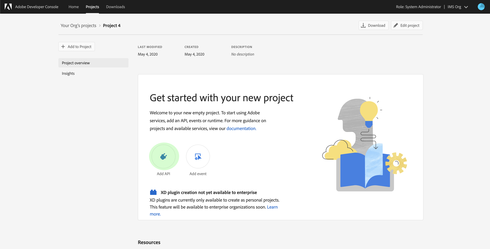

# Authenticate and access [!DNL Experience Platform] APIs

This document provides a step-by-step tutorial for gaining access to an Adobe Experience Platform developer account in order to make calls to [!DNL Experience Platform] APIs.

## API を呼び出すための認証

アプリケーションとユーザーのセキュリティを維持するには、Adobe I/O API へのすべてのリクエストが、OAuth や JSON Web Tokens（JWT）などの標準を使用して認証され、承認される必要があります。次に、JWTをクライアント固有の情報と共に使用して個人アクセストークンを生成します。

このチュートリアルでは、次のフローチャートに概要が示されているアクセストークンの作成による認証の手順について説明します。


## 前提条件

In order to successfully make calls to [!DNL Experience Platform] APIs, you require the following:

* Adobe Experience Platform へのアクセス権を持つ IMS 組織
* 登録済みの Adobe ID アカウント
* ユーザーを製品の&#x200B;**開発者**&#x200B;および&#x200B;**ユーザー**&#x200B;として追加できる Admin Console 管理者です。

次の節では、Adobe ID を作成し、組織の開発者およびユーザーになる手順について説明します。

### Adobe ID の作成

Adobe ID をお持ちでない場合は、次の手順で作成できます。

1. [ [Adobe開発者コンソール]に移動します。](https://console.adobe.io)
2. 「**[!UICONTROL 新規アカウントを作成]**」をクリックします
3. サインアッププロセスの完了

## Become a developer and user for [!DNL Experience Platform] for an organization

Adobe I/O で統合を作成する前に、IMS 組織の製品の開発者権限を持つアカウントが必要です。Admin Console の開発者アカウントに関する詳しい情報については、開発者管理用の[サポートドキュメント](https://helpx.adobe.com/jp/enterprise/using/manage-developers.html)を参照してください。

**開発者アクセスの獲得**

Contact an [!DNL Admin Console] administrator in your Organization to add you as a developer for one of your Organization&#39;s products using the [[!DNL Admin Console]](https://adminconsole.adobe.com/).


先に進むには、管理者が開発者を 1 つ以上の製品プロファイルに割り当てる必要があります。


開発者として割り当てられると、[Adobe I/O](https://www.adobe.com/go/devs_console_ui) 上で統合を作成するためのアクセス権が与えられます。これらの統合は、外部のアプリケーションやサービスから Adobe API へのパイプラインです。

**ユーザーアクセスの取得**

Your [!DNL Admin Console] administrator must also add you to the product as a user.


開発者を追加するプロセスと同様に、先に進むには、管理者が少なくとも 1 つの製品プロファイルを割り当てる必要があります。


## Adobeデベロッパーコンソールでのアクセス資格情報の生成

>[!NOTE]
>
>『 [Privacy Service開発者ガイド](../privacy-service/api/getting-started.md)』からこのドキュメントをフォローしている場合は、このガイドに戻って、に固有のアクセス資格情報を生成でき [!DNL Privacy Service]ます。

AdobeDeveloper Consoleを使用して、次の3つのアクセス資格情報を生成する必要があります。

* `{IMS_ORG}`
* `{API_KEY}`
* `{ACCESS_TOKEN}`

およ `{IMS_ORG}` びは1回だけ生成する必要があり、今後の `{API_KEY}`[!DNL Platform] API呼び出しで再利用できます。 ただし、一時的な `{ACCESS_TOKEN}` ので、24時間ごとに再生成する必要があります。

手順の詳細は以下のとおりです。

### 1回限りのセットアップ

[Adobeデベロッパーコンソールに移動し](https://www.adobe.com/go/devs_console_ui) 、Adobe IDでサインインします。 次に、Adobe開発者コンソールのドキュメントで、空のプロジェクトの [作成に関するチュートリアルに説明されている手順に従います](https://www.adobe.io/apis/experienceplatform/console/docs.html#!AdobeDocs/adobeio-console/master/projects-empty.md) 。

新しいプロジェクトを作成したら、プ **[!UICONTROL ロジェクト概要]** 画面の「 **API** 」をクリックします。



API **** 追加画面が表示されます。 Adobe Experience Platformの製品アイコンをクリックし、「 **[!UICONTROL Experience PlatformAPI]** 」を選択してから「 **[!UICONTROL 次へ]**」をクリックします。


プロジェクトに追加するAPI [!DNL Experience Platform] を選択したら、サービスアカウント(JWT)を使用したプロジェクトへのAPIの [](https://www.adobe.io/apis/experienceplatform/console/docs.html#!AdobeDocs/adobeio-console/master/services-add-api-jwt.md) 追加（「APIを設定」の手順から開始）のチュートリアルに示されている手順に従って、プロセスを完了します。

APIがプロジェクトに追加されると、 **プロジェクトの概要** ページに、すべてのAPI呼び出しで必要な次の資格情報が表示され [!DNL Experience Platform] ます。

* `{API_KEY}` (クライアント ID)
* `{IMS_ORG}` (Organization ID)


### 各セッションの認証

最後に必要な秘密鍵証明書は、収集する必要がある秘密鍵証明書 `{ACCESS_TOKEN}`です。 との値とは異なり、APIを使用し続け `{API_KEY}` るに `{IMS_ORG}`は、新しいトークンを24時間ごとに生成する必要があり [!DNL Platform] ます。

新しいトークンを生成するに `{ACCESS_TOKEN}`は、『Developer Console credentials』ガイドのJWTトークンを [生成する手順に従います](https://www.adobe.io/apis/experienceplatform/console/docs.html#!AdobeDocs/adobeio-console/master/credentials.md) 。

## アクセス資格情報のテスト

3つの必要な資格情報をすべて収集したら、以下のAPI呼び出しを行うことができます。 この呼び出しは、スキーマレジストリの [!DNL Experience Data Model]`global` コンテナ内のすべての(XDM)クラスをリストします。

**API 形式**

```http
GET /global/classes
```

**リクエスト**

```SHELL
curl -X GET https://platform.adobe.io/data/foundation/schemaregistry/global/classes \
  -H 'Accept: application/vnd.adobe.xed-id+json' \
  -H 'Authorization: Bearer {ACCESS_TOKEN}' \
  -H 'x-api-key: {API_KEY}' \
  -H 'x-gw-ims-org-id: {IMS_ORG}'
```

**応答** 

応答が以下に示す応答と類似している場合は、資格情報が有効で、機能しています。 （スペース節約のために応答は部分的に表示されています。）

```JSON
{
  "results": [
    {
        "title": "XDM ExperienceEvent",
        "$id": "https://ns.adobe.com/xdm/context/experienceevent",
        "meta:altId": "_xdm.context.experienceevent",
        "version": "1"
    },
    {
        "title": "XDM Individual Profile",
        "$id": "https://ns.adobe.com/xdm/context/profile",
        "meta:altId": "_xdm.context.profile",
        "version": "1"
    }
  ]
}
```

## JWT 認証および API 呼び出しでの Postman の使用

[Postman](https://www.postman.com/) は、RESTful API を使用するための一般的なツールです。この [Medium post](https://medium.com/adobetech/using-postman-for-jwt-authentication-on-adobe-i-o-7573428ffe7f) では 、JWT 認証を自動的に実行し、それを使用して Adobe Experience Platform API を使用するように Postman を設定する方法について説明します。

## 次の手順

このドキュメントを読むと、APIのアクセス資格情報を収集し、テストに成功し [!DNL Platform] ます。 ドキュメント全体で提供されているAPI呼び出しの例に従うことができ [ます](../landing/documentation/overview.md)。

このチュートリアルで収集した認証値に加えて、多くのAPIでは、有効な認証値をヘッダーとして指定す [!DNL Platform]`{SANDBOX_NAME}` る必要もあります。 詳しくは、「[サンドボックスの概要](../sandboxes/home.md)」を参照してください。