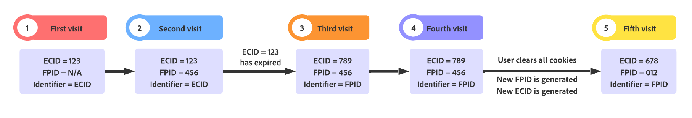

# Web SDKでのファーストパーティデバイス ID の使用

Adobe Experience Platform Web SDKは、[Adobe Experience Cloud ID （ECID） ](https://experienceleague.adobe.com/docs/experience-platform/identity/ecid.html?lang=ja) を cookie を使用して web サイトの訪問者に割り当て、ユーザーの行動を追跡します。 cookie の有効期間に関するブラウザーの制限に対応するために、ファーストパーティデバイス ID （FPID）と呼ばれる独自のデバイス識別子を設定および管理できます。

>[!NOTE]
>
>ファーストパーティデバイス ID のサポートは、Web SDKからExperience Platform Edge Networkにデータを送信する場合にのみ使用できます。

>[!IMPORTANT]
>
>ファーストパーティデバイス ID は Web SDKの [ サードパーティ cookie](../../tags/extensions/client/web-sdk/web-sdk-extension-configuration.md#identity) 機能と互換性がありません。 ファーストパーティデバイス ID またはサードパーティ Cookie のいずれかを使用できますが、両方を同時に使用することはできません。

## 前提条件 {#prerequisites}

開始する前に、ECID や `identityMap` など、web SDKでの ID データの仕組みに精通していることを確認してください。 詳しくは、[Web SDKの ID データ ](./overview.md) に関する概要を参照してください。

## ファーストパーティデバイス ID のフォーマット要件 {#formatting-requirements}

Edge Networkは、[UUIDv4 形式 ](https://datatracker.ietf.org/doc/html/rfc4122) に準拠する ID のみを受け付けます。 UUIDv4 形式でないデバイス ID は拒否されます。

* [!DNL UUIDs] はユニークでランダムであり、衝突の可能性はごくわずかです。
* IP アドレスやその他の個人を特定できる情報（PII）を使用して [!DNL UUIDv4] ーザーをシードすることはできません。
* [!DNL UUIDs] を生成するライブラリは、すべてのプログラミング言語で使用できます。

## 独自のサーバーを使用した [!DNL FPID] cookie の設定 {#set-cookie-server}

独自のサーバーを通じて cookie を設定する場合、様々な方法を使用して、ブラウザーポリシーによる cookie の制限を防ぐことができます。

* サーバーサイドスクリプティング言語を使用した cookie の生成
* サイトのサブドメインまたは他のエンドポイントに対する API リクエストに応答して cookie を設定します
* [!DNL CMS] を使用した cookie の生成
* [!DNL CDN] を使用した cookie の生成

さらに、常にドメインの `A` レコードの下に FPID cookie を設定する必要があります。

>[!IMPORTANT]
>
>JavaScriptの `document.cookie` メソッドを使用して設定された Cookie は、cookie の期間を制限するブラウザーポリシーからほとんど保護されなくなります。

### cookie を設定するタイミング {#when-to-set-cookie}

Edge Networkにリクエストを送信する前に、[!DNL FPID] Cookie を設定することをお勧めします。 ただし、それが不可能なシナリオでは、引き続き既存のメソッドを使用して [!DNL ECID] が生成され、cookie が存在する限り、プライマリ識別子として機能します。

最終的に [!DNL ECID] がブラウザー削除ポリシーの影響を受けたが、[!DNL FPID] がそうでない場合、[!DNL FPID] は次の訪問でプライマリ識別子となり、以降の各訪問で [!DNL ECID] をシードするために使用されます。

### cookie の有効期限の設定 {#set-expiration}

cookie の有効期限の設定は、[!DNL FPID] 機能を実装する際に慎重に考慮する必要があります。 これを決定する際には、組織が事業を行う国や地域と、それぞれの地域の法律や政策を考慮する必要があります。

この決定の一環として、会社全体の Cookie 設定ポリシーを採用するか、事業を行うロケールごとにユーザーに応じて異なるポリシーを採用する場合があります。

Cookie の初回有効期限に選択した設定に関係なく、サイトへの新しい訪問が発生するたびに cookie の有効期限を拡張するロジックを含める必要があります。

## cookie フラグの影響 {#cookie-flag-impact}

様々なブラウザー間での cookie の処理方法に影響する様々な cookie フラグがあります。

* [&#39;HTTPOnly&#39;](#http-only)
* [&#39;セキュア&#39;](#secure)
* [&#39;SameSite&#39;](#same-site)

### `HTTPOnly` {#http-only}

`HTTPOnly` フラグを使用して設定された Cookie には、クライアントサイドスクリプトを使用してアクセスできません。 つまり、[!DNL FPID] を設定する際に `HTTPOnly` フラグを設定する場合、`identityMap` に含める cookie の値を読み取るために、サーバーサイドのスクリプト言語を使用する必要があります。

Edge Networkに [!DNL FPID] cookie の値を読み取らせることを選択した場合、`HTTPOnly` フラグを設定することで、クライアントサイドスクリプトから値にアクセスできなくなりますが、Edge Networkの cookie 読み取り機能に悪影響を与えることはありません。

>[!NOTE]
>
>`HTTPOnly` フラグを使用しても、cookie の有効期間を制限する可能性のある cookie ポリシーには影響しません。 ただし、[!DNL FPID] の値を設定して読み取る際には、引き続き考慮する必要があります。

### `Secure` {#secure}

`Secure` 属性で設定された cookie は、[!DNL HTTPS] プロトコルで暗号化されたリクエストと共にのみサーバーに送信されます。 このフラグを使用すると、MAN-IN-THE-MIDDLE 攻撃者が cookie の値に容易にアクセスできないようにすることができます。 可能であれば、常に `Secure` フラグを設定することをお勧めします。

### `SameSite` {#same-site}

`SameSite` 属性を使用すると、サーバーはクロスサイトリクエストで cookie が送信されるかどうかを決定できます。 この属性は、クロスサイト偽造攻撃に対する保護を提供します。 `Strict`、`Lax`、`None` の 3 つの値が存在する可能性があります。 社内チームに問い合わせて、組織に適した設定を決定してください。

`SameSite` 属性が指定されていない場合、一部のブラウザーのデフォルト設定は `SameSite=Lax` になりました。

## ID 階層 {#id-hierarchy}

[!DNL ECID] と [!DNL FPID] の両方が存在する場合、ユーザーの識別では [!DNL ECID] が優先されます。 これにより、既存の [!DNL ECID] がブラウザーの cookie ストアに存在する場合、その ID がプライマリ識別子のままとなり、既存の訪問者数が影響を受けるリスクがなくなります。 既存のユーザーの場合、[!DNL FPID] の有効期限が切れるか、ブラウザーポリシーまたは手動プロセスの結果として削除されるまで、[!DNL ECID] はプライマリ ID になりません。

ID の優先順位は次の順序で設定されます。

1. `identityMap` に含まれる [!DNL ECID]
1. cookie に保存された [!DNL ECID]
1. `identityMap` に含まれる [!DNL FPID]
1. cookie に保存された [!DNL FPID]


## ファーストパーティデバイス ID への移行 {#migrating-to-fpid}

以前の実装からファーストパーティデバイス ID に移行している場合は、移行がどのように見えるかを低レベルで視覚化するのが難しい可能性があります。

このプロセスを説明するために、以前にサイトを訪問した顧客が関与するシナリオや、[!DNL FPID] 移行がAdobe ソリューションでその顧客を特定する方法にどのような影響を与えるかを考えてみましょう。



>[!IMPORTANT]
>
>`ECID` cookie は常に `FPID` よりも優先されます。

| 訪問 | 説明 |
| --- | --- |
| 初回訪問 | [!DNL FPID] cookie の設定をまだ開始していないとします。 [AMCV cookie](https://experienceleague.adobe.com/docs/id-service/using/intro/cookies.html#section-c55af54828dc4cce89f6118655d694c8) に含まれる [!DNL ECID] は、訪問者の識別に使用される識別子になります。 |
| 2 回目の訪問 | [!DNL FPID] ソリューションのロールアウトが開始されました。 既存の [!DNL ECID] は引き続き存在し、訪問者を識別するためのプライマリ識別子として残ります。 |
| 3 回目の訪問 | 2 回目と 3 回目の訪問の間に、ブラウザーポリシーが原因で [!DNL ECID] が削除されるまでに十分な時間が経過しました。 ただし、[!DNL FPID] は [!DNL DNS] [!DNL A] レコードを使用して設定されているので、[!DNL FPID] は保持されます。 [!DNL FPID] はプライマリ ID と見なされ、エンドユーザーデバイスに書き込まれる [!DNL ECID] のシード処理に使用されるようになりました。 これで、このユーザーはAdobe Experience PlatformおよびExperience Cloud ソリューションの新規訪問者と見なされます。 |
| 4 回目の訪問 | 3 回目と 4 回目の訪問の間に、ブラウザーポリシーが原因で [!DNL ECID] が削除されるまでに十分な時間が経過しました。 前回の訪問同様、[!DNL FPID] の設定の仕方が原因で残っています。 今回は、前回の訪問と同じ [!DNL ECID] が生成されます。 Experience PlatformおよびExperience Cloud ソリューション全体で、前回の訪問と同じユーザーとして表示されます。 |
| 5 回目の訪問 | 4 回目と 5 回目の訪問の間に、エンドユーザーはブラウザー内のすべての Cookie をクリアしました。 新しい [!DNL FPID] が生成され、新しい [!DNL ECID] の作成をシードするために使用されます。 これで、このユーザーはAdobe Experience PlatformおよびExperience Cloud ソリューションの新規訪問者と見なされます。 |

{style="table-layout:auto"}

## ファーストパーティデバイス ID （FPID）の使用 {#using-fpid}

ファーストパーティデバイス ID （[!DNL FPIDs]）は、ファーストパーティ cookie を使用して訪問者を追跡します。 ファーストパーティ cookie は、DNS [!DNL CNAME] または [!DNL JavaScript] コードとは異なり、DNS [A レコード ](https://datatracker.ietf.org/doc/html/rfc1035) （IPv4 の場合）または [AAAA レコード ](https://datatracker.ietf.org/doc/html/rfc3596) （IPv6 の場合）を使用するサーバーを使用して設定する場合に最も効果的です。

>[!IMPORTANT]
>
>[!DNL A] または [!DNL AAAA] レコードは、cookie の設定とトラッキングでのみサポートされています。 データ収集の主な方法は、[!DNL DNS CNAME] を使用することです。 [!DNL FPIDs] は、[!DNL A] または [!DNL AAAA] レコードを使用して設定され、[!DNL CNAME] を使用してAdobeに送信されます。
>
>[Adobe管理証明書プログラム ](https://experienceleague.adobe.com/docs/core-services/interface/administration/ec-cookies/cookies-first-party.html#adobe-managed-certificate-program) は、ファーストパーティのデータ収集でもサポートされています。

[!DNL FPID] cookie が設定されると、その値を取得し、イベントデータが収集されたときにAdobeに送信できます。 収集された [!DNL FPIDs] は、Adobe Experience Cloud アプリケーションの主要識別子である [!DNL ECIDs] を生成するために使用されます。

[!DNL FPIDs] は 2 つの方法で使用できます。

* **[方法 1](#setting-cookie-datastreams)**:web SDK呼び出しの [!DNL CNAME] を設定し、データストリーム設定に [!DNL FPID] cookie の名前を含めます。
* **[方法 2](#identityMap)**:ID マップに [!DNL FPID] を含めます。 詳しくは、このドキュメントの下部にある [`identityMap`](#identityMap) での FPID の使用」の節を参照してください。

### 方法 1:Web SDK呼び出しの CNAME を設定し、データストリームにファーストパーティ ID Cookie を設定する {#setting-cookie-datastreams}

独自ドメインから [!DNL FPID] cookie を設定するには、web SDK呼び出しに独自の [!DNL CNAME] （正規名）を設定し、データストリーム設定で [!DNL First Party ID Cookie] 機能を有効にする必要があります。

**手順 1. Web SDK デプロイメントドメインの CNAME を設定し** す。

DNS の [!DNL CNAME] レコードを使用すると、あるドメイン名から別のドメイン名にエイリアスを作成できます。 これにより、サードパーティのサービスを自分のドメインの一部であるかのように表示できるので、サードパーティの Cookie をファーストパーティの Cookie のように見せることができます。

**例**

Web SDKを Web サイト `mywebsite.com` ージに実装する場合を考えてみましょう。 Web SDKは、データをEdge Networkに `edge.adobedc.net` ドメインに送信します。

| [!DNL CNAME] なし | （[!DNL CNAME] を使用） |
|---------|----------|
| <ul><li>Web サイト `mywebsite.com` は、Web SDK ドメイン `edge.adobedc.net` を使用してEdge Networkにデータを送信します。</li><li>`edge.adobedc.net` で設定された Cookie は、`mywebsite.com` ドメインから取得されたものではないので、サードパーティ Cookie と見なされます。 お使いのブラウザーによっては、サードパーティ Cookie がブロックされ、お客様のデータがEdge Networkに到達しない場合があります。</li></ul> | <ul><li>`metrics.mywebsite.com` など、web SDKをデプロイするサブドメインを作成します。</li><li>`metrics.mywebsite.com` が `edge.adobedc.net` を指すように、DNS システムで [!DNL CNAME] レコードを設定します。</li><li>Web サイトで `metrics.mywebsite.com` を通じて cookie が設定されると、ブラウザーには、`edge.adobedc.net` （サードパーティ）ではなく `mywebsite.com` （ファーストパーティ）から取得されたように見えます。 これにより、ファーストパーティ ID cookie がブロックされにくくなり、より正確なデータ収集が可能になります。</li></ul> |

[!DNL CNAME] を使用してファーストパーティデータ収集が有効になっている場合、データ収集エンドポイントに対するリクエストにより、ドメインのすべての cookie が送信されます。

この機能を使用するには、特定のサブドメインではなく、ドメインの最上位レベルで [!DNL FPID] cookie を設定する必要があります。 サブドメインで設定すると、cookie の値はEdge Networkに送信されず、[!DNL FPID] のソリューションは意図したとおりに動作しません。

>[!IMPORTANT]
>
>この機能を使用するには、[ ファーストパーティデータ収集 ](https://experienceleague.adobe.com/docs/core-services/interface/administration/ec-cookies/cookies-first-party.html?lang=en) を有効にしておく必要があります。

**手順 2. データストリームの**[!UICONTROL  ファーストパーティ ID Cookie ]**機能を有効にする**

CNAME を設定したら、データストリームで「**[!UICONTROL ファーストパーティ ID Cookie]**」オプションを有効にする必要があります。 この設定は、ファーストパーティデバイス ID を参照する際に、この値を [ID マップ ](#identityMap) で参照するのではなく、指定された Cookie を参照するようにEdge Networkに指示します。

データストリームの設定方法については、[ データストリーム設定ドキュメント ](../../datastreams/configure.md#advanced-options) を参照してください。

Adobe Experience Cloudとの連携方法について詳しくは、[ ファーストパーティ cookie](https://experienceleague.adobe.com/docs/core-services/interface/administration/ec-cookies/cookies-first-party.html?lang=ja) に関するドキュメントを参照してください。


この設定を有効にする場合、[!DNL FPID] が保存されていると期待される Cookie の名前を指定する必要があります。

>[!NOTE]
>
>ファーストパーティ ID を使用する場合、サードパーティ ID の同期を実行することはできません。 サードパーティの ID 同期は、[!DNL Visitor ID] サービスと、そのサービスによって生成される `UUID` に依存します。 ファーストパーティ ID 機能を使用する場合、[!DNL Visitor ID] サービスを使用せずに [!DNL ECID] が生成されるので、サードパーティ ID の同期が不可能になります。
><br> ファーストパーティ ID を使用する場合、Audience Managerのパートナー ID 同期が主に `UUIDs` または `DIDs` に基づいていることを考慮すると、[Audience Manager](https://experienceleague.adobe.com/en/docs/audience-manager) の、パートナープラットフォームでのアクティベーション向けの機能はサポートされません。 ファーストパーティ ID から派生する [!DNL ECID] は、`UUID` にリンクされていないので、アドレス指定できません。

## 方法 2:`identityMap` での FPID の使用 {#identityMap}

[!DNL FPID] を独自の cookie に保存する代わりに、ID マップを通じてEdge Networkに [!DNL FPID] を送信することもできます。

`identityMap` で [!DNL FPID] を設定する方法の例を以下に示します。

```json
{
  "identityMap": {
    "FPID": [
      {
        "id": "123e4567-e89b-42d3-9456-426614174000",
        "authenticatedState": "ambiguous",
        "primary": true
      }
    ]
  }
}
```

他の ID タイプと同様に、`identityMap` 内の他の ID と共に [!DNL FPID] を含めることができます。 次に、認証済み [!DNL CRM ID] に含まれる [!DNL FPID] の例を示します。

```json
{
  "identityMap": {
    "FPID": [
      {
        "id": "123e4567-e89b-42d3-9456-426614174000",
        "authenticatedState": "ambiguous",
        "primary": false
      }
    ],
    "EMAIL": [
      {
        "id": "email@mail.com",
        "authenticatedState": "authenticated",
        "primary": true
      }
    ]
  }
}
```

ファーストパーティデータ収集が有効な場合にEdge Networkによって読み取られる Cookie に [!DNL FPID] が含まれている場合は、認証済みの [!DNL CRM ID] のみを取得する必要があります。

```json
{
  "identityMap": {
    "EMAIL": [
      {
        "id": "email@mail.com",
        "authenticatedState": "authenticated",
        "primary": true
      }
    ]
  }
}
```

[!DNL FPID] の `primary` インジケーターがないため、次の `identityMap` ではEdge Networkからエラー応答が返されます。 最後に、`identityMap` に存在する ID のうち 1 つを `primary` としてマークする必要があります。

```json
{
  "identityMap": {
    "FPID": [
      {
        "id": "123e4567-e89b-12d3-a456-426614174000",
        "authenticatedState": "ambiguous"
      }
    ],
    "EMAIL": [
      {
        "id": "email@mail.com",
        "authenticatedState": "authenticated"
      }
    ]
  }
}
```

この場合、Edge Networkから返されるエラー応答は次のようになります。

```json
{
    "type": "https://ns.adobe.com/aep/errors/EXEG-0306-400",
    "status": 400,
    "title": "No primary identity set in request (event)",
    "detail": "No primary identity found in the input event. Update the request accordingly to your schema and try again.",
    "report": {
        "requestId": "{REQUEST_ID}",
        "configId": "{CONFIG_ID}",
        "orgId": "{ORG_ID}"
    }
}
```

## FAQ {#faq}

以下は、ファーストパーティデバイス ID に関するよくある質問への回答のリストです。

### 単に ID を生成することと ID のシード処理はどのように異なりますか？

シーディングの概念は、Adobe Experience Cloudに渡された [!DNL FPID] を決定論的アルゴリズムを使用して [!DNL ECID] に変換するという点でユニークです。 同じ [!DNL FPID] がEdge Networkに送信されるたびに、同じ [!DNL ECID] が [!DNL FPID] からシードされます。

### ファーストパーティデバイス ID はいつ生成されますか？

潜在的な訪問者の水増しを減らすには、web SDKを使用して最初のリクエストを行う前に [!DNL FPID] を生成する必要があります。 ただし、これを行えない場合は、そのユーザーの [!DNL ECID] が引き続き生成され、プライマリ識別子として使用されます。 生成された [!DNL FPID] は、[!DNL ECID] が存在しなくなるまで、プライマリ識別子になりません。

### ファーストパーティデバイス ID をサポートしているデータ収集方法はどれですか？

現在、Web SDKのみがファーストパーティデバイス ID をサポートしています。

### ファーストパーティデバイス ID は Platform またはExperience Cloud ソリューションに保存されますか？

[!DNL FPID] を使用して [!DNL ECID] をシードすると、`identityMap` からドロップされて、生成された [!DNL ECID] に置き換えられます。 [!DNL FPID] は、Adobe Experience PlatformまたはExperience Cloud ソリューションには保存されません。
