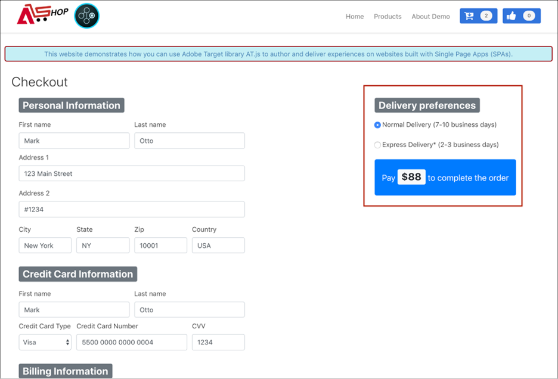

# シングルページアプリケーションの実装

Adobe Experience Platform Web SDK は、シングルページアプリケーション（SPA）など、次世代のクライアントサイドテクノロジーでパーソナライゼーションを実行するための機能を提供します。

従来の Web サイトでは、「ページ間」ナビゲーションモデル（マルチページアプリケーションとも呼ばれます）で作業を行っていました。このモデルでは、Web サイトデザインが URL に緊密に結合され、ある Web ページから別の Web ページへの移行で、ページの読み込みが必要となりました。

代わりに、単一ページアプリケーションなどの最新の web アプリケーションは、ブラウザー UI レンダリングの迅速な使用を推進するモデルを採用しています。これは、多くの場合、ページリロードに依存しません。 これらのエクスペリエンスは、スクロール、クリック、カーソル移動などの顧客のインタラクションによってトリガーされます。最新の web のパラダイムが進化するにつれ、パーソナライゼーションと実験をデプロイするための、ページの読み込みなどの従来の汎用イベントの関連性は機能しなくなりました。


## Experience Platform Web SDK for SPA の利点

シングルページアプリケーションで Adobe Experience Platform Web SDK を使用するメリットを次に紹介します。

* ページ読み込み時にすべてのオファーをキャッシュし、複数のサーバー呼び出しを単一のサーバー呼び出しに減らす機能。
* 従来のサーバー呼び出しで発生する遅延時間なしで、キャッシュ経由でオファーが即座に表示されるため、サイトでのユーザーエクスペリエンスが著しく向上します。
* 1 行のコードと 1 回限りの開発者セットアップにより、マーケターは、SPA の Visual Experience Composer （VEC）を介して A/B およびエクスペリエンスのターゲット設定（XT）アクティビティを作成および実行できます。

## XDM ビューとシングルページアプリケーション

Adobe Target VEC for SPA では、ビューと呼ばれる概念を利用します。ビューは、SPA エクスペリエンスを構成するビジュアル要素の論理的なグループです。 したがって、単一ページアプリケーションは、ユーザーインタラクションに基づいて、URL ではなくビューを通じた移行と見なすことができます。 通常、ビューはサイト全体またはサイト内のグループ化された視覚的要素を表すことができます。

ビューの概要をさらに説明するために、次の例では、React で実装された架空のオンライン e コマースサイトを使用して、ビューの例を調べます。

ホームページに移動すると、ヒーロー画像がイースターの販売とサイトで利用可能な最新の製品を宣伝します。 この場合、ビューはホーム画面全体に対して定義できます。 このビューは、単に「ホーム」と呼ばれることもあります。


ビジネスで販売されている製品に対するお客様の関心が高まるにつれ、お客様は **製品** リンクをクリックすることにします。 ホームサイトと同様に、製品サイト全体をビューとして定義できます。 このビューには、「products-all」という名前を付けることができます。


ビューはサイト全体またはサイト上の視覚要素のグループとして定義できるので、製品サイトに表示される 4 つの製品はグループ化され、ビューと見なすことができます。 このビューには、「products」という名前を付けることができます。


顧客が **さらに読み込み** ボタンをクリックしてサイト上のより多くの製品を検索しても、このケースでは web サイトの URL は変更されませんが、表示される 2 行目の製品のみを表すために、ここでビューを作成できます。 ビュー名は「products-page-2」にすることができます。


顧客がサイトでいくつかの製品を購入することを決定し、チェックアウト画面に進みます。チェックアウトサイトでは、顧客は通常の配信または速達を選択するオプションを与えられます。 ビューには、サイト上の任意の視覚要素のグループを使用できるので、配信環境設定用のビューを作成して、「配信環境設定」と呼ぶこともできます。


ビューの概念は、これよりはるかに拡張することができます。 これらは、サイトで定義できるビューの例です。

## XDM ビューの実装

XDM ビューはAdobe Targetで活用し、マーケターが Visual Experience Composer を使用して SPA で A/B テストおよび XT テストを実行できるようにします。 これには、1 回限りの開発者向けの設定を完了するために、次の手順を実行する必要があります。

1. [Adobe Experience Platform Web SDK](/help/web-sdk/install/overview.md) のインストール
2. パーソナライズする単一ページアプリケーション内のすべての XDM ビューを決定します。
3. XDM ビューを定義したら、AB または XT VEC アクティビティを配信するために、`sendEvent()` に設定した `renderDecisions` 関数と、シングルページアプリケーションで対応す `true`XDM ビューを実装します。 XDM ビューは `xdm.web.webPageDetails.viewName` で渡す必要があります。 この手順では、マーケターは Visual Experience Composer を活用して、これらの XDM の A/B テストと XT テストを開始できます。

   ```javascript
   alloy("sendEvent", { 
     "renderDecisions": true, 
     "xdm": { 
       "web": { 
         "webPageDetails": { 
         "viewName":"home" 
         }
       } 
     } 
   });
   ```

>[!NOTE]
>
>最初の `sendEvent()` 呼び出しで、エンドユーザーにレンダリングする必要があるすべての XDM ビューが取得され、キャッシュされます。 渡された XDM ビューを使用した後続の `sendEvent()` 呼び出しは、サーバーコールなしでキャッシュから読み取られ、レンダリングされます。

## `sendEvent()` 関数の例

この節では、模擬 e コマース SPA 用に React で `sendEvent()` 関数を呼び出す方法を示す 3 つの例について説明します。

### 例 1：A/B テストのホームページ

マーケティングチームは、ホームページ全体で A/B テストを実行したいと考えています。


ホームサイト全体で A/B テストを実行するには、`sendEvent()` は、`home` に設定した XDM `viewName` と共に呼び出す必要があります。

```jsx
function onViewChange() { 
  
  var viewName = window.location.hash; // or use window.location.pathName if router works on path and not hash 

  viewName = viewName || 'home'; // view name cannot be empty 

  // Sanitize viewName to get rid of any trailing symbols derived from URL 

  if (viewName.startsWith('#') || viewName.startsWith('/')) { 
    viewName = viewName.substr(1); 
  }
   
  alloy("sendEvent", { 
    "renderDecisions": true, 
    "xdm": { 
      "web": { 
        "webPageDetails": { 
          "viewName":"home" 
        } 
      } 
    }
  }); 
} 

// react router v4 

const history = syncHistoryWithStore(createBrowserHistory(), store); 

history.listen(onViewChange); 

// react router v3 

<Router history={hashHistory} onUpdate={onViewChange} > 
```

### 例 2：パーソナライズされた製品

マーケティングチームは、ユーザーが **さらに読み込む** をクリックした後で価格ラベルのカラーを赤に変更して、2 行目にある製品をパーソナライズしたいと考えています。


```jsx
function onViewChange(viewName) { 

  alloy("sendEvent", { 
    "renderDecisions": true, 
    "xdm": { 
      "web": { 
        "webPageDetails": { 
          "viewName": viewName
        }
      } 
    } 
  }); 
} 

class Products extends Component { 
  
  render() { 
    return ( 
      <button type="button" onClick={this.handleLoadMoreClicked}>Load more</button> 
    ); 
  } 

  handleLoadMoreClicked() { 
    var page = this.state.page + 1; // assuming page number is derived from component's state 
    this.setState({page: page}); 
    onViewChange('PRODUCTS-PAGE-' + page); 
  } 

} 
```

### 例 3:A/B テスト配信の環境設定

マーケティングチームは、「**高速配信**」が選択されている場合にボタンの色を青から赤に変更することでコンバージョンを高めることができるかどうかを確認するために、A/B テストを実行します（両方の配信オプションでボタンの色を青に保つのではなく）。



選択した配信環境設定に応じてサイトのコンテンツをパーソナライズするために、配信環境設定ごとにビューを作成できます。 **通常配信** が選択されている場合、ビューに「checkout-normal」という名前を付けることができます。 **高速配信** が選択されている場合、ビューに「checkout-express」という名前を付けることができます。

```jsx
function onViewChange(viewName) { 
  alloy("sendEvent", { 
    "renderDecisions": true, 
    "xdm": { 
      "web": { 
        "webPageDetails": { 
          "viewName": viewName 
        }
      }
    }
  }); 
} 

class Checkout extends Component { 

  render() { 
    return ( 
      <div onChange={this.onDeliveryPreferenceChanged}> 
        <label> 
          <input type="radio" id="normal" name="deliveryPreference" value={"Normal Delivery"} defaultChecked={true}/> 
          <span> Normal Delivery (7-10 business days)</span> 
        </label> 
        <label> 
          <input type="radio" id="express" name="deliveryPreference" value={"Express Delivery"}/> 
          <span> Express Delivery* (2-3 business days)</span> 
        </label> 
      </div> 
    ); 
  } 

  onDeliveryPreferenceChanged(evt) { 
    var selectedPreferenceValue = evt.target.value; 
    onViewChange(selectedPreferenceValue); 
  } 

} 
```

## SPA 用 Visual Experience Composer の使用

XDM ビューの定義が完了し、渡された XDM ビューで `sendEvent()` を実装すると、VEC はこれらのビューを検出でき、ユーザーは A/B または XT アクティビティのアクションと変更を作成できるようになります。

>[!NOTE]
>
>SPA で VEC を使用するには、{Firefox[ または ](https://addons.mozilla.org/en-US/firefox/addon/adobe-target-vec-helper/)2}Chrome[ VEC Helper 拡張機能をインストールして有効化する必要があります。](https://chrome.google.com/webstore/detail/adobe-target-vec-helper/ggjpideecfnbipkacplkhhaflkdjagak)

### 変更パネル

変更パネルには、特定のビュー用に作成されたアクションが取り込まれています。 ビューのすべてのアクションは、そのビューの下にグループ化されます。


### アクション

アクションをクリックすると、このアクションが適用されるサイト上の要素がハイライト表示されます。 ビューに作成された各 VEC アクションには、**情報**、**編集**、**クローン**、**移動**、**削除** のアイコンがあります。 これらのアイコンについて詳しくは、次の表を参照してください。


| アイコン | 説明 |
|---|---|
| 情報 | アクションの詳細を表示します。 |
| 編集 | アクションのプロパティを直接編集できます。 |
| クローン | 変更パネルに存在する 1 つ以上のビュー、または VEC で参照および移動した 1 つ以上のビューにアクションのクローンを作成します。 アクションは、変更パネルに存在する必要はありません。<br/><br/>**注意：** 複製操作を行ったら、参照を使用して VEC のビューに移動し、複製されたアクションが有効な操作かどうかを確認します。 アクションをビューに適用できない場合は、エラーが表示されます。 |
| 移動 | 変更パネルに既に存在するページの読み込みイベントまたはその他のビューにアクションを移動します。<br/><br/>**ページの読み込みイベント：** ページの読み込みイベントに対応するアクションが web アプリケーションの最初のページ読み込みに適用されます。 <br/><br/>**注意：** 移動操作を行ったら、参照を使用して VEC のビューに移動し、移動が有効な操作かどうかを確認します。 アクションをビューに適用できない場合は、エラーが表示されます。 |
| 削除 | アクションを削除します。 |

## SPA への VEC の使用の例

この節では、Visual Experience Composer を使用して A/B または XT アクティビティのアクションと変更を作成する 3 つの例について説明します。

### 例 1:「home」ビューを更新する

このドキュメントでは先ほど、「home」という名前のビューがホーム サイト全体に対して定義されました。 マーケティングチームは、次のように「ホーム」ビューを更新するとします。

* **買い物かごに追加** ボタンと **いいね** ボタンを、より明るい青色に変更します。 これは、ヘッダーのコンポーネントを変更する必要があるので、ページの読み込み中に発生する必要があります。
* **2019 年の最新製品** ラベルを **2019 年の最もホットな製品** に変更し、テキストの色を紫色に変更します。

VEC でこれらの更新を行うには、「作成 **を選択し、その変更を「ホーム** ビューに適用します。


### 例 2：製品ラベルを変更する

「products-page-2」ビューの場合、マーケティングチームは **Price** ラベルを **Sale Price** に変更し、ラベルの色を赤に変更します。

VEC でこれらの更新を行うには、次の手順が必要です。

1. VEC で **参照** を選択します。
2. サイトの上部ナビゲーションで「**製品**」を選択します。
3. **さらに読み込み** を 1 回選択して、製品の 2 行目を表示します。
4. VEC で「**作成**」を選択します。
5. アクションを適用して、テキストラベルを **販売価格** に、カラーを赤に変更します。


### 例 3：配信環境設定のスタイル設定をパーソナライズ

ビューは、状態やラジオボタンからのオプションなど、詳細なレベルで定義できます。 このドキュメントの以前は、ビューは、配信環境設定、「checkout-normal」および「checkout-express」用に定義されていました。 マーケティングチームは、「checkout-express」表示のボタンの色を赤に変更したいと考えています。

VEC でこれらの更新を行うには、次の手順が必要です。

1. VEC で **参照** を選択します。
2. サイト上の買い物かごに商品を追加します。
3. サイトの右上隅にある「買い物かご」アイコンを選択します。
4. **注文をチェックアウト** を選択します。
5. **配信環境設定** の下の **高速配信** ラジオボタンを選択します。
6. VEC で「**作成**」を選択します。
7. **Pay** ボタンのカラーを赤に変更します。

>[!NOTE]
>
>「チェックアウト – エクスプレス」ビューは、「エクスプレス配信 **ラジオボタンが選択されるまで、変更パネルに表示され** せん。 これは、`sendEvent()` 関数が、「高速配信 **** ラジオボタンが選択されたときに実行されるため、VEC は、ラジオボタンが選択されるまで「checkout-express」表示を認識しません。


