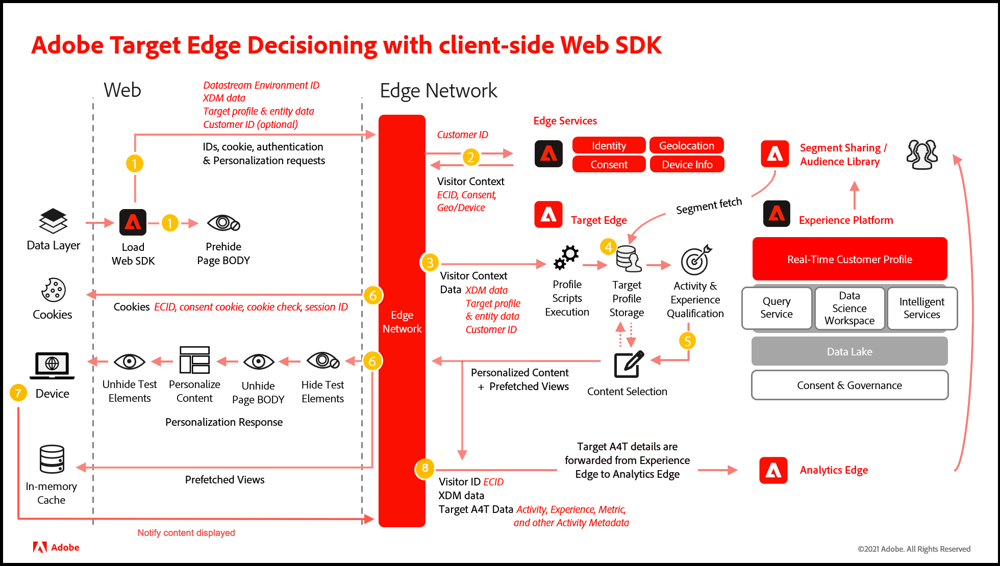

# パーソナライゼーションへの [!DNL Adobe Target] と [!DNL Web SDK] の使用

[!DNL Adobe Experience Platform] [!DNL Web SDK] は、web チャネルに [!DNL Adobe Target] して管理され、パーソナライズされたエクスペリエンスを配信およびレンダリングできます。 [Visual Experience Composer](https://experienceleague.adobe.com/docs/target/using/experiences/vec/visual-experience-composer.html?lang=ja) （VEC）、非ビジュアルベースのインターフェイス [&#x200B; フォームベースの Experience Composer](https://experienceleague.adobe.com/docs/target/using/experiences/form-experience-composer.html?lang=ja) と呼ばれるWYSIWYG エディターを使用して、アクティビティとパーソナライゼーションエクスペリエンスを作成、アクティベートおよび配信できます。

>[!IMPORTANT]
>
>[at.js 2.x からExperience Platform web SDKへの Target の移行 &#x200B;](https://experienceleague.adobe.com/docs/platform-learn/migrate-target-to-websdk/introduction.html?lang=ja) チュートリアルで、Target 実装をExperience Platform web SDKに移行する方法を説明します。
>
>[Web SDKを使用してAdobe Experience Cloudを実装する &#x200B;](https://experienceleague.adobe.com/docs/platform-learn/implement-web-sdk/overview.html?lang=ja) チュートリアルで、Target を初めて実装する方法を説明します。 Target について詳しくは、チュートリアルの「[Experience Platform Web SDKを使用した Target の設定 &#x200B;](https://experienceleague.adobe.com/docs/platform-learn/implement-web-sdk/applications-setup/setup-target.html?lang=ja) の節を参照してください。


次の機能はテスト済みで、現在 [!DNL Target] でサポートされています。

* [A/B テスト &#x200B;](https://experienceleague.adobe.com/docs/target/using/activities/abtest/test-ab.html?lang=ja)
* [A4T インプレッションおよびコンバージョンレポート &#x200B;](https://experienceleague.adobe.com/docs/target/using/integrate/a4t/a4t.html?lang=ja)
* [Automated Personalization アクティビティ &#x200B;](https://experienceleague.adobe.com/docs/target/using/activities/automated-personalization/automated-personalization.html?lang=ja)
* [&#x200B; エクスペリエンスのターゲット設定アクティビティ &#x200B;](https://experienceleague.adobe.com/docs/target/using/activities/automated-personalization/automated-personalization.html?lang=ja)
* [&#x200B; 多変量分析テスト（MVT） &#x200B;](https://experienceleague.adobe.com/docs/target/using/activities/multivariate-test/multivariate-testing.html?lang=ja)
* [Recommendations アクティビティ &#x200B;](https://experienceleague.adobe.com/docs/target/using/recommendations/recommendations.html?lang=ja)
* [Target のネイティブインプレッションとコンバージョンレポート &#x200B;](https://experienceleague.adobe.com/docs/target/using/reports/reports.html?lang=ja)
* [VEC サポート &#x200B;](https://experienceleague.adobe.com/docs/target/using/experiences/vec/visual-experience-composer.html?lang=ja)

## [!DNL Web SDK] システム図

次の図は、[!DNL Target] と [!DNL Web SDK] edge decisioning のワークフローを理解するのに役立ちます。



| 通話 | 詳細 |
| --- | --- |
| 1 | デバイスが [!DNL Web SDK] を読み込みます。 [!DNL Web SDK] は、XDM データ、データストリーム環境 ID、渡し込みパラメーター、顧客 ID （オプション）を含むリクエストをEdge Networkに送信します。 ページ（またはコンテナ）は事前非表示になっています。 |
| 2 | Edge Networkは、訪問者 ID、同意、その他の訪問者コンテキスト情報（位置情報やデバイスにわかりやすい名前など）を使用してリクエストを強化するため、エッジサービスにリクエストを送信します。 |
| 3 | Edge Networkは、訪問者 ID と渡されたパラメーターを使用して、エンリッチメントされたパーソナライゼーションリクエストを [!DNL Target] エッジに送信します。 |
| 4 | プロファイルスクリプトは、を実行してから、プロファイルストレージ [!DNL Target] フィードします。 プロファイルストレージは、[!UICONTROL &#x200B; オーディエンスライブラリ &#x200B;] からセグメントを取得します（例えば、[!DNL Adobe Analytics]、[!DNL Adobe Audience Manager]、[!DNL Adobe Experience Platform] から共有されたセグメント）。 |
| 5 | URL リクエストパラメーターとプロファイルデータに基づいて、[!DNL Target] は、現在のページビューと将来の事前読み込みビューで訪問者に表示するアクティビティとエクスペリエンスを決定します。 その後、[!DNL Target] はこれをEdge Networkに送り返します。 |
| 6 | 回答：Edge Networkは、パーソナライゼーションの応答をページに送り返します（オプションで、パーソナライゼーションを追加するためのプロファイル値も含みます）。 現在のページ上のパーソナライズされたコンテンツは、デフォルトコンテンツのちらつきなしでできるだけ早く表示されます。<br>b.単一ページアプリケーション（SPA）でのユーザーアクションの結果として表示されるビューのパーソナライズされたコンテンツはキャッシュされるので、ビューがトリガーされたときに追加のサーバー呼び出しをおこなわずに即座にコンテンツを適用できます。 <br>c.Edge Networkは、訪問者 ID と Cookie のその他の値（同意、セッション ID、ID、Cookie チェック、パーソナライゼーションなど）を送信します。 |
| 7 | Web SDKが、デバイスからEdge Networkに通知を送信します。 |
| 8 | Edge Networkは、[!UICONTROL Analytics for Target] （A4T）の詳細（アクティビティ、エクスペリエンスおよびコンバージョンメタデータ）を [!DNL Analytics] Edge に転送します。 |

## [!DNL Adobe Target] の有効化

[!DNL Target] を有効にするには、次の手順を実行します。

1. 適切なクライアントコードを使用して、[&#x200B; データストリーム &#x200B;](../../../datastreams/overview.md) の [!DNL Target] を有効にします。
1. イベントに「`renderDecisions`」オプションを追加します。

その後、オプションで、次のオプションも追加できます。

* **`decisionScopes`**：イベントにこのオプションを追加して、特定のアクティビティ（フォームベースのコンポーザーで作成されたアクティビティで役立つ）を取得します。
* **[スニペットを事前非表示](../manage-flicker.md)**：ページの特定の部分のみを非表示にします。

## Adobe Target VEC の使用

[!DNL Web SDK] 実装で VEC を使用するには、{Firefox[&#128279;](https://addons.mozilla.org/en-US/firefox/addon/adobe-target-vec-helper/) または [3}Chrome](https://chrome.google.com/webstore/detail/adobe-target-vec-helper/ggjpideecfnbipkacplkhhaflkdjagak) VEC Helper 拡張機能をインストールして有効化します。

詳しくは、*Adobe Targetガイドの [Visual Experience Composer ヘルパー拡張機能 &#x200B;](https://experienceleague.adobe.com/docs/target/using/experiences/vec/troubleshoot-composer/vec-helper-browser-extension.html?lang=ja) を参照してください*。

## パーソナライズされたコンテンツのレンダリング

詳しくは、[&#x200B; パーソナライゼーションコンテンツのレンダリング &#x200B;](../rendering-personalization-content.md) を参照してください。

## XDM でのオーディエンス

[!DNL Web SDK] を介して配信される [!DNL Target] アクティビティのオーディエンスを定義する場合は、[XDM](https://experienceleague.adobe.com/docs/experience-platform/xdm/home.html?lang=ja) を定義し、使用する必要があります。 XDM スキーマ、クラス、スキーマフィールドグループを定義したら、XDM データで定義されたターゲティング用の [!DNL Target] オーディエンスルールを作成できます。 [!DNL Target] 内では、XDM データは [!UICONTROL Audience Builder] にカスタムパラメーターとして表示されます。 XDM は、ドット表記（`web.webPageDetails.name` など）を使用してシリアル化されます。

カスタムパラメーターやユーザープロファイルを使用する、事前に定義されたオーディエンスを持つ [!DNL Target] アクティビティがある場合、そのアクティビティはSDKで正しく配信されません。 カスタムパラメーターやユーザープロファイルを使用する代わりに、XDM を使用する必要があります。 ただし、[!DNL Web SDK] を介してサポートされている標準搭載のオーディエンスターゲティングフィールドのうち、XDM を必要としないものがあります。 これらのフィールドは、XDM を必要としない [!DNL Target] UI で使用できます。

* ターゲットライブラリ
* ジオ
* ネットワーク
* オペレーティングシステム
* サイトページ
* ブラウザー
* トラフィックソース
* 時間枠

詳しくは、*Adobe Target ガイド [&#x200B; オーディエンスのカテゴリ &#x200B;](https://experienceleague.adobe.com/docs/target/using/audiences/create-audiences/categories-audiences/target-rules.html?lang=ja) を参照してください*。

### レスポンストークン

レスポンストークンは、Googleや Facebook などのサードパーティにメタデータを送信するために使用されます。 レスポンストークンが返されます
`propositions` -> `items` 内の `meta` フィールドに移動します。 次に例を示します。

```json
{
  "id": "AT:eyJhY3Rpdml0eUlkIjoiMTI2NzM2IiwiZXhwZXJpZW5jZUlkIjoiMCJ9",
  "scope": "__view__",
  "scopeDetails": ...,
  "renderAttempted": true,
  "items": [
    {
      "id": "0",
      "schema": "https://ns.adobe.com/personalization/dom-action",
      "meta": {
        "experience.id": "0",
        "activity.id": "126736",
        "offer.name": "Default Content",
        "offer.id": "0"
      }
    }
  ]
}
```

応答トークンを収集するには、promise を購読し、`propositions` を繰り返し処理 `alloy.sendEvent`、`items` ～ `meta` から詳細を抽出する必要があります。

すべての `proposition` には、`proposition` がレンダリングされたかどうかを示す `renderAttempted` しいブール値フィールドがあります。 以下のサンプルを参照してください。

```js
alloy("sendEvent",
  {
    "renderDecisions": true,
    "decisionScopes": [
      "hero-container"
    ]
  }).then(result => {
    const { propositions } = result;

    // filter rendered propositions
    const renderedPropositions = propositions.filter(proposition => proposition.renderAttempted === true);

    // collect the item metadata that represents the response tokens
    const collectMetaData = (items) => {
      return items.filter(item => item.meta !== undefined).map(item => item.meta);
    }

    const pageLoadResponseTokens = renderedPropositions
      .map(proposition => collectMetaData(proposition.items))
      .filter(e => e.length > 0)
      .flatMap(e => e);
  });
  
```

自動レンダリングが有効な場合、提案の配列には次が含まれます。

#### ページ読み込み時：

* `renderAttempted` フラグを `false` に設定したフォームベースの Composer ベースの `propositions`
* `renderAttempted` フラグを `true` に設定した Visual Experience Composer ベースの提案
* フラグが `true` に設定されたシングルページアプリケーションビュー `renderAttempted`Visual Experience Composer ベースの提案

#### 表示時 – 変更（キャッシュされたビュー用）:

* フラグが `true` に設定されたシングルページアプリケーションビュー `renderAttempted`Visual Experience Composer ベースの提案

自動レンダリングが無効の場合、提案の配列には次が含まれます。

#### ページ読み込み時：

* `renderAttempted` フラグが `false` に設定された [!DNL Form-based Composer] ベースの `propositions`
* `renderAttempted` フラグが `false` に設定された [!DNL Visual Experience Composer] ベースの提案
* フラグが `false` に設定されたシングルページアプリケーションビュー `renderAttempted` 対する [!DNL Visual Experience Composer] ベースの提案

#### 表示時 – 変更（キャッシュされたビュー用）:

* フラグが `false` に設定されたシングルページアプリケーションビュー `renderAttempted`Visual Experience Composer ベースの提案

### 単一プロファイルの更新

[!DNL Web SDK] を使用すると、プロファイルを [!DNL Target] プロファイルに更新したり、エクスペリエンスイベントとして [!DNL Web SDK] に更新したりできます。

[!DNL Target] プロファイルを更新するには、プロファイルデータに次の情報が渡されていることを確認します。

* `"data {"` 未満
* `"__adobe.target"` 未満
* プレフィックス `"profile."`

| キー | タイプ | 説明 |
| --- | --- | --- |
| `renderDecisions` | ブール値 | DOM アクションを解釈するかどうかをパーソナライゼーションコンポーネントに指示します |
| `decisionScopes` | 配列 `<String>` | 決定を取得する範囲のリスト |
| `xdm` | オブジェクト | Web SDKにエクスペリエンスイベントとして到着する XDM 形式のデータ |
| `data` | オブジェクト | ターゲットクラスの [!DNL Target] ソリューションに送信される任意のキーと値のペア。 |

<!--Typical [!DNL Web SDK] code using this command looks like the following:-->

**コンテンツがエンドユーザーに表示されるまで、プロファイルまたはエンティティパラメーターの保存を遅延させる**

コンテンツが表示されるまでプロファイルの属性の記録を遅延させるには、リクエストで `data.adobe.target._save=false` を設定します。

例えば、Web サイトには、Web サイト上の 3 つのカテゴリリンク（男性、女性および子供）に対応する 3 つの決定範囲が含まれており、ユーザーが最終的に訪問したカテゴリを追跡したいとします。 コンテンツがリクエストされた時点でカテゴリが持続しないように、`__save` フラグを `false` に設定してこれらのリクエストを送信します。 コンテンツを視覚化したら、対応する属性が記録されるように、適切なペイロード（`eventToken` と `stateToken` を含む）を送信します。

次の例では、trackEvent スタイルのメッセージを送信し、プロファイルスクリプトを実行して、属性を保存し、イベントを直ちに記録します。

```js
alloy("sendEvent", {
    "renderDecisions": true,
    "xdm": { /* Experience Event XDM data */ },
    "data": {
        "__adobe": {
            "target": {
                " __save": true|false,
                //defaults to true if omitted
                "profile.gender": "female",
                "profile.age": 30,
                "entity.name": "T-shirt",
                "entity.id": "1234"
            }
        }
    }
})
```

>[!NOTE]
>
>`__save` ディレクティブが省略された場合、プロファイル属性とエンティティ属性の保存は直ちに行われます。 `__save` ディレクティブは、プロファイル属性とエンティティの詳細にのみ関連しています。

## お勧めをリクエスト

次の表に、[!DNL Recommendations] 属性と、各属性が [!DNL Web SDK] でサポートされているかどうかを示します。

| カテゴリ | 属性 | サポートステータス |
| --- | --- | --- |
| Recommendations - デフォルトのエンティティ属性 | entity.id | サポートあり |
|  | entity.name | サポートあり |
|  | entity.categoryId | サポートあり |
|  | entity.pageUrl | サポートあり |
|  | entity.thumbnailUrl | サポートあり |
|  | entity.message | サポートあり |
|  | entity.value | サポートあり |
|  | entity.inventory | サポートあり |
|  | entity.brand | サポートあり |
|  | entity.margin | サポートあり |
|  | entity.event.detailsOnly | サポートあり |
| Recommendations - カスタムエンティティの属性 | entity.yourCustomAttributeName | サポートあり |
| Recommendations – 予約済みの mbox/ページパラメーター | excludedIds | サポートあり |
|  | cartIds | サポートあり |
|  | productPurchasedId | サポートあり |
| カテゴリ親和性のページまたは項目カテゴリ | user.categoryId | サポートあり |

**Recommendations 属性をAdobe Targetに送信する方法：**

```js
alloy("sendEvent", {
  "renderDecisions": true,
  "data": {
    "__adobe": {
      "target": {
        "entity.id": "123",
        "entity.genre": "Drama"
      }
    }
  }
});
```

## mbox コンバージョン指標の表示 {#display-mbox-conversion-metrics}

以下のサンプルに、コンテンツやアクティビティの対象として認定される必要なく、表示 mbox コンバージョンを追跡し、プロファイルパラメーターをAdobe Targetに送信する方法を示します。

```js
alloy("sendEvent", {
    "xdm": {
        "_experience": {
            "decisioning": {
                "propositions": [{
                    "scope": "conversion-step-1" //example scope name
                }],
                "propositionEventType": {
                    "display": 1
                }
            }
        },
        "eventType": "decisioning.propositionDisplay"
    }
});
```


| プロパティ | 説明 |
|---------|----------|
| `xdm._experience.decisioning.propositions[x].scope` | 成功指標を関連付ける範囲（ターゲット側の特定のアクティビティに関連付けられます）。 |
| `xdm._experience.decisioning.propositions[x].eventType` | 目的のイベントタイプを説明する文字列。 このユースケースでは、これを `"decisioning.propositionDisplay"` に設定します。 |

## デバッグ

mboxTrace と mboxDebug は非推奨（廃止予定）になりました。 代わりに、[Web SDK デバッグ &#x200B;](/help/web-sdk/use-cases/debugging.md) メソッドを使用します。

## 用語

__提案：__[!DNL Adobe Target] では、提案は、アクティビティから選択されたエクスペリエンスに関連付けられます。

__スキーマ：__ 決定のスキーマは、[!DNL Adobe Target] のオファーのタイプです。

__範囲：__ 決定の範囲。 ま [!DNL Adobe Target]、スコープは mBox です。 グローバル mBox は `__view__` スコープです。

__XDM:__ XDM はドット表記にシリアル化され、mBox パラメーターとして [!DNL Adobe Target] に入れられます。
