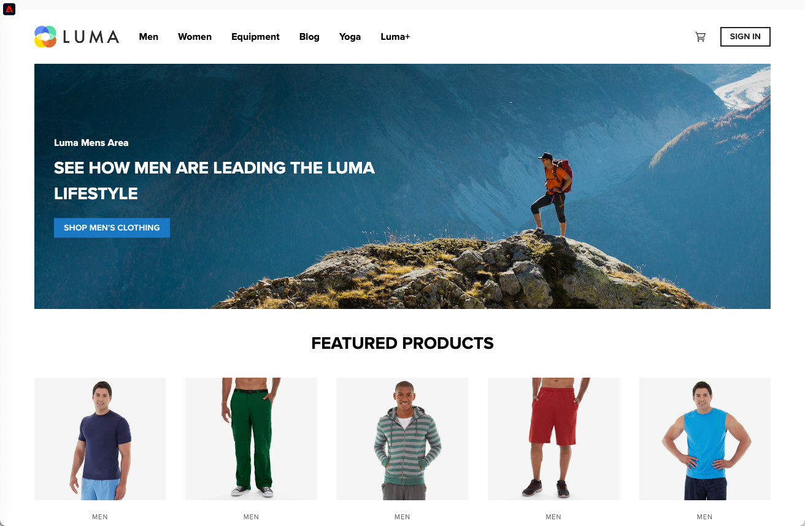
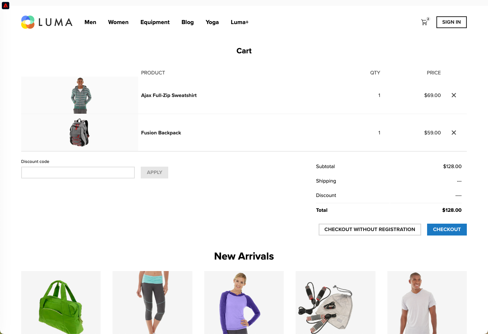

# シングルページアプリケーション（SPA）の実装 {#web-spa-implementation}

Adobe Experience Platform Web SDK は、シングルページアプリケーション（SPA）などの次世代のクライアントサイドテクノロジーでパーソナライゼーションを実行できるようにするための豊富な機能を提供します。

従来の web サイトは、「ページからページ」のナビゲーションモデル（別名マルチページアプリケーション）を使用していました。このモデルでは、web サイトデザインは URL と密接に結合され、ある web ページから別のページへのトランジションにはページ読み込みが必要になります。

シングルページアプリケーション（SPA）などの最新型 web アプリケーションは、代わりに、ページの再読み込みがほどんど独立した、ブラウザーの UI レンダリングの迅速な使用を推進するモデルを採用しています。これらのエクスペリエンスは、スクロール、クリック、カーソル移動などの顧客のインタラクションによってトリガーされます。最新の web の仕組みが進化するにつれて、パーソナライゼーションと実験をデプロイするためのページ読み込みなどの従来の一般的なイベントは機能しなくなりました。


## SPAに Web SDK を使用するメリット {#web-spa-benefits}

単一ページアプリケーションに Web SDK を使用する利点は次のとおりです。

* ページ読み込み時にすべてのオファーをキャッシュし、複数のサーバー呼び出しを単一のサーバー呼び出しに減らす機能。
* オファーは従来のサーバー呼び出しによって生じるラグ時間なしで、キャッシュを通じて即座に表示されるので、サイトでのユーザーエクスペリエンスが大幅に向上します。
* マーケターは、1 回限りの開発者設定で、SPA 上の Adobe Journey Optimizer Web ビジュアルエディターを使用して、パーソナライゼーションおよび実験アクティビティを作成し、実行できます。

## XDM ビューとシングルページアプリケーション {#web-spa-xdm}

Journey Optimizerの web エディターでは、「_ビュー_ と呼ばれる概念を利用します。

ビューは、SPA エクスペリエンスを構成するビジュアル要素の論理的なグループです。 つまりシングルページアプリケーションは、ユーザーのインタラクションに基づいて、URL ではなく、ビュー間を移行するものと考えることができます。通常、ビューはサイト全体、シングルページまたはページ内のグループ化されたビジュアル要素を表します。

ビューの詳細を説明するために、次の例では、架空のオンライン e コマースサイトを使用しています。

* ホームサイトに移動した後、ヒーロー画像は、季節のコレクションとサイトで入手可能な様々な製品カタログを紹介します。この場合、ビューはホーム画面全体として定義できます。このビューは、単に「ホーム」と呼ぶことができます。

  

* 顧客は、その会社が販売している製品に興味を持つようになると、**メンズ**&#x200B;のリンクをクリックすることを決定します。ホームページと同様に、**メンズ**&#x200B;ページ全体をビューとして定義できます。このビューには「メンズ」という名前を付けることができます。

  

* ビューはサイト全体またはサイト上のビジュアル要素のグループとして定義できるので、製品サイトに表示される 4 つの製品をグループ化し、ビューと見なすことができます。このビューには、「製品」という名前を付けることができます。

  

* 顧客が&#x200B;**すべてのメンズ製品**&#x200B;ボタンを使用してサイト上の他の製品を参照する場合、この場合、web サイトの URL は変わりませんが、表示される製品の 2 行目のみを表示するビューをここで作成できます。ビュー名は「製品ページ-2」になります。

* 顧客がサイトでいくつかの製品を購入することを決定し、チェックアウト画面に進みます。買い物かご画面自体を、「買い物かご」という名前のビューに関連付けることができます。または、チェックアウト画面内で別のビューを使用して、下に推奨商品を表示することもできます。

  

ビューの概念は、これよりもはるかに広範に拡張できます。これらは、サイトで定義できるビューの例に過ぎません。

## XDM ビューの実装 {#implement-xdm-views}

XDM ビューはAdobe Journey Optimizerで活用すると、マーケターがJourney Optimizer web ビジュアルエディターを使用して、SPAで web パーソナライゼーションや実験キャンペーンを実行できるようになります。

これには、1 回限りの開発者向けの設定を完了するために、次の手順を実行する必要があります。

1. [Adobe Experience Platform Web SDK](/help/web-sdk/install/overview.md) をインストールし、[web チャネルの前提条件 ](https://experienceleague.adobe.com/docs/journey-optimizer/using/web/configure-web-channel/web-prerequisites.html?lang=ja) ページを確認します。

2. パーソナライズするシングルページアプリケーション内のすべての XDM ビューを決定します。

3. XDM ビューを定義した後、これらのビューにコンテンツを配信するには、シングルページアプリケーションで `renderDecisions` を持つ `sendEvent()` 機能を `true` および対応する XDM ビューを設定します。`xdm.web.webPageDetails.viewName` で XDM ビューを渡す必要があります。この手順を使用すると、マーケターは、Journey Optimizer web エディター内でこれらのビューを見つけ、それらに対してコンテンツの変更を適用できます。

```js
 alloy("sendEvent", {
  "renderDecisions": true,
  "xdm": {
   "web": {
    "webPageDetails": {
    "viewName":"home"
   }
  }
 }
});
```

>[!NOTE]
>
>最初の `sendEvent()` を呼び出すと、エンドユーザーにレンダリングされる必要のあるすべての XDM ビューが取得され、キャッシュされます。XDM ビューが渡された後続の `sendEvent()` を呼び出すと、キャッシュから読み取られ、サーバー呼び出しなしでレンダリングされます。

## `sendEvent()` 関数の例

この節では、仮想的な e コマース SPA の `sendEvent()` 関数を React で呼び出す方法を示す 2 つの例を説明します。

### 例 1：A/B テストのホームページ {#web-spa-sample-1}

マーケティングチームは、ホームページ全体で A/B テストを実行したいと考えています。


ホームサイト全体で A/B テストを実行するには、`sendEvent()` は、`home` に設定した XDM `viewName` と共に呼び出す必要があります。

```js
function onViewChange() {

  var viewName = window.location.hash; // or use window.location.pathName if router works on path and not hash

  viewName = viewName || 'home'; // view name cannot be empty

  // Sanitize viewName to get rid of any trailing symbols derived from URL

  if (viewName.startsWith('#') || viewName.startsWith('/')) {
    viewName = viewName.substr(1);
  }

  alloy("sendEvent", {
    "renderDecisions": true,

    "xdm": {
      "web": {
        "webPageDetails": {
          "viewName":"home"
        }
      }
    }
  });
}

// react router v4

const history = syncHistoryWithStore(createBrowserHistory(), store);

history.listen(onViewChange);

// react router v3

<Router history={hashHistory} onUpdate={onViewChange} >
```

### 例 2：パーソナライズされた製品 {#web-spa-sample-2}

マーケティングチームは、ユーザーがすべてのメンズ向け製品をクリックした後に、価格ラベルの色を赤に変更して、2 行目の製品をパーソナライズしたいと考えています。


```js
function onViewChange(viewName) {

    alloy("sendEvent", {
        "renderDecisions": true,
        "xdm": {
            "web": {
                "webPageDetails": {
                    "viewName": viewName
                }
            }
        }
    });
}

class Products extends Component {

    render() {
        return (

            <
            button type = "button"
            onClick = {
                this.handleLoadMoreClicked
            } > All Men 's Products</button>
        );
    }

    handleLoadMoreClicked() {
        var page = this.state.page + 1; // assuming page number is derived from component's state
        this.setState({
            page: page
        });
        onViewChange('PRODUCTS-PAGE-' + page);
    }
}
```
