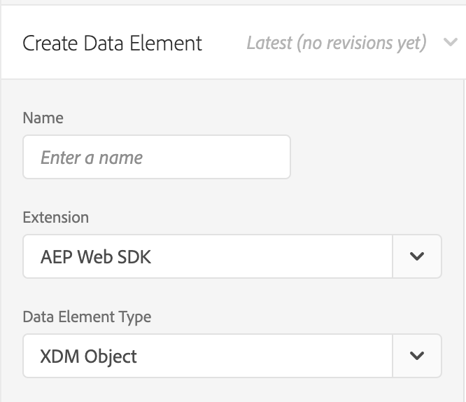

# Experience Platform Web SDKでのOffer Decisioningの使用

Adobe Experience Platform [!DNL Web SDK] は、Offer Decisioningで管理されるパーソナライズされたオファーを配信およびレンダリングできます。 Offer Decisioning ユーザーインターフェイス（UI）または API を使用して、オファーとその他の関連オブジェクトを作成できます。

## 前提条件

* 組織は Edge Decisioning に対して有効になっています
* オファー、作成されたアクティビティ
* データストリームが公開されました

## 用語

Offer Decisioningを使用する際は、以下の用語を理解することが重要です。 詳細および追加の用語については、[Offer Decisioning用語集 &#x200B;](https://experienceleague.adobe.com/docs/offer-decisioning/using/get-started/glossary.html?lang=ja) を参照してください。

* **決定範囲：** Offer Decisioningの場合、決定範囲は、Offer Decisioning サービスでオファーを提案するために使用するアクティビティ ID とプレースメント ID を含む、Base64 でエンコードされた JSON の文字列です。

  *決定範囲 JSON:*

  ```json
  {
    "activityId":"xcore:offer-activity:11cfb1fa93381aca",
    "placementId":"xcore:offer-placement:1175009612b0100c"
  }
  ```

  *決定範囲 Base64 エンコードされた文字列：*

  ```json
  "eyJhY3Rpdml0eUlkIjoieGNvcmU6b2ZmZXItYWN0aXZpdHk6MTFjZmIxZmE5MzM4MWFjYSIsInBsYWNlbWVudElkIjoieGNvcmU6b2ZmZXItcGxhY2VtZW50OjExNzUwMDk2MTJiMDEwMGMifQ=="
  ```

  >[!TIP]
  >
  >決定範囲の値は、UI の **アクティビティの概要** ページからコピーできます。

  

* **データストリーム：** 詳しくは、[&#x200B; データストリーム &#x200B;](/help/datastreams/overview.md) ドキュメントを参照してください。

* **ID**：詳しくは、[Experience Platform Web SDKでの ID サービスの使用方法 &#x200B;](../../identity/overview.md) を概要するこのドキュメントをお読みください。

## Offer Decisioningの有効化

Offer Decisioningを有効にするには、次の手順を実行します。

1. [&#x200B; データストリーム &#x200B;](/help/datastreams/overview.md) でAdobe Experience Platformを有効にし、「Offer Decisioning」ボックスをオンにします。

   

1. 手順に従って [SDKをインストール &#x200B;](/help/web-sdk/install/overview.md) します（SDKはスタンドアロンで、または UI を使用してインストールできます。 詳しくは、[&#x200B; タグのクイックスタートガイド &#x200B;](/help/tags/quick-start/quick-start.md)）を参照してください。
1. `personalization.decisionScopes` を使用してOffer DecisioningのSDKを設定します。 Offer Decisioning固有のその他の手順を以下に示します。

   * スタンドアロンのSDKのインストール

      1. `personalization.decisionScopes` を使用した「sendEvent」アクションの設定

     ```javascript
     alloy("sendEvent", {
       ...
       "personalization": {
         "decisionScopes": [
           "eyJhY3Rpdml0eUlkIjoieGNvcmU6b2ZmZXItYWN0aXZpdHk6MTIxYWIwOWMxM2JkZDIyNCIsInBsYWNlbWVudElkIjoieGNvcmU6b2ZmZXItcGxhY2VtZW50OjEyMWFiMDZhODRkMDViMTEifQ==",
           "eyJhY3Rpdml0eUlkIjoieGNvcmU6b2ZmZXItYWN0aXZpdHk6MTIxYWIyNWI5NTUwNWIxZiIsInBsYWNlbWVudElkIjoieGNvcmU6b2ZmZXItcGxhY2VtZW50OjEyMWFiMjFmOTQzMDE0MmIifQ=="
         ]
       }
     });
     ```

   * タグを使用したSDKのインストール

      1. [タグプロパティの作成](/help/tags/ui/administration/companies-and-properties.md)
      1. [埋め込みコードの追加](https://experienceleague.adobe.com/docs/core-services-learn/implementing-in-websites-with-launch/configure-launch/launch-add-embed.html?lang=ja)
      1. 「データストリーム」ドロップダウンから設定を選択し、作成したデータストリームを使用して、Experience Platform Web SDK拡張機能をインストールして設定します。 詳しくは、[拡張機能](/help/tags/ui/managing-resources/extensions/overview.md)に関するドキュメントを参照してください。

         

         

      1. 必要な[データ要素](/help/tags/ui/managing-resources/data-elements.md)を作成します。少なくとも、Experience Platform Web SDK ID マップおよびExperience Platform Web SDK XDM オブジェクトデータ要素を作成する必要があります。

         

         

      1. [&#x200B; ルール &#x200B;](/help/tags/ui/managing-resources/rules.md) を作成します。

         * Experience Platform Web SDKのイベントを送信アクションを追加し、関連する `decisionScopes` をアクションの設定に追加します。

         

      1. 設定したすべての関連するルール、データ要素、拡張機能を含む [&#x200B; ライブラリを作成して公開します &#x200B;](/help/tags/ui/publishing/libraries.md)

## リクエストと応答のサンプル

### 1`decisionScopes` の値

**リクエスト**

```json
{
  "events": [
    {
      "xdm": {
        "identityMap": {
          "ECID": [
            {
              "id": "91133425615229052182584359620783097099"
            }
          ]
        }
      },
      "query": {
        "personalization": {
          "decisionScopes": [
            "eyJhY3Rpdml0eUlkIjoieGNvcmU6b2ZmZXItYWN0aXZpdHk6MTFjZmIxZmE5MzM4MWFjYSIsInBsYWNlbWVudElkIjoieGNvcmU6b2ZmZXItcGxhY2VtZW50OjExNzUwMDk2MTJiMDEwMGMifQ=="
          ]
        }
      }
    }
  ]
}
```

| プロパティ | 必須 | 説明 | 制限 | 例 |
|---|---|---|---|---|
| `identityMap` | ○ | この [ID サービスのドキュメント &#x200B;](../../identity/overview.md) を参照してください。 | リクエストごとに 1 つの ID。 | `{ "identityMap": { "ECID": [ { "id": "91133425615229052182584359620783097099" } ] } }`。<br><br> メモ：ユーザーは、API 呼び出しに `ECID` パラメーターを含める必要はありません。 このパラメーターは、必要に応じて、呼び出しに自動的に追加されます。 |
| `decisionScopes` | ○ | アクティビティ ID とプレースメント ID を含む JSON の Base64 エンコードされた文字列の配列。 | リクエストあたり最大 30`decisionScopes`。 | `"decisionScopes": ["eyJhY3Rpdml0eUlkIjoieGNvcmU6b2ZmZXItYWN0aXZpdHk6MTFjZmIxZmE5MzM4MWFjYSIsInBsYWNlbWVudElkIjoieGNvcmU6b2ZmZXItcGxhY2VtZW50OjExNzUwMDk2MTJiMDEwMGMifQ=="]` |

**応答**

```json
{
  "requestId": "94c4f2f1-9218-43ce-afd3-eb0d853c5174",
  "handle": [
    {
      "payload": [
        {
          "id": "2862bb89-5df2-4bc6-85c2-d8f7e1a091de",
          "scope": "eyJhY3Rpdml0eUlkIjoieGNvcmU6b2ZmZXItYWN0aXZpdHk6MTFjZmIxZmE5MzM4MWFjYSIsInBsYWNlbWVudElkIjoieGNvcmU6b2ZmZXItcGxhY2VtZW50OjExNzUwMDk2MTJiMDEwMGMifQ==",
          "activity": {
            "id": "xcore:offer-activity:11cfb1fa93381aca",
            "etag": "2"
          },
          "placement": {
            "id": "xcore:offer-placement:1175009612b0100c",
            "etag": "1"
          },
          "items": [
            {
              "id": "xcore:personalized-offer:124cc332095cfa74",
              "schema": "https://ns.adobe.com/experience/offer-management/content-component-html",
              "etag": "1",
              "data": {
                "id": "xcore:personalized-offer:124cc332095cfa74",
                "format": "text/html",
                "language": [
                  "en-US"
                ],
                "content": "<p>20% Off on shipping</p>",
                "characteristics": {
                  "foo": "bar",
                  "foo1": "bar1"
                }
              }
            }
          ]
        }
      ],
      "type": "personalization:decisions",
      "eventIndex": 0
    }
  ]
}
```

| プロパティ | 説明 | 例 |
|---|---|---|
| `scope` | 提案されたオファーにつながった決定範囲。 | `"scope": "eyJhY3Rpdml0eUlkIjoieGNvcmU6b2ZmZXItYWN0aXZpdHk6MTFjZmIxZmE5MzM4MWFjYSIsInBsYWNlbWVudElkIjoieGNvcmU6b2ZmZXItcGxhY2VtZW50OjExNzUwMDk2MTJiMDEwMGMifQ=="` |
| `activity.id` | オファーアクティビティの一意の ID。 | `"id": "xcore:offer-activity:11cfb1fa93381aca"` |
| `placement.id` | オファープレースメントの一意の ID。 | `"id": "xcore:offer-placement:1175009612b0100c"` |
| `items.id` | 提案されたオファーの ID。 | `"id": "xcore:personalized-offer:124cc332095cfa74"` |
| `schema` | 提案されたオファーに関連付けられたコンテンツのスキーマ。 | `"schema": "https://ns.adobe.com/experience/offer-management/content-component-html"` |
| `data.id` | 提案されたオファーの ID。 | `"id": "xcore:personalized-offer:124cc332095cfa74"` |
| `format` | 提案されたオファーに関連付けられたコンテンツの形式。 | `"format": "text/html"` |
| `language` | 提案されたオファーのコンテンツに関連付けられた言語の配列。 | `"language": [ "en-US" ]` |
| `content` | 提案されたオファーに関連付けられたコンテンツ（文字列の形式）。 | `"content": "<p style="color:red;">20% Off on shipping</p>"` |
| `deliveryUrl` | 提案されたオファーに関連付けられた画像コンテンツ（URL 形式）。 | `"deliveryURL": "https://image.jpeg"` |
| `characteristics` | 提案されたオファーに関連付けられた特性（JSON オブジェクト形式）。 | `"characteristics": { "foo": "bar", "foo1": "bar1" }` |

### 複数の `decisionScopes` 値

**リクエスト**

```json
{
  "events": [
    {
      "xdm": {
        "identityMap": {
          "ECID": [
            {
              "id": "91133425615229052182584359620783097099"
            }
          ]
        }
      },
      "query": {
        "personalization": {
          "decisionScopes": [
            "eyJhY3Rpdml0eUlkIjoieGNvcmU6b2ZmZXItYWN0aXZpdHk6MTFjZmIxZmE5MzM4MWFjYSIsInBsYWNlbWVudElkIjoieGNvcmU6b2ZmZXItcGxhY2VtZW50OjExNzUwMDk2MTJiMDEwMGMifQ==",
            "eyJhY3Rpdml0eUlkIjoieGNvcmU6b2ZmZXItYWN0aXZpdHk6MTIyMjA4YjNhODc0MDU1OCIsInBsYWNlbWVudElkIjoieGNvcmU6b2ZmZXItcGxhY2VtZW50OjEyMjIwNDUyOTUxNGEyYzAifQ==",
            "eyJhY3Rpdml0eUlkIjoieGNvcmU6b2ZmZXItYWN0aXZpdHk6MTIyYzkxMzg1Mjc2MDE4YyIsInBsYWNlbWVudElkIjoieGNvcmU6b2ZmZXItcGxhY2VtZW50OjEyMzMxZjU2MTYyYWEyZjcifQ=="
          ]
        }
      }
    }
  ]
}
```

| プロパティ | 必須 | 説明 | 制限 | 例 |
|---|---|---|---|---|
| `identityMap` | ○ | この [ID サービスのドキュメント &#x200B;](../../identity/overview.md) を参照してください。 | リクエストごとに 1 つの ID。 | `{ "identityMap": { "ECID": [ { "id": "91133425615229052182584359620783097099" } ] } }`。<br><br> メモ：ユーザーは、API 呼び出しに `ECID` パラメーターを含める必要はありません。 このパラメーターは、必要に応じて、呼び出しに自動的に追加されます。 |
| `decisionScopes` | ○ | アクティビティ ID とプレースメント ID を含む JSON の Base64 エンコードされた文字列の配列。 | リクエストあたり最大 30`decisionScopes`。 | `"decisionScopes":["eyJhY3Rpdml0eUlkIjoieGNvcmU6b2ZmZXItYWN0aXZpdHk6MTFjZmIxZmE5MzM4MWFjYSIsInBsYWNlbWVudElkIjoieGNvcmU6b2ZmZXItcGxhY2VtZW50OjExNzUwMDk2MTJiMDEwMGMifQ==", "eyJhY3Rpdml0eUlkIjoieGNvcmU6b2ZmZXItYWN0aXZpdHk6MTIyMjA4YjNhODc0MDU1OCIsInBsYWNlbWVudElkIjoieGNvcmU6b2ZmZXItcGxhY2VtZW50OjEyMjIwNDUyOTUxNGEyYzAifQ=="` |

**応答**

```json
{
  "requestId": "94c4f2f1-9218-43ce-afd3-eb0d853c5174",
  "handle": [
    {
      "payload": [
        {
          "id": "a2804dfb-a0ec-4df9-8311-59d3ecdeb642",
          "scope": "eyJhY3Rpdml0eUlkIjoieGNvcmU6b2ZmZXItYWN0aXZpdHk6MTFjZmIxZmE5MzM4MTEyMyIsInBsYWNlbWVudElkIjoieGNvcmU6b2ZmZXItcGxhY2VtZW50OjExNzUwMDk2MTJiMDExMjMifQ==",
          "activity": {
            "id": "xcore:offer-activity:11cfb1fa93381123",
            "etag": "1"
          },
          "placement": {
            "id": "xcore:offer-placement:1175009612b01123",
            "etag": "3"
          },
          "items": [
            {
              "id": "xcore:personalized-offer:11e36d4a22954123",
              "schema": "https://ns.adobe.com/experience/offer-management/content-component-text",
              "etag": "2",
              "data": {
                "id": "xcore:personalized-offer:11e36d4a22954123",
                "format": "text/text",
                "language": [
                  "en"
                ],
                "content": "20% Off on shipping",
                "characteristics": {
                  "foo2": "bar2"
                }
              }
            }
          ]
        },
        {
          "id": "a2804dfb-a0ec-4df9-8311-59d3ecdeb642",
          "scope": "eyJhY3Rpdml0eUlkIjoieGNvcmU6b2ZmZXItYWN0aXZpdHk6MTFjZmIxZmE5MzM4MWFjYSIsInBsYWNlbWVudElkIjoieGNvcmU6b2ZmZXItcGxhY2VtZW50OjExNzUwMDk2MTJiMDEwMGMifQ==",
          "activity": {
            "id": "xcore:offer-activity:11cfb1fa93381aca",
            "etag": "2"
          },
          "placement": {
            "id": "xcore:offer-placement:1175009612b0100c",
            "etag": "1"
          },
          "items": [
            {
              "id": "xcore:personalized-offer:11e36d4a2295415d",
              "schema": "https://ns.adobe.com/experience/offer-management/content-component-imagelink",
              "etag": "1",
              "data": {
                "id": "xcore:personalized-offer:11e36d4a2295415d",
                "format": "image/png",
                "language": [
                  "en"
                ],
                "deliveryURL": "https://image.jpeg",
                "characteristics": {
                  "foo": "bar",
                  "foo1": "bar1"
                }
              }
            }
          ]
        }
      ],
      "type": "personalization:decisions",
      "eventIndex": 0
    }
  ]
}
```

| プロパティ | 説明 | 例 |
|---|---|---|
| `scope` | 提案されたオファーにつながった決定範囲。 | `"scope": "eyJhY3Rpdml0eUlkIjoieGNvcmU6b2ZmZXItYWN0aXZpdHk6MTFjZmIxZmE5MzM4MWFjYSIsInBsYWNlbWVudElkIjoieGNvcmU6b2ZmZXItcGxhY2VtZW50OjExNzUwMDk2MTJiMDEwMGMifQ=="` |
| `activity.id` | オファーアクティビティの一意の ID。 | `"id": "xcore:offer-activity:11cfb1fa93381123"` |
| `placement.id` | オファープレースメントの一意の ID。 | `"xcore:offer-placement:1175009612b01123"` |
| `items.id` | 提案されたオファーの ID。 | `"id": "xcore:personalized-offer:11e36d4a22954123"` |
| `schema` | 提案されたオファーに関連付けられたコンテンツのスキーマ。 | `"schema": "https://ns.adobe.com/experience/offer-management/content-component-text"` |
| `data.id` | 提案されたオファーの ID。 | `"id": "xcore:personalized-offer:11e36d4a22954123"` |
| `format` | 提案されたオファーに関連付けられたコンテンツの形式。 | `"format": "text/text"` |
| `language` | 提案されたオファーのコンテンツに関連付けられた言語の配列。 | `"language": [ "en-US" ]` |
| `content` | 提案されたオファーに関連付けられたコンテンツ（文字列の形式）。 | `"content": "<p style="color:red;">20% Off on shipping</p>"` |
| `deliveryUrl` | 提案されたオファーに関連付けられた画像コンテンツ（URL 形式）。 | `"deliveryURL": "https://image.jpeg"` |
| `characteristics` | 提案されたオファーに関連付けられた特性（JSON オブジェクト形式）。 | `"characteristics": { "foo": "bar", "foo1": "bar1" }` |

## 制限事項

キャッピングなど、一部のオファー制約は現在、モバイル Edge Network ワークフローではサポートされていません。 キャッピングフィールド値は、1 つのオファーをすべてのユーザーに対して提示できる回数を指定します。詳しくは、[オファーの実施要件ルールと制約に関するドキュメント](https://experienceleague.adobe.com/docs/offer-decisioning/using/managing-offers-in-the-offer-library/creating-personalized-offers.html?lang=ja#eligibility)を参照してください。
