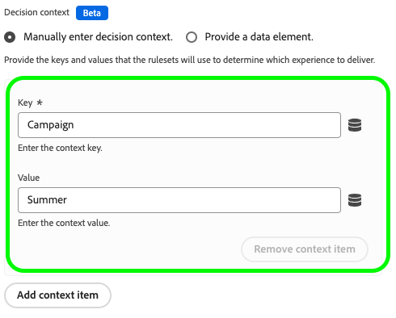

# Web SDKでの Web アプリ内メッセージのサポートの設定

アプリ内メッセージは、web アプリケーション内のユーザーに送信できる通知で、特定の目標地点へとユーザーを導きます。

これらの通知は、新機能の宣伝、特別オファーの提示、ユーザーのオンボーディングの促進など、様々な目的で使用できます。

アプリ内メッセージを使用すると、オーディエンスと効果的に関わり、アプリケーションの重要な側面に向けることができます。

>[!IMPORTANT]
>
>Web アプリ内メッセージは、[Adobe Journey Optimizer](https://experienceleague.adobe.com/docs/journey-optimizer/using/ajo-home.html?lang=ja) 機能であり、Web SDKを使用してパーソナライズされたコンテンツを配信します。
>
>Web アプリ内メッセージキャンペーンの設定方法について詳しくは、[Adobe Journey Optimizer ドキュメント &#x200B;](https://experienceleague.adobe.com/docs/journey-optimizer/using/in-app/create-in-app-web.html?lang=ja) を参照してください。


## 前提条件 {#prerequisites}

### Web SDK タグ拡張機能のバージョン {#extension-version}

Web アプリ内メッセージ機能を使用するには、最新バージョンの Web SDK タグ拡張機能が必要です。

### Web アプリ内メッセージ用の CSP の設定 {#csp}

[Web アプリ内メッセージ &#x200B;](../personalization/web-in-app-messaging.md) を設定する場合は、CSP に次のディレクティブを含める必要があります。

```
default-src  blob:;
```

CSP の設定について詳しくは、[&#x200B; 専用ドキュメント &#x200B;](../use-cases/configuring-a-csp.md) を参照してください。

## Web SDK タグ拡張機能を使用した web アプリ内メッセージの設定 {#tag-extension}

以下に説明する設定の場所については、[Web SDK タグ拡張機能の設定ページ &#x200B;](../../tags/extensions/client/web-sdk/web-sdk-extension-configuration.md) を参照してください。

Web SDK タグ拡張機能を [&#x200B; インストール &#x200B;](../../tags/extensions/client/web-sdk/web-sdk-extension-configuration.md#install-the-web-sdk-tag-extension) したら、次の手順に従って Web アプリ内メッセージ用の拡張機能を設定します。

「**[!UICONTROL Personalization]**」セクションで、「**[!UICONTROL パーソナライゼーションストレージを有効にする]** オプションをオンにします。 このオプションを使用すると、ページの読み込み中にユーザーに表示されたエクスペリエンスを Web SDKで追跡できます。


Web アプリ内メッセージは、次の 2 種類のトリガーをサポートしています。

* [Experience Platformへのデータの送信](#send-data-platform)
* [メッセージの手動によるトリガー](#manual-trigger)

使用するトリガーに応じて web SDK タグ拡張機能を設定するには、次の節を参照してください。

### **[!UICONTROL Experience Platformへのデータの送信]**&#x200B;トリガーの設定手順 {#send-data-platform}

Web SDK拡張機能を含むタグプロパティを選択し、次の設定を使用して [&#x200B; 新しいルールを作成 &#x200B;](../../tags/ui/managing-resources/rules.md##create-a-rule) します。

1. **[!UICONTROL 拡張機能]**: [!UICONTROL Core]
2. **[!UICONTROL イベントタイプ]**:[!UICONTROL &#x200B; ライブラリが読み込まれました（ページのトップ） &#x200B;]

   

3. 「**[!UICONTROL 変更を保持]**」を選択して、イベント設定を保存します。

次に、作成したルールにアクションを追加します。

1. 「[!DNL Actions]」セクションで、「**[!UICONTROL 追加]**」を選択します。
   

2. 次の **[!UICONTROL アクション]** 設定を使用します。
   * **[!UICONTROL 拡張機能]**: [!UICONTROL Adobe Experience Platform Web SDK]
   * **[!UICONTROL アクションタイプ]**:[!UICONTROL &#x200B; イベントを送信 &#x200B;]

     

3. 画面の右側の「**[!UICONTROL Personalization]**」セクションで、「**[!UICONTROL ビジュアルパーソナライゼーションの決定をレンダリング]** オプションを有効にします。
   

4. 画面の右側の「**[!UICONTROL 決定コンテキスト]**」セクションで、キャンペーン設定で使用した **[!UICONTROL キー]**/**[!UICONTROL 値]** のペアを定義して、アプリ内メッセージに適合します。
   

5. 「**[!UICONTROL 変更を保持]**」を選択して、設定を保存します。


次に、新しく作成したルールをタグプロパティライブラリに追加する必要があります。 これを行うには、**[!UICONTROL 公開フロー]** に移動し、以前に作成したルールを選択します。


ルールをライブラリに追加したら、「保存して開発用にビルド **[!UICONTROL を選択し]** す。


これで設定プロセスが完了し、メッセージをユーザーに表示する準備が整いました。

### 手動トリガーを使用するための設定手順 {#manual-trigger}

Web SDK拡張機能を含むタグプロパティを選択し、次の設定を使用して [&#x200B; 新しいルールを作成 &#x200B;](../../tags/ui/managing-resources/rules.md##create-a-rule) します。

1. **[!UICONTROL 拡張機能]**: [!UICONTROL Core]
2. **[!UICONTROL イベントタイプ]**:[!UICONTROL &#x200B; クリック &#x200B;]
3. 選択した CSS セレクターで識別される、ページ上の特定の要素のトリガーを設定します。

   


次に、作成したルールにアクションを追加します。

1. 「[!DNL Actions]」セクションで、「**[!UICONTROL 追加]**」を選択します。
   

2. 次の **[!UICONTROL アクション]** 設定を使用します。
   * **[!UICONTROL 拡張機能]**: [!UICONTROL Adobe Experience Platform Web SDK]
   * **[!UICONTROL アクションタイプ]**:[!UICONTROL &#x200B; ルールセットを評価 &#x200B;]

     

3. 画面の右側で、「**[!UICONTROL ビジュアルパーソナライゼーションの決定をレンダリング]** オプションを有効にします。
   


4. 画面の右側の「**[!UICONTROL 決定コンテキスト]**」セクションで、キャンペーン設定で使用した **[!UICONTROL キー]**/**[!UICONTROL 値]** のペアを定義して、アプリ内メッセージに適合します。
   

5. 「**[!UICONTROL 変更を保持]**」を選択して、設定を保存します。

次に、新しく作成したルールをタグプロパティライブラリに追加する必要があります。 これを行うには、**[!UICONTROL 公開フロー]** に移動し、以前に作成したルールを選択します。


ルールをライブラリに追加したら、「保存して開発用にビルド **[!UICONTROL を選択し]** す。


これで設定プロセスが完了し、メッセージをユーザーに表示する準備が整いました。

## Web SDK JavaScript ライブラリを使用して web アプリ内メッセージを設定します {#js-library}

Web SDK タグ拡張機能を使用する代わりに、Web SDK JavaScript ライブラリから直接 Web アプリ内メッセージを設定することもできます。


Adobe Journey Optimizerからの web アプリ内メッセージは、2 とおりの方法で表示できます。

### 方法 1：パーソナライゼーションコンテンツの自動取得 {#automatic}

ページの読み込み時に Web SDKでパーソナライゼーションコンテンツを自動的に取得するには、`sendEvent` コマンドを使用します（下図を参照）。

```js
  alloy("sendEvent", {
      renderDecisions: true,
      personalization: {
          surfaces: ['#welcome']
      }
  });
```

### 方法 2：ユーザーアクションに基づいてパーソナライゼーションコンテンツを手動で取得する {#manual}

ユーザーが特定のアクションを実行した後にのみパーソナライゼーションコンテンツを表示するには、次の例に示すように、`evaluateRulesets` コマンドを使用します。

この例では、パーソナライゼーションコンテンツは、ユーザーが web サイトの「**[!UICONTROL 今すぐ購入]**」ボタンをクリックすると表示されます。

```js
 alloy("evaluateRulesets", {
     renderDecisions: true,
     personalization: {
         decisionContext: {
             "userAction": "buy_now"
         }
     }
 });
```

### パーソナライゼーションストレージの設定 {#personalization-storage}

「`personalizationStorageEnabled` 設定」オプションを使用して、設定した回数のアプリ内メッセージを表示することも、ページを訪問するたびに表示することもできます。

[Web SDK設定 &#x200B;](../commands/configure/overview.md) で、必要に応じて `personalizationStorageEnabled` オプションを設定します。

* `personalizationStorageEnabled: true` は、アプリ内メッセージを [Adobe Journey Optimizer キャンペーン &#x200B;](https://experienceleague.adobe.com/docs/journey-optimizer/using/in-app/create-in-app-web.html?lang=ja#configure-inapp) で定義した頻度でトリガー付けします。
* ページが読み込まれるたびにアプリ内メッセージを `personalizationStorageEnabled: false`トリガーします。
