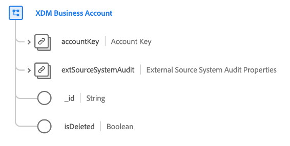

# [!UICONTROL XDM Business Account] クラス

>[!IMPORTANT]
>
>このクラスは、[Adobe Real-time Customer Data Platform B2B Edition](../../../rtcdp/b2b-overview.md) にアクセスできる組織で使用することを目的としています。 このクラスを [ リアルタイム顧客プロファイル ](../../../profile/home.md) に加えるには、Real-Time CDP B2B Edition へのアクセス権が必要です。

[!UICONTROL XDM ビジネスアカウント ] は、ビジネスアカウントに必要な最小限のプロパティをキャプチャする、標準のエクスペリエンスデータモデル（XDM）クラスです。

| プロパティ | データタイプ | 説明 |
| --- | --- | --- |
| `accountKey` | [[!UICONTROL B2B Source]](../../data-types/b2b-source.md) | アカウントエンティティの複合識別子。 |
| `extSourceSystemAudit` | [[!UICONTROL  外部Source システム監査属性 ]](../../data-types/external-source-system-audit-attributes.md) | アカウントが外部ソースシステムに由来する場合、このオブジェクトはそのシステムの監査属性を取得します。 |
| `_id` | 文字列 | レコードの一意の識別子。 これは、`accountKey` 識別子とは別の、システムで生成された値です。 |
| `isDeleted` | ブール値 | このアカウント エンティティがMarketo Engageで削除されているかどうかを示します。  [Marketo ソースコネクタを使用 ](../../../sources/connectors/adobe-applications/marketo/marketo.md) すると、Marketoで削除されたすべてのレコードがリアルタイム顧客プロファイルに自動的に反映されます。 ただし、これらのプロファイルに関連するレコードは、引き続きデータレイクに保持される場合があります。 `isDeleted` を `true` に設定すると、フィールドを使用して、データレイクのクエリ時にソースから削除されたレコードをフィルターで除外できます。 |

{style="table-layout:auto"}

このクラスが他の B2B クラスと概念的にどのように関連し、Real-Time CDP UI でこれらの関係を確立する方法については、[Adobe Experience Platform B2B Edition のスキーマの関係 ](../../tutorials/relationship-b2b.md) に関するガイドを参照してください。
