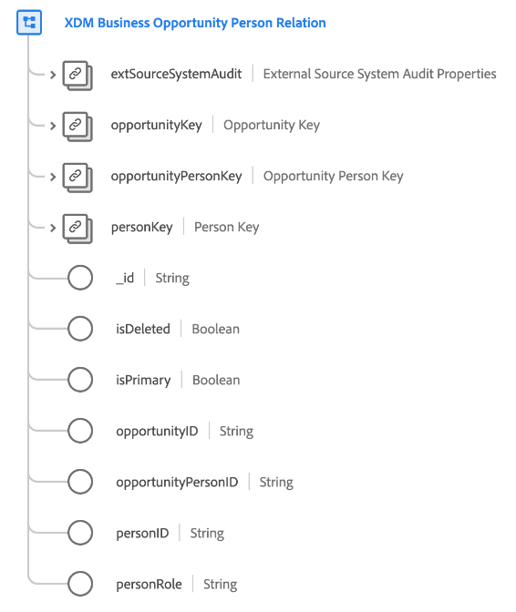

# [!UICONTROL XDM Business Opportunity Person Relationclass ] 

>[!NOTE]
>
>このクラスは、リアルタイム顧客データプラットフォームのB2Bエディションにアクセスできる組織でのみ使用できます。

[!UICONTROL XDM Business Opportunity Person Relationationap] は、ビジネスオポチュニティに関連付けられている個人の最低限必要なプロパティを取得する、標準のExperience Data Model(XDM)クラスです。

| プロパティ | データタイプ | 説明 |
| --- | --- | --- |
| `extSourceSystemAudit` | [[!UICONTROL 外部ソース・システム監査属性]](../../data-types/external-source-system-audit-attributes.md) | ビジネス・パーソンの関係が外部ソース・システムから取得された場合、このオブジェクトはそのシステムの監査属性を取り込みます。 |
| `opportunityKey` | [[!UICONTROL B2Bソース]](../../data-types/b2b-source.md) | 営業案件と個人関係の営業案件の複合識別子。 |
| `opportunityPersonKey` | [[!UICONTROL B2Bソース]](../../data-types/b2b-source.md) | 営業案件 — 個人関係エンティティの複合識別子。 |
| `personKey` | [[!UICONTROL B2Bソース]](../../data-types/b2b-source.md) | 営業案件と個人関係の個人の複合識別子。 |
| `_id` | 文字列 | レコードの一意の識別子。 これは、クラスで取り込まれる他のIDフィールドとは別の、システムで生成される値です。 |
| `opportunityID` | 文字列 | 営業案件と個人関係の営業案件の一意の識別子です。 |
| `opportunityPersonID` | 文字列 | 営業案件 — 個人関係エンティティの一意の識別子 |
| `isPrimary` | Boolean | 個人がこの営業案件の主要連絡先かどうかを示します。 |
| `personID` | 文字列 | 営業案件と個人の関係にある個人の一意の識別子です。 |
| `personRole` | 文字列 | 営業案件と個人の関係における個人の役割です。 |
