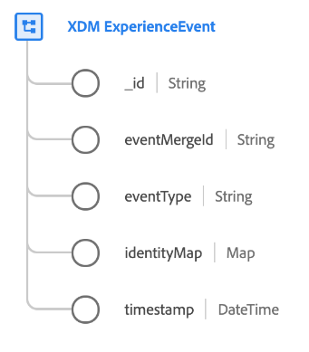
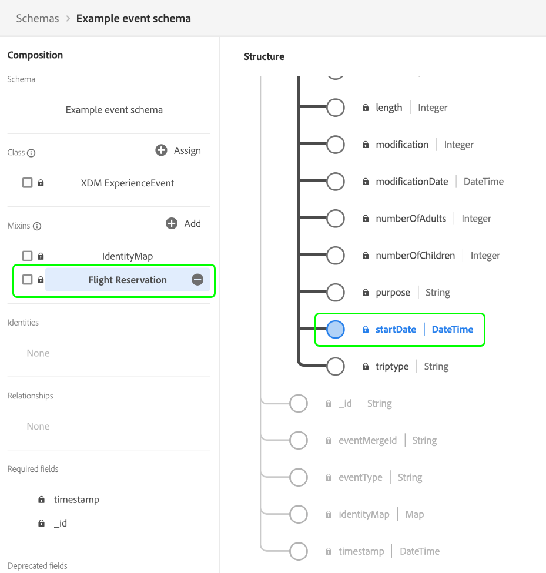

# [!DNL XDM ExperienceEvent] クラス

[!DNL XDM ExperienceEvent]は標準Experience Data Model （XDM） クラスです。 このクラスを使用すると、特定のイベントが発生した場合や、特定の条件セットに達した場合に、システムのタイムスタンプ付きスナップショットを作成できます。

エクスペリエンスイベントは、発生した事実（特定の時点や個人の ID など）の記録したものです。イベントは、明示的（直接観察可能な人間のアクション）または暗黙的（人間の直接のアクションなしに発生したもの）に設定でき、集計や解釈なしで記録されます。Experience Platform エコシステムにおけるこのクラスの使用に関する詳細については、[XDMの概要](../home.md#data-behaviors)を参照してください。

[!DNL XDM ExperienceEvent] クラス自体は、スキーマに対していくつかの時系列関連フィールドを提供します。 これらのフィールド （`_id`と`timestamp`）のうち2つは、このクラスに基づくすべてのスキーマに&#x200B;**必須**&#x200B;ですが、残りはオプションです。 一部のフィールドの値は、データの取り込み時に自動的に入力されます。

| プロパティ | 説明 |
| --- | --- |
| `_id` **（必須）** | Experience Event Class `_id` フィールドは、Adobe Experience Platformに取り込まれる個々のイベントを一意に識別します。 このフィールドは、個々のイベントの一意性を追跡し、データの重複を防ぎ、ダウンストリームサービスでそのイベントを検索するために使用されます。  重複するイベントが検出された場合、Experience Platform アプリケーションとサービスでは、重複の処理が異なる場合があります。 例えば、同じ`_id`を持つイベントがプロファイルストアに既に存在する場合、プロファイルサービス内の重複イベントはドロップされます。 ただし、これらのイベントはデータレイクに記録されたままです。  場合によっては、`_id`を[&#x200B; ユニバーサル固有識別子（UUID） &#x200B;](https://datatracker.ietf.org/doc/html/rfc4122)または[&#x200B; グローバル固有識別子（GUID） &#x200B;](https://learn.microsoft.com/en-us/dotnet/api/system.guid?view=net-5.0)にすることができます。   ソース接続からデータをストリーミングする場合、またはParquet ファイルから直接取り込む場合は、イベントを一意にするフィールドの特定の組み合わせを連結して、この値を生成する必要があります。 連結できるイベントの例には、プライマリ ID、タイムスタンプ、イベントタイプなどがあります。 連結された値は、`uri-reference` 形式の文字列にする（コロン文字は削除する）必要があります。 その後、連結された値は、SHA-256 または選択した別のアルゴリズムを使用してハッシュ化する必要があります。  **このフィールドは、個人に関連する ID を表すものではなく**、データ記録そのものを表していることを見極めることが重要です。人物に関する ID データは、代わりに互換性のあるフィールドグループが提供する [ID フィールド](../schema/composition.md#identity)に降格させるべきです。 |
| `eventMergeId` | [Adobe Experience Platform Web SDK](/help/collection/js/js-overview.md) を使用してデータを取り込む場合、レコードを作成する原因となった取り込まれたバッチの ID を表します。 このフィールドは、データの取り込み時にシステムによって自動的に入力されます。 Web SDK 実装のコンテキスト以外に、このフィールドの使用はサポートされていません。 |
| `eventType` | イベントのタイプまたはカテゴリを示す文字列。 このフィールドは、同じスキーマとデータセット内の異なるイベントタイプを区別する場合（リテール企業で製品を表示するイベントと買い物かごへの追加イベントを区別する場合など）に使用できます。  このプロパティの標準値は、[付録の節](#eventType)に記載されています（意図するユースケースの説明も含む）。このフィールドは拡張可能な列挙型で、つまり、独自のイベントタイプ文字列を使用して、追跡するイベントを分類することもできます。  `eventType` では、アプリケーションでのヒットごとに 1 つのイベントのみを使用するように制限されているので、最も重要なイベントをシステムに伝えるには、計算フィールドを使用する必要があります。 詳しくは、[計算フィールドのベストプラクティス](#calculated)の節を参照してください。 |
| `producedBy` | イベントのプロデューサーまたはオリジンを表す文字列の値。セグメント化で必要な場合、このフィールドを使用すると特定のイベントプロデューサーを除外できます。  このプロパティの推奨値の一部が、[付録の節](#producedBy)に記載されています。このフィールドは拡張可能な列挙型で、つまり、独自の文字列を使用して、異なるイベントプロデューサーを表すこともできます。 |
| `identityMap` | イベントが適用される個人の名前空間 ID のセットを含む map フィールド。 このフィールドは、ID データが取り込まれると、システムによって自動的に更新されます。 このフィールドを[&#x200B; リアルタイム顧客プロファイル &#x200B;](../../profile/home.md)用に適切に利用するには、データ操作でフィールドの内容を手動で更新しようとしないでください。  そのユースケースについては、[スキーマ構成の基本](../schema/composition.md#identityMap) の ID マップの節を参照してください。 |
| `timestamp` **（必須）** | イベントが発生した時点の ISO 8601 タイムスタンプ（[RFC 3339 セクション 5.6](https://datatracker.ietf.org/doc/html/rfc3339) を準拠した書式設定）。このタイムスタンプ **must**&#x200B;は過去に発生していますが、**must**&#x200B;は1970年以降に発生しています。 このフィールドの使用に関するベストプラクティスについては、以下の[タイムスタンプ](#timestamps)の節を参照してください。 |

{style="table-layout:auto"}

## イベントモデリングのベストプラクティス

以下の節で、Adobe Experience Platform でイベントベースのエクスペリエンスデータモデル（XDM）スキーマを設計する際のベストプラクティスについて説明します。

### タイムスタンプ {#timestamps}

イベントスキーマのルート `timestamp` フィールドは、イベント自体の観測&#x200B;**のみ**&#x200B;を表すことができ、過去の日付にする必要があります。 ただし、イベント **は1970年以降に開催する必要があります**。 セグメント化のユースケースで、使用するタイムスタンプが将来の日付になる可能性がある場合、これらの値はエクスペリエンスイベントスキーマの他の場所で制約を受ける必要があります。

例えば、旅行業界や接客業のビジネスがフライト予約イベントをモデリングしている場合、クラスレベルの `timestamp`フィールドは、予約イベントが観測された時刻を表します。 旅行予約の開始日など、イベントに関連するその他のタイムスタンプは、標準フィールドグループまたはカスタムフィールドグループが提供する別のフィールドで取得する必要があります。

クラスレベルのタイムスタンプをイベントスキーマの他の関連する日時値から分離することで、エクスペリエンスアプリケーションでカスタマージャーニーをタイムスタンプで記録しながら、柔軟なセグメント化のユースケースを実装することができます。

### 計算フィールドの使用 {#calculated}

エクスペリエンスアプリケーションにおける特定のインタラクションの結果、技術的に同じイベントタイムスタンプを共有する複数の関連イベントが発生する可能性があるので、それらのインタラクションを単一のイベントレコードとして表現できます。 例えば、顧客が web サイトで製品を閲覧すると、結果的に、可能性のある 2 つの `eventType` 値を持つイベントレコードになることがあります。「製品ビュー」イベント（`commerce.productViews`）または汎用的な「ページビュー」イベント（`web.webpagedetails.pageViews`）の 2 つです。 このような場合、1 回のヒットで複数のイベントがキャプチャされる際に、計算フィールドを使用して最も重要な属性をキャプチャすることができます。

[Adobe Experience Platform Data Prep](../../data-prep/home.md)を使用して、XDMとの間でデータをマッピング、変換、検証します。 サービスから提供される[マッピング機能](../../data-prep/functions.md)を使用すると、複数のイベントレコードのデータを Experience Platform に取り込む際に、論理演算子を呼び出してデータの優先順位付け、変換および統合を行うことができます。上記の例では、「製品ビュー」と「ページビュー」の両方が発生した場合に「ページビュー」よりも「製品ビュー」を優先させる計算フィールドとして、`eventType` を指定することができます。

UIを使用してExperience Platformにデータを手動で取り込む場合は、計算フィールドの作成方法について詳しくは、[計算フィールド &#x200B;](../../data-prep/ui/mapping.md#calculated-fields)に関するガイドを参照してください。

ソース接続を使用してExperience Platformにデータをストリーミングする場合は、代わりに計算フィールドを使用するようにソースを設定できます。 接続を設定する際に計算フィールドを実装する手順については、 [特定のソースのドキュメント](../../sources/home.md) を参照してください。

## 互換性のあるスキーマフィールドグループ {#field-groups}

>[!NOTE]
>
>複数のフィールドグループの名前が変更されました。 詳しくは、[フィールドグループ名の更新](../field-groups/name-updates.md)のドキュメントを参照してください。

アドビでは、 [!DNL XDM ExperienceEvent] クラスで使用するためのいくつかの標準フィールドグループを提供しています。 このクラスで一般的に使用されるフィールドグループは次のとおりです。

* [[!UICONTROL Adobe Analytics ExperienceEvent Full Extension]](../field-groups/event/analytics-full-extension.md)
* [[!UICONTROL Adobe Advertising ExperienceEvent Full Extension]](../field-groups/event/advertising-full-extension.md)
* [[!UICONTROL Balance Transfers]](../field-groups/event/balance-transfers.md)
* [[!UICONTROL Campaign Marketing Details]](../field-groups/event/campaign-marketing-details.md)
* [[!UICONTROL Card Actions]](../field-groups/event/card-actions.md)
* [[!UICONTROL Channel Details]](../field-groups/event/channel-details.md)
* [[!UICONTROL Commerce Details]](../field-groups/event/commerce-details.md)
* [[!UICONTROL Deposit Details]](../field-groups/event/deposit-details.md)
* [[!UICONTROL Device Trade-In Details]](../field-groups/event/device-trade-in-details.md)
* [[!UICONTROL Dining Reservation]](../field-groups/event/dining-reservation.md)
* [[!UICONTROL End User ID Details]](../field-groups/event/enduserids.md)
* [[!UICONTROL Environment Details]](../field-groups/event/environment-details.md)
* [[!UICONTROL Flight Reservation]](../field-groups/event/flight-reservation.md)
* [[!UICONTROL IAB TCF 2.0 Consent]](../field-groups/event/iab.md)
* [[!UICONTROL Lodging Reservation]](../field-groups/event/lodging-reservation.md)
* [[!UICONTROL MediaAnalytics Interaction Details]](../field-groups/event/mediaanalytics-interaction.md)
* [[!UICONTROL Quote Request Details]](../field-groups/event/quote-request-details.md)
* [[!UICONTROL Reservation Details]](../field-groups/event/reservation-details.md)
* [[!UICONTROL Web Details]](../field-groups/event/web-details.md)

## 付録

次の節では、[!UICONTROL XDM ExperienceEvent] クラスに関する追加情報を示します。

### `eventType` の許容値 {#eventType}

次の表に、 `eventType` の許容値とその定義の概要を示します。

| 値 | 定義 |
| --- | --- |
| `advertising.clicks` | このイベントは、広告を選択するアクションが発生したときに追跡されます。 |
| `advertising.completes` | このイベントは、タイムドメディアアセットが完了するまで監視されたタイミングを追跡します。 これは、視聴者がビデオ全体を視聴したことを必ずしも意味するものではなく、視聴者は先にスキップした可能性があります。 |
| `advertising.conversions` | このイベントは、パフォーマンス評価のためにイベントをトリガーする、お客様が実行した事前定義済みのアクションをトラッキングします。 |
| `advertising.federated` | このイベントは、エクスペリエンスイベントがデータフェデレーション（顧客間のデータ共有）を通じて作成されたかどうかを追跡します。 |
| `advertising.firstQuartiles` | このイベントは、デジタル動画広告が通常の速度でデュレーションの25%を再生した場合に追跡されます。 |
| `advertising.impressions` | このイベントは、表示される可能性のある顧客に対する広告のインプレッションを追跡します。 |
| `advertising.midpoints` | このイベントは、デジタル動画広告が通常の速度でデュレーションの50%を再生した場合に追跡されます。 |
| `advertising.starts` | このイベントは、デジタル動画広告の再生が開始された時点を追跡します。 |
| `advertising.thirdQuartiles` | このイベントは、デジタル動画広告が通常の速度でデュレーションの75%を再生した場合に追跡されます。 |
| `advertising.timePlayed` | このイベントは、特定のタイムドメディアアセットにユーザーが費やした時間を追跡します。 |
| `application.close` | このイベントは、アプリケーションが閉じられたか、バックグラウンドに送信されたかを追跡します。 |
| `application.launch` | このイベントは、アプリケーションが起動またはフォアグラウンドに持ち込まれたタイミングを追跡します。 |
| `click` | **非推奨**&#x200B;ではなく、`decisioning.propositionInteract`を使用してください。 |
| `commerce.backofficeCreditMemoIssued` | このイベントは、お客様にクレジット通知が発行された時点を追跡します。 |
| `commerce.backofficeOrderCancelled` | このイベントは、以前に開始した購入プロセスが完了前に終了した場合に追跡されます。 |
| `commerce.backofficeOrderItemsShipped` | このイベントは、購入した商品が顧客に物理的に出荷された時点を追跡します。 |
| `commerce.backofficeOrderPlaced` | このイベントは、注文の配置を追跡します。 |
| `commerce.backofficeShipmentCompleted` | このイベントは、出荷プロセス全体の正常な完了を追跡します。 |
| `commerce.checkouts` | このイベントは、商品リストのチェックアウトイベントが発生した場合に追跡します。 チェックアウトプロセスに複数のステップがある場合、複数のチェックアウトイベントが存在する可能性があります。 複数のステップがある場合、各イベントのタイムスタンプと参照されているページ／エクスペリエンスを使用して、各イベント（ステップ）を識別し、順に表現します。 |
| `commerce.productListAdds` | このイベントは、商品が商品リストまたはショッピングカートに追加された時点を追跡します。 |
| `commerce.productListOpens` | このイベントは、新しい商品リスト（ショッピングカート）が初期化または作成された時点を追跡します。 |
| `commerce.productListRemovals` | このイベントは、商品リストまたはショッピングカートから商品エントリが削除された場合に追跡します。 |
| `commerce.productListReopens` | このイベントは、アクセスできなくなった商品リスト（ショッピングカート）が、リマーケティングアクティビティを介して顧客によって再アクティブ化された場合を追跡します。 |
| `commerce.productListViews` | このイベントは、商品リストまたはショッピングカートが閲覧を受け取った時点を追跡します。 |
| `commerce.productViews` | このイベントは、製品が1つ以上のビューを受け取った場合に追跡されます。 |
| `commerce.purchases` | このイベントは、注文が受け入れられた時点を追跡します。 これはコマースコンバージョンで唯一必要なアクションです。購入イベントでは商品リストが参照されている必要があります。 |
| `commerce.saveForLaters` | このイベントは、商品リストが将来の使用のために保存された場合（商品ウィッシュリストなど）を追跡します。 |
| `decisioning.propositionDisplay` | このイベントは、Web SDKがページに表示されている内容に関する情報を自動的に送信する場合に使用されます。 ただし、ページの上下のヒットなど、他の方法で表示情報を既に含めている場合は、このイベントタイプは必要ありません。 ページヒットの下部では、任意のイベントタイプを選択できます。 |
| `decisioning.propositionDismiss` | このイベントタイプは、Adobe Journey Optimizer アプリケーション内メッセージまたはコンテンツカードが却下された場合に使用されます。 |
| `decisioning.propositionFetch` | イベントが主に意思決定を取得することを示すために使用されます。 Adobe Analyticsはこのイベントを自動的にドロップします。 |
| `decisioning.propositionInteract` | このイベントタイプは、パーソナライズされたコンテンツでのクリックなどのインタラクションを追跡するために使用されます。 |
| `decisioning.propositionSend` | このイベントは、見込み客に検討のためのレコメンデーションやオファーを送信することが決定された日時を追跡します。 |
| `decisioning.propositionTrigger` | この種類のイベントは、Web SDKによってローカルストレージに保存されますが、Edge Networkには送信されません。 ルールセットが満たされるたびに、イベントが生成され、ローカルストレージに保存されます（その設定が有効な場合）。 |
| `delivery.feedback` | このイベントは、メール配信などの配信のフィードバックイベントを追跡します。 |
| `directMarketing.emailBounced` | このイベントは、個人へのメールがバウンスしたときに追跡されます。 |
| `directMarketing.emailBouncedSoft` | このイベントは、メールからユーザーへのソフトバウンスを追跡します。 |
| `directMarketing.emailClicked` | このイベントは、オーディエンスがマーケティングメール内のリンクをクリックしたときに追跡されます。 |
| `directMarketing.emailDelivered` | このイベントは、メールがユーザーのメールサービスに正常に配信されたときに追跡されます。 |
| `directMarketing.emailOpened` | このイベントは、オーディエンスがマーケティングメールを開封したタイミングを追跡します。 |
| `directMarketing.emailSent` | このイベントは、マーケティングメールが個人に送信された時点を追跡します。 |
| `directMarketing.emailUnsubscribed` | このイベントは、オーディエンスがマーケティングメールの購読を解除したタイミングを追跡します。 |
| `display` | **非推奨**&#x200B;ではなく、`decisioning.propositionDisplay`を使用してください。 |
| `inappmessageTracking.dismiss` | このイベントは、アプリ内メッセージが却下された場合に追跡されます。 |
| `inappmessageTracking.display` | このイベントは、アプリ内メッセージが表示されたときに追跡されます。 |
| `inappmessageTracking.interact` | このイベントは、アプリ内メッセージがいつ操作されたかを追跡します。 |
| `leadOperation.callWebhook` | このイベントは、リードに応答してWebhookが呼び出されたときに追跡されます。 |
| `leadOperation.changeCampaignStream` | このイベントは、特定のビジネスリードのマーケティング戦略やエンゲージメント戦略の変化を意味します。 |
| `leadOperation.changeEngagementCampaignCadence` | このイベントは、キャンペーンの一環としてリードがエンゲージする頻度に変更があった場合に追跡されます。 |
| `leadOperation.convertLead` | このイベントは、リードがコンバージョンされた日付を追跡します。 |
| `leadOperation.interestingMoment` | このイベントは、興味深い瞬間が人のために記録されたときに追跡されます。 |
| `leadOperation.mergeLeads` | このイベントは、同じエンティティを参照する複数のリードの情報が統合された場合に追跡されます。 |
| `leadOperation.newLead` | このイベントは、リードがいつ作成されたかを追跡します。 |
| `leadOperation.scoreChanged` | このイベントは、リードのスコア属性の値が変更された時点を追跡します。 |
| `leadOperation.statusInCampaignProgressionChanged` | このイベントは、キャンペーン内のリードのステータスが変更された場合に追跡されます。 |
| `listOperation.addToList` | このイベントは、オーディエンスがマーケティングリストに追加された日時を追跡します。 |
| `listOperation.removeFromList` | このイベントは、オーディエンスがマーケティングリストから削除された日時を追跡します。 |
| `media.adBreakComplete` | このイベントは、広告ブレークの完了を示します。 |
| `media.adBreakStart` | このイベントは、広告休憩の開始を示しています。 |
| `media.adComplete` | このイベントは、広告の完了を示します。 |
| `media.adSkip` | このイベントは、広告がスキップされた際にシグナルを発します。 |
| `media.adStart` | このイベントは、広告の開始を示します。 |
| `media.bitrateChange` | このイベントは、ビットレートが変化した場合にシグナルを発します。 |
| `media.bufferStart` | バッファリングが開始されると、`media.bufferStart` イベントタイプが送信されます。 特定の`bufferResume` イベントタイプはありません。`play` イベントの後に`bufferStart` イベントが送信されたときに、バッファリングが再開されたと見なされます。 |
| `media.chapterComplete` | このイベントは、章の完了を示します。 |
| `media.chapterSkip` | このイベントは、ユーザーが別のセクションまたは章に進むまたは戻るときにトリガーされます。 |
| `media.chapterStart` | このイベントは、章の始まりを示します。 |
| `media.downloaded` | このイベントは、メディアのダウンロード済みコンテンツが発生したときに追跡されます。 |
| `media.error` | このイベントは、メディアの再生中にエラーが発生したときに通知されます。 |
| `media.pauseStart` | このイベントは、`pauseStart` イベントが発生したときに追跡します。 このイベントは、ユーザーがメディア再生の一時停止を開始するとトリガーされます。 再開イベントタイプがありません。 `pauseStart`の後に再生イベントを送信すると、履歴書が推測されます。 |
| `media.ping` | `media.ping` イベントタイプは、継続的な再生ステータスを示すために使用されます。 メインコンテンツの場合、このイベントは、再生開始後10秒以降、再生中10秒ごとに送信する必要があります。 広告コンテンツの場合は、広告トラッキング中に1秒ごとに送信する必要があります。 Ping イベントは、リクエストボディにパラムマップを含めないでください。 |
| `media.play` | `media.play` イベントタイプは、プレーヤーが別の状態（`playing` `buffering,` （ユーザーが再開した場合）や`paused` （回復した場合）など、自動再生などのシナリオを含む別の状態から`error`状態に移行したときに送信されます。 このイベントは、プレーヤーの`on('Playing')` コールバックによってトリガーされます。 |
| `media.sessionComplete` | このイベントは、メインコンテンツの最後に達したときに送信されます。 |
| `media.sessionEnd` | `media.sessionEnd` イベントタイプは、ユーザーが表示を放棄し、再表示する可能性が低い場合、直ちにセッションを閉じるようにMedia Analytics バックエンドに通知します。 このイベントが送信されない場合、セッションは非アクティブ状態の10分後、または再生ヘッドの移動なしで30分後にタイムアウトします。 そのセッション IDを持つ後続のメディア呼び出しは無視されます。 |
| `media.sessionStart` | `media.sessionStart` イベントタイプは、セッション開始呼び出しで送信されます。 応答を受け取ると、セッション IDは場所ヘッダーから抽出され、コレクションサーバーへのすべての後続のイベント呼び出しに使用されます。 |
| `media.statesUpdate` | このイベントは、`statesUpdate` イベントが発生したときに追跡します。 プレーヤーの状態トラッキング機能は、オーディオまたはビデオストリームに添付できます。 標準の状態は、`fullscreen`、`mute`、`closedCaptioning`、`pictureInPicture`および`inFocus`です。 |
| `opportunityEvent.addToOpportunity` | このイベントは、ユーザーが商談に追加された日時を追跡します。 |
| `opportunityEvent.opportunityUpdated` | このイベントは、商談が更新されたときに追跡されます。 |
| `opportunityEvent.removeFromOpportunity` | このイベントは、ユーザーが商談から削除された日時を追跡します。 |
| `personalization.request` | **非推奨**&#x200B;ではなく、`decisioning.propositionFetch`を使用してください。 |
| `pushTracking.applicationOpened` | このイベントは、ユーザーがプッシュ通知からアプリケーションを開いたときに追跡します。 |
| `pushTracking.customAction` | このイベントは、ユーザーがプッシュ通知でカスタムアクションを選択した場合に追跡されます。 |
| `web.formFilledOut` | このイベントは、オーディエンスがweb ページのフォームに入力したときに追跡されます。 |
| `web.webinteraction.linkClicks` | リンクのクリックがWeb SDKによって自動的に記録されたことを示すイベント シグナル。 |
| `web.webpagedetails.pageViews` | このイベントタイプは、ヒットをページビューとしてマークするための標準的な方法です。 |
| `location.entry` | このイベントは、特定の場所での個人またはデバイスのエントリを追跡します。 |
| `location.exit` | このイベントは、特定の場所からの個人またはデバイスの離脱を追跡します。 |

{style="table-layout:auto"}

### `producedBy` の推奨値 {#producedBy}

`producedBy` の許容値を次の表に示します。

| 値 | 定義 |
| --- | --- |
| `self` | 自分 |
| `system` | システム |
| `salesRef` | 営業担当者 |
| `customerRep` | 顧客担当者 |
