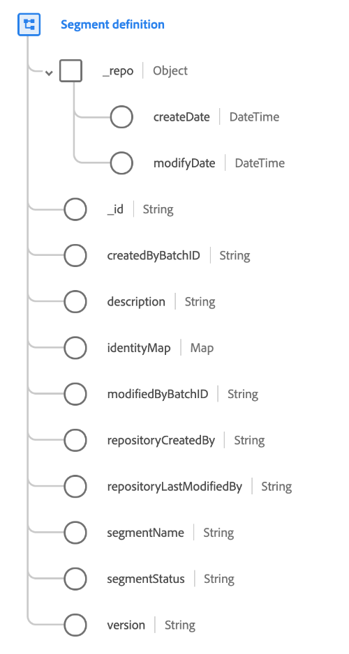

# [!UICONTROL セグメント定義] クラス

&quot;[!UICONTROL セグメント定義]「 」は、セグメント定義の詳細を取り込む標準 Experience Data Model(XDM) クラスです。 クラスには、セグメントの ID や名前などの必須フィールドと、その他のオプションの属性が含まれます。 外部システムからAdobe Experience Platformにセグメント定義を取り込む場合は、このクラスを使用する必要があります。

>[!NOTE]
>
>このクラスは、セグメント定義自体に関する情報を取り込むためにのみ使用する必要があります。 プロファイルデータ内でセグメントメンバーシップ情報を取り込むには、 [セグメントメンバーシップの詳細フィールドグループ](../field-groups/profile/segmentation.md) の [!UICONTROL XDM 個人プロファイル] スキーマ。

| プロパティ | 説明 |
| --- | --- |
| `_repo` | 次を含むオブジェクト [!UICONTROL DateTime] フィールド： <ul><li>`createDate`:データが最初に取り込まれた日時など、リソースがデータストアで作成された日時。</li><li>`modifyDate`:リソースが最後に変更された日時。</li></ul> |
| `_id` | レコードの、システムで生成される一意の文字列識別子。 このフィールドは、個々のレコードの一意性を追跡し、データの重複を防ぎ、ダウンストリームサービスでそのレコードを検索するために使用します。  このフィールドはシステムで生成されるので、データの取り込み中に明示的な値は指定されません。 ただし、必要に応じて独自の一意の ID 値を指定することもできます。  ****&#x200B;このフィールドは、個人に関連する ID を表すものではなく、データ記録そのものを表していることを見極めることが重要です。人物に関する ID データは、次の場所に置き換える必要があります [id フィールド](../schema/composition.md#identity) 代わりに、 |
| `createdByBatchID` | レコードが作成される原因となった取得済みバッチの ID。 |
| `description` | セグメント定義の説明。 |
| `identityMap` | セグメントが適用される個人の名前空間付き ID のセットを含む map フィールド。 そのユースケースについては、[スキーマ構成の基本](../schema/composition.md#identityMap) の ID マップの節を参照してください。 |
| `modifiedByBatchID` | レコードを更新した最後に取得したバッチの ID。 |
| `repositoryCreatedBy` | レコードを作成したユーザーの ID。 |
| `repositoryLastModifiedBy` | レコードを最後に変更したユーザーの ID。 |
| `segmentName` | **（必須）** セグメント定義の名前。 |
| `segmentStatus` | 外部システムからのセグメントのステータス。 次の値を使用できます。 <ul><li>`ACTIVE`</li><li>`INACTIVE`</li><li>`DELETED`</li><li>`DRAFT`</li><li>`REVOKED`</li></ul> |
| `version` | セグメント定義の最新バージョン番号。 |

{style=&quot;table-layout:auto&quot;}
