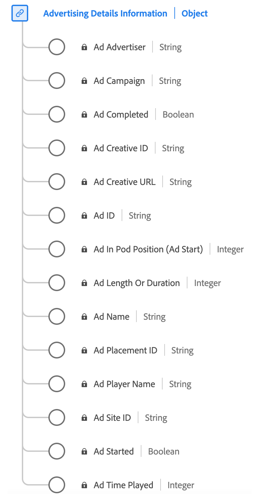

# [!UICONTROL 広告の詳細] レポートのデータタイプ

[!UICONTROL 広告の詳細] レポートは、広告に関連する主要な属性を取り込む、標準のエクスペリエンスデータモデル (XDM) データタイプです。 これには、広告 ID、広告主とキャンペーン ID、長さ、シーケンス内の位置、広告をレンダリングするプレーヤーに関する詳細などの情報が含まれます。 このデータ型を使用すると、広告のパフォーマンスとエンゲージメントの様々な側面を追跡および分析し、オーディエンスが様々な広告とどのようにやり取りし、対応するかに関するインサイトを提供できます。

+++「 」を選択して、Advertising Details Reporting データタイプのダイアグラムを表示します。

+++

| 表示名 | プロパティ | データタイプ | 説明 |
|----------------------------------------|-----------------|-----------|-----------------------------------------------------------------------------------------------|
| [!UICONTROL 広告名] | `friendlyName` | 文字列 | 人間が読み取れる広告の名前。 レポートでは、「広告名」が分類、「広告名（変数）」が eVar です。 |
| [!UICONTROL 広告 ID] | `name` | 文字列 | 広告の ID。 整数と文字の組み合わせになります。 |
| [!UICONTROL 広告の長さまたは期間] | `length` | 整数 | ビデオ広告の長さ（秒）。 |
| [!UICONTROL ポッド位置の広告（広告開始）] | `podPosition` | 整数 | 親広告開始内の広告のインデックス。例えば、最初の広告のインデックスは 0 で、2 番目の広告のインデックスは 1 です。 |
| [!UICONTROL 広告プレーヤー名] | `playerName` | 文字列 | 広告のレンダリングをおこなうプレーヤーの名前。 |
| [!UICONTROL 広告主] | `advertiser` | 文字列 | 広告で商品が取り上げられる会社またはブランド。 |
| [!UICONTROL 広告キャンペーン] | `campaignID` | 文字列 | 広告キャンペーンの ID。 |
| [!UICONTROL 広告クリエイティブ ID] | `creativeID` | 文字列 | 広告クリエイティブの ID。 |
| [!UICONTROL 広告サイト ID] | `siteID` | 文字列 | 広告サイトの ID。 |
| [!UICONTROL 広告クリエイティブ URL] | `creativeURL` | 文字列 | 広告クリエイティブの URL。 |
| [!UICONTROL 広告プレースメント ID] | `placementID` | 文字列 | 広告のプレースメント ID。 |
| [!UICONTROL 広告完了] | `isCompleted` | ブール値 | 広告が完了したかどうかをトラッキングします。 |
| [!UICONTROL 広告開始済み] | `isStarted` | ブール値 | 広告が開始したかどうかをトラッキングします。 |
| [!UICONTROL 広告再生時間] | `timePlayed` | 整数 | 広告の合計視聴時間（再生秒数）。 |

{style="table-layout:auto"}

フィールドグループについて詳しくは、 [パブリック XDM リポジトリ](https://github.com/adobe/xdm/blob/master/components/datatypes/advertisingdetails.schema.json)
