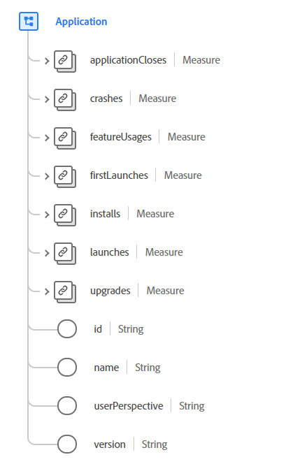

# [!UICONTROL アプリ] データタイプ

[!UICONTROL アプリ] は、アプリケーションで生成されるインタラクションに関連する詳細を記述する標準の Experience Data Model(XDM) データ型です。 アプリケーションとは、エンドユーザーがインストール、実行、閉じる、またはアンインストールできるモバイルアプリケーションやデスクトップアプリケーションなどのソフトウェアエクスペリエンスを指します。 このデータ型のプロパティは、チャットボット、ブラウザーベースのプラグイン、またはアプリケーションに適用されないその他のエクスペリエンスなどのエージェントを記述する目的ではありません。

 

| プロパティ | データタイプ | 説明 |
| --- | --- | --- |
| `applicationCloses` | [[!UICONTROL 測定]](./measure.md) | アプリケーションの終了に関する詳細を説明します。 |
| `crashes` | [[!UICONTROL 測定]](./measure.md) | このプロパティは、アプリケーションが意図したとおりに終了しない場合にトリガーします。 |
| `featureUsages` | [[!UICONTROL 測定]](./measure.md) | 測定されるアプリケーション機能のアクティベーションからのデータを表します。 |
| `firstLaunches` | [[!UICONTROL 測定]](./measure.md) | 最初の起動時のデータが含まれます。 このプロパティは、インストール後の最初の起動時にトリガーされます。 |
| `installs` | [[!UICONTROL 測定]](./measure.md) | 特定のインストールイベントが使用可能な場合に、デバイスにアプリケーションをインストールしたことを記録します。 |
| `launches` | [[!UICONTROL 測定]](./measure.md) | アプリケーションの起動に関連付けられた値を表します。 これは、実行のたびに、セッションのタイムアウトを超えたときに、クラッシュ、インストールおよびバックグラウンドからの再開を含めてトリガーされます。 |
| `upgrades` | [[!UICONTROL 測定]](./measure.md) | 以前にインストールされたアプリケーションのアップグレードに関するデータが含まれます。 これは、アップグレード後の最初の起動時にトリガーされます。 |
| `id` | 文字列 | アプリケーションの一意の ID。 |
| `name` | 文字列 |  アプリケーションの名前 |
| `userPerspective` | 文字列 | イベントが発生した時点でのユーザーとアプリまたはブランドとの間の視点または物理的な関係。 アプリに関するユーザーの視点を理解することで、セッションを正確に生成できます。これは、含めたくない多くの場合、含める必要がないからです `background` および `detached` 「アクティブ」セッションの一部としてのイベント。 このプロパティの値は、以下に示す列挙値のいずれかと等しくなければなりません。 <li> `foreground`:ユーザーとアプリが相互に直接やり取りしている。 </li> <li> `background`:アプリとユーザーは間接的に相互作用しています。 例えば、画面がロックされている間や、別のアプリがフォアグラウンドで使用されている間に、アプリは値を測定して更新できます。  </li> <li> `detached`:分離とは、イベントがアプリに関連していたが、外部システムからの電子メールの送信やプッシュ通知など、アプリから直接来ていなかったことを意味します。 |
| `version` | 文字列 | アプリケーションのバージョン。 |

{style=&quot;table-layout:auto&quot;}

データタイプについて詳しくは、パブリック XDM リポジトリを参照してください。

* [入力された例](https://github.com/adobe/xdm/blob/master/components/datatypes/channels/application.example.1.json)
* [フルスキーマ](https://github.com/adobe/xdm/blob/master/components/datatypes/channels/application.schema.json)
