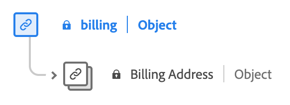

# [!UICONTROL コマース] データタイプ

[!UICONTROL コマース] は、購入および販売に関連するレコードを記述する標準 Experience Data Model(XDM) データ型です。

![の図 [!UICONTROL コマース] データタイプ。](../images/data-types/commerce.png)

| 表示名 | プロパティ | データタイプ | 説明 |
|------------------------------------------|-----------------------|------------------------------------|----------------------------------------------------------------------------------------------------------|
| [!UICONTROL Order] | `order` | [[!UICONTROL Order]](./order.md) | 1 つ以上の製品の注文を表します。 |
| [!UICONTROL プロモーション ID] | `promotionID` | [!UICONTROL 文字列] | 注文が存在する場合は、その注文のプロモーション識別子。 |
| [!UICONTROL 買い物かごの放棄] | `cartAbandons` | [[!UICONTROL 測定]](./measure.md) | 製品リストが、ユーザーによってアクセスまたは購入できなくなったと識別された日時を表します。 |
| [!UICONTROL チェックアウト] | `checkouts` | [[!UICONTROL 測定]](./measure.md) | 製品リストのチェックアウトプロセス中のアクション。 チェックアウトプロセスに複数のステップがある場合、複数のチェックアウトイベントが存在する可能性があります。 複数の手順がある場合、イベント時間情報と参照先のページまたはエクスペリエンスを使用して、手順と、順番に表される個々のイベントを識別します。 |
| [!UICONTROL 製品リスト（買い物かご）追加数] | `productListAdds` | [[!UICONTROL 測定]](./measure.md) | 商品リストへの商品の追加（買い物かごに追加される商品など）。 |
| [!UICONTROL 製品リスト（買い物かご）の開封数] | `productListOpens` | [[!UICONTROL 測定]](./measure.md) | 新しい製品リストの初期化（作成中の買い物かごなど）。 |
| [!UICONTROL 製品リスト（買い物かご）削除] | `productListRemovals` | [[!UICONTROL 測定]](./measure.md) | 製品リストからの製品エントリの削除（買い物かごからの製品の削除など）。 |
| [!UICONTROL 商品リスト（買い物かご）再オープン] | `productListReopens` | [[!UICONTROL 測定]](./measure.md) | 以前に破棄された製品リスト。ユーザーによって再アクティブ化されました。 |
| [!UICONTROL 製品リスト（買い物かご）表示] | `productListViews` | [[!UICONTROL 測定]](./measure.md) | 製品リストの表示または表示が発生した日時を表します。製品リストの表示または表示が発生しました。 |
| [!UICONTROL 製品表示回数] | `productViews` | [[!UICONTROL 測定]](./measure.md) | 個々の製品の表示がいつ発生したかを表示します。 |
| [!UICONTROL 購入] | `purchases` | [[!UICONTROL 測定]](./measure.md) | 注文が許可されたタイミングを追跡するために使用します。 コマースコンバージョンで必要なアクションは、購入イベントのみです。 購入イベントでは、製品リストが参照されている必要があります。 |
| [!UICONTROL 後で使用するために保存] | `saveForLaters` | [[!UICONTROL 測定]](./measure.md) | 製品リストが今後の使用のために保存されるタイミングを表します（ウィッシュリストなど）。 |
| [!UICONTROL 店舗での購入] | `inStorePurchase` | [[!UICONTROL 測定]](./measure.md) | 「inStore」の購入を示します。 この情報は、分析用に保存されます。 |
| [!UICONTROL 買い物かご] | `cart` | [[!UICONTROL 買い物かご]](./cart.md) | 1 つ以上の製品を含む買い物かごのプロパティ。 |
| [!UICONTROL 送料] | `shipping` | [[!UICONTROL 輸送]](./shipping.md) | 1 つ以上の製品の出荷の詳細。 |
| [!UICONTROL 課金] | `billing` | [[!UICONTROL 課金]](#billing) | 1 つ以上の支払の請求の詳細。 |
| [!UICONTROL 即時購入] | `instantPurchase` | [[!UICONTROL 測定]](./measure.md) | 製品が即座に購入された日時を示します。場合によって、買い物かごやチェックアウトをスキップする可能性があります。 |
| [!UICONTROL 購買依頼リストのオープン] | `requisitionListOpens` | [[!UICONTROL 測定]](./measure.md) | 新しい購買依頼リストの初期化を示します。 |
| [!UICONTROL 購買依頼リストの削除] | `requisitionListDeletes` | [[!UICONTROL 測定]](./measure.md) | 購買依頼リストの削除を示します。 |
| [!UICONTROL 購買依頼リストの追加] | `requisitionListAdds` | [[!UICONTROL 測定]](./measure.md) | 購買依頼リストへの製品の追加を示します。 |
| [!UICONTROL 購買依頼リストの削除] | `requisitionListRemovals` | [[!UICONTROL 測定]](./measure.md) | 購買依頼製品リストからの製品の削除を示します。 |
| [!UICONTROL 購買依頼リスト] | `requisitionList` | [[!UICONTROL requisitionlist]](./requisition-list.md) | 顧客が作成した購買依頼リストのプロパティ。 |
| [!UICONTROL 範囲] | `commerceScope` | [[!UICONTROL 歩行神経]](./commerce-scope.md) | イベントが発生した場所のコマーススコープ識別子（ストア表示、ストア、Web サイトなど）。 |

{style="table-layout:auto"}

## [!UICONTROL 課金] データタイプ {#billing}

[!UICONTROL 課金] は、請求の詳細に関する情報を含む標準の Experience Data Model(XDM) データ型です。 特に、請求先住所に焦点を当てます。

| 表示名 | プロパティ | データタイプ | 説明 |
|-------------------------------|-----------------|-----------------|--------------------------|
| [!UICONTROL 請求先住所] | `address` | [[!UICONTROL 郵送先住所]](./postal-address.md) | 請求先住所。 |

{style="table-layout:auto"}

詳しくは、 [!UICONTROL コマース] データタイプについては、パブリック XDM リポジトリを参照してください。

* [入力された例](https://github.com/adobe/xdm/blob/master/components/datatypes/marketing/commerce.example.1.json)
* [完全なスキーマ](https://github.com/adobe/xdm/blob/master/components/datatypes/marketing/commerce.schema.json)
