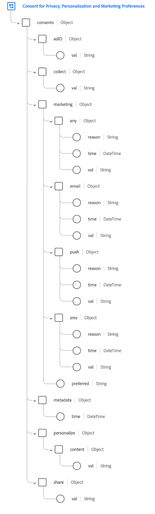

# [!UICONTROL Consents and Preferences] データ型

[!UICONTROL Consent for Privacy, Personalization and Marketing Preferences] データ型（以下「[!UICONTROL Consents and Preferences] データ型」と呼びます）は、[!DNL Experience Data Model] （XDM）データ型です。このデータ型は、同意管理プラットフォーム（CMP）およびその他のソースからデータ操作で生成される顧客の権限と環境設定の収集をサポートすることを目的としています。

このドキュメントでは、[!UICONTROL Consents and Preferences] データ型で提供されるフィールドの構造と意図された使用について説明します。

## 前提条件 {#prerequisites}

このドキュメントでは、XDMと[!DNL Experience Platform]でのスキーマの使用について理解する必要があります。 続行する前に、次のドキュメントを確認してください。

* [XDM システムの概要](https://experienceleague.adobe.com/docs/experience-platform/xdm/home.html?lang=ja)
* [スキーマ構成の基本](https://www.adobe.com/go/xdm-schema-best-practices-en)

## データタイプ構造 {#structure}

>[!IMPORTANT]
>
>[!UICONTROL Consents and Preferences] データタイプは、同意と環境設定の様々なユースケースをカバーするように設計されています。 その結果、このドキュメントでは、データタイプのフィールドの使用について一般的な用語で説明し、これらのフィールドの使用方法に関する提案のみを行います。 プライバシー法務部門と相談して、データタイプの構造と、組織がこれらの同意と好みの選択をどのように解釈し、顧客に提示するのかを決めてください。

[!UICONTROL Consents and Preferences] データタイプには、**同意**&#x200B;および&#x200B;**環境設定**&#x200B;情報を取得するために使用される複数のフィールドが用意されています。

同意とは、顧客がデータの使用方法を指定できるオプションのことです。 同意の多くは法的側面を持っており、一部の法域では、データを特定の方法で使用する前に許可を得る必要があり、顧客が肯定的な同意を必要としない場合はその使用を停止（オプトアウト）するオプションを提供する必要があります。

環境設定とは、顧客が自社の体験のさまざまな側面をどのように扱うべきかを指定できるオプションのことです。 このカテゴリは次の2つに分類されます。

* **Personalizationの環境設定**：顧客に配信するエクスペリエンスをブランドがどのようにパーソナライズすべきかについての環境設定。
* **マーケティングの環境設定**：企業が様々なチャネルを通じて顧客に連絡できるかどうかに関する環境設定。

次のスクリーンショットは、Experience Platform UIでのデータタイプの構造の表現方法を示しています。



>[!TIP]
>
>Experience Platform UIでXDM リソースを検索し、その構造を調べる手順については、[XDM リソースの探索](../ui/explore.md)に関するガイドを参照してください。

次のJSONは、[!UICONTROL Consents and Preferences] データ型が処理できるデータ型の例を示しています。 これらの各フィールドの具体的な使用方法に関する情報は、以下の節で提供されます。

```json
{
  "consents": {
    "collect": {
      "val": "VI",
    },
    "adID": {
      "idType": "IDFA",
      "val": "y"
    },
    "share": {
      "val": "y",
    },
    "personalize": {
      "content": {
        "val": "y"
      }
    },
    "marketing": {
      "preferred": "email",
      "any": {
        "val": "u"
      },
      "push": {
        "val": "n",
        "reason": "Too Frequent",
        "time": "2019-01-01T15:52:25+00:00"
      }
    },
    "metadata": {
      "time": "2019-01-01T15:52:25+00:00"
    }
  }
}
```

>[!TIP]
>
>Experience Platformで定義した任意のXDM スキーマに対して、サンプル JSON データを生成することで、顧客の同意と環境設定データのマッピング方法を視覚化できます。 詳しくは、次のドキュメントを参照してください。
>
>* [UIでサンプルデータを生成](../ui/sample.md)
>* [APIでサンプルデータを生成](../api/sample-data.md)

## `consents` {#choices}

`consents`には、顧客の同意と環境設定を説明する複数のフィールドが含まれています。 これらのフィールドについて詳しくは、以下のサブセクションを参照してください。

```json
"consents": {
  "collect": {
    "val": "VI",
  },
  "adID": {
    "idType": "IDFA",
    "val": "y"
  },
  "share": {
    "val": "y",
  },
  "personalize": {
    "content": {
      "val": "y"
    }
  },
  "marketing": {
    "preferred": "email",
    "any": {
      "val": "u"
    },
    "email": {
      "val": "n",
      "reason": "Too Frequent",
      "time": "2019-01-01T15:52:25+00:00"
    }
  }
}
```

### `collect`

`collect`は、データの収集に対する顧客の同意を表します。

```json
"collect": {
  "val": "y"
}
```

| プロパティ | 説明 |
| --- | --- |
| `val` | このユースケースに対して顧客が提供した同意の選択肢。 使用可能な値と定義については、[付録](#choice-values)を参照してください。 |

{style="table-layout:auto"}

### `adID`

`adID`は、広告主IDを使用して、このデバイス上のアプリ間で顧客をリンクできるかどうかについての顧客の同意を表します。

```json
"adID": {
  "idType": "IDFA",
  "val": "y"
}
```

| プロパティ | 説明 |
| --- | --- |
| `idType` | 広告IDの種類（Appleの広告主向けIDの`IDFA`またはGoogleの広告主向けIDの`GAID`）。Android広告主向けID （AAID）とも呼ばれます）。 |
| `val` | このユースケースに対して顧客が提供した同意の選択肢。 使用可能な値と定義については、[付録](#choice-values)を参照してください。 |

{style="table-layout:auto"}

### `share`

`share`は、自分のデータをセカンドパーティまたはサードパーティと共有（またはセールス）できるかどうかについての顧客の同意を表します。

```json
"share": {
  "val": "y"
}
```

| プロパティ | 説明 |
| --- | --- |
| `val` | このユースケースに対して顧客が提供した同意の選択肢。 使用可能な値と定義については、[付録](#choice-values)を参照してください。 |

{style="table-layout:auto"}

### `personalize` {#personalize}

`personalize`は、データをパーソナライゼーションに使用する方法に関する顧客の嗜好を取得します。 顧客は、特定のパーソナライゼーションユースケースからオプトアウトするか、パーソナライゼーションから完全にオプトアウトすることができます。

>[!IMPORTANT]
>
>`personalize`はマーケティングのユースケースをカバーしていません。 例えば、顧客がすべてのチャネルでパーソナライゼーションをオプトアウトした場合、それらのチャネルを通じたコミュニケーションの受信を停止すべきではありません。 顧客のプロファイルではなく、一般的なメッセージを送信することが重要です。
>
>同じ例では、顧客がすべてのチャネルのダイレクトマーケティングをオプトアウトした場合（`marketing`を通じて、[次のセクション ](#marketing)で説明）、パーソナライゼーションが許可されている場合でも、その顧客はメッセージを受け取ってはなりません。

```json
"personalize": {
  "content": {
    "val": "y",
  }
}
```

| プロパティ | 説明 |
| --- | --- |
| `content` | web サイトやアプリケーション上のパーソナライズされたコンテンツに対する顧客の嗜好を表します。 |
| `val` | 指定されたユースケースに対して顧客が提供するパーソナライゼーションの環境設定。 お客様が同意を提供するように求める必要がない場合、このフィールドの値は、パーソナライゼーションを実行する根拠を示す必要があります。 使用可能な値と定義については、[付録](#choice-values)を参照してください。 |

{style="table-layout:auto"}

### `marketing` {#marketing}

`marketing`は、データを使用できるマーケティング目的に関する顧客の嗜好を取得します。 顧客は、特定のマーケティングのユースケースからオプトアウトするか、ダイレクトマーケティングを完全にオプトアウトします。

```json
"marketing": {
  "preferred": "email",
  "any": {
    "val": "u"
  },
  "email": {
    "val": "n",
    "reason": "Too Frequent"
  },
  "push": {
    "val": "y"
  },
  "sms": {
    "val": "y"
  }
}
```

| プロパティ | 説明 |
| --- | --- |
| `preferred` | コミュニケーションを受信するために顧客が好むチャネルを示します。 使用可能な値については、[付録](#preferred-values)を参照してください。 |
| `any` | ダイレクトマーケティング全体に対する顧客の嗜好を表します。 このフィールドで指定された同意設定は、`marketing`で指定された追加のサブフィールドで上書きされない限り、任意のマーケティングチャネルの「デフォルト」設定と見なされます。 より詳細な同意オプションを使用する場合は、このフィールドを除外することをお勧めします。<br><br>値が`n`に設定されている場合、より特定のパーソナライゼーション設定はすべて無視する必要があります。 値が`y`に設定されている場合は、明示的に`y`に設定されていない限り、すべての細かいパーソナライゼーションオプションも`n`として扱う必要があります。 値が未設定の場合、各パーソナライゼーションオプションの値は指定どおりに尊重されます。 |
| `email` | 顧客がメール メッセージの受信に同意するかどうかを示します。 |
| `push` | 顧客がプッシュ通知の受信を許可するかどうかを示します。 |
| `sms` | 顧客がテキストメッセージの受信に同意するかどうかを示します。 |
| `val` | 指定されたユースケースに対する顧客が提供する環境設定。 顧客が同意を提供するように求められていない場合、このフィールドの値は、マーケティングのユースケースを実行する根拠を示す必要があります。 使用可能な値と定義については、[付録](#choice-values)を参照してください。 |
| `time` | マーケティング環境設定が変更された場合のISO 8601 タイムスタンプ（該当する場合）。 個々の環境設定のタイムスタンプが`metadata`で指定されたタイムスタンプと同じ場合、このフィールドはその環境設定に設定されないことに注意してください。 |
| `reason` | 顧客がマーケティングのユースケースをオプトアウトした場合、この文字列フィールドはその顧客がオプトアウトした理由を表します。 |

{style="table-layout:auto"}

### `metadata`

`metadata`は、顧客の同意と環境設定に関する一般的なメタデータを、最後に更新されたときにいつでも取得します。

```json
"metadata": {
  "time": "2019-01-01T15:52:25+00:00",
}
```

| プロパティ | 説明 |
| --- | --- |
| `time` | 顧客の同意と環境設定が最後に更新された時点のISO 8601 タイムスタンプ。 このフィールドは、負荷と複雑さを軽減するために、個々の環境設定にタイムスタンプを適用する代わりに使用できます。 個別の環境設定で`time`値を指定すると、その特定の環境設定の`metadata` タイムスタンプが上書きされます。 |

{style="table-layout:auto"}

## データタイプを使用したデータの取り込み {#ingest}

[!UICONTROL Consents and Preferences] データ型を使用して顧客から同意データを取り込むには、そのデータ型を含むスキーマに基づいてデータセットを作成する必要があります。

フィールドにデータタイプを割り当てる手順については、[UIでのスキーマの作成](https://www.adobe.com/go/xdm-schema-editor-tutorial-en)に関するチュートリアルを参照してください。 データ型[!UICONTROL Consents and Preferences]のフィールドを含むスキーマを作成したら、既存のスキーマでデータセットを作成する手順に従って、データセットユーザーガイドの[ データセットの作成](../../catalog/datasets/user-guide.md#create)に関する節を参照してください。

>[!IMPORTANT]
>
>同意データを[!DNL Real-Time Customer Profile]に送信する場合は、[!DNL Profile] データタイプを含む[!DNL XDM Individual Profile] クラスに基づいて[!UICONTROL Consents and Preferences]対応スキーマを作成する必要があります。 そのスキーマに基づいて作成するデータセットも[!DNL Profile]に対して有効にする必要があります。 スキーマとデータセットの[!DNL Real-Time Customer Profile]要件に関連する特定の手順については、上記にリンクされたチュートリアルを参照してください。
>
>さらに、顧客プロファイルを正しく更新するには、最新の同意データと環境設定データを含むデータセットの優先順位を付けるように結合ポリシーを設定する必要があります。 詳しくは、[結合ポリシー](../../rtcdp/profile/merge-policies.md)の概要を参照してください。

## 同意と環境設定の変更の処理

顧客がweb サイト上の同意や嗜好を変更した場合、その変更を収集し、使用するデータ収集ライブラリで同意を設定することですぐに適用する必要があります。 お客様がデータ収集をオプトアウトした場合、すべてのデータ収集は直ちに停止する必要があります。 顧客がパーソナライゼーションをオプトアウトした場合、次のページにパーソナライゼーションが表示されないようにする必要があります。 JavaScript ライブラリを使用する[`setConsent`](/help/collection/js/commands/setconsent.md)、またはタグ拡張機能を使用する[[!UICONTROL Set consent]](/help/tags/extensions/client/web-sdk/actions/set-consent.md) アクションを参照してください。

## 付録 {#appendix}

以下の節では、[!UICONTROL Consents and Preferences] データタイプに関する追加参照情報を提供します。

### `val` の許容値 {#choice-values}

次の表は、`val`に使用できる値の概要を示しています。

| 値 | タイトル | 説明 |
| --- | --- | --- |
| `y` | はい（オプトイン） | 顧客が同意または嗜好についてオプトインしている。 言い換えれば、該当する同意または環境設定に示されているように、データの使用に&#x200B;**do**&#x200B;の同意を得ています。 |
| `n` | いいえ（オプトアウト） | 顧客は同意または嗜好からオプトアウトしました。 言い換えれば、該当する同意または環境設定で示されているように、データの使用に&#x200B;**が**&#x200B;同意していません。 |
| `p` | 確認待ち | システムは、最終的な同意または環境設定の値をまだ受け取っていません。 これは、2段階認証を必要とする同意の一部として最もよく使用されます。 例えば、顧客が電子メールの受信をオプトインした場合、電子メール内のリンクを選択して正しい電子メールアドレスを提供したことを確認するまで、その同意は`p`に設定され、その時点で同意は`y`に更新されます。<br><br>この同意または環境設定で2 セットの検証プロセスが使用されていない場合は、代わりに`p`の選択肢を使用して、顧客が同意プロンプトに対してまだ応答していないことを示すことができます。 例えば、顧客が同意プロンプトに応答する前に、web サイトの最初のページで値を`p`に自動的に設定できます。 明示的な同意を必要としない法域では、お客様は、お客様が明示的にオプトアウトしていないことを示すために使用することもできます（つまり、同意が想定されます）。<br><br>この値は、ストリーミング取り込みなどの他のメカニズムを使用して[!DNL Profile]に取り込むことができますが、**でのデータ収集または同意収集では** サポートされていません[!DNL Edge Network]。 `p`値を明示的に送信することはできませんが、エンドユーザーの同意が明示的に[[!DNL Web SDK]](../../landing/governance-privacy-security/consent/sdk.md)になると、イベントキューは[!DNL Edge Network]によって処理され、イベントは`in`にディスパッチされます。 |
| `u` | 不明 | 顧客の同意や嗜好情報は不明です。 |
| `dy` | デフォルトの「はい」（オプトイン） | お客様が自身で同意値を提供しておらず、デフォルトではオプトイン（「はい」）として扱われます。 言い換えれば、顧客が他の方法で示すまで、同意が引き受けられます。<br><br>会社のプライバシーポリシーに法律または変更が加えられたために、一部またはすべてのユーザーのデフォルトが変更された場合は、デフォルト値を含むすべてのプロファイルを手動で更新する必要があります。 |
| `dn` | デフォルトの「いいえ」（オプトアウト） | お客様が自身で同意値を提供しておらず、デフォルトではオプトアウト（「いいえ」）として扱われます。 言い換えれば、顧客は、他の方法で示されるまで同意を拒否したものとみなされます。<br><br>会社のプライバシーポリシーに法律または変更が加えられたために、一部またはすべてのユーザーのデフォルトが変更された場合は、デフォルト値を含むすべてのプロファイルを手動で更新する必要があります。 |
| `LI` | 正当な利益 | このデータを特定の目的のために収集および処理する正当な事業上の利益は、個人に与える潜在的な損害を上回ります。 |
| `CT` | 契約 | 個人との契約上の義務を満たすために、特定の目的のためのデータの収集が必要です。 |
| `CP` | 法的義務の遵守 | 特定の目的のためのデータの収集は、ビジネスの法的義務を満たすために必要です。 |
| `VI` | 個人の重要な関心 | 特定の目的のためのデータの収集は、個人の重要な利益を保護するために必要です。 |
| `PI` | 公益 | 特定の目的のためのデータの収集は、公共の利益または公的権限の行使においてタスクを実行するために必要です。 |

{style="table-layout:auto"}

### `preferred` の許容値 {#preferred-values}

次の表は、`preferred`に使用できる値の概要を示しています。 `preferred`の値は、データ収集、プライバシーポリシー、パーソナライゼーションオプションに関するコミュニケーションを受信する際に、顧客が好むチャネルを示します。

| 値 | 説明 |
| --- | --- |
| `email` | この環境設定は、電子メールを介したメッセージの受信に対する顧客の同意を示します。 |
| `push` | この環境設定は、プッシュ通知の受信に対する顧客の同意を示します。 多くの場合、モバイルアプリケーションを通じて、デバイスに直接送信されるメッセージやアラートです。 |
| `inApp` | この環境設定は、アプリ内メッセージの受信に対する顧客の同意を示します。 これらのメッセージは、モバイルアプリケーションまたはweb アプリケーション内で配信され、ユーザーがアプリに積極的にエンゲージしている間に情報を提供します。 |
| `sms` | この環境設定は、SMS （ショートメッセージサービス）を介したメッセージの受信に対する顧客の同意を示します。 これらは、携帯電話に送信されたテキストメッセージです。 |
| `phone` | この環境設定は、電話でのやり取りを通じたコミュニケーションの受信に対する顧客の同意を示します。 |
| `phyMail` | この環境設定は、物理的なメールを通じて資料を受け取ることに顧客が同意していることを示します。 |
| `inVehicle` | この環境設定は、車内での通知の受信に対する顧客の同意を示します。 これらのメッセージは、車両情報システムまたはその他の車内通信チャネルを通じて配信することができる。 |
| `inHome` | この環境設定は、自宅にいる間にメッセージを受信することに対する顧客の同意を示します。 これらのメッセージは、スマートホームデバイスやその他のホームベースの通信チャネルを通じて配信できます。 |
| `iot` | この環境設定は、IoT （モノのインターネット）に関連するメッセージの受信に対する顧客の同意を示します。 これらのメッセージは、環境内の接続されたデバイスやシステムを通じて配信できます。 |
| `social` | この環境設定は、ソーシャルメディアプラットフォームを通じたコミュニケーションの受信に対する顧客の同意を示します。 |
| `other` | この環境設定には、標準的なカテゴリに収まらないチャネルも含まれます。 特定のビジネスや業界に特化した、代替または専門的なコミュニケーションチャネルを表します。 |
| `none` | この環境設定は、顧客が優先コミュニケーションチャネルを持っていないことを示します。 |
| `unknown` | この環境設定は、顧客の優先コミュニケーションチャネルが不明であるか、指定されていないことを示します。 これは、顧客が明示的な同意や嗜好情報を提供していない場合に発生する可能性があります。 |

{style="table-layout:auto"}

### 完全[!UICONTROL Consents and Preferences] スキーマ {#full-schema}

[!UICONTROL Consents and Preferences] データタイプの完全なスキーマを表示するには、[公式XDM リポジトリ ](https://github.com/adobe/xdm/blob/master/components/datatypes/consent/consent-preferences.schema.json)を参照してください。
