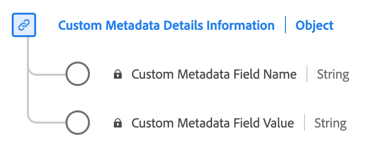

# [!UICONTROL カスタムメタデータの詳細情報] データタイプ

[!UICONTROL カスタムメタデータの詳細情報] は標準のエクスペリエンスデータモデル (XDM) データタイプで、カスタムメタデータを保存するための構造を定義します。 以下を使用します。 [!UICONTROL カスタムメタデータの詳細情報] コンテンツやインタラクションに関連付けられたカスタムメタデータの名前や値などの詳細を取り込むためのデータタイプ。

| 表示名 | プロパティ | データタイプ | 説明 |
|--------------------------------------------|------------------|-----------|-----------------------------------------|
| [!UICONTROL カスタムメタデータフィールド名] | `name` | 文字列 | カスタムフィールドの名前。 |
| [!UICONTROL カスタムメタデータフィールド値] | `value` | 文字列 | カスタムフィールドの値。 |

{style="table-layout:auto"}

フィールドグループについて詳しくは、 [パブリック XDM リポジトリ](https://github.com/adobe/xdm/blob/master/components/datatypes/custommetadatadetails.schema.json)
