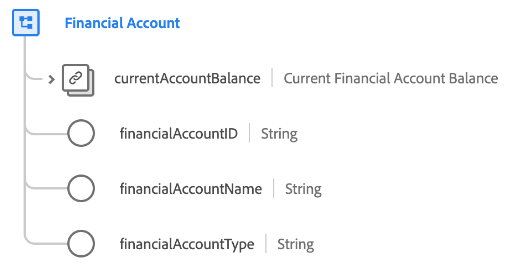

# [!UICONTROL 金融口座] データタイプ

[!UICONTROL 金融口座] は、金融口座のタイプ、所有者、現在の残高などの詳細を記述する標準の XDM データ型です。

| プロパティ | データタイプ | 説明 |
| --- | --- | --- |
| `currentAccountBalance` | [[!UICONTROL 通貨]](./currency.md) | 勘定の現在の残高。 |
| `financialAccountId` | [!UICONTROL 文字列] | アカウントの一意の ID。 |
| `financialAccountName` | [!UICONTROL 文字列] | アカウントに割り当てられた名前。 |
| `financialAccountType` | [!UICONTROL 文字列] | 金融口座のタイプ（当座預金、貯蓄、退職金など）。 |

{style=&quot;table-layout:auto&quot;}

データタイプについて詳しくは、 [パブリック XDM リポジトリ](https://github.com/adobe/xdm/blob/master/docs/reference/datatypes/financial-account.schema.json).
