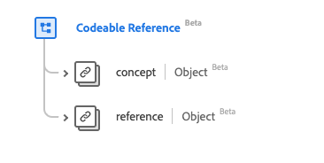

# [!UICONTROL  コード化可能な参照 ] データタイプ

[!UICONTROL  コード化可能な参照 ] は、リソースまたは概念への参照を記述する標準の Experience Data Model （XDM）データタイプです。 このデータタイプは、HL7 FHIR リリース 5 の仕様に従って作成されます。

| 表示名 | プロパティ | データタイプ | 説明 |
| --- | --- | --- | --- |
| [!UICONTROL  概念 ] | `concept` | [[!UICONTROL  コード化可能な概念 ]](../healthcare/codeable-concept.md) | 概念への参照（クラス）。 |
| [!UICONTROL  参考 ] | `reference` | [[!UICONTROL  参考 ]](../healthcare/reference.md) | リソースへの参照。 |

データタイプについて詳しくは、公開 XDM リポジトリを参照してください。

* [ 入力された例 ](https://github.com/adobe/xdm/blob/master/extensions/industry/healthcare/fhir/datatypes/codeablereference.example.1.json)
* [ 完全なスキーマ ](https://github.com/adobe/xdm/blob/master/extensions/industry/healthcare/fhir/datatypes/codeablereference.schema.json)
