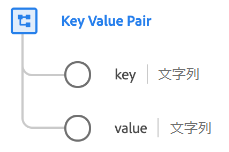

# [!UICONTROL キーと値のペア] データタイプ

[!UICONTROL キーと値のペア] は、汎用のキー値ペアの詳細を取り込む標準的な Experience Data Model(XDM) データ型です。 このデータタイプは、 [[!UICONTROL Adobe Analytics ExperienceEvent Full 拡張機能] フィールドグループ](../field-groups/event/analytics-full-extension.md) を使用して、list 変数の配列項目を記述します。

| プロパティ | データタイプ | 説明 |
| --- | --- | --- |
| `key` | 文字列 | 汎用変数または値のキー（名前）。 |
| `value` | 文字列 | 変数の値。 |

{style=&quot;table-layout:auto&quot;}

データタイプについて詳しくは、 [パブリック XDM リポジトリ](https://github.com/adobe/xdm/blob/master/extensions/adobe/experience/analytics/keyvalue.schema.json).
