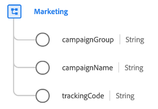

# [!UICONTROL マーケティング] データタイプ

[!UICONTROL マーケティング] は、特定のタッチポイントでアクティブなマーケティングアクティビティを記述する標準の XDM データ型です。

| プロパティ | データタイプ | 説明 |
| --- | --- | --- |
| `campaignGroup` | 文字列 | キャンペーングループの名前 ( 複数のキャンペーンが `50%_DISCOUNT`) をクリックします。 |
| `campaignName` | 文字列 | マーケティングキャンペーンの名前（例： ） `50%_DISCOUNT_USA` または `50%_DISCOUNT_ASIA`. |
| `trackingCode` | 文字列 | イベントが関連付けられているマーケティングキャンペーンを識別するために使用できるトラッキングコード。 |

{style=&quot;table-layout:auto&quot;}

フィールドグループについて詳しくは、パブリック XDM リポジトリを参照してください。

* [入力された例](https://github.com/adobe/xdm/blob/master/components/datatypes/marketing/marketing.example.1.json)
* [フルスキーマ](https://github.com/adobe/xdm/blob/master/components/datatypes/marketing/marketing.schema.json)
