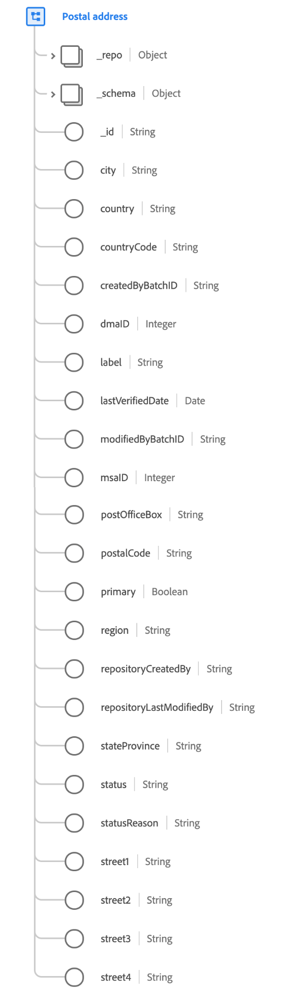

# [!UICONTROL 郵送先住所] データタイプ

[!UICONTROL 郵送先住所] は、郵送先住所の詳細を説明する標準の XDM データ型です。

 

| プロパティ | 説明 |
| --- | --- |
| `city` | 市区町村の名前。 |
| `country` | 政府が管理する領土の名前。これは、任意の言語で国名を付けることができる自由形式のフィールドです。 |
| `countryCode` | 国の 2 文字の <a href="https://datahub.io/core/country-list">ISO 3166-1 alpha-2</a> コード。 |
| `createdByBatchID` | アドレスレコードを作成した、取得したバッチファイルの ID。 |
| `dmaID` | Nielsen メディア研究が指定された市場領域。 |
| `label` | アドレスの自由形式の名前。 |
| `lastVerifiedDate` | アドレスが人物に関連付けられていることを最後に検証した日付。 |
| `modifiedByBatchID` | レコードを最後に変更した、取り込んだバッチファイルの ID。 |
| `msaID` | 観測が行われた米国の大都市統計地域。 |
| `postOfficeBox` | 住所の私書箱。 |
| `postalCode` | 場所の郵便番号。一部の国には郵便番号がありません。一部の国では、郵便番号の一部のみが含まれます。 |
| `primary` | これが個人のプライマリアドレスであるかどうかを示す Boolean 値です。 プロファイルに設定できるのは 1 つだけです `primary` 特定の時点のアドレス。 |
| `region` | 住所の地域、郡または地域の部分。 |
| `repositoryCreatedBy` | レコードを作成したユーザーの ID。 |
| `repositoryLastModifiedBy` | レコードを最後に変更したユーザーの ID。 |
| `stateProvince` | 観測される州、または都道府県の部分。この形式は、[ISO 3166-2（国および下位区分）](https://www.unece.org/cefact/locode/subdivisions.html)規格に従います。 |
| `status` | アドレスが現在使用できるかどうかを示します。 |
| `statusReason` | 現在の `status`. |
| `street1` - `street4` | これら 4 つのフィールドは、主な番地レベルの情報、アパート番号、番地、および番地を含むように設計されています。 `street2` から `street4` はオプションです。 |

{style=&quot;table-layout:auto&quot;}

郵送先住所のデータタイプについて詳しくは、パブリック XDM リポジトリを参照してください。

* [入力された例](https://github.com/adobe/xdm/blob/master/components/datatypes/demographic/address.example.1.json)
* [フルスキーマ](https://github.com/adobe/xdm/blob/master/components/datatypes/demographic/address.schema.json)
