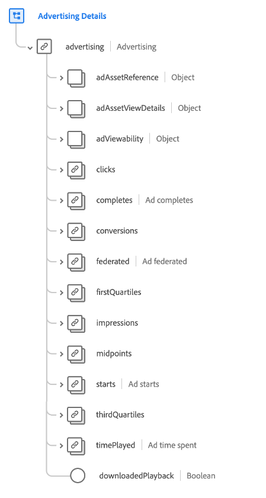
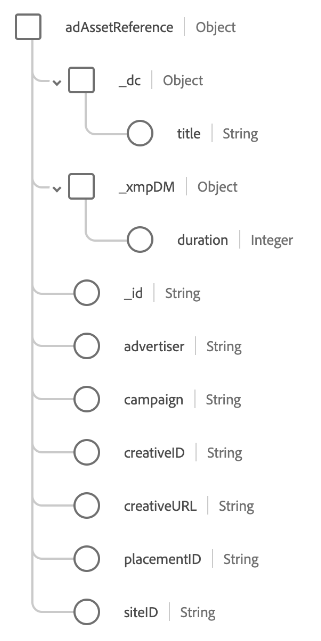
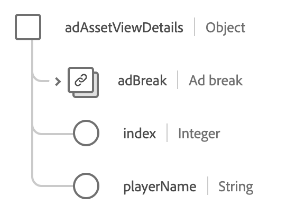

# [!UICONTROL 広告の詳細] スキーマフィールドグループ

[!UICONTROL 広告の詳細] は、 [[!DNL XDM ExperienceEvent] クラス](../../classes/experienceevent.md). フィールドグループには、 `advertising` オブジェクトをスキーマに追加します。

| プロパティ | データタイプ | 説明 |
| --- | --- | --- |
| `adAssetReference` | オブジェクト | 広告に関するアセット情報をキャプチャします。 詳しくは、 [次の款](#adAssetReference) を参照してください。 |
| `adAssetViewDetails` | オブジェクト | 広告再生の表示の詳細をキャプチャします。 詳しくは、 [次の款](#adAssetViewDetails) を参照してください。 |
| `adViewability` | オブジェクト | プレーヤーのボリューム、ライブラリのバージョン、ウィンドウのステータス、広告ビューポートのディメンションなど、エンドユーザーに表示されるインプレッションの数をキャプチャします。 詳しくは、 [次の款](#adViewability) を参照してください。 |
| `clicks` | [[!UICONTROL 測定]](../../data-types/measure.md) | 広告のクリックアクションの数。 |
| `completes` | [[!UICONTROL 測定]](../../data-types/measure.md) | タイムドメディアアセットが最後まで視聴された回数。 これは、エンドユーザーが先にスキップした可能性があるので、必ずしもビデオ全体を視聴したとは限りません。 |
| `conversions` | [[!UICONTROL 測定]](../../data-types/measure.md) | 事前定義済みのアクション（複数可）が、パフォーマンス評価のためにイベントをトリガーした回数。 |
| `federated` | [[!UICONTROL 測定]](../../data-types/measure.md) | 顧客間でのデータ共有など、データフェデレーションを通じてエクスペリエンスイベントが作成されたかどうかを示します。 |
| `firstQuartiles` | [[!UICONTROL 測定]](../../data-types/measure.md) | デジタルビデオ広告が、通常の速度で再生時間の 25%を再生した回数。 |
| `impressions` | [[!UICONTROL 測定]](../../data-types/measure.md) | エンドユーザーに送信され、表示される可能性のある広告インプレッションの数。 |
| `midpoints` | [[!UICONTROL 測定]](../../data-types/measure.md) | デジタルビデオ広告が、通常の速度で再生時間の 50%を再生した回数。 |
| `starts` | [[!UICONTROL 測定]](../../data-types/measure.md) | デジタルビデオ広告が再生を開始した回数。 |
| `thirdQuartiles` | [[!UICONTROL 測定]](../../data-types/measure.md) | デジタルビデオ広告が、通常の速度で再生時間の 75%を再生した回数。 |
| `timePlayed` | [[!UICONTROL 測定]](../../data-types/measure.md) | 特定のタイムドメディアアセットでエンドユーザーが費やした時間。 |
| `downloadedPlayback` | ブール値 | に設定する場合 `true`は、ダウンロードされた広告セッションの再生によってヒットが生成されたことを示します。 |

{style=&quot;table-layout:auto&quot;}

## `adAssetReference` {#adAssetReference}

この `adAssetReference` オブジェクトは、広告に関するアセット情報をキャプチャします。

| プロパティ | データタイプ | 説明 |
| --- | --- | --- |
| `_dc.title` | 文字列 | 人間が読み取り可能な、わかりやすい広告アセットの名前。 |
| `_xmpDM.duration` | 整数 | アセットの長さまたは期間（秒）。 |
| `_id` | 文字列 | 広告アセットの一意の識別子 ( [広告 ID 標準](https://datatracker.ietf.org/doc/html/rfc8107). |
| `advertiser` | 文字列 | 広告で取り上げられている製品の会社またはブランド. |
| `campaign` | 文字列 | 広告キャンペーンの ID. |
| `creativeID` | 文字列 | 広告クリエイティブの ID. |
| `creativeURL` | 文字列 | 広告クリエイティブの URL. |
| `placementID` | 文字列 | 広告のプレースメント ID. |
| `siteID` | 文字列 | 広告サイトの ID. |

{style=&quot;table-layout:auto&quot;}

## `adAssetViewDetails` {#adAssetViewDetails}

この `adAssetViewDetails` オブジェクトは、広告再生の表示の詳細をキャプチャします。

| プロパティ | データタイプ | 説明 |
| --- | --- | --- |
| `adBreak` | [[!UICONTROL 広告ブレーク]](../../data-types/ad-break.md) | タイムド広告がタイムドメディアにどのように挿入されるかを説明します。 |
| `index` | 整数 | 親広告ブレーク内の広告のインデックス。 例えば、最初の広告にインデックスがあるとします `0` 2 つ目の広告はインデックスを持ちます `1`. |
| `playerName` | 文字列 | 広告のレンダリングをおこなうプレーヤーの名前. |

{style=&quot;table-layout:auto&quot;}

## `adViewability` {#adViewability}

この `adViewability` オブジェクトは、プレーヤーのボリューム、ライブラリのバージョン、ウィンドウのステータス、広告ビューポートのディメンションなど、エンドユーザーに表示されるインプレッションの数をキャプチャします。

| プロパティ | データタイプ | 説明 |
| --- | --- | --- |
| `implementationDetails` | [[!UICONTROL 実装の詳細]](../../data-types/implementation-details.md) | 視認性指標を測定するために実装されたライブラリの名前とバージョン。 |
| `measuredAdNotVisible` | [[!UICONTROL 測定]](../../data-types/measure.md) | インプレッション時にビューアビリティライブラリで測定されたとおりに広告が表示されないことを示します。 |
| `measuredMuted` | [[!UICONTROL 測定]](../../data-types/measure.md) | インプレッション時にビューアビリティライブラリで測定されたとおりに広告がミュートされることを示します。 |
| `unmeasurableIframe` | [[!UICONTROL 測定]](../../data-types/measure.md) | インプレッション時にビューアビリティライブラリで測定されたとおりに、広告が非アクティブなウィンドウに表示されることを示します。 |
| `unmeasurableOther` | [[!UICONTROL 測定]](../../data-types/measure.md) | iframe 内に広告が表示されているので、視認性ライブラリが測定を正しく実行できないことを示します。 |
| `viewabilityEligibleImpressions` | [[!UICONTROL 測定]](../../data-types/measure.md) | 視覚性ライブラリが実装されたエンドユーザーに対する広告のインプレッション。 |
| `viewabilityCompletes` | [[!UICONTROL 測定]](../../data-types/measure.md) | ビューアビリティライブラリによって完了時にビューアブルと見なされたエンドユーザーに対する広告の（1 つまたは複数の）完了。 |
| `viewableFirstQuartiles` | [[!UICONTROL 測定]](../../data-types/measure.md) | 視認性ライブラリにより、再生の第 1 四分位数で視聴可能と認められたエンドユーザーに対する広告の（1 つまたは複数の）第 1 四分位数。 |
| `viewableImpressions` | [[!UICONTROL 測定]](../../data-types/measure.md) | 視認性ライブラリにより、2 秒間再生した後に視聴可能と認められたエンドユーザーに対する広告のインプレッション。 |
| `viewableMidpoints` | [[!UICONTROL 測定]](../../data-types/measure.md) | 視認性ライブラリにより、再生の中間点で視聴可能と見なされたエンドユーザーに対する広告の（1 つまたは複数の）中間点。 |
| `viewableThirdQuartiles` | [[!UICONTROL 測定]](../../data-types/measure.md) | 視認性ライブラリにより、再生第 3 四分位数で視聴可能と認められたエンドユーザーに対する広告の（1 つまたは複数の）第 3 四分位数。 |
| `activeWindow` | ブール値 | 広告がユーザーのデバイスのアクティブウィンドウに表示されたかどうかを示します。 |
| `adHeight` | 整数 | 実行時に測定される、プレイヤーの垂直方向のピクセル数。プレイヤーに追加のコントロールまたはサムネールがある場合は、広告のサイズよりも大きくなる可能性があります。 |
| `adUnitDepth` | 整数 | パブリッシャーは、広告のアクセスをページのコードのみに制限するために、コンテナ (iFrame) 内に広告ユニットを埋め込むことができます。 この値は、広告ユニットが内部に表示されるコンテナの数を示します。 |
| `adWidth` | 整数 | 実行時に測定される、プレイヤーの水平方向のピクセル数。プレイヤーに追加のコントロールまたはサムネールがある場合は、広告のサイズよりも大きくなる可能性があります。 |
| `measurementEligible` | ブール値 | 広告が視認性測定の資格を有したかどうか。ユニットにサポートされているクリエイティブフォーマットとタグタイプがある場合、広告は適格です。 |
| `percentViewable` | 整数 | 測定時に表示可能と見なされた広告のピクセルの割合。 |
| `playerVolume` | 整数 | 実行時に測定される、プレーヤーのボリュームの割合 ( ここで、 `0` がミュートされ、 `100` は最大ボリュームです。 |
| `viewable` | ブール値 | 実行時に広告が表示可能だったかどうかを示します。 ディスプレイ広告は、少なくとも 50%の広告が 1 秒間表示されている場合、表示可能と見なされます。 ビデオ広告は、ビデオの再生中に少なくとも 50%の広告が連続して 2 秒間表示されている場合、視聴可能と見なされます。 |
| `viewportHeight` | 整数 | 実行時に測定された、エクスペリエンスが表示されたウィンドウ内の垂直方向のサイズ（ピクセル単位）。 Web ビューポートイベントの場合、この値はブラウザーのビューポートの高さを示します。 |
| `viewportWidth` | 整数 | 実行時に測定された、エクスペリエンスが表示されたウィンドウ内の水平方向のサイズ（ピクセル単位）。 Web ビューポートイベントの場合、この値はブラウザービューポートの幅を示します。 |

{style=&quot;table-layout:auto&quot;}

フィールドグループについて詳しくは、 [パブリック XDM リポジトリ](https://github.com/adobe/xdm/blob/master/components/fieldgroups/experience-event/experienceevent-advertising.schema.json).
