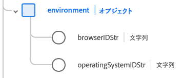

# [!UICONTROL Adobe Analytics ExperienceEvent 完全拡張]スキーマフィールドグループ

[!UICONTROL Adobe Analytics ExperienceEvent 完全拡張]は、 [[!DNL XDM ExperienceEvent] クラス](../../classes/experienceevent.md)の標準スキーマフィールドグループで、Adobe Analytics が収集する共通のメトリクスをキャプチャするものです。

このドキュメントでは、Analytics 拡張機能フィールドグループの構造と使用例について説明します。

>[!NOTE]
>
>このフィールドグループ内で繰り返される要素のサイズと数のため、このガイドで示される多くのフィールドは、スペースを節約するために折りたたまれています。このフィールドグループの完全な構造を見るには、[Platform UI](../../ui/explore.md) で検索するか、[パブリック XDM リポジトリ](https://github.com/adobe/xdm/blob/master/extensions/adobe/experience/analytics/experienceevent-all.schema.json)で完全なスキーマを表示します。

## フィールドグループ構造

フィールドグループは、スキーマに単一の `_experience` オブジェクトを提供し、スキーマ自身には単一の `analytics` オブジェクトが含まれます。

| プロパティ | データタイプ | 説明 |
| --- | --- | --- |
| `customDimensions` | オブジェクト | Analytics で追跡されているカスタムディメンションをキャプチャします。 このオブジェクトの内容については詳しくは、[次のサブセクション](#custom-dimensions)を参照してください。 |
| `endUser` | オブジェクト | イベントをトリガーしたエンドユーザーの web インタラクションの詳細をキャプチャします。 詳しくは、[以下のサブセクション](#end-user)を参照してください。 |
| `environment` | オブジェクト | イベントをトリガーしたブラウザーおよびオペレーティングシステムに関する情報をキャプチャします。 このオブジェクトの内容について詳しくは、[次のサブセクション](#environment)を参照してください。 |
| `event1to100`  `event101to200`  `event201to300`  `event301to400`  `event401to500`  `event501to100`  `event601to700`  `event701to800`  `event801to900`  `event901to1000` | オブジェクト | フィールドグループには、最大 1000 個のカスタムイベントをキャプチャするためのオブジェクトフィールドが用意されています。 これらのフィールドについて詳しくは、[次のサブセクション](#events)を参照してください。 |
| `session` | オブジェクト | イベントをトリガーしたセッションに関する情報をキャプチャします。 このオブジェクトの内容について詳しくは、[次のサブセクション](#session)を参照してください。 |

{style=&quot;table-layout:auto&quot;}

## `customDimensions` {#custom-dimensions}

`customDimensions` は、Analytics で追跡されるカスタムの[寸法](https://experienceleague.adobe.com/docs/analytics/components/dimensions/overview.html?lang=ja)をキャプチャします。

| プロパティ | データタイプ | 説明 |
| --- | --- | --- |
| `eVars` | オブジェクト | 最大 250 個のコンバージョン変数（[eVars](https://experienceleague.adobe.com/docs/analytics/components/dimensions/evar.html?lang=ja)）をキャプチャするオブジェクトです。このオブジェクトのプロパティには `eVar1` から `eVar250` までのキーがあり、データタイプには文字列のみを使用できます。 |
| `hierarchies` | オブジェクト | 最大 5 つのカスタム階層変数（[hiers](https://experienceleague.adobe.com/docs/analytics/implementation/vars/page-vars/hier.html?lang=ja)）をキャプチャするオブジェクトです。このオブジェクトのプロパティは `hier1` から `hier5` までがキーとなっており、それ自身が以下のサブプロパティを持つオブジェクトです。<ul><li>`delimiter`：`values` で提供されるリストの生成に使用する、元の区切り文字。</li><li>`values`：階層レベル名の区切りリストを文字列で表したもの。</li></ul> |
| `listProps` | オブジェクト | 最大 75 個の [list props](https://experienceleague.adobe.com/docs/analytics/implementation/vars/page-vars/prop.html?lang=ja#リスト-prop) をキャプチャするオブジェクトです。このオブジェクトのプロパティは `prop1` から `prop75` までがキーとなっており、それ自身は以下のサブプロパティを持つオブジェクトです。<ul><li>`delimiter`：`values` で提供されるリストの生成に使用する、元の区切り文字。</li><li>`values`：prop 値の区切りリストを文字列で表したもの。</li></ul> |
| `lists` | オブジェクト | 最大 3 つの[リスト](https://experienceleague.adobe.com/docs/analytics/implementation/vars/page-vars/list.html?lang=ja)までキャプチャするオブジェクト。このオブジェクトのプロパティは `list1` から `list3` までのキーが設定されています。各プロパティには、[[!UICONTROL キーと値のペア]](../../data-types/key-value-pair.md)データタイプの `list` 配列が一つ含まれます。 |
| `props` | オブジェクト | 最大 75 個の [prop](https://experienceleague.adobe.com/docs/analytics/implementation/vars/page-vars/prop.html?lang=ja) をキャプチャするオブジェクトです。このオブジェクトのプロパティは `prop1` から `prop75` までのキーがあり、データタイプには文字列のみを使用できます。 |
| `postalCode` | 文字列 | クライアントが指定した zip コードまたは郵便番号。 |
| `stateProvince` | 文字列 | クライアントが提供する都道府県の場所。 |

{style=&quot;table-layout:auto&quot;}

## `endUser` {#end-user}

`endUser` は、イベントをトリガーしたエンドユーザーの web インタラクションの詳細をキャプチャします。

| プロパティ | データタイプ | 説明 |
| --- | --- | --- |
| `firstWeb` | [[!UICONTROL Web 情報]](../../data-types/web-information.md) | このエンドユーザーの最初の ExperienceEvent からの web ページ、リンクおよびリファラーに関する情報。 |
| `firstTimestamp` | 整数 | このエンドユーザーの最初の ExperienceEvent の Unix タイムスタンプ。 |

## `environment` {#environment}

`environment` は、イベントをトリガーしたブラウザーとオペレーティングシステムに関する情報をキャプチャします。

| プロパティ | データタイプ | 説明 |
| --- | --- | --- |
| `browserIDStr` | 文字列 | 使用するブラウザーの Adobe Analytics 識別子（別名： [ブラウザータイプディメンション](https://experienceleague.adobe.com/docs/analytics/components/dimensions/browser-type.html?lang=ja)）です。 |
| `operatingSystemIDStr` | 文字列 | 使用するオペレーティングシステムの Adobe Analytics 識別子（別名：[オペレーティングシステムタイプディメンション](https://experienceleague.adobe.com/docs/analytics/components/dimensions/operating-system-types.html?lang=ja)）です。 |

## カスタムイベントフィールド {#events}

Analytics 拡張機能フィールドグループには、最大 100 個の[カスタムイベント指標](https://experienceleague.adobe.com/docs/analytics/components/metrics/custom-events.html?lang=ja)を捕捉する10のオブジェクトフィールドがあり、フィールドグループの合計は 1,000 個となります。

各最上位イベントオブジェクトには、それぞれの範囲に対応する個々のイベントオブジェクトが含まれます。 例えば、`event101to200` には `event101` から `event200` までのキーが設定されたイベントが含まれます。

各偶数オブジェクトは、[[!UICONTROL 測定]](../../data-types/measure.md)データタイプを使用し、一意の識別子と定量的な値を提供します。

## `session` {#session}

`session` は、イベントをトリガーしたセッションに関する情報をキャプチャします。

| プロパティ | データタイプ | 説明 |
| --- | --- | --- |
| `search` | [[!UICONTROL 検索]](../../data-types/search.md) | セッションエントリの web 検索またはモバイル検索に関する情報をキャプチャします。 |
| `web` | [[!UICONTROL Web 情報]](../../data-types/web-information.md) | セッションエントリのリンククリック数、web ページの詳細、リファラー情報およびブラウザーの詳細に関する情報をキャプチャします。 |
| `depth` | 整数 | エンドユーザーの現在のセッションの深さ（ページ番号など）。 |
| `num` | 整数 | エンドユーザーの現在のセッション番号。 |
| `timestamp` | 整数 | セッションエントリの Unix タイムスタンプ。 |

## 次の手順

このドキュメントでは、Analytics 拡張機能フィールドグループの構造と使用例について説明しました。 フィールドグループ自体の詳細については、[公開 XDM リポジトリ](https://github.com/adobe/xdm/blob/master/extensions/adobe/experience/analytics/experienceevent-all.schema.json)を参照してください。

Adobe Experience Platform Web SDK を使用した Analytics データの収集にこのフィールドグループを使用している場合は、[データストリームの設定](../../../edge/fundamentals/datastreams.md)に関するガイドを参照し、サーバー側でデータを XDM にマッピングする方法を確認してください。
