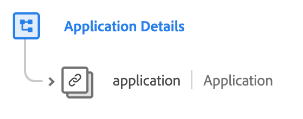

# [!UICONTROL アプリの詳細] スキーマフィールドグループ

[!UICONTROL アプリの詳細] は、 [[!DNL XDM ExperienceEvent] クラス](../../classes/experienceevent.md). フィールドグループには、 `application` スキーマに対するオブジェクト。クラッシュ回数、機能の使用状況、起動回数、アップグレード回数など、アプリケーション関連の詳細を取り込みます。

| プロパティ | データタイプ | 説明 |
| --- | --- | --- |
| `application` | [[!UICONTROL アプリケーション]](../../data-types/financial-account.md) | イベントに関連するアプリケーション情報をキャプチャします（アプリケーション名、アプリのバージョン、インストール、起動、クラッシュ、クロージャなど）。 イベントのターゲットとなるアプリケーション（プッシュ通知の送信先など）またはイベントを発信するアプリケーション（クリック、ログインなど）のどちらかです。 |

{style="table-layout:auto"}

フィールドグループについて詳しくは、 [パブリック XDM リポジトリ](https://github.com/adobe/xdm/blob/master/docs/reference/fieldgroups/experience-event/experienceevent-application.schema.json).
