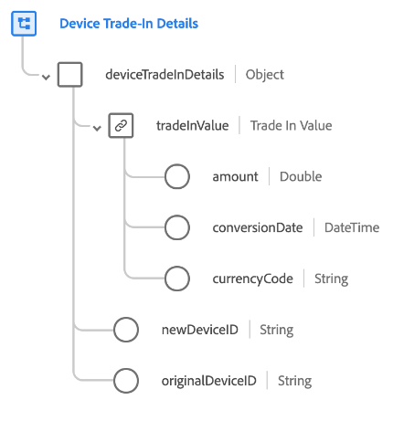

# [!UICONTROL Device Trade-In ] Detailsschema フィールドグループ

>[!NOTE]
>
>複数のスキーマフィールドグループの名前が変更されました。 詳しくは、[ フィールドグループ名の更新 ](../name-updates.md) のドキュメントを参照してください。

[!UICONTROL デバイスのトレードイ] ン [[!DNL XDM ExperienceEvent] ：クラスの標準スキーマフィールドグル](../../classes/experienceevent.md)ープを説明します。このフィールド (`deviceTradeInDetails`) には、デバイスの取引取引を示す 1 つのフィールド（取引額、元のデバイス ID、新しいデバイス ID など）が表示されます。

| プロパティ | データタイプ | 説明 |
| --- | --- | --- |
| `tradeInValue` | [通貨](../../data-types/currency.md) | 取引されるデバイスの値。 |
| `newDeviceID` | 文字列 | 取引対象の新しいデバイスの ID。 |
| `originalDeviceID` | 文字列 | 取引されるデバイスの ID。 |

{style=&quot;table-layout:auto&quot;}

フィールドグループについて詳しくは、パブリック XDM リポジトリを参照してください。

* [入力例](https://github.com/adobe/xdm/blob/master/components/fieldgroups/experience-event/industry-verticals/experienceevent-device-trade-in-details.example.1.json)
* [フルスキーマ](https://github.com/adobe/xdm/blob/master/components/fieldgroups/experience-event/industry-verticals/experienceevent-device-trade-in-details.schema.json)
