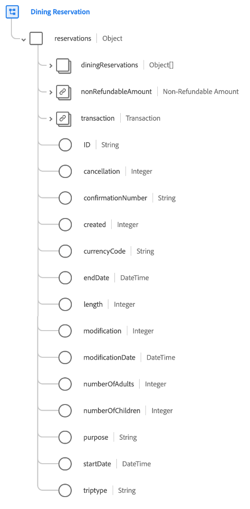

# [!UICONTROL 食事の予約] スキーマフィールドグループ

[!UICONTROL 食事の予約] は、 [[!DNL XDM ExperienceEvent] クラス](../../classes/experienceevent.md) 食事の予約に関する情報をキャプチャするために使用されます。

フィールドグループは、 [!UICONTROL 予約の詳細] フィールドグループを作成し、1 つのオブジェクトタイプフィールドの下に同じフィールドをすべて含める `reservations`. これらの汎用フィールドに加えて、 [!UICONTROL 食事の予約] 次を含む `diningReservations` 配列。 このオブジェクトの配列は、レストラン固有のプロパティを持つ 1 つ以上の予約を記述するために使用されます。

>[!NOTE]
>
>このドキュメントでは、 `diningReservations` 配列。 の下に表示されるその他のフィールドに関する情報 `reservations` オブジェクトの場合は、 [[!UICONTROL 予約の詳細] フィールドグループ参照](./reservation-details.md).

## `diningReservations`

`diningReservations` は、食事の予約のリストを表すオブジェクトの配列です。 予約イベントが、1 日の異なる時間帯に複数の異なるレストランでの予約を含む場合、例えば、これらの予約は、個々のオブジェクトとして以下に示すことができます。 `diningReservations` 1 つのイベント用。

の下に提供される各オブジェクトの構造 `diningReservations` は以下に示します。

| プロパティ | データタイプ | 説明 |
| --- | --- | --- |
| `ID` | 文字列 | 予約番号または識別子。 |
| `cancellation` | 整数 | この値は、予約がキャンセルされるとキャプチャされます。 |
| `confirmationNumber` | 文字列 | 予約確認番号または識別子。 |
| `created` | 整数 | この値は、予約が作成されるとキャプチャされます。 |
| `cuisine` | 整数 | レストランの料理のタイプ。 |
| `currencyCode` | 文字列 | 購入に使用される ISO 4217 通貨コード。 |
| `deliveryPartners` | 文字列 | レストランで利用可能な配信パートナー。 |
| `diningOptions` | 文字列 | レストランで利用可能な配送および食事のオプション。 |
| `groupReservation` | ブール値 | 予約がグループに対しておこなわれているかどうかを示します。 |
| `length` | 整数 | 予約の合計日数。 |
| `loyaltyID` | 文字列 | 予約に記載されているゲストのロイヤリティプログラム ID。 |
| `modification` | 整数 | この値は、予約が変更されるとキャプチャされます。 |
| `modificationDate` | 日時 | 予約が最後に変更された時刻。 |
| `numberOfAdults` | 整数 | 予約に関連付けられた大人の数。 |
| `numberOfChildren` | 整数 | 予約に関連付けられている子の数。 |
| `numberOfRooms` | 整数 | 予約に関連付けられている部屋の数。 |
| `partySize` | 整数 | 食事会の人数。 |
| `priceCategory` | 文字列 | 予約の価格カテゴリ。 |
| `purpose` | 文字列 | 予約の目的（通常、ビジネスまたは個人）。 |
| `reservationTime` | 日時 | 食事の予約が入っている時間。 |
| `restaurantID` | 文字列 | レストランまたは食事の場所の識別子。 |
| `reservationStatus` | 文字列 | 予約のステータス。 |
| `specialOccasion` | ブール値 | 予約が特別な日に行われているかどうかを示します。 |
| `status` | 整数 | 食事の予約のステータス。 |

{style="table-layout:auto"}

フィールドグループについて詳しくは、パブリック XDM リポジトリを参照してください。

* [入力された例](https://github.com/adobe/xdm/blob/master/components/fieldgroups/experience-event/industry-verticals/experienceevent-dining-reservation.example.1.json)
* [フルスキーマ](https://github.com/adobe/xdm/blob/master/components/fieldgroups/experience-event/industry-verticals/experienceevent-dining-reservation.schema.json)
