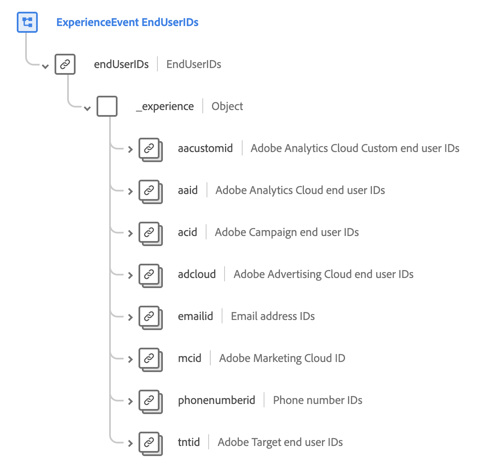

# [!UICONTROL End User ID Details] スキーマフィールドグループ

>[!NOTE]
>
>複数のスキーマフィールドグループの名前が変更されました。 詳しくは、[フィールドグループ名の更新](../name-updates.md)のドキュメントを参照してください。

[!UICONTROL End User ID Details]は、[[!DNL XDM ExperienceEvent] class](../../classes/experienceevent.md)の標準スキーマフィールドグループで、複数のAdobe アプリケーションで個人のID情報を記述するために使用されます。 フィールドグループは、ルートレベル `endUserIDs` オブジェクトを提供します。このオブジェクト自体には、データの取り込みに応じて値が自動的に更新される読み取り専用`_experience` フィールドが含まれます。

{width=700}

| プロパティ | データタイプ | 説明 |
| --- | --- | --- |
| `aacustomid` | [ID](../../data-types/identity.md) | Adobe Analytics CloudのカスタムエンドユーザーID。 |
| `aaid` | [ID](../../data-types/identity.md) | Adobe Analytics CloudのエンドユーザーID。 |
| `acid` | [ID](../../data-types/identity.md) | Adobe CampaignのエンドユーザーID。 |
| `adcloud` | [ID](../../data-types/identity.md) | Adobe AdvertisingのエンドユーザーID。 |
| `emailid` | [ID](../../data-types/identity.md) | メールアドレス ID。 |
| `mcid` | [ID](../../data-types/identity.md) | Adobe Marketing Cloud ID （MCID）: MCIDは、現在、Experience Cloud ID （ECID）として知られています。 |
| `phonenumberid` | [ID](../../data-types/identity.md) | 電話番号ID。 |
| `tntid` | [ID](../../data-types/identity.md) | Adobe TargetのエンドユーザーID。 |

{style="table-layout:auto"}

フィールドグループについて詳しくは、パブリック XDM リポジトリを参照してください。

* [入力済み例](https://github.com/adobe/xdm/blob/master/components/fieldgroups/experience-event/experienceevent-enduserids.example.1.json)
* [完全なスキーマ &#x200B;](https://github.com/adobe/xdm/blob/master/components/fieldgroups/experience-event/experienceevent-enduserids.schema.json)
